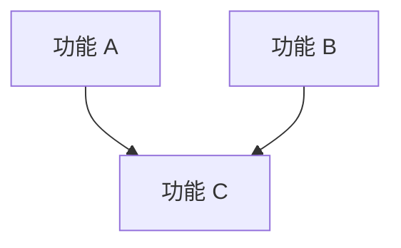

# vX.Y.Z - 版本名称

> 一句话描述这个版本要达到的效果。

## 目标

这个版本完成后，用户可以做什么？解决了什么核心问题？

## 范围

### 包含

- 功能 A — 简述
- 功能 B — 简述

### 不包含（推迟到后续版本）

- 功能 X — 原因

## 功能清单

### 依赖关系

| 层级 | 功能 | 可并行 |
|------|------|--------|
| L0（无依赖） | 功能 A, 功能 B | 全部可并行 |
| L1（依赖 L0） | 功能 C | - |

### 功能清单

| 功能 | 优先级 | 依赖 | Feature 文档 | Issue |
|------|--------|------|-------------|-------|
| 功能 A | P0 | - | [link](features/功能a.md) | #TODO |
| 功能 B | P1 | - | [link](features/功能b.md) | #TODO |
| 功能 C | P0 | 功能 A, 功能 B | [link](features/功能c.md) | #TODO |

## 验收标准

- [ ] 标准 1
- [ ] 标准 2

## 技术选型

> 如涉及基础设施搭建，在此记录关键技术决策。

| 领域 | 选择 | 备注 |
|------|------|------|
| 示例 | **xxx** | 选择原因 |

## 依赖与风险

- **依赖**：列出外部依赖、前置条件
- **风险**：技术风险、不确定性

## 时间线

- 开始日期：
- 目标发布日期：
- Milestone：[GitHub Milestone 链接]
