# 从 BlockNote 到 CodeMirror 6：一次产品定位级的架构迁移

> SwarmNote 将编辑器从 BlockNote（ProseMirror 系）迁移到 CodeMirror 6，从"Notion 式 block 编辑器"转向"Obsidian 式 Markdown Live Preview"。这不是换个库那么简单——它重新定义了数据模型、简化了整条数据链路、打通了移动端、同时也放弃了一些 block 编辑器独有的交互。本文用图表和代码，把这次迁移的每一个得与失讲清楚。

## 目录

1. [一句话总结](#1-一句话总结)
2. [架构全景对比](#2-架构全景对比)
3. [获得了什么](#3-获得了什么)
   - 3.1 [数据模型坍缩：三种格式变一种](#31-数据模型坍缩三种格式变一种)
   - 3.2 [Rust 后端大幅简化](#32-rust-后端大幅简化)
   - 3.3 [移动端从零到有](#33-移动端从零到有)
   - 3.4 [双端代码复用 ~80%](#34-双端代码复用-80)
   - 3.5 [移动端输入体验质的飞跃](#35-移动端输入体验质的飞跃)
   - 3.6 [字符级 CRDT 协作：从桌面独享到双端统一](#36-字符级-crdt-协作从桌面独享到双端统一)
   - 3.7 [与外部工具的天然兼容](#37-与外部工具的天然兼容)
4. [失去了什么](#4-失去了什么)
   - 4.1 [Block 拖拽重排](#41-block-拖拽重排)
   - 4.2 [Slash Menu](#42-slash-menu)
   - 4.3 [自定义 React Block](#43-自定义-react-block)
   - 4.4 [yrs-blocknote crate 的全部投入](#44-yrs-blocknote-crate-的全部投入)
   - 4.5 [结构化数据查询能力](#45-结构化数据查询能力)
5. [关键技术变化详解](#5-关键技术变化详解)
   - 5.1 [为什么 CM6 在移动端更好：输入管道的根本差异](#51-为什么-cm6-在移动端更好输入管道的根本差异)
   - 5.2 [Y.Doc schema 变化：从 XML 树到纯文本](#52-ydoc-schema-变化从-xml-树到纯文本)
   - 5.3 [Live Preview 如何工作](#53-live-preview-如何工作)
   - 5.4 [双端共享架构](#54-双端共享架构)
6. [场景对比：同一件事，前后怎么做](#6-场景对比同一件事前后怎么做)
7. [综合评估](#7-综合评估)
8. [结论](#8-结论)

---

## 1. 一句话总结

> **放弃 Notion 式的"结构化 block"交互，换来 Obsidian 式的"纯文本 + 装饰"架构——整条数据链路从三种格式坍缩为一种，5000 行桥接代码归零，移动端从不可能变成开箱即用。**

---

## 2. 架构全景对比

### 迁移前：BlockNote 架构

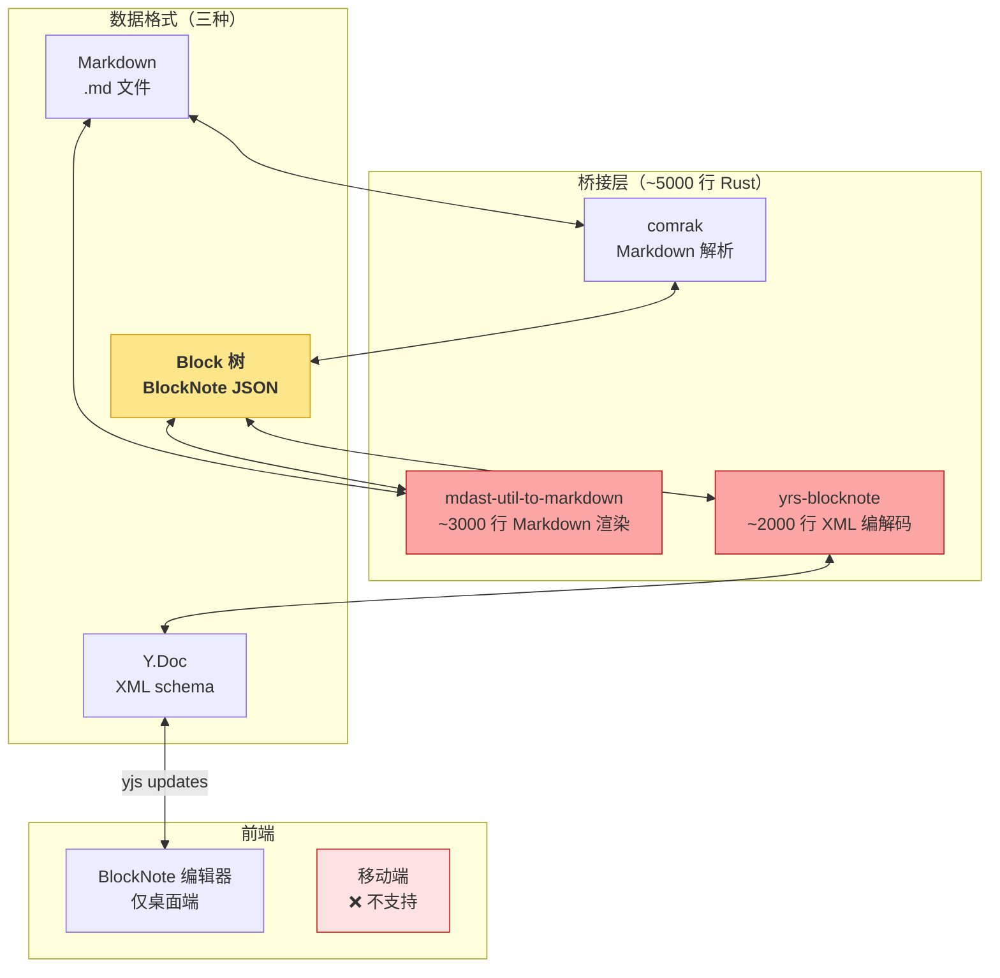
```mermaid
graph TB
    subgraph "数据格式（三种）"
        MD["Markdown<br/>.md 文件"]
        BLOCK["Block 树<br/>BlockNote JSON"]
        YDOC["Y.Doc<br/>XML schema"]
    end

    subgraph "桥接层（~5000 行 Rust）"
        COMRAK["comrak<br/>Markdown 解析"]
        MDAST["mdast-util-to-markdown<br/>~3000 行 Markdown 渲染"]
        CODEC["yrs-blocknote<br/>~2000 行 XML 编解码"]
    end

    subgraph "前端"
        BN["BlockNote 编辑器<br/>仅桌面端"]
        MOBILE_X["移动端<br/>❌ 不支持"]
    end

    MD <--> COMRAK
    COMRAK <--> BLOCK
    BLOCK <--> MDAST
    MDAST <--> MD
    BLOCK <--> CODEC
    CODEC <--> YDOC
    YDOC <-->|"yjs updates"| BN

    style BLOCK fill:#fde68a,stroke:#d4a017,font-weight:bold
    style MDAST fill:#fca5a5,stroke:#b91c1c
    style CODEC fill:#fca5a5,stroke:#b91c1c
    style MOBILE_X fill:#fee2e2,stroke:#dc2626
```

### 迁移后：CM6 架构

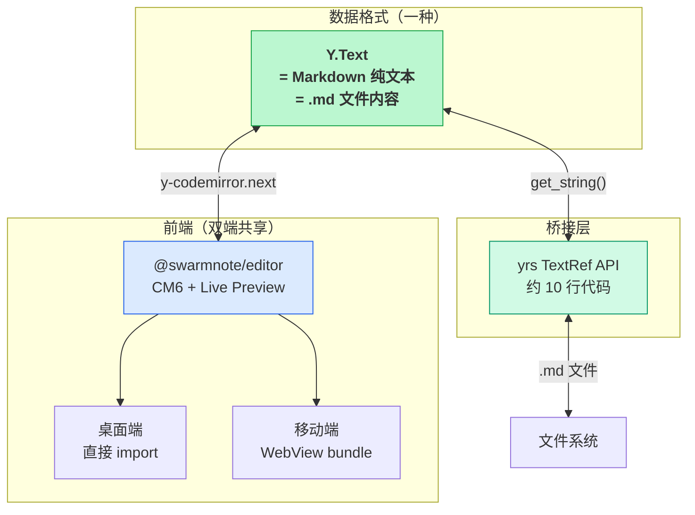
```mermaid
graph TB
    subgraph "数据格式（一种）"
        YTEXT["Y.Text<br/>= Markdown 纯文本<br/>= .md 文件内容"]
    end

    subgraph "桥接层"
        NONE["yrs TextRef API<br/>约 10 行代码"]
    end

    subgraph "前端（双端共享）"
        CM6["@swarmnote/editor<br/>CM6 + Live Preview"]
        DESKTOP["桌面端<br/>直接 import"]
        MOBILE["移动端<br/>WebView bundle"]
    end

    YTEXT <-->|"get_string()"| NONE
    NONE <-->|".md 文件"| FS["文件系统"]
    YTEXT <-->|"y-codemirror.next"| CM6
    CM6 --> DESKTOP
    CM6 --> MOBILE

    style YTEXT fill:#bbf7d0,stroke:#16a34a,font-weight:bold
    style NONE fill:#d1fae5,stroke:#059669
    style CM6 fill:#dbeafe,stroke:#2563eb
```

**变化核心**：中间那一大坨桥接层（Block 树 + 两个 crate）整体消失了。

---

## 3. 获得了什么

### 3.1 数据模型坍缩：三种格式变一种

这是迁移带来的最深层的简化。

**迁移前**，数据在系统中以三种格式存在，需要通过 Block 树做 Hub-and-Spoke 中转：

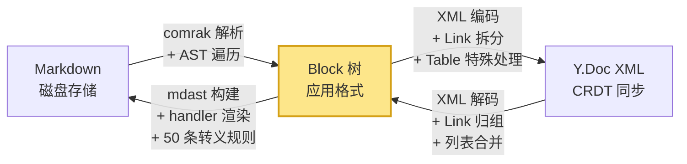
```mermaid
graph LR
    MD["Markdown<br/>磁盘存储"]
    BLOCK["Block 树<br/>应用格式"]
    YDOC["Y.Doc XML<br/>CRDT 同步"]

    MD -->|"comrak 解析<br/>+ AST 遍历"| BLOCK
    BLOCK -->|"mdast 构建<br/>+ handler 渲染<br/>+ 50 条转义规则"| MD
    BLOCK -->|"XML 编码<br/>+ Link 拆分<br/>+ Table 特殊处理"| YDOC
    YDOC -->|"XML 解码<br/>+ Link 归组<br/>+ 列表合并"| BLOCK

    style BLOCK fill:#fde68a,stroke:#d4a017,stroke-width:2px
```

每条转换路径都有自己的复杂度：

| 转换路径 | 复杂度来源 |
|---|---|
| Markdown → Block | comrak AST 解析 → 逐节点映射 → 多态 Content 构建 |
| Block → Markdown | Block → mdast AST → handler 分发 → 50+ 条上下文转义规则 |
| Block → Y.Doc XML | 递归编码 → Link 拆成 attribute → Table 走独立路径 → blockContainer 双写 props |
| Y.Doc XML → Block | 递归解码 → 连续同 href Link 归组 → 扁平 ListItem 合并成嵌套 List |

**迁移后**，三种格式坍缩成了同一个东西：

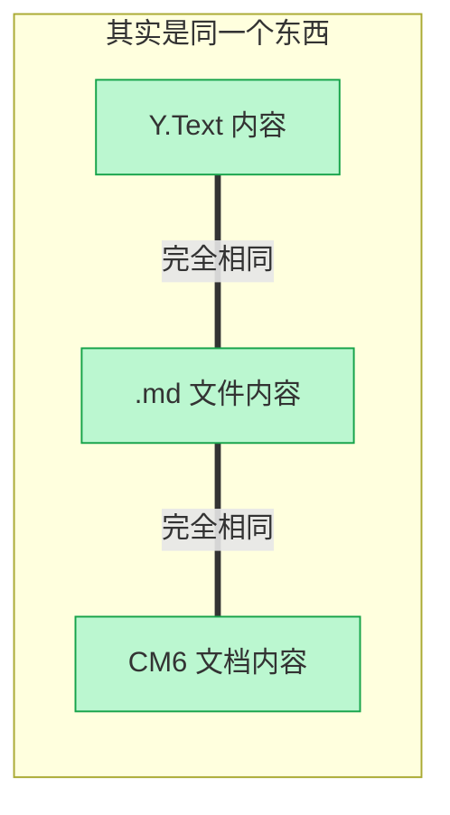
```mermaid
graph LR
    subgraph "其实是同一个东西"
        YTEXT["Y.Text 内容"]
        MD[".md 文件内容"]
        CM6DOC["CM6 文档内容"]
    end

    YTEXT ===|"完全相同"| MD
    MD ===|"完全相同"| CM6DOC

    style YTEXT fill:#bbf7d0,stroke:#16a34a
    style MD fill:#bbf7d0,stroke:#16a34a
    style CM6DOC fill:#bbf7d0,stroke:#16a34a
```

因为：
- **CM6 的文档模型就是纯文本**（Markdown 源码字符串）
- **Y.Text 存的就是这个字符串**
- **.md 文件写的也是这个字符串**

三者是同一份数据的三个视角，不需要任何转换。

### 3.2 Rust 后端大幅简化

以"收到远端 P2P update，前端未打开文档"这个场景为例：

**迁移前**的 Rust 调用链：

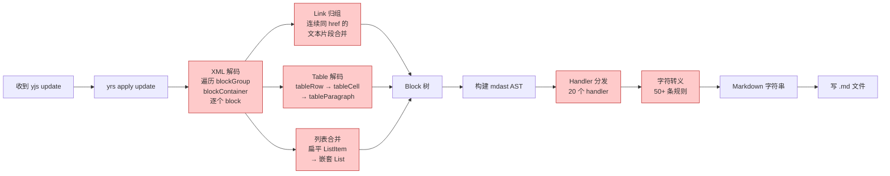
```mermaid
graph LR
    UPDATE["收到 yjs update"] --> APPLY["yrs apply update"]
    APPLY --> DECODE["XML 解码<br/>遍历 blockGroup<br/>blockContainer<br/>逐个 block"]
    DECODE --> LINK["Link 归组<br/>连续同 href 的<br/>文本片段合并"]
    DECODE --> TABLE["Table 解码<br/>tableRow → tableCell<br/>→ tableParagraph"]
    DECODE --> LIST["列表合并<br/>扁平 ListItem<br/>→ 嵌套 List"]
    LINK --> BLOCKS["Block 树"]
    TABLE --> BLOCKS
    LIST --> BLOCKS
    BLOCKS --> MDAST["构建 mdast AST"]
    MDAST --> HANDLER["Handler 分发<br/>20 个 handler"]
    HANDLER --> ESCAPE["字符转义<br/>50+ 条规则"]
    ESCAPE --> MARKDOWN["Markdown 字符串"]
    MARKDOWN --> WRITE["写 .md 文件"]

    style DECODE fill:#fecaca,stroke:#b91c1c
    style LINK fill:#fecaca,stroke:#b91c1c
    style TABLE fill:#fecaca,stroke:#b91c1c
    style LIST fill:#fecaca,stroke:#b91c1c
    style HANDLER fill:#fecaca,stroke:#b91c1c
    style ESCAPE fill:#fecaca,stroke:#b91c1c
```

**迁移后**：


```mermaid
graph LR
    UPDATE["收到 yjs update"] --> APPLY["yrs apply update"]
    APPLY --> GET["text.get_string()"]
    GET --> WRITE["写 .md 文件"]

    style GET fill:#bbf7d0,stroke:#16a34a
```

对应的 Rust 代码：

```rust
// 迁移前：~5000 行 crate 支撑的一行调用
let md = yrs_blocknote::doc_to_markdown(&doc, "document-store");

// 迁移后：yrs 原生 API，无需任何自研 crate
let txn = doc.transact();
let md = txn.get_text("document").unwrap().get_string(&txn);
```

**被删除的代码量**：

| 模块 | 行数 | 迁移后 |
|---|---|---|
| `yrs-blocknote` crate（Block 模型 + XML 编解码） | ~2000 行 | 删除 |
| `mdast-util-to-markdown` crate（Markdown 渲染引擎） | ~3000 行 | 删除 |
| 对应的测试代码 | ~200 个测试 | 删除 |
| **合计** | **~5000+ 行** | **→ ~10 行 yrs API 调用** |

### 3.3 移动端从零到有

这是迁移的直接驱动力。

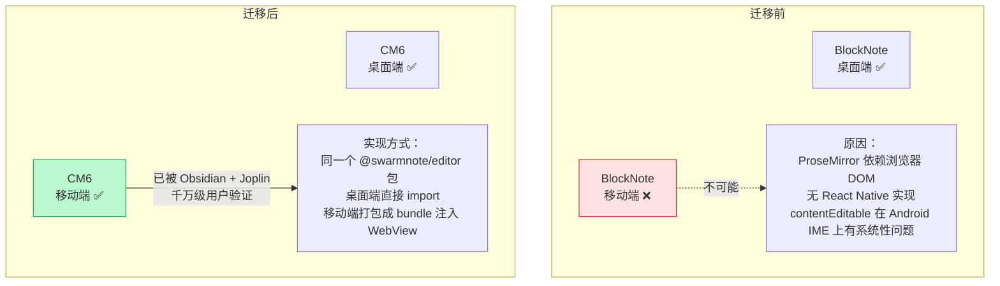
```mermaid
graph TD
    subgraph "迁移前"
        BN_D["BlockNote<br/>桌面端 ✅"]
        BN_M["BlockNote<br/>移动端 ❌"]
        BN_WHY["原因：<br/>ProseMirror 依赖浏览器 DOM<br/>无 React Native 实现<br/>contentEditable 在 Android IME 上有系统性问题"]
    end

    subgraph "迁移后"
        CM6_D["CM6<br/>桌面端 ✅"]
        CM6_M["CM6<br/>移动端 ✅"]
        CM6_HOW["实现方式：<br/>同一个 @swarmnote/editor 包<br/>桌面端直接 import<br/>移动端打包成 bundle 注入 WebView"]
    end

    BN_M -.->|"不可能"| BN_WHY
    CM6_M -->|"已被 Obsidian + Joplin<br/>千万级用户验证"| CM6_HOW

    style BN_M fill:#fee2e2,stroke:#dc2626
    style CM6_M fill:#bbf7d0,stroke:#16a34a
```

### 3.4 双端代码复用 ~80%

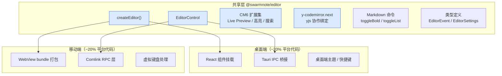
```mermaid
graph TB
    subgraph "共享层 @swarmnote/editor"
        CREATE["createEditor()"]
        CTRL["EditorControl"]
        EXT["CM6 扩展集<br/>Live Preview / 高亮 / 搜索"]
        COLLAB["y-codemirror.next<br/>yjs 协作绑定"]
        CMD["Markdown 命令<br/>toggleBold / toggleList"]
        TYPES["类型定义<br/>EditorEvent / EditorSettings"]
    end

    subgraph "桌面端（~20% 平台代码）"
        D_MOUNT["React 组件挂载"]
        D_TAURI["Tauri IPC 桥接"]
        D_THEME["桌面端主题 / 快捷键"]
    end

    subgraph "移动端（~20% 平台代码）"
        M_BUNDLE["WebView bundle 打包"]
        M_RPC["Comlink RPC 层"]
        M_KB["虚拟键盘处理"]
    end

    CREATE --> D_MOUNT
    CREATE --> M_BUNDLE
    CTRL --> D_TAURI
    CTRL --> M_RPC

    style CREATE fill:#dbeafe,stroke:#2563eb
    style CTRL fill:#dbeafe,stroke:#2563eb
    style EXT fill:#dbeafe,stroke:#2563eb
    style COLLAB fill:#dbeafe,stroke:#2563eb
```

**迁移前**：桌面端和移动端的编辑器代码复用率 = **0%**（因为移动端根本没有编辑器）。

**迁移后**：核心编辑逻辑（CM6 初始化、扩展、命令、yjs 绑定）全部在 `@swarmnote/editor` 里，双端共享。平台特定代码只有挂载方式和通信层的差异。

### 3.5 移动端输入体验质的飞跃

这不是"稍微好一点"，而是架构层面的本质差异。

**ProseMirror（BlockNote 底层）的输入管道**：

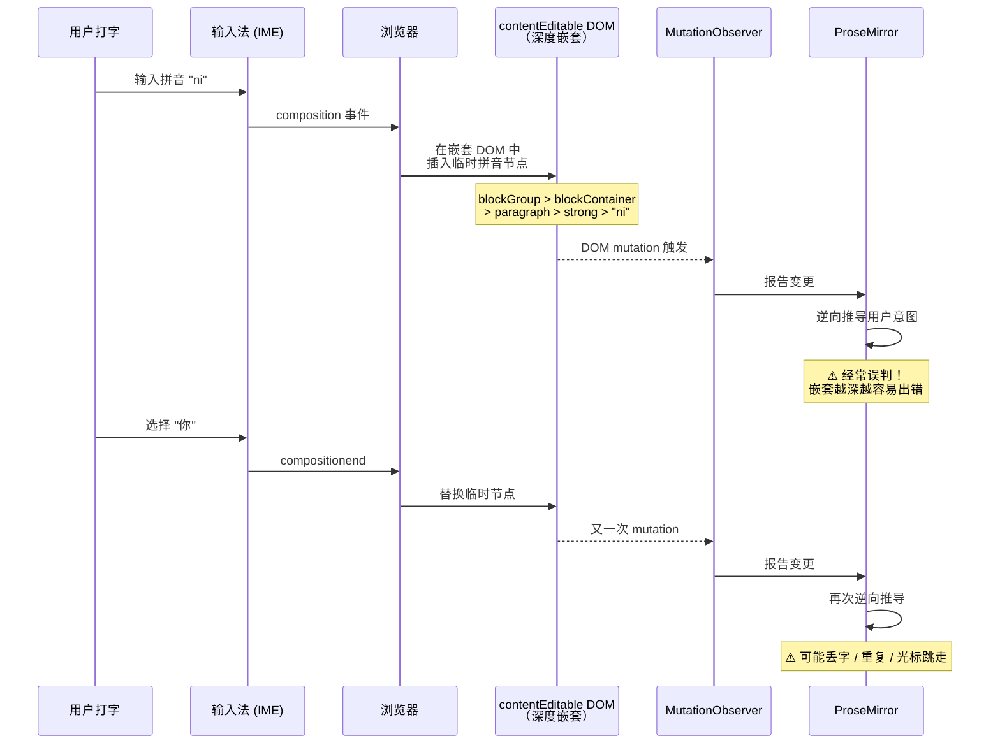
```mermaid
sequenceDiagram
    participant User as 用户打字
    participant IME as 输入法 (IME)
    participant Browser as 浏览器
    participant DOM as contentEditable DOM<br/>（深度嵌套）
    participant MO as MutationObserver
    participant PM as ProseMirror

    User->>IME: 输入拼音 "ni"
    IME->>Browser: composition 事件
    Browser->>DOM: 在嵌套 DOM 中<br/>插入临时拼音节点
    Note over DOM: blockGroup > blockContainer<br/>> paragraph > strong > "ni"
    DOM-->>MO: DOM mutation 触发
    MO->>PM: 报告变更
    PM->>PM: 逆向推导用户意图
    Note over PM: ⚠️ 经常误判！<br/>嵌套越深越容易出错

    User->>IME: 选择 "你"
    IME->>Browser: compositionend
    Browser->>DOM: 替换临时节点
    DOM-->>MO: 又一次 mutation
    MO->>PM: 报告变更
    PM->>PM: 再次逆向推导
    Note over PM: ⚠️ 可能丢字 / 重复 / 光标跳走
```

**CM6 的输入管道**：

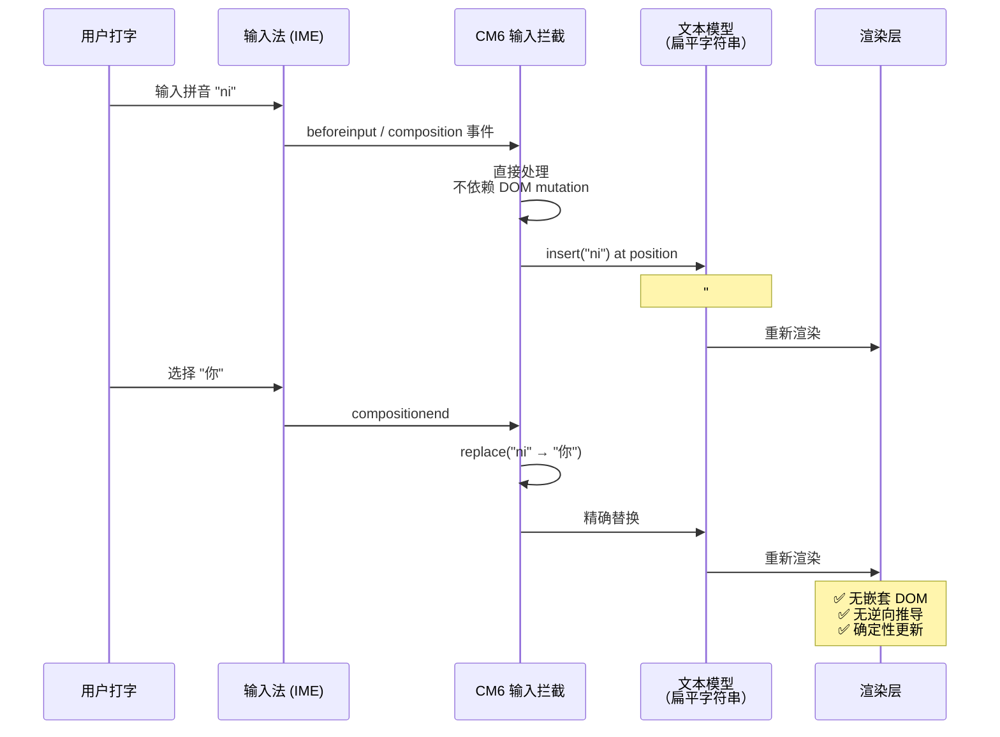
```mermaid
sequenceDiagram
    participant User as 用户打字
    participant IME as 输入法 (IME)
    participant CM6 as CM6 输入拦截
    participant Model as 文本模型<br/>（扁平字符串）
    participant View as 渲染层

    User->>IME: 输入拼音 "ni"
    IME->>CM6: beforeinput / composition 事件
    CM6->>CM6: 直接处理<br/>不依赖 DOM mutation
    CM6->>Model: insert("ni") at position
    Note over Model: "## 标题\n普通文本ni"<br/>就是一个字符串
    Model->>View: 重新渲染

    User->>IME: 选择 "你"
    IME->>CM6: compositionend
    CM6->>CM6: replace("ni" → "你")
    CM6->>Model: 精确替换
    Model->>View: 重新渲染
    Note over View: ✅ 无嵌套 DOM<br/>✅ 无逆向推导<br/>✅ 确定性更新
```

**根本区别**：

| | ProseMirror | CM6 |
|---|---|---|
| DOM 结构 | 深度嵌套（blockGroup > blockContainer > paragraph > marks） | 扁平（`<div class="cm-line">` 列表） |
| 输入方式 | 浏览器先改 DOM → MutationObserver 观察 → 逆向推导 | 拦截 beforeinput 事件 → 直接修改文本模型 → 渲染 |
| IME 兼容性 | 嵌套 DOM 上的 composition 事件经常被浏览器错误处理 | 扁平文本上的 composition 事件行为稳定 |
| 生产验证 | BlockNote 官方无移动端方案 | Obsidian + Joplin 千万级用户移动端验证 |

### 3.6 字符级 CRDT 协作：从桌面独享到双端统一

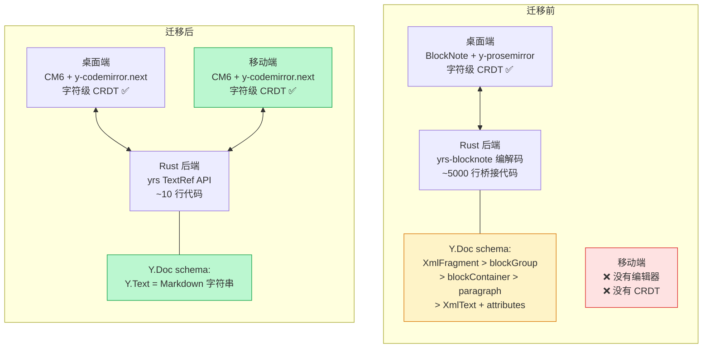
```mermaid
graph TB
    subgraph "迁移前"
        direction TB
        B_DESKTOP["桌面端<br/>BlockNote + y-prosemirror<br/>字符级 CRDT ✅"]
        B_MOBILE["移动端<br/>❌ 没有编辑器<br/>❌ 没有 CRDT"]
        B_RUST["Rust 后端<br/>yrs-blocknote 编解码<br/>~5000 行桥接代码"]
        B_SCHEMA["Y.Doc schema:<br/>XmlFragment > blockGroup<br/>> blockContainer > paragraph<br/>> XmlText + attributes"]

        B_DESKTOP <--> B_RUST
        B_RUST --- B_SCHEMA
    end

    subgraph "迁移后"
        direction TB
        A_DESKTOP["桌面端<br/>CM6 + y-codemirror.next<br/>字符级 CRDT ✅"]
        A_MOBILE["移动端<br/>CM6 + y-codemirror.next<br/>字符级 CRDT ✅"]
        A_RUST["Rust 后端<br/>yrs TextRef API<br/>~10 行代码"]
        A_SCHEMA["Y.Doc schema:<br/>Y.Text = Markdown 字符串"]

        A_DESKTOP <--> A_RUST
        A_MOBILE <--> A_RUST
        A_RUST --- A_SCHEMA
    end

    style B_MOBILE fill:#fee2e2,stroke:#dc2626
    style B_SCHEMA fill:#fef3c7,stroke:#d97706
    style A_MOBILE fill:#bbf7d0,stroke:#16a34a
    style A_SCHEMA fill:#bbf7d0,stroke:#16a34a
```

`y-codemirror.next`（yjs 作者 Kevin Jahns 维护）的工作原理极简：

```
CM6 用户编辑 → ChangeSet(from, to, insert)
                ↓ y-codemirror.next 自动翻译
             Y.Text.insert(pos, text) / Y.Text.delete(pos, len)
                ↓ yjs CRDT
             生成 update → 广播给其他设备
```

**双端用同一个 Y.Text、同一套 update 协议、同一个 CRDT 算法**，不需要任何格式转换就能互相同步。

### 3.7 与外部工具的天然兼容

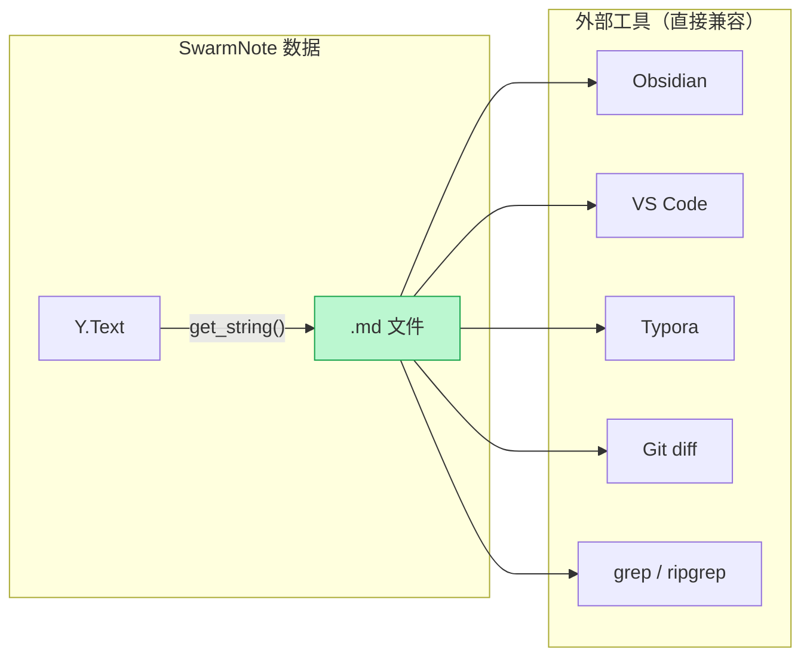
```mermaid
graph LR
    subgraph "SwarmNote 数据"
        YTEXT["Y.Text"]
        FILE[".md 文件"]
    end

    subgraph "外部工具（直接兼容）"
        OBS["Obsidian"]
        VSCODE["VS Code"]
        TYPORA["Typora"]
        GIT["Git diff"]
        GREP["grep / ripgrep"]
    end

    YTEXT -->|"get_string()"| FILE
    FILE --> OBS
    FILE --> VSCODE
    FILE --> TYPORA
    FILE --> GIT
    FILE --> GREP

    style FILE fill:#bbf7d0,stroke:#16a34a
```

迁移前，`.md` 文件是 Y.Doc 的"投影"——需要经过 XML 解码 → Block 构建 → mdast 渲染 → 字符转义才能生成。这个过程中任何一个 bug 都可能导致 `.md` 文件和编辑器显示不一致。

迁移后，`.md` 文件就是 `Y.Text.get_string()` 的直接输出，**不存在转换损耗**。用户在 VS Code 里看到的和在 SwarmNote 里看到的保证是同一份文本。

---

## 4. 失去了什么

迁移不是免费的。以下是真实放弃的能力。

### 4.1 Block 拖拽重排

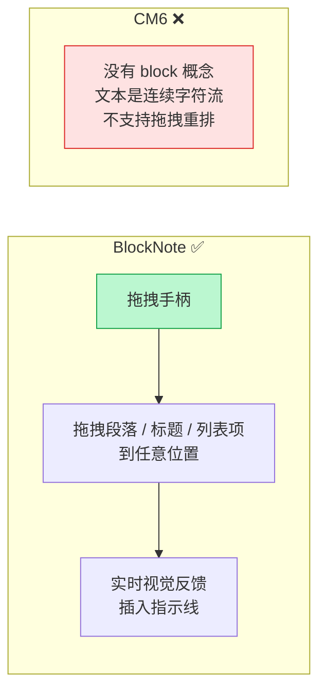
```mermaid
graph LR
    subgraph "BlockNote ✅"
        DRAG["拖拽手柄"]
        DRAG --> REORDER["拖拽段落 / 标题 / 列表项<br/>到任意位置"]
        REORDER --> VISUAL["实时视觉反馈<br/>插入指示线"]
    end

    subgraph "CM6 ❌"
        NODRAG["没有 block 概念<br/>文本是连续字符流<br/>不支持拖拽重排"]
    end

    style DRAG fill:#bbf7d0,stroke:#16a34a
    style NODRAG fill:#fee2e2,stroke:#dc2626
```

**影响评估**：中等。Obsidian 也没有 block 拖拽，但千万级用户并不觉得这是问题。笔记场景下，**剪切粘贴**（Ctrl+X → 移动光标 → Ctrl+V）是足够的替代方案。Block 拖拽更适合 Notion 的"数据库页面"场景，不是纯笔记的核心需求。

### 4.2 Slash Menu

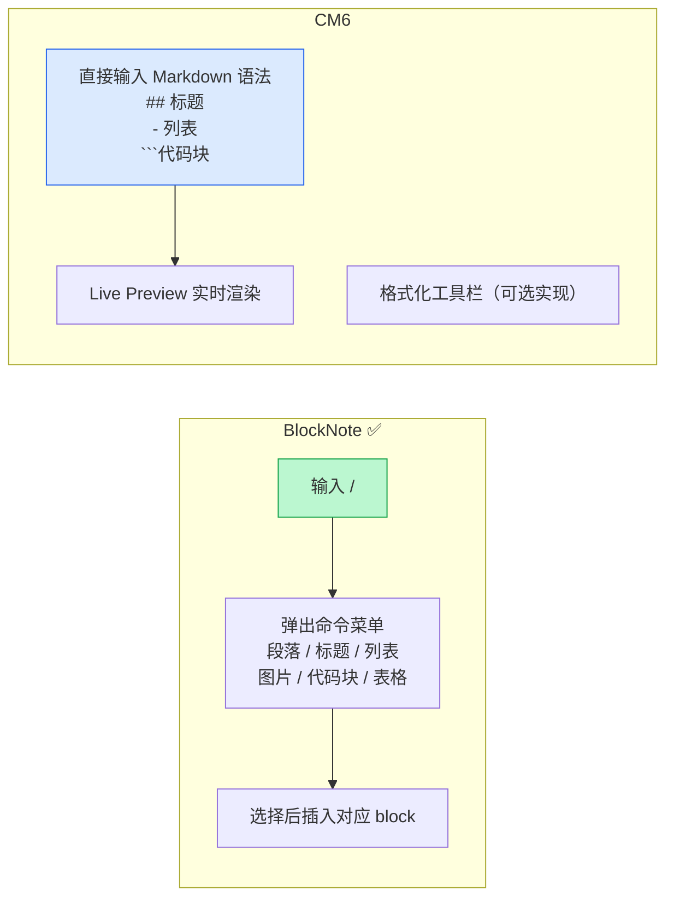
```mermaid
graph LR
    subgraph "BlockNote ✅"
        SLASH["输入 /"]
        SLASH --> MENU["弹出命令菜单<br/>段落 / 标题 / 列表<br/>图片 / 代码块 / 表格"]
        MENU --> INSERT["选择后插入对应 block"]
    end

    subgraph "CM6"
        MD_INPUT["直接输入 Markdown 语法<br/>## 标题<br/>- 列表<br/>```代码块"]
        MD_INPUT --> LIVE["Live Preview 实时渲染"]
        TOOLBAR["格式化工具栏（可选实现）"]
    end

    style SLASH fill:#bbf7d0,stroke:#16a34a
    style MD_INPUT fill:#dbeafe,stroke:#2563eb
```

**影响评估**：低。Slash Menu 本质上是"不记得 Markdown 语法的用户"的辅助。SwarmNote 转向 Obsidian 式定位后，目标用户群体恰好是熟悉 Markdown 的人。如果确实需要，CM6 上可以用 `@codemirror/autocomplete` 自己实现一个，但优先级不高。

### 4.3 自定义 React Block

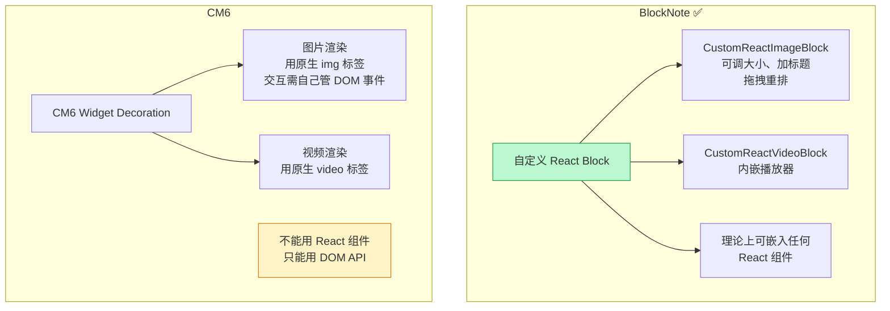
```mermaid
graph TD
    subgraph "BlockNote ✅"
        CUSTOM["自定义 React Block"]
        CUSTOM --> IMG_BLOCK["CustomReactImageBlock<br/>可调大小、加标题<br/>拖拽重排"]
        CUSTOM --> VIDEO_BLOCK["CustomReactVideoBlock<br/>内嵌播放器"]
        CUSTOM --> ANY["理论上可嵌入任何<br/>React 组件"]
    end

    subgraph "CM6"
        WIDGET["CM6 Widget Decoration"]
        WIDGET --> IMG_W["图片渲染<br/>用原生 img 标签<br/>交互需自己管 DOM 事件"]
        WIDGET --> VIDEO_W["视频渲染<br/>用原生 video 标签"]
        NOTE["不能用 React 组件<br/>只能用 DOM API"]
    end

    style CUSTOM fill:#bbf7d0,stroke:#16a34a
    style NOTE fill:#fef3c7,stroke:#d97706
```

**影响评估**：中等。当前桌面端的图片和视频 block 需要用 CM6 的 Widget Decoration 重写。Widget 只能用 DOM API，不能用 React——但对于图片和视频这种简单的媒体展示来说，一个 `` 标签就够了。复杂交互（如调整图片大小）需要手写 DOM 事件处理，工作量比 React 组件大一些。

### 4.4 yrs-blocknote crate 的全部投入

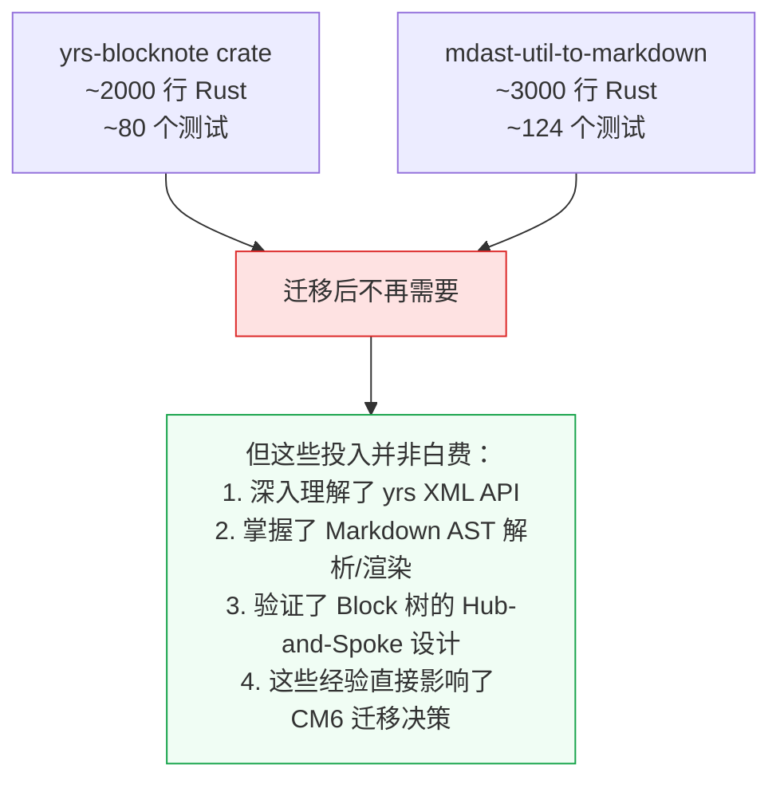
```mermaid
graph TD
    CRATE["yrs-blocknote crate<br/>~2000 行 Rust<br/>~80 个测试"]
    MDAST["mdast-util-to-markdown<br/>~3000 行 Rust<br/>~124 个测试"]

    CRATE --> WASTE["迁移后不再需要"]
    MDAST --> WASTE

    WASTE --> SILVER["但这些投入并非白费：<br/>1. 深入理解了 yrs XML API<br/>2. 掌握了 Markdown AST 解析/渲染<br/>3. 验证了 Block 树的 Hub-and-Spoke 设计<br/>4. 这些经验直接影响了 CM6 迁移决策"]

    style WASTE fill:#fee2e2,stroke:#dc2626
    style SILVER fill:#f0fdf4,stroke:#16a34a
```

**影响评估**：沉没成本。代码本身不再使用，但开发过程中积累的对 yrs、Markdown 解析、CRDT 同步的深度理解是不可替代的。正是因为亲手做过这套复杂桥接，才能清楚认识到"切到 CM6 后这些全部可以删掉"的价值。

### 4.5 结构化数据查询能力

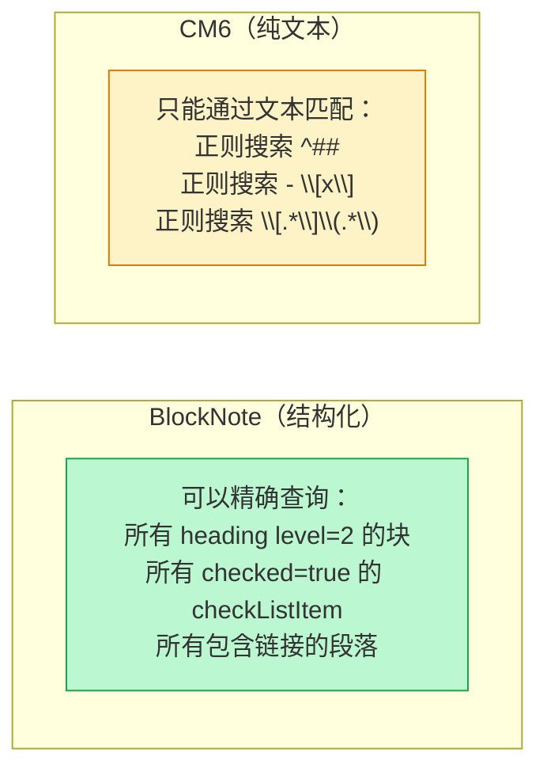
```mermaid
graph LR
    subgraph "BlockNote（结构化）"
        QUERY["可以精确查询：<br/>所有 heading level=2 的块<br/>所有 checked=true 的 checkListItem<br/>所有包含链接的段落"]
    end

    subgraph "CM6（纯文本）"
        REGEX["只能通过文本匹配：<br/>正则搜索 ^## <br/>正则搜索 - \\[x\\]<br/>正则搜索 \\[.*\\]\\(.*\\)"]
    end

    style QUERY fill:#bbf7d0,stroke:#16a34a
    style REGEX fill:#fef3c7,stroke:#d97706
```

**影响评估**：低。在笔记应用中，结构化查询的需求很少。全文搜索（grep on Markdown text）覆盖了 99% 的搜索场景。如果未来确实需要结构化查询（比如"列出所有未完成的待办"），可以用 `@lezer/markdown` 在 Rust 端或 JS 端按需解析 AST，不需要常驻的结构化数据模型。

---

## 5. 关键技术变化详解

### 5.1 为什么 CM6 在移动端更好：输入管道的根本差异

ProseMirror 和 CM6 都使用 `contentEditable`，但关键差异在于 **DOM 结构的复杂度** 和 **输入处理的方向**。

**ProseMirror 的 contentEditable DOM**（BlockNote 渲染出来的）：

```html
<!-- 深度嵌套的富结构 DOM -->
<div class="bn-block-group">
  <div class="bn-block-outer" data-id="abc">
    <div class="bn-block">
      <div class="bn-inline-content">
        <p>
          <strong>加粗</strong>文本<em>斜体</em>
        </p>
      </div>
    </div>
  </div>
</div>
```

**CM6 的 contentEditable DOM**：

```html
<!-- 扁平的纯文本行 -->
<div class="cm-line">## 标题</div>
<div class="cm-line"></div>
<div class="cm-line">**加粗**文本*斜体*</div>
```

移动端 Android IME（中文输入法）在 composition 过程中会往 contentEditable DOM 里临时插入节点。嵌套越深，浏览器产生的中间状态越复杂，MutationObserver 误判的概率越高。CM6 的扁平 DOM 结构从根本上减少了这个问题面。

### 5.2 Y.Doc schema 变化：从 XML 树到纯文本

**迁移前** Y.Doc 里存的是一棵 XML 树（ProseMirror 的文档结构映射）：

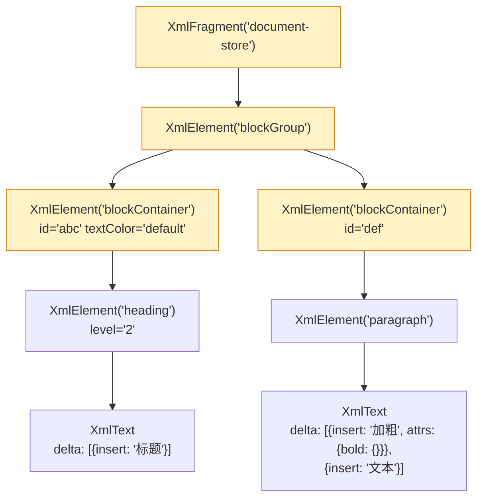
```mermaid
graph TD
    FRAG["XmlFragment('document-store')"]
    BG["XmlElement('blockGroup')"]
    BC1["XmlElement('blockContainer')<br/>id='abc' textColor='default'"]
    H1["XmlElement('heading')<br/>level='2'"]
    XT1["XmlText<br/>delta: [{insert: '标题'}]"]
    BC2["XmlElement('blockContainer')<br/>id='def'"]
    P1["XmlElement('paragraph')"]
    XT2["XmlText<br/>delta: [{insert: '加粗', attrs: {bold: {}}},<br/>{insert: '文本'}]"]

    FRAG --> BG
    BG --> BC1
    BC1 --> H1
    H1 --> XT1
    BG --> BC2
    BC2 --> P1
    P1 --> XT2

    style FRAG fill:#fef3c7,stroke:#d97706
    style BG fill:#fef3c7,stroke:#d97706
    style BC1 fill:#fef3c7,stroke:#d97706
    style BC2 fill:#fef3c7,stroke:#d97706
```

**迁移后** Y.Doc 里存的就是一个 Y.Text：

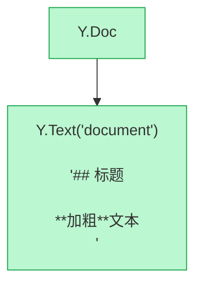
```mermaid
graph TD
    DOC["Y.Doc"]
    TEXT["Y.Text('document')<br/><br/>'## 标题\n\n**加粗**文本\n'"]

    DOC --> TEXT

    style DOC fill:#bbf7d0,stroke:#16a34a
    style TEXT fill:#bbf7d0,stroke:#16a34a
```

| | 迁移前 | 迁移后 |
|---|---|---|
| yjs 类型 | XmlFragment + XmlElement + XmlText | **单个 Y.Text** |
| 节点层级 | 4~6 层嵌套 | **1 层** |
| 格式信息存在 | XML element attributes + XmlText delta attributes | **Markdown 标记字符**（`##`、`**`、`-`） |
| Rust 端读取 | 递归遍历 XML 树 + 类型匹配 + attribute 解析 | **`text.get_string()`** |
| Rust 端写入 | 递归构建 XML 树 + 双写 props + Link 拆分 | **`text.insert()` / `text.delete()`** |
| CRDT 合并粒度 | block 级（XML 元素的增删）+ 字符级（XmlText 内部） | **纯字符级**（整篇文档是连续字符流） |

### 5.3 Live Preview 如何工作

CM6 的 Live Preview 是"Obsidian 式所见即所得"的核心。它不修改文档内容（文档始终是 Markdown 纯文本），而是在**渲染层**加装饰：

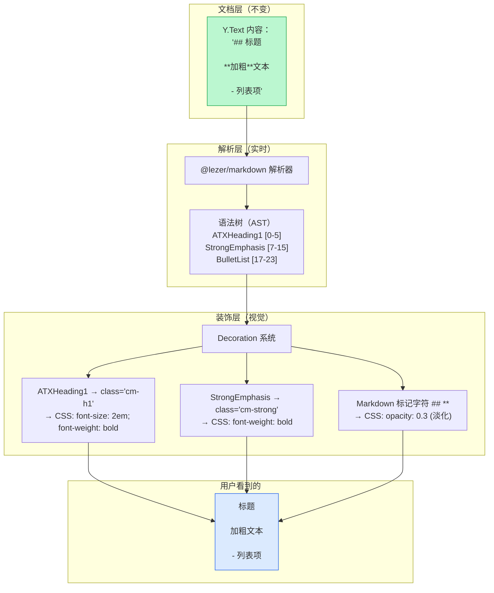
```mermaid
graph TD
    subgraph "文档层（不变）"
        TEXT["Y.Text 内容：<br/>'## 标题\n\n**加粗**文本\n\n- 列表项'"]
    end

    subgraph "解析层（实时）"
        LEZER["@lezer/markdown 解析器"]
        AST["语法树（AST）<br/>ATXHeading1 [0-5]<br/>StrongEmphasis [7-15]<br/>BulletList [17-23]"]
    end

    subgraph "装饰层（视觉）"
        DEC["Decoration 系统"]
        H1_CSS["ATXHeading1 → class='cm-h1'<br/>→ CSS: font-size: 2em; font-weight: bold"]
        BOLD_CSS["StrongEmphasis → class='cm-strong'<br/>→ CSS: font-weight: bold"]
        MARK_CSS["Markdown 标记字符 ## **<br/>→ CSS: opacity: 0.3 (淡化)"]
    end

    subgraph "用户看到的"
        RENDER["标题<br/><br/>加粗文本<br/><br/>- 列表项"]
    end

    TEXT --> LEZER
    LEZER --> AST
    AST --> DEC
    DEC --> H1_CSS
    DEC --> BOLD_CSS
    DEC --> MARK_CSS
    H1_CSS --> RENDER
    BOLD_CSS --> RENDER
    MARK_CSS --> RENDER

    style TEXT fill:#bbf7d0,stroke:#16a34a
    style RENDER fill:#dbeafe,stroke:#2563eb
```

**核心机制**：

1. 用 `@lezer/markdown` 对可见区域的文本做增量解析（viewport-only，性能无忧）
2. 遍历语法树节点，给每个节点加 CSS class（`Decoration.line()` / `Decoration.mark()`）
3. 外层 CSS 负责：
   - 把 `## ` 等 Markdown 标记字符淡化或隐藏
   - 把被标记的内容样式化（加粗、标题字号等）

**关键优势**：文档模型始终是纯文本，装饰是实时计算的、非侵入式的。光标移入某行时可以显示原始 Markdown 标记，移出后自动淡化——这就是 Obsidian 的 Live Preview 交互。

### 5.4 双端共享架构

```mermaid
graph TB
    subgraph "@swarmnote/editor（纯 TS，平台无关）"
        CREATE["createEditor(parent, props)"]
        CONTROL["EditorControl<br/>insertText / execCommand / undo / redo"]
        EXTENSIONS["CM6 扩展集<br/>markdownDecoration / highlight / search"]
        YCOLLAB["yCollab 扩展<br/>y-codemirror.next 绑定"]
        COMMANDS["editorCommands<br/>toggleBold / toggleHeading / toggleList"]
        TYPES["EditorEvent / EditorSettings / EditorProps"]
    end

    subgraph "桌面端 (Tauri)"
        D_REACT["React 组件"]
        D_REACT -->|"import { createEditor }"| CREATE
        D_IPC["Tauri invoke<br/>load/save yjs state"]
    end

    subgraph "移动端 (Expo RN)"
        M_WEBVIEW["react-native-webview"]
        M_BUNDLE["esbuild 打包成 IIFE"]
        M_RPC["Comlink async RPC<br/>RN ↔ WebView"]

        CREATE -->|"被打包进"| M_BUNDLE
        M_BUNDLE -->|"injectedJavaScript"| M_WEBVIEW
        M_RPC <-->|"postMessage"| M_WEBVIEW
    end

    subgraph "Rust 后端（双端共享）"
        R_YRS["yrs (Y.Doc)"]
        R_P2P["libp2p 同步"]
        R_DB["SQLite 持久化"]
    end

    D_IPC <-->|"yjs update"| R_YRS
    M_RPC <-->|"yjs update<br/>(via uniffi)"| R_YRS
    R_YRS <--> R_P2P
    R_YRS <--> R_DB

    style CREATE fill:#dbeafe,stroke:#2563eb,font-weight:bold
    style CONTROL fill:#dbeafe,stroke:#2563eb
    style EXTENSIONS fill:#dbeafe,stroke:#2563eb
    style YCOLLAB fill:#dbeafe,stroke:#2563eb
```

`@swarmnote/editor` 的设计原则（参考 Joplin 的 `@joplin/editor`）：

- **完全不知道自己运行在哪个平台**——它就是一个纯 TS 编辑器库
- 暴露 `createEditor(parentElement, props) => EditorControl` 作为唯一入口
- 桌面端直接 `import` 使用
- 移动端通过 esbuild 打包成 IIFE 字符串，注入 WebView，通过 Comlink（Apache 2.0）做类型安全的 async RPC

---

## 6. 场景对比：同一件事，前后怎么做

### 场景 A：收到 P2P 同步 update（前端未打开文档）

**迁移前**：

```mermaid
sequenceDiagram
    participant P2P
    participant Rust
    participant Crate as yrs-blocknote<br/>~5000 行
    participant FS as .md 文件

    P2P->>Rust: yjs update (binary)
    Rust->>Rust: yrs apply update
    Rust->>Crate: doc_to_markdown(doc)
    Note over Crate: 1. 遍历 XML 树<br/>2. 解码每个 blockContainer<br/>3. Link 归组<br/>4. 构建 Block 树<br/>5. Block → mdast AST<br/>6. Handler 分发<br/>7. 50+ 条字符转义<br/>8. 列表合并
    Crate-->>Rust: Markdown 字符串
    Rust->>FS: 写 .md
```

**迁移后**：

```mermaid
sequenceDiagram
    participant P2P
    participant Rust
    participant FS as .md 文件

    P2P->>Rust: yjs update (binary)
    Rust->>Rust: yrs apply update
    Rust->>Rust: text.get_string()
    Rust->>FS: 写 .md
```

### 场景 B：外部编辑器修改了 .md 文件

**迁移前**：

```mermaid
sequenceDiagram
    participant VS as VS Code
    participant FS as .md 文件
    participant Rust
    participant Crate as yrs-blocknote

    VS->>FS: 保存修改
    FS-->>Rust: file watcher 触发
    Rust->>Rust: 读取新 .md
    Rust->>Crate: markdown_to_doc(md)
    Note over Crate: 1. comrak 解析 Markdown<br/>2. AST → Block 树<br/>3. Block → XML 编码<br/>4. Link 拆分为 attribute<br/>5. Table 走特殊路径<br/>6. 构建 blockGroup > blockContainer
    Crate-->>Rust: 新的 Y.Doc
    Rust->>Rust: 计算 diff → 广播 update
```

**迁移后**：

```mermaid
sequenceDiagram
    participant VS as VS Code
    participant FS as .md 文件
    participant Rust

    VS->>FS: 保存修改
    FS-->>Rust: file watcher 触发
    Rust->>Rust: 读取新 .md
    Rust->>Rust: diff(old_text, new_text)<br/>→ Y.Text insert/delete
    Note over Rust: 文本 diff → yrs 操作<br/>无需中间格式
    Rust->>Rust: 广播 update
```

### 场景 C：用户在编辑器中打字

**迁移前**：

```mermaid
sequenceDiagram
    participant User as 用户
    participant BN as BlockNote
    participant YPM as y-prosemirror
    participant YDoc as Y.Doc (XML)
    participant Rust
    participant Crate as yrs-blocknote
    participant FS as .md 文件

    User->>BN: 打字
    BN->>YPM: ProseMirror transaction
    YPM->>YDoc: XML 节点操作
    YDoc->>Rust: yjs update (IPC)
    Rust->>Crate: doc_to_markdown(doc)
    Crate-->>Rust: Markdown
    Rust->>FS: 写 .md (debounce)
```

**迁移后**：

```mermaid
sequenceDiagram
    participant User as 用户
    participant CM6
    participant YCM as y-codemirror.next
    participant YText as Y.Text
    participant Rust
    participant FS as .md 文件

    User->>CM6: 打字
    CM6->>YCM: ChangeSet
    YCM->>YText: Y.Text.insert()
    YText->>Rust: yjs update (IPC)
    Rust->>Rust: text.get_string()
    Rust->>FS: 写 .md (debounce)
```

中间没有任何格式转换，因为 Y.Text 的字符串内容本身就是合法的 Markdown。

---

## 7. 综合评估

### 量化对比

| 维度 | 迁移前（BlockNote） | 迁移后（CM6） | 变化 |
|---|---|---|---|
| 数据格式数量 | 3（Markdown、Block、Y.Doc XML） | 1（Markdown = Y.Text） | **-67%** |
| Rust 桥接代码 | ~5000 行（2 个 crate） | ~10 行 yrs API | **-99.8%** |
| 桥接层测试 | ~200 个 | 0 | **-100%** |
| 支持平台 | 桌面端 only | 桌面 + 移动 | **+1 平台** |
| 双端代码复用 | 0% | ~80% | **+80%** |
| Y.Doc schema 层级 | 4-6 层 XML 嵌套 | 1 层 Y.Text | **-80%** |
| 格式转换路径 | 4 条（每条有独立复杂度） | 0 条 | **-100%** |
| Block 拖拽 | ✅ | ❌ | 失去 |
| Slash Menu | ✅ | ❌（可选实现） | 失去 |
| 自定义 React Block | ✅ | ❌（改用 Widget） | 降级 |
| 移动端中文 IME | ❌（系统性问题） | ✅（生产验证） | 获得 |
| Live Preview | ❌ | ✅ | 获得 |

### 得失天平

```mermaid
graph LR
    subgraph "获得 ✅"
        G1["移动端编辑器"]
        G2["~5000 行代码删除"]
        G3["双端 80% 代码复用"]
        G4["移动端中文 IME 稳定"]
        G5["字符级 CRDT 双端统一"]
        G6["Live Preview"]
        G7["数据格式从 3 种变 1 种"]
        G8["与外部编辑器完全兼容"]
    end

    subgraph "失去 ❌"
        L1["Block 拖拽重排"]
        L2["Slash Menu"]
        L3["自定义 React Block"]
        L4["yrs-blocknote 沉没成本"]
        L5["结构化数据查询"]
    end

    style G1 fill:#bbf7d0,stroke:#16a34a
    style G2 fill:#bbf7d0,stroke:#16a34a
    style G3 fill:#bbf7d0,stroke:#16a34a
    style G4 fill:#bbf7d0,stroke:#16a34a
    style G5 fill:#bbf7d0,stroke:#16a34a
    style G6 fill:#bbf7d0,stroke:#16a34a
    style G7 fill:#bbf7d0,stroke:#16a34a
    style G8 fill:#bbf7d0,stroke:#16a34a
    style L1 fill:#fee2e2,stroke:#dc2626
    style L2 fill:#fef3c7,stroke:#d97706
    style L3 fill:#fef3c7,stroke:#d97706
    style L4 fill:#fee2e2,stroke:#dc2626
    style L5 fill:#fef3c7,stroke:#d97706
```

失去的能力中，**真正影响产品体验的只有 Block 拖拽**（Slash Menu 和自定义 React Block 都有降级替代方案）。而 Block 拖拽本身更适合 Notion 式的数据库/看板场景，不是纯笔记的核心需求——Obsidian 没有 Block 拖拽，仍然是最受欢迎的笔记应用之一。

---

## 8. 结论

这次迁移的本质是**用产品定位的收窄换取架构的根本简化**：

- **收窄**：从"什么都能嵌入的 Notion 式 block 编辑器"收窄到"Markdown 优先的 Obsidian 式笔记"
- **简化**：数据模型从三种格式坍缩为一种、~5000 行桥接代码归零、双端从零复用到 80% 复用

从工程角度看，这是一个**删除代码比编写代码更有价值**的典型案例。不是因为那些代码写得不好——`yrs-blocknote` 和 `mdast-util-to-markdown` 都是精心设计、充分测试的 crate——而是因为选对了文档模型之后，这些桥接工作本身就不需要存在了。

> 最好的代码是不需要写的代码。最好的桥接层是不需要桥接的架构。
