# 从磁盘到像素：一次外部文件修改在 SwarmNote 里的完整旅行

> 你用 VS Code 改了一下 `.md` 文件保存。在另一个窗口开着的 SwarmNote 编辑器**没有**闪一下重新加载、**没有**让你失去光标位置、**没有**覆盖你正在打的字。这背后是一条跨越了操作系统、Rust 后端、CRDT 库、Tauri IPC、CodeMirror 渲染引擎共 9 个环节的流水线。本文把它一层层剥开，看看每一步在做什么、每一步为什么必须这么做。

## 目录

1. [一张图看懂：全景架构](#1-一张图看懂全景架构)
2. [场景：这条路上到底有多少"坑"](#2-场景这条路上到底有多少坑)
3. [九步旅行](#3-九步旅行)
   - 3.1 [OS 事件 → notify watcher](#31-os-事件--notify-watcher)
   - 3.2 [handle_file_change 分流](#32-handle_file_change-分流)
   - 3.3 [reload_from_file：自写检测与冲突判定](#33-reload_from_file自写检测与冲突判定)
   - 3.4 [do_reload：加锁与生成增量](#34-do_reload加锁与生成增量)
   - 3.5 [replace_doc_content：UTF-16 diff 的秘密](#35-replace_doc_contentutf-16-diff-的秘密)
   - 3.6 [Tauri 事件跨越进程边界](#36-tauri-事件跨越进程边界)
   - 3.7 [前端 listen + applyUpdate](#37-前端-listen--applyupdate)
   - 3.8 [y-codemirror.next 的桥接](#38-y-codemirrornext-的桥接)
   - 3.9 [CodeMirror 6 的增量渲染](#39-codemirror-6-的增量渲染)
4. [四个关键设计点](#4-四个关键设计点)
   - 4.1 [100ms 防抖：对抗"保存 = 多个事件"](#41-100ms-防抖对抗保存--多个事件)
   - 4.2 [blake3 自写检测：打破循环](#42-blake3-自写检测打破循环)
   - 4.3 [text-diff 胜过整段替换](#43-text-diff-胜过整段替换)
   - 4.4 [`origin = "remote"`：环路的最后一道闸](#44-origin--remote环路的最后一道闸)
5. [冲突分支：本地有未保存编辑时](#5-冲突分支本地有未保存编辑时)
6. [场景对比：text-diff vs 整段替换](#6-场景对比text-diff-vs-整段替换)
7. [小结](#7-小结)

---

## 1. 一张图看懂：全景架构

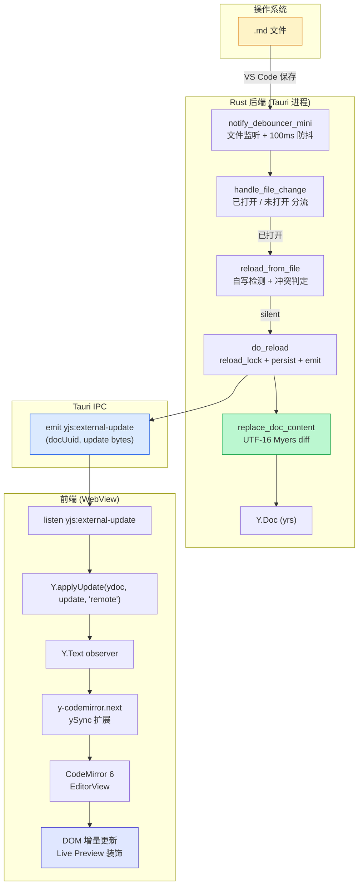
```mermaid
flowchart TB
    subgraph OS["操作系统"]
        FILE[".md 文件"]
    end

    subgraph RUST["Rust 后端 (Tauri 进程)"]
        WATCHER["notify_debouncer_mini<br/>文件监听 + 100ms 防抖"]
        DISPATCH["handle_file_change<br/>已打开 / 未打开 分流"]
        RELOAD["reload_from_file<br/>自写检测 + 冲突判定"]
        DO["do_reload<br/>reload_lock + persist + emit"]
        DIFF["replace_doc_content<br/>UTF-16 Myers diff"]
        YDOC["Y.Doc (yrs)"]
    end

    subgraph IPC["Tauri IPC"]
        EVT["emit yjs:external-update<br/>(docUuid, update bytes)"]
    end

    subgraph FRONT["前端 (WebView)"]
        LISTEN["listen yjs:external-update"]
        APPLY["Y.applyUpdate(ydoc, update, 'remote')"]
        YTEXT["Y.Text observer"]
        YCOLLAB["y-codemirror.next<br/>ySync 扩展"]
        CM6["CodeMirror 6<br/>EditorView"]
        DOM["DOM 增量更新<br/>Live Preview 装饰"]
    end

    FILE -->|"VS Code 保存"| WATCHER
    WATCHER --> DISPATCH
    DISPATCH -->|"已打开"| RELOAD
    RELOAD -->|"silent"| DO
    DO --> DIFF
    DIFF --> YDOC
    DO --> EVT
    EVT --> LISTEN
    LISTEN --> APPLY
    APPLY --> YTEXT
    YTEXT --> YCOLLAB
    YCOLLAB --> CM6
    CM6 --> DOM

    style FILE fill:#fef3c7,stroke:#d97706
    style DIFF fill:#bbf7d0,stroke:#16a34a
    style EVT fill:#dbeafe,stroke:#2563eb
    style DOM fill:#e0e7ff,stroke:#4338ca
```

---

## 2. 场景：这条路上到底有多少"坑"

你可能觉得"把 `.md` 的新内容塞进编辑器"很简单——读一下文件、替换一下文本框内容就完事了？

设想一下这些并发场景：

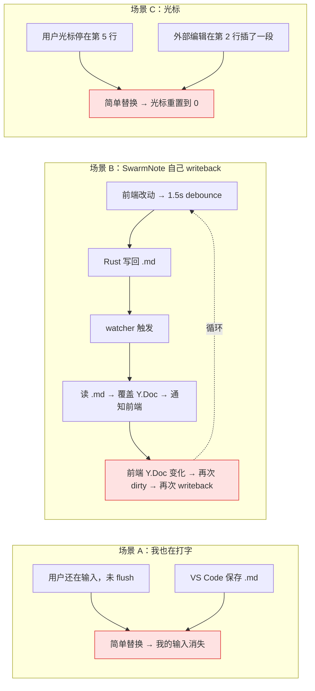
```mermaid
flowchart LR
    subgraph S1["场景 A：我也在打字"]
        A1["用户还在输入，未 flush"]
        A2["VS Code 保存 .md"]
        A3["简单替换 → 我的输入消失"]
        A1 --> A3
        A2 --> A3
    end

    subgraph S2["场景 B：SwarmNote 自己 writeback"]
        B1["前端改动 → 1.5s debounce"]
        B2["Rust 写回 .md"]
        B3["watcher 触发"]
        B4["读 .md → 覆盖 Y.Doc → 通知前端"]
        B5["前端 Y.Doc 变化 → 再次 dirty → 再次 writeback"]
        B1 --> B2 --> B3 --> B4 --> B5 -.循环.-> B1
    end

    subgraph S3["场景 C：光标"]
        C1["用户光标停在第 5 行"]
        C2["外部编辑在第 2 行插了一段"]
        C3["简单替换 → 光标重置到 0"]
        C1 --> C3
        C2 --> C3
    end

    style A3 fill:#fee2e2,stroke:#dc2626
    style B5 fill:#fee2e2,stroke:#dc2626
    style C3 fill:#fee2e2,stroke:#dc2626
```

这条流水线每一步几乎都对应一个陷阱的防御：

| 陷阱 | 防御机制 | 出现位置 |
|------|---------|---------|
| "保存一次 = 多个 FS 事件" | 100ms debounce | notify_debouncer_mini |
| writeback 触发自己的 watcher → 死循环 | blake3 hash 自写检测 | `reload_from_file` |
| 外部覆盖本地未保存的字 | dirty 时弹对话框 + CRDT text-diff | `reload_from_file` + `replace_doc_content` |
| 整段替换光标跳走 | 增量 insert/delete 而非 replace | `replace_doc_content` |
| 应用 remote update 又把 dirty 标上 | `origin = "remote"` annotation | 前端 NoteEditor |

下面我们沿着流水线走一遍。

---

## 3. 九步旅行

### 3.1 OS 事件 → notify watcher

操作系统层面，Windows 的 `ReadDirectoryChangesW`、Linux 的 `inotify`、macOS 的 `FSEvents` 都会报告文件变更。Rust 的 [`notify`](https://crates.io/crates/notify) crate 是它们的跨平台抽象。

但是 — **一次"保存"在 OS 层面往往是多个事件**。VS Code 典型流程是：

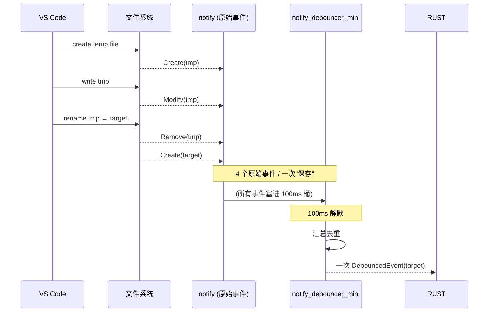
```mermaid
sequenceDiagram
    participant VS as VS Code
    participant FS as 文件系统
    participant NOTIFY as notify (原始事件)
    participant DEB as notify_debouncer_mini

    VS->>FS: create temp file
    FS-->>NOTIFY: Create(tmp)
    VS->>FS: write tmp
    FS-->>NOTIFY: Modify(tmp)
    VS->>FS: rename tmp → target
    FS-->>NOTIFY: Remove(tmp)
    FS-->>NOTIFY: Create(target)
    Note over NOTIFY,DEB: 4 个原始事件 / 一次"保存"

    NOTIFY->>DEB: (所有事件塞进 100ms 桶)
    Note over DEB: 100ms 静默
    DEB->>DEB: 汇总去重
    DEB-->>RUST: 一次 DebouncedEvent(target)
```

没有防抖，后面链路会被重复触发 N 次。代码里的防抖窗口是 100 毫秒：

```rust
// src-tauri/src/fs/watcher.rs:71
let debouncer = new_debouncer(
    Duration::from_millis(100),
    move |events| { /* ... */ },
)?;
```

然后过滤一轮：跳过 `.` 开头的目录（`.swarmnote`、`.git`），只保留 `.md` 文件变更，拿到 workspace 相对路径。最后分别传给下一步：

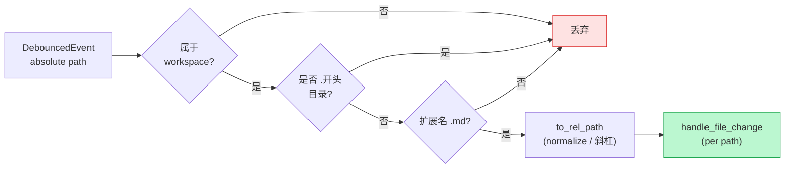
```mermaid
flowchart LR
    E["DebouncedEvent<br/>absolute path"] --> F1{"属于<br/>workspace?"}
    F1 -->|否| X["丢弃"]
    F1 -->|是| F2{"是否 .开头<br/>目录?"}
    F2 -->|是| X
    F2 -->|否| F3{"扩展名 .md?"}
    F3 -->|否| X
    F3 -->|是| REL["to_rel_path<br/>(normalize / 斜杠)"]
    REL --> CALL["handle_file_change<br/>(per path)"]

    style X fill:#fee2e2,stroke:#dc2626
    style CALL fill:#bbf7d0,stroke:#16a34a
```

### 3.2 handle_file_change 分流

文档可能**正在某个窗口里被打开编辑**，也可能**闭着**（只在磁盘上）。两种情况行为不一样：

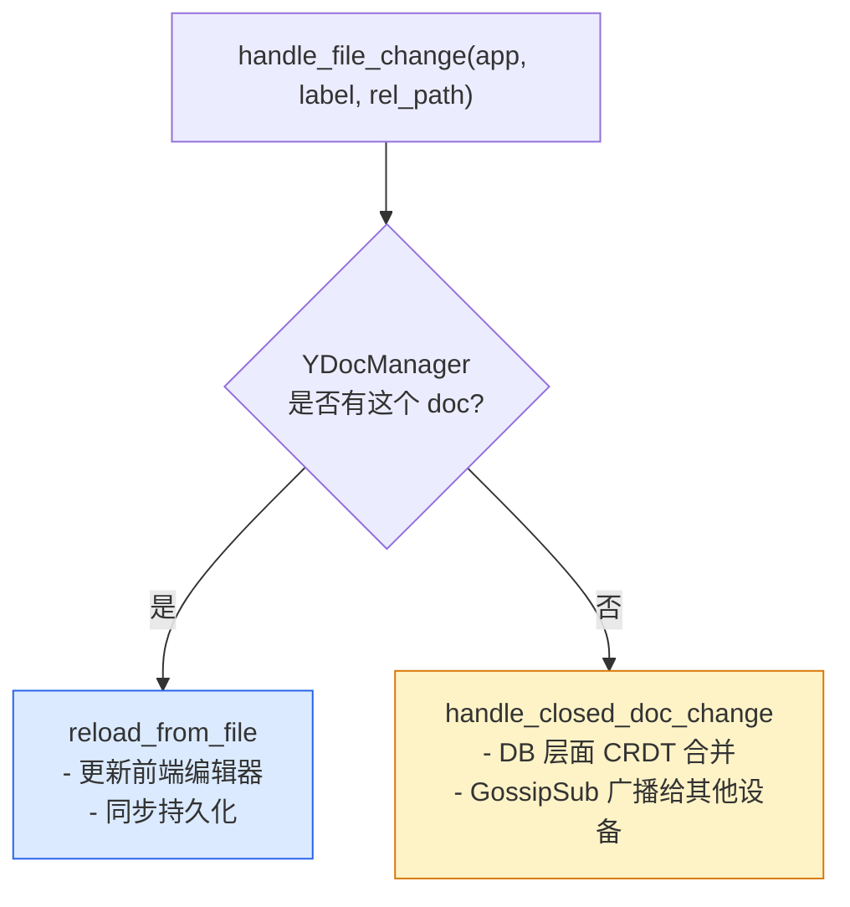
```mermaid
flowchart TD
    H["handle_file_change(app, label, rel_path)"] --> Q{"YDocManager<br/>是否有这个 doc?"}
    Q -->|是| R1["reload_from_file<br/>- 更新前端编辑器<br/>- 同步持久化"]
    Q -->|否| R2["handle_closed_doc_change<br/>- DB 层面 CRDT 合并<br/>- GossipSub 广播给其他设备"]

    style R1 fill:#dbeafe,stroke:#2563eb
    style R2 fill:#fef3c7,stroke:#d97706
```

本文追踪"当前窗口有这个文档打开"的热门路径（左分支）。

### 3.3 reload_from_file：自写检测与冲突判定

进入 `YDocManager::reload_from_file` 后，先回答两个问题：

1. 这次变更是不是**我们自己**刚刚 writeback 产生的？
2. 用户本地有没有**未 flush 的编辑**？

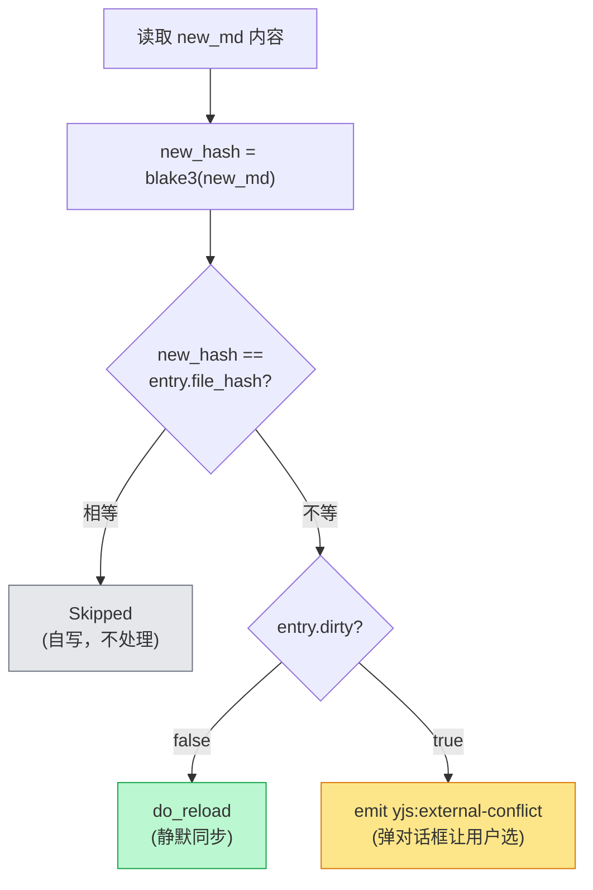
```mermaid
flowchart TD
    A["读取 new_md 内容"] --> B["new_hash = blake3(new_md)"]
    B --> C{"new_hash ==<br/>entry.file_hash?"}
    C -->|相等| D["Skipped<br/>(自写，不处理)"]
    C -->|不等| E{"entry.dirty?"}
    E -->|false| F["do_reload<br/>(静默同步)"]
    E -->|true| G["emit yjs:external-conflict<br/>(弹对话框让用户选)"]

    style D fill:#e5e7eb,stroke:#6b7280
    style F fill:#bbf7d0,stroke:#16a34a
    style G fill:#fde68a,stroke:#d97706
```

每次我们 writeback 写文件后，都会**立刻**把新文件的 blake3 hash 存到 `entry.file_hash`：

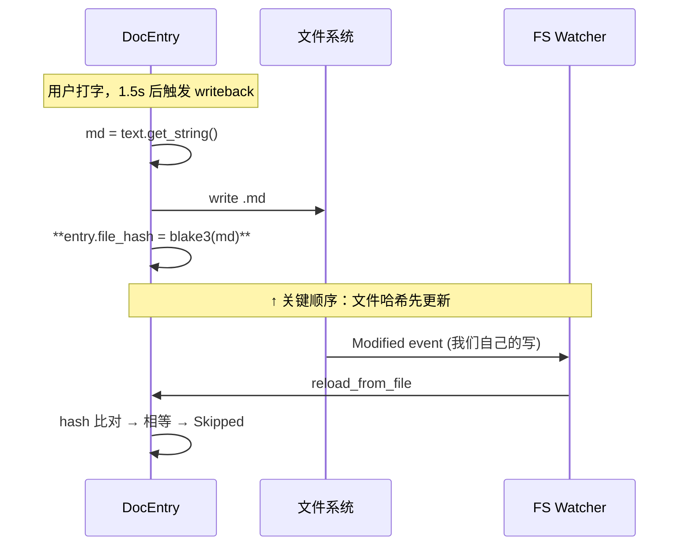
```mermaid
sequenceDiagram
    participant DocEntry
    participant FS as 文件系统
    participant Watcher as FS Watcher

    Note over DocEntry: 用户打字，1.5s 后触发 writeback
    DocEntry->>DocEntry: md = text.get_string()
    DocEntry->>FS: write .md
    DocEntry->>DocEntry: **entry.file_hash = blake3(md)**
    Note over DocEntry,Watcher: ↑ 关键顺序：文件哈希先更新
    FS->>Watcher: Modified event (我们自己的写)
    Watcher->>DocEntry: reload_from_file
    DocEntry->>DocEntry: hash 比对 → 相等 → Skipped
```

没有这一步，writeback 会触发自己的 watcher → reload → 再 writeback → 死循环。

### 3.4 do_reload：加锁与生成增量

判断"静默同步"后走到 `do_reload`：

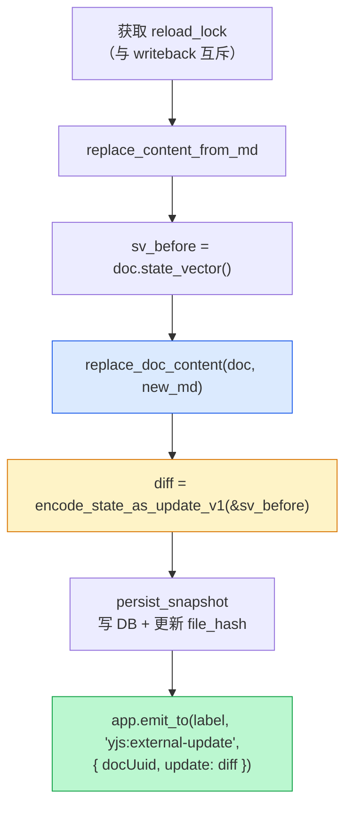
```mermaid
flowchart TD
    A["获取 reload_lock<br/>（与 writeback 互斥）"] --> B["replace_content_from_md"]
    B --> B1["sv_before = doc.state_vector()"]
    B1 --> B2["replace_doc_content(doc, new_md)"]
    B2 --> B3["diff = encode_state_as_update_v1(&sv_before)"]
    B3 --> C["persist_snapshot<br/>写 DB + 更新 file_hash"]
    C --> D["app.emit_to(label, 'yjs:external-update',<br/>{ docUuid, update: diff })"]

    style B2 fill:#dbeafe,stroke:#2563eb
    style B3 fill:#fef3c7,stroke:#d97706
    style D fill:#bbf7d0,stroke:#16a34a
```

关键在于 `diff`：`encode_state_as_update_v1(&sv_before)` **只编码从 sv_before 到现在之间的增量**，不是整个文档的快照。发给前端的 update 体积通常只有几十到几百字节——恰好是这次外部改动引入的那部分。

### 3.5 replace_doc_content：UTF-16 diff 的秘密

这一步是整条链路最技术化的地方。目标：把 Y.Text 里的 `old_md` 变成 `new_md`，但**只产生最小的 CRDT 操作**。

为什么要最小？因为 CRDT 的并发语义是"尊重每一个 insert/delete 的 position"——操作越粗（整段替换），越容易把并发的小编辑冲洗掉。

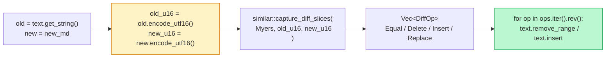
```mermaid
flowchart LR
    A["old = text.get_string()<br/>new = new_md"] --> B["old_u16 = old.encode_utf16()<br/>new_u16 = new.encode_utf16()"]
    B --> C["similar::capture_diff_slices(<br/>&nbsp;Myers, old_u16, new_u16<br/>)"]
    C --> D["Vec&lt;DiffOp&gt;<br/>Equal / Delete / Insert / Replace"]
    D --> E["for op in ops.iter().rev():<br/>&nbsp;&nbsp;text.remove_range / text.insert"]

    style B fill:#fef3c7,stroke:#d97706
    style E fill:#bbf7d0,stroke:#16a34a
```

**为什么是 UTF-16？** Y.Text 的 offset 语义由 `OffsetKind::Utf16` 控制——这是为了和 JavaScript 的 `String.length` / `String.slice` 对齐（JS 字符串内部就是 UTF-16）。yrs 默认是 bytes 模式，但 CJK 字符在 UTF-8 里是 3 字节，偏移量和 JS 对不上，会导致 `block_offset` 溢出 panic。

**为什么倒序？** 因为 `remove_range(index, len)` 和 `insert(index, s)` 的 index 是"当前 Y.Text 状态下的偏移"。如果正序处理，先执行的操作会让后续操作的 index 全部错位。倒序处理则天然保序：

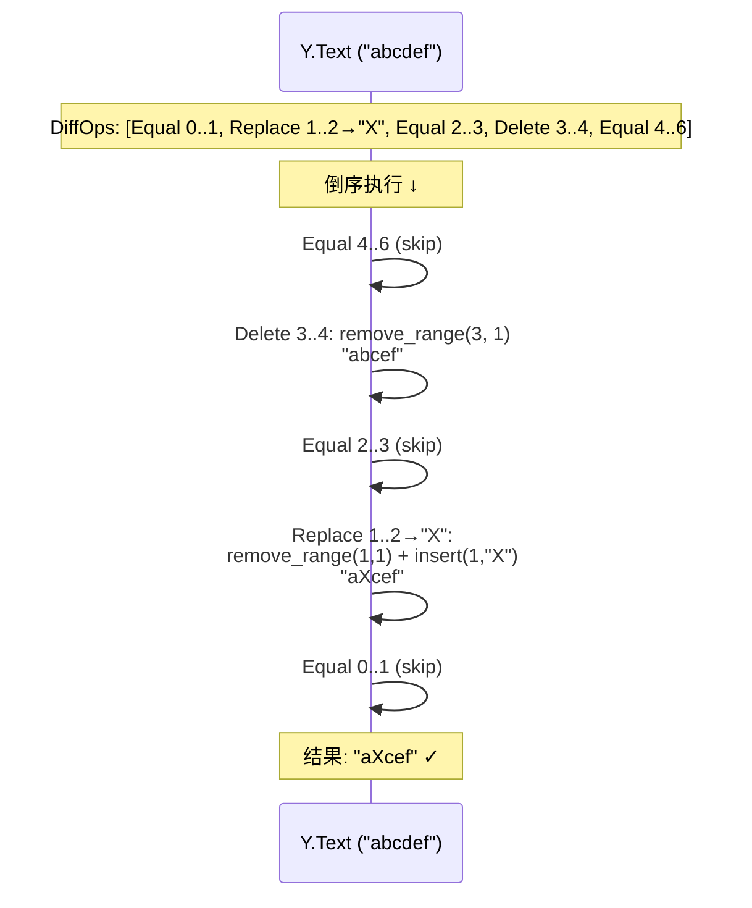
```mermaid
sequenceDiagram
    participant T as Y.Text ("abcdef")
    Note over T: DiffOps: [Equal 0..1, Replace 1..2→"X", Equal 2..3, Delete 3..4, Equal 4..6]

    Note over T: 倒序执行 ↓
    T->>T: Equal 4..6 (skip)
    T->>T: Delete 3..4: remove_range(3, 1)<br/>"abcef"
    T->>T: Equal 2..3 (skip)
    T->>T: Replace 1..2→"X":<br/>remove_range(1,1) + insert(1,"X")<br/>"aXcef"
    T->>T: Equal 0..1 (skip)

    Note over T: 结果: "aXcef" ✓
```

这个算法在 [`src-tauri/src/yjs/mod.rs`](../../src-tauri/src/yjs/mod.rs#L73) 里实现，配套 9 个单元测试覆盖 append/delete/middle change/CJK/并发合并等场景。

### 3.6 Tauri 事件跨越进程边界

Y.Doc 操作完成后得到 `diff: Vec<u8>`——一段二进制 CRDT update。Rust 通过 Tauri 的 event 机制发给前端：

```rust
app.emit_to(
    label,
    "yjs:external-update",
    serde_json::json!({
        "docUuid": doc_uuid.to_string(),
        "update": diff,
    }),
)
```

Tauri 底层把 event 通过 IPC 通道（本质上是 WebView ↔ Rust 之间的 WebSocket-like 消息流）发到目标窗口的 WebView：

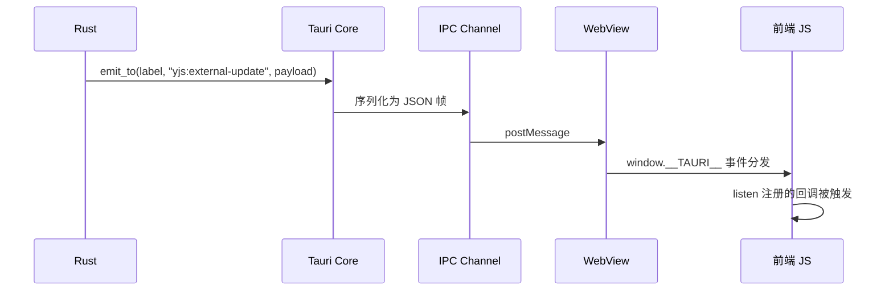
```mermaid
sequenceDiagram
    participant Rust
    participant TauriCore as Tauri Core
    participant IPC as IPC Channel
    participant WebView
    participant JS as 前端 JS

    Rust->>TauriCore: emit_to(label, "yjs:external-update", payload)
    TauriCore->>IPC: 序列化为 JSON 帧
    IPC->>WebView: postMessage
    WebView->>JS: window.__TAURI__ 事件分发
    JS->>JS: listen 注册的回调被触发
```

注意 `update` 字段从 `Vec<u8>` 序列化为 JSON 时变成 `number[]`，前端侧需要用 `new Uint8Array(event.payload.update)` 转回 typed array。

### 3.7 前端 listen + applyUpdate

`NoteEditor.tsx` 用 Tauri 的 `listen` API 订阅事件：

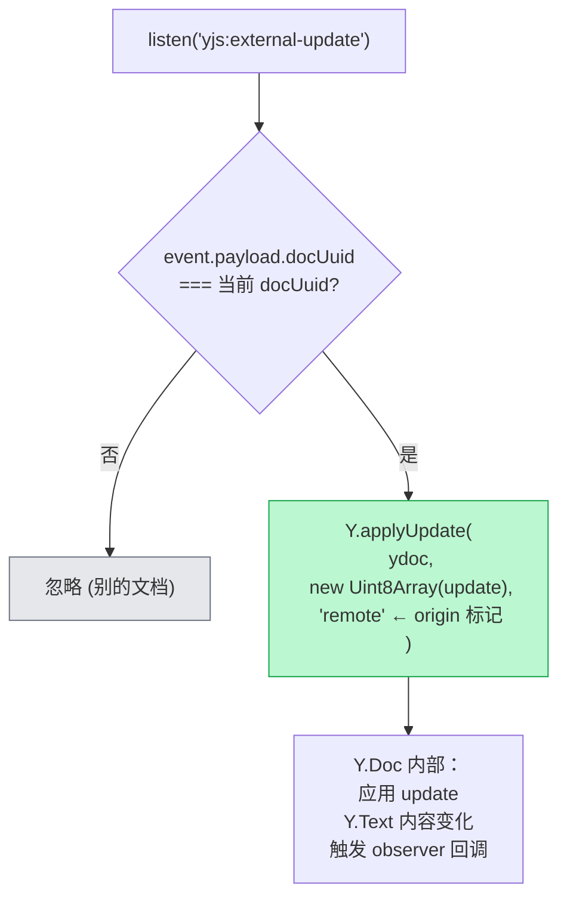
```mermaid
flowchart TD
    A["listen('yjs:external-update')"] --> B{"event.payload.docUuid<br/>=== 当前 docUuid?"}
    B -->|否| X["忽略 (别的文档)"]
    B -->|是| C["Y.applyUpdate(<br/>&nbsp;ydoc,<br/>&nbsp;new Uint8Array(update),<br/>&nbsp;'remote'  ← origin 标记<br/>)"]
    C --> D["Y.Doc 内部：<br/>应用 update<br/>Y.Text 内容变化<br/>触发 observer 回调"]

    style C fill:#bbf7d0,stroke:#16a34a
    style X fill:#e5e7eb,stroke:#6b7280
```

`"remote"` 这个字符串是 **origin 标签**，稍后会在环路避免里看到它的作用。

### 3.8 y-codemirror.next 的桥接

[y-codemirror.next](https://github.com/yjs/y-codemirror.next) 是 yjs 官方维护的 CodeMirror 6 绑定。它内部订阅了 Y.Text 的 observer，把 delta 翻译成 CM6 的 ChangeSet：

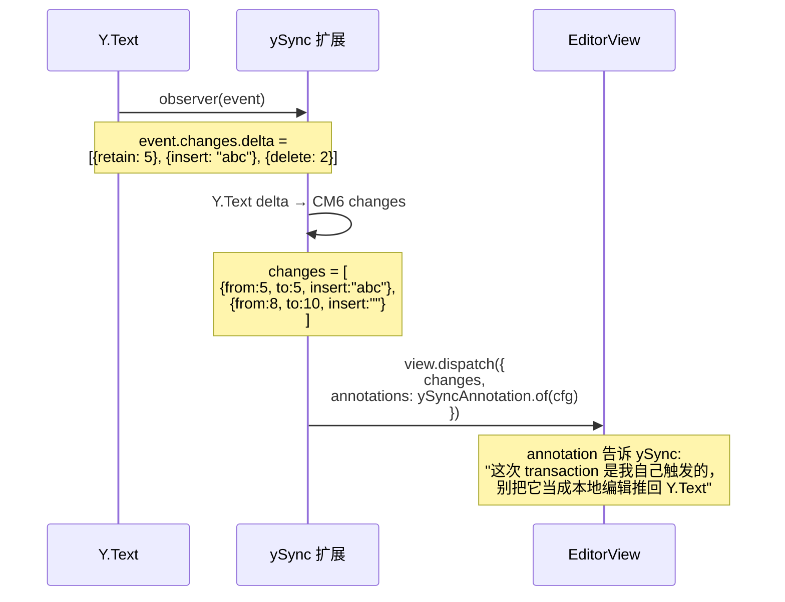
```mermaid
sequenceDiagram
    participant YT as Y.Text
    participant YS as ySync 扩展
    participant CM6 as EditorView

    YT->>YS: observer(event)
    Note over YT,YS: event.changes.delta = <br/>[{retain: 5}, {insert: "abc"}, {delete: 2}]
    YS->>YS: Y.Text delta → CM6 changes
    Note over YS: changes = [<br/>  {from:5, to:5, insert:"abc"},<br/>  {from:8, to:10, insert:""}<br/>]
    YS->>CM6: view.dispatch({<br/>  changes,<br/>  annotations: ySyncAnnotation.of(cfg)<br/>})
    Note over CM6: annotation 告诉 ySync:<br/>"这次 transaction 是我自己触发的，<br/>别把它当成本地编辑推回 Y.Text"
```

`ySyncAnnotation` 是关键——没有它，CM6 会把自己的 transaction 通知给 y-codemirror.next 的 updateListener，后者又会把 CM6 的变化推回 Y.Text，形成"Y.Text → CM6 → Y.Text → ..."的死循环。Annotation 就是一张"自己人勿扰"的牌。

### 3.9 CodeMirror 6 的增量渲染

CM6 收到 `view.dispatch({ changes })` 后：

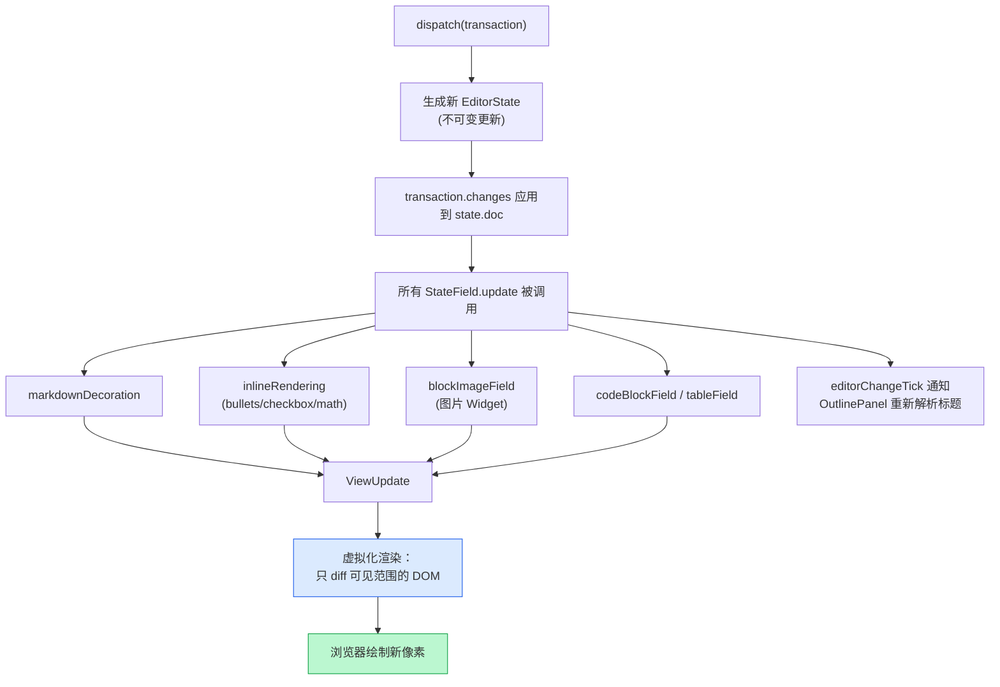
```mermaid
flowchart TD
    A["dispatch(transaction)"] --> B["生成新 EditorState<br/>(不可变更新)"]
    B --> C["transaction.changes 应用到 state.doc"]
    C --> D["所有 StateField.update 被调用"]
    D --> D1["markdownDecoration"]
    D --> D2["inlineRendering<br/>(bullets/checkbox/math)"]
    D --> D3["blockImageField<br/>(图片 Widget)"]
    D --> D4["codeBlockField / tableField"]
    D --> D5["editorChangeTick 通知<br/>OutlinePanel 重新解析标题"]
    D1 & D2 & D3 & D4 --> E["ViewUpdate"]
    E --> F["虚拟化渲染：<br/>只 diff 可见范围的 DOM"]
    F --> G["浏览器绘制新像素"]

    style F fill:#dbeafe,stroke:#2563eb
    style G fill:#bbf7d0,stroke:#16a34a
```

两个关键点：

- **状态是不可变的**：CM6 不修改老 state，而是根据 transaction 产生新 state。这让 undo/redo、时间旅行调试都很干净。
- **光标由 transaction 自动平移**：`{from: 5, to: 5, insert: "abc"}` 这种 change，CM6 知道要把所有 > 5 的光标位置都 +3。用户的光标不会"跳走"。

---

## 4. 四个关键设计点

### 4.1 100ms 防抖：对抗"保存 = 多个事件"

已经在 [3.1](#31-os-事件--notify-watcher) 展开过——100 毫秒是一个经验值，够长以合并一次保存的连续事件，够短以让用户感觉"保存立即生效"。

### 4.2 blake3 自写检测：打破循环

可能是整个系统里最精妙的一个设计。流程对比：

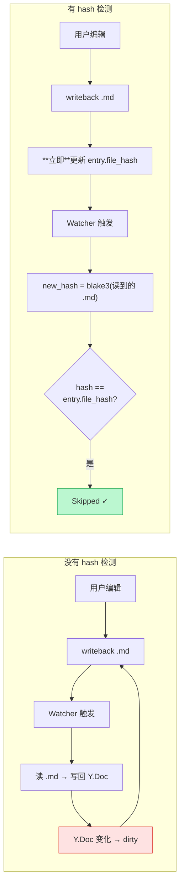
```mermaid
flowchart LR
    subgraph NoGuard["没有 hash 检测"]
        A1["用户编辑"] --> A2["writeback .md"]
        A2 --> A3["Watcher 触发"]
        A3 --> A4["读 .md → 写回 Y.Doc"]
        A4 --> A5["Y.Doc 变化 → dirty"]
        A5 --> A2
    end

    subgraph WithGuard["有 hash 检测"]
        B1["用户编辑"] --> B2["writeback .md"]
        B2 --> B3["**立即**更新 entry.file_hash"]
        B3 --> B4["Watcher 触发"]
        B4 --> B5["new_hash = blake3(读到的 .md)"]
        B5 --> B6{"hash ==<br/>entry.file_hash?"}
        B6 -->|是| B7["Skipped ✓"]
    end

    style A5 fill:#fee2e2,stroke:#dc2626
    style B7 fill:#bbf7d0,stroke:#16a34a
```

`persist_snapshot` 的实现顺序是刻意的：

1. 写入 `.md` 文件
2. **立刻**计算 hash 并存到 `entry.file_hash`（在 await 写 DB 之前！）
3. 写 DB 持久化 yjs_state

只有这个顺序才能保证：当 OS 把 FS 事件派发给 debouncer → 回调 → `reload_from_file` 读 hash 时，`entry.file_hash` 已经是新值。

### 4.3 text-diff 胜过整段替换

前面 [3.5](#35-replace_doc_contentutf-16-diff-的秘密) 讲了**怎么做**，这里讲**为什么必须这么做**。

设想另一台设备 B 和本地 A 通过 P2P 协作同一个文档。同一时刻：

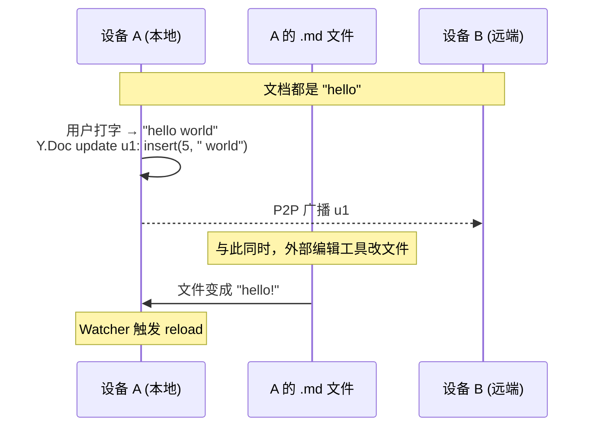
```mermaid
sequenceDiagram
    participant A as 设备 A (本地)
    participant FILE as A 的 .md 文件
    participant B as 设备 B (远端)

    Note over A,B: 文档都是 "hello"
    A->>A: 用户打字 → "hello world"<br/>Y.Doc update u1: insert(5, " world")
    A-->>B: P2P 广播 u1

    Note over FILE: 与此同时，外部编辑工具改文件
    FILE->>A: 文件变成 "hello!"
    Note over A: Watcher 触发 reload
```

**方案 A：整段替换**（`text.delete(0,5) + text.insert(0, "hello!")`）

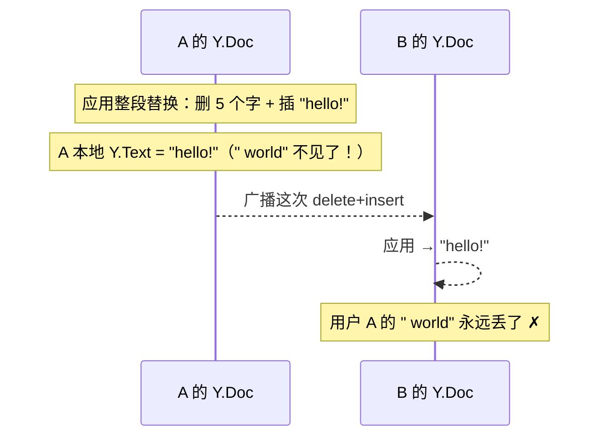
```mermaid
sequenceDiagram
    participant A as A 的 Y.Doc
    participant B as B 的 Y.Doc

    Note over A: 应用整段替换：删 5 个字 + 插 "hello!"
    Note over A: A 本地 Y.Text = "hello!"（" world" 不见了！）
    A-->>B: 广播这次 delete+insert
    B-->>B: 应用 → "hello!"
    Note over B: 用户 A 的 " world" 永远丢了 ✗
```

**方案 B：text-diff**（`insert(5, "!")`）

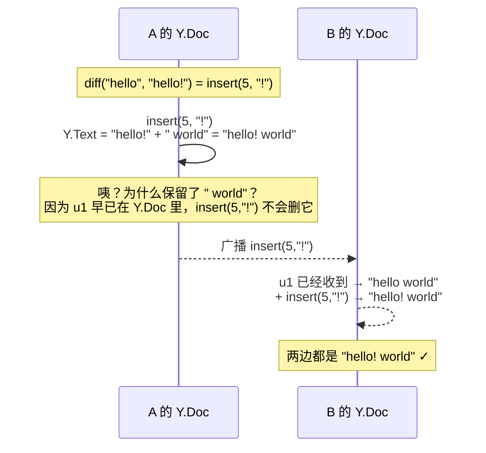
```mermaid
sequenceDiagram
    participant A as A 的 Y.Doc
    participant B as B 的 Y.Doc

    Note over A: diff("hello", "hello!") = insert(5, "!")
    A->>A: insert(5, "!")<br/>Y.Text = "hello!" + " world" = "hello! world"
    Note over A: 咦？为什么保留了 " world"？<br/>因为 u1 早已在 Y.Doc 里，insert(5,"!") 不会删它
    A-->>B: 广播 insert(5,"!")
    B-->>B: u1 已经收到 → "hello world"<br/>+ insert(5,"!") → "hello! world"
    Note over B: 两边都是 "hello! world" ✓
```

Text-diff 在 CRDT 语境下天然合并——因为它只描述"哪里改了什么"，而不是"整个内容是什么"。

### 4.4 `origin = "remote"`：环路的最后一道闸

应用 update 后 Y.Doc 会 emit `update` 事件。NoteEditor 订阅这个事件来跟踪"脏"状态：

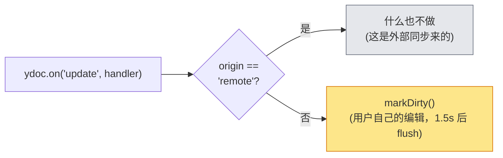
```mermaid
flowchart LR
    A["ydoc.on('update', handler)"] --> B{"origin ==<br/>'remote'?"}
    B -->|是| C["什么也不做<br/>(这是外部同步来的)"]
    B -->|否| D["markDirty()<br/>(用户自己的编辑，1.5s 后 flush)"]

    style C fill:#e5e7eb,stroke:#6b7280
    style D fill:#fde68a,stroke:#d97706
```

如果不区分 origin，每次外部同步都会把 UI 状态标成"未保存"——奇怪：用户明明没动，凭什么说未保存？更糟糕的是，标脏会触发 debounced writeback，又写一次文件，又触发 watcher，又触发 reload... 老朋友了，死循环。

`"remote"` 标签让 applyUpdate 引入的变化走 "不标脏 + 不触发 writeback" 的静默路径。

同样的思路也出现在 y-codemirror.next 的 `ySyncAnnotation` 里（3.8 节）——在不同层面给同源变化打上标签，避免互相推来推去。

---

## 5. 冲突分支：本地有未保存编辑时

如果 `entry.dirty == true`（用户正在打字还没 flush），静默覆盖显然不对。这时走冲突路径：

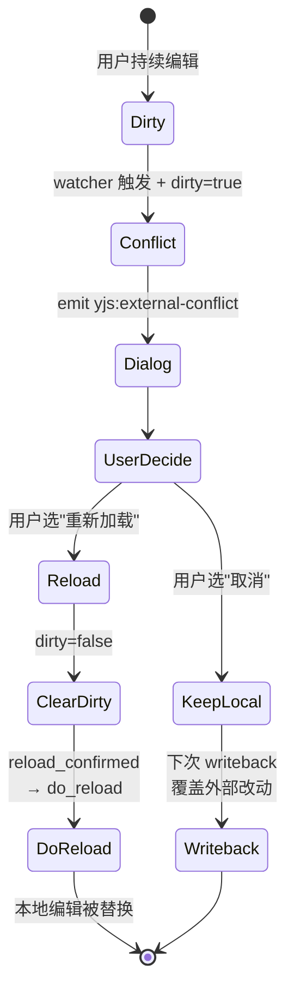
```mermaid
stateDiagram-v2
    [*] --> Dirty: 用户持续编辑
    Dirty --> Conflict: watcher 触发 + dirty=true
    Conflict --> Dialog: emit yjs:external-conflict
    Dialog --> UserDecide

    state UserDecide <<choice>>
    UserDecide --> Reload: 用户选"重新加载"
    UserDecide --> KeepLocal: 用户选"取消"

    Reload --> ClearDirty: dirty=false
    ClearDirty --> DoReload: reload_confirmed<br/>→ do_reload
    DoReload --> [*]: 本地编辑被替换

    KeepLocal --> Writeback: 下次 writeback<br/>覆盖外部改动
    Writeback --> [*]
```

前端接到 `yjs:external-conflict` 事件后弹出 Tauri 的原生 `confirm` 对话框：

> "新建笔记.md" 已被外部修改。是否重新加载？当前未保存的编辑将丢失。

点"确定"调 `reload_ydoc_confirmed` IPC，后端把 dirty 清零然后走正常的 `do_reload`。

这是整条链路里**唯一**弹对话框的场景。其他所有外部修改（包括含图片、表格、代码块的复杂变更）都是 silent reload。

---

## 6. 场景对比：text-diff vs 整段替换

把整件事浓缩成一张对比表：

| 维度 | 整段替换 | text-diff (本实现) |
|------|---------|-------------------|
| CRDT update 体积 | 全文大小 | O(变更范围) |
| 并发编辑合并 | 丢失并发改动 | CRDT 正确合并 |
| 光标位置 | 重置到 0 | 由 transaction 自动平移 |
| P2P 广播带宽 | 浪费（每次都是全量） | 只传 diff |
| 历史记录粒度 | 每次都是全替换 | 每次是语义级的 insert/delete |
| 实现复杂度 | 极低 | 中等（需要 diff 库 + UTF-16 处理） |
| 单元测试难度 | 低 | 中（需要覆盖 CJK、并发等） |

再加一个特别的对比——**如果"不做 diff，直接写 Markdown → Block → Y.Doc 编码"**（这是本项目 CM6 迁移前的做法）：

```mermaid
flowchart LR
    subgraph Old["CM6 迁移前 (~5000 行桥接)"]
        O1["读 .md"] --> O2["markdown → AST"] --> O3["AST → Block 树"] --> O4["Block → XmlFragment<br/>编码到 Y.Doc"] --> O5["diff 两个 Y.Doc<br/>生成 update"]
    end

    subgraph New["CM6 迁移后 (本文所述)"]
        N1["读 .md"] --> N2["text-diff (old, new)"] --> N3["Y.Text insert/delete"] --> N4["encode update"]
    end

    style O3 fill:#fecaca,stroke:#b91c1c
    style O4 fill:#fecaca,stroke:#b91c1c
    style N2 fill:#bbf7d0,stroke:#16a34a
```

新方案不需要任何"语义解析"——因为 Y.Text 的内容和 `.md` 的内容**本来就是同一份字符串**（见 [CM6 迁移博客](./cm6-migration-tradeoffs.md)）。

---

## 7. 小结

这条流水线有两类力量在拉扯：

**分布式正确性**——我们希望多端并发编辑、外部工具编辑、自动同步这三类来源的变更能够**无损合并**。这是 CRDT、text-diff、origin 标记、冲突对话框共同在解决的问题。

**工程健壮性**——我们希望文件操作不会自我循环、防抖合理、光标不会跳走、自写可识别。这是 blake3 hash、reload_lock、debounce、annotation 在保障的东西。

两类都做到了，才能让用户在 VS Code 里改一下 `.md` 保存——SwarmNote 编辑器那边**像什么都没发生**一样把新内容融入当前视图。用户只看到"编辑器内容变了"这一个结果，但这背后是九个环节、四个关键设计、两个防御机制共同接力跑完的。

> 最好的抽象是让上层看起来简单。这条流水线做得好的地方，就是你感觉不到它存在。

## 相关阅读

- [从 BlockNote 到 CodeMirror 6：一次产品定位级的架构迁移](./cm6-migration-tradeoffs.md) — 数据模型为什么能坍缩为 Y.Text
- [App Core 架构设计](./app-core-architecture.md) — 跨平台 Rust 核心抽象
- [TauriYjsProvider 实现](./tauri-yjs-provider.md) — 前后端 yjs update 通道是怎么建立的
