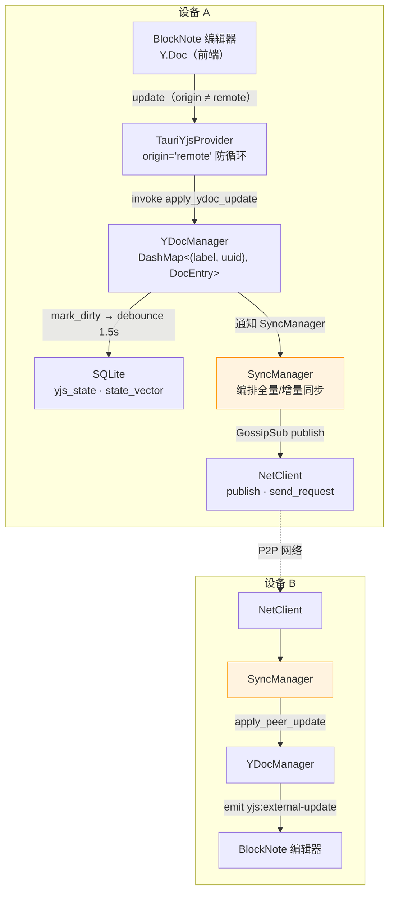
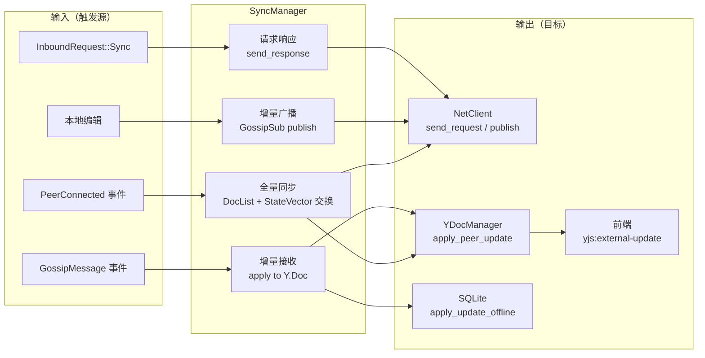
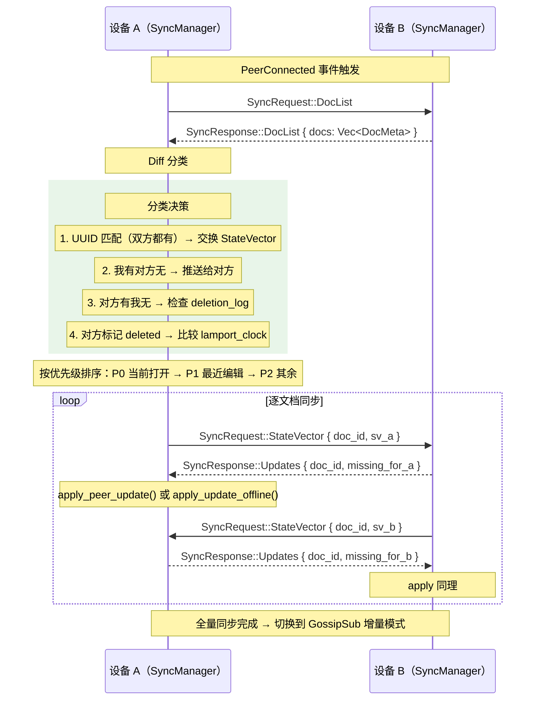
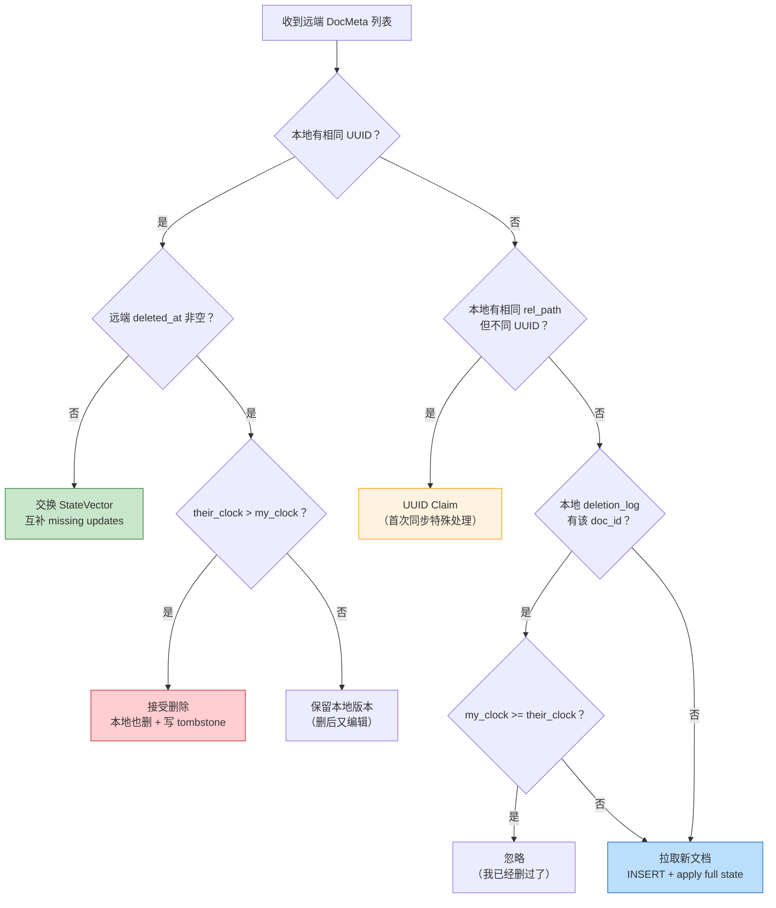
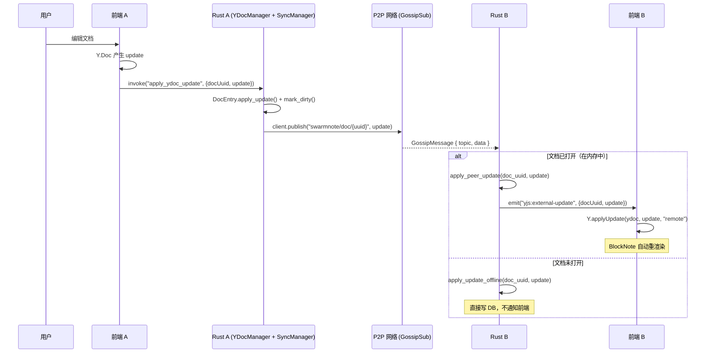
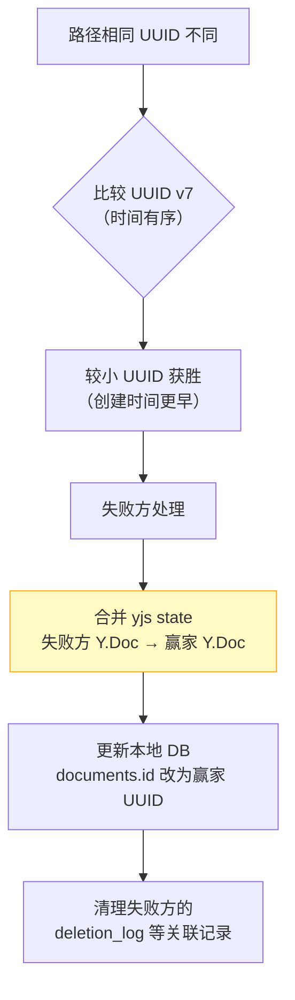

# P2P 同步实现深度探索

> 本文是 4 个专家 Agent 并行探索的综合产出，分别从**网络层、数据层、设计文档、前端集成**四个维度研究了 SwarmNote 如何实现 P2P 笔记同步。

## 1. 现状盘点：已经有什么？还缺什么？

### 1.1 已就绪的基础设施

| 模块 | 就绪状态 | 具体内容 |
|------|---------|---------|
| GossipSub API | ✅ 完整 | `subscribe` / `unsubscribe` / `publish` 三个方法已在 `swarm-p2p-core` 中实现 |
| Request-Response API | ✅ 完整 | `send_request` / `send_response`，超时 120s |
| 协议消息定义 | ✅ 完整 | `SyncRequest::DocList/StateVector/FullSync` + `SyncResponse::DocList/Updates` |
| DocMeta 结构 | ✅ 完整 | 含 `doc_id: Uuid`、`deleted_at`、`lamport_clock`、`workspace_uuid: Uuid` |
| documents.state_vector | ✅ 已持久化 | `persist_snapshot` 每次写回都更新 `state_vector` 列 |
| deletion_log 墓碑 | ✅ 已实现 | 删除路径统一写 tombstone，含 lamport_clock |
| YDocManager | ✅ 完整 | DashMap per-window 管理，writeback task debounce 1.5s |
| 前端 yjs:external-update | ✅ 可复用 | `Y.applyUpdate(ydoc, update, "remote")` + origin 防循环 |
| workspace.json UUID | ✅ 已实现 | 工作区全局 UUID 源头，三级优先级解析 |
| UNIQUE(workspace_id, rel_path) | ✅ 已加 | 并发安全保障 |
| event_loop Sync 分支 | ⚠️ STUB | 有匹配分支但打印 "not yet implemented" |
| event_loop GossipMessage | ⚠️ STUB | 同上 |

### 1.2 需要新建的组件

| 组件 | 重要性 | 说明 |
|------|--------|------|
| **SyncManager** 模块 | P0 核心 | 编排全量/增量同步的中枢 |
| `apply_peer_update()` | P0 | YDocManager 新入口：按 doc_uuid 遍历所有窗口的 DocEntry |
| `apply_update_offline()` | P0 | YDocManager 新入口：文档未打开时直接操作 DB |
| event_loop 填充 | P0 | `InboundRequest::Sync` + `GossipMessage` 两个 stub 的实现 |
| UUID Claim 机制 | P1 | 首次同步时处理同路径不同 UUID 的冲突 |
| 同步状态 UI | P1 | StatusBar 展示 syncing/synced/offline |
| lamport_clock 编辑递增 | P2 | `persist_snapshot` 中递增 clock |

---

## 2. 架构全景：数据如何流转

### 2.1 整体架构图



### 2.2 前端防循环机制

前端维护完整的 `Y.Doc` 实例，BlockNote 通过 `y-prosemirror` 直接读写 `ydoc.getXmlFragment("document-store")`。`TauriYjsProvider` 的核心设计：

```
本地编辑 → Y.Doc "update" 事件（origin = 用户操作）
  → TauriYjsProvider._onDocUpdate()
  → origin !== "remote" → invoke("apply_ydoc_update") → 发给 Rust

远端同步 → Rust emit "yjs:external-update"
  → Y.applyUpdate(ydoc, update, "remote")    ← origin 设为 "remote"
  → Y.Doc "update" 事件（origin = "remote"）
  → TauriYjsProvider._onDocUpdate()
  → origin === "remote" → 跳过，不回传                ← 防循环
```

**关键结论**：现有的 `yjs:external-update` 事件可以**直接复用于 P2P 同步**，前端无需任何改动。

---

## 3. SyncManager：核心新模块

### 3.1 职责定义

SyncManager 是连接网络层和数据层的编排中枢：



### 3.2 SyncManager 需要持有的引用

```rust
pub struct SyncManager {
    client: NetClient<AppRequest, AppResponse>,  // P2P 网络客户端
    ydoc_mgr: Arc<YDocManager>,                  // Y.Doc 管理器
    db_state: Arc<DbState>,                      // 数据库连接池
    identity: Arc<IdentityState>,                // 本机 PeerId
    pairing_mgr: Arc<PairingManager>,            // 判断 peer 是否已配对
    app: AppHandle,                              // 用于 emit Tauri 事件
}
```

**当前代码中 `NetManager.client` 已标注 `#[expect(dead_code)]`**，说明作者预留了该字段供同步层使用。

---

## 4. YDocManager 需要的 2 个新入口

### 4.1 问题分析

当前 `apply_update` 要求 `window_label` 参数（来自 Tauri 窗口），但 P2P 同步的 update 是网络事件，没有对应窗口。

此外，`DashMap` 的键是 `(window_label, doc_uuid)`——同一文档可能同时在多个窗口打开，P2P update 需要更新所有实例。

### 4.2 入口 1：apply_peer_update（文档在内存中）

```rust
/// P2P 同步专用入口：按 doc_uuid 遍历所有窗口的 DocEntry
pub async fn apply_peer_update(
    &self, app: &AppHandle, doc_uuid: Uuid, update: &[u8]
) -> AppResult<bool> {
    let mut applied = false;
    // 遍历所有持有该 doc_uuid 的 entry（可能跨多个窗口）
    for entry in self.docs.iter() {
        if entry.key().1 != doc_uuid { continue; }
        let (label, _) = entry.key().clone();

        entry.apply_update(update).await?;
        entry.mark_dirty();
        applied = true;

        // 通知对应窗口的前端
        let _ = app.emit_to(&label, "yjs:external-update", json!({
            "docUuid": doc_uuid.to_string(),
            "update": update,
        }));
    }
    Ok(applied)
}
```

### 4.3 入口 2：apply_update_offline（文档不在内存中）

```rust
/// 文档未打开时的离线更新路径：直接操作 DB
pub async fn apply_update_offline(
    db: &DatabaseConnection, doc_uuid: Uuid, update: &[u8]
) -> AppResult<()> {
    let doc_record = documents::Entity::find_by_id(doc_uuid).one(db).await?;
    let Some(record) = doc_record else { return Ok(()); };

    // 创建临时 Doc，加载已有状态
    let doc = Doc::with_options(Options { offset_kind: OffsetKind::Utf16, ..Default::default() });
    doc.get_or_insert_xml_fragment("document-store");
    if let Some(state) = &record.yjs_state {
        apply_binary_update(&doc, state)?;
    }

    // 应用 peer update
    apply_binary_update(&doc, update)?;

    // 重新编码并写回 DB
    let txn = doc.transact();
    let new_state = txn.encode_state_as_update_v1(&StateVector::default());
    let new_sv = txn.state_vector().encode_v1();
    drop(txn);

    let mut model: documents::ActiveModel = record.into();
    model.yjs_state = Set(Some(new_state));
    model.state_vector = Set(Some(new_sv));
    model.updated_at = Set(Utc::now().timestamp());
    model.update(db).await?;
    Ok(())
}
```

---

## 5. 全量同步流程（Request-Response）

### 5.1 触发时机

`PeerConnected` 事件发生，且对方是已配对设备。

### 5.2 完整序列图



### 5.3 Diff 分类的完整决策树



### 5.4 state_vector 的使用

`documents.state_vector` 列已在 `persist_snapshot` 中持久化（`encode_v1()` 格式）。全量同步时：

- 文档在内存中 → 从 `DocEntry` 实时编码（最新状态）
- 文档不在内存 → 从 DB 读取（可能有 debounce 延迟，但对全量同步可接受）
- 从未打开过的文档 → `state_vector IS NULL`，使用 `StateVector::default().encode_v1()`（等同于"我什么都没有，全给我"）

---

## 6. 增量同步流程（GossipSub）

### 6.1 Topic 设计

```
swarmnote/doc/{doc_uuid}     ← 单文档增量 update 广播
swarmnote/meta/{ws_uuid}     ← 工作区文档元数据变更通知（可选）
```

- 打开文档时 `client.subscribe("swarmnote/doc/{uuid}")`
- 关闭文档时 `client.unsubscribe("swarmnote/doc/{uuid}")`
- GossipSub 使用 `ValidationMode::Strict`（需签名），消息 source 可信
- Message ID 基于内容哈希（DefaultHasher），**相同 update 天然去重**

### 6.2 增量同步时序



### 6.3 GossipSub 配置参数

| 参数 | 值 | 影响 |
|------|-----|------|
| `enable_gossipsub` | `true` | 默认启用 |
| `gossipsub_heartbeat_interval` | 10s | 新 peer 加入 mesh 需约 1 个心跳周期 |
| `ValidationMode` | `Strict` | 要求签名，消息 source 可信 |
| `MessageAuthenticity` | `Signed(keypair)` | Ed25519 签名 |
| 消息去重 | 内容哈希 | 相同 yjs update 不会被重复处理 |

**注意**：新 peer 订阅 topic 后最多 10s 才开始稳定收到消息。因此推荐流程是**先全量同步补齐历史，再订阅 GossipSub 接实时增量**。

---

## 7. event_loop 需要填充的 2 个 STUB

### 7.1 当前 stub 状态

`src-tauri/src/network/event_loop.rs` 中有 3 个已标记但未实现的分支：

```rust
// 当前代码（STUB）
NodeEvent::GossipMessage { source, topic, data } => {
    info!("GossipSub message from {source:?} on topic {topic} (handler not yet implemented)");
}
InboundRequest { request: AppRequest::Sync(sync_req), pending_id, peer_id } => {
    warn!("Sync request from {peer_id} not yet implemented");
}
```

### 7.2 GossipMessage 填充方案

```rust
NodeEvent::GossipMessage { source, topic, data } => {
    // 解析 topic → doc_uuid
    if let Some(doc_uuid_str) = topic.strip_prefix("swarmnote/doc/") {
        if let Ok(doc_uuid) = Uuid::parse_str(doc_uuid_str) {
            let applied = sync_manager.handle_gossip_update(doc_uuid, &data).await;
            // handle_gossip_update 内部：
            //   1. ydoc_mgr.apply_peer_update() — 文档在内存
            //   2. ydoc_mgr.apply_update_offline() — 文档不在内存
        }
    }
}
```

### 7.3 InboundRequest::Sync 填充方案

```rust
InboundRequest { request: AppRequest::Sync(sync_req), pending_id, peer_id } => {
    match sync_req {
        SyncRequest::DocList => {
            let docs = sync_manager.build_doc_list(window_label).await;
            client.send_response(pending_id, AppResponse::Sync(
                SyncResponse::DocList { docs }
            )).await;
        }
        SyncRequest::StateVector { doc_id, sv } => {
            let missing = sync_manager.compute_missing_updates(doc_id, &sv).await;
            client.send_response(pending_id, AppResponse::Sync(
                SyncResponse::Updates { doc_id, updates: missing }
            )).await;
        }
        SyncRequest::FullSync { doc_id } => {
            let full_state = sync_manager.get_full_state(doc_id).await;
            client.send_response(pending_id, AppResponse::Sync(
                SyncResponse::Updates { doc_id, updates: full_state }
            )).await;
        }
    }
}
```

---

## 8. 前端改动评估

### 8.1 零改动即可工作的部分

| 现有机制 | 为什么可以直接复用 |
|----------|-------------------|
| `yjs:external-update` 事件 | Rust emit → 前端 `Y.applyUpdate(ydoc, update, "remote")` → BlockNote 自动重渲染。P2P update 与外部文件修改的处理逻辑完全相同 |
| `TauriYjsProvider` 防循环 | `origin === "remote"` 过滤，不会将远端 update 回传给 Rust |
| `networkStore` 事件 | `peer-connected` / `peer-disconnected` 已完整，可驱动"是否有设备在线"的判断 |

### 8.2 需要新增的前端组件

#### A. editorStore 扩展同步状态

```typescript
// 新增字段
syncStatus: "idle" | "syncing" | "synced";
lastSyncedAt: Date | null;

// 新增 actions
setSyncStatus: (status) => void;
```

#### B. NoteEditor 注册新的 Tauri 事件

| 新事件名（建议） | Payload | 前端处理 |
|-----------------|---------|---------|
| `yjs:sync-started` | `{ docUuid }` | `setSyncStatus("syncing")` |
| `yjs:sync-complete` | `{ docUuid }` | `setSyncStatus("synced")` |

注意：P2P 增量 update 直接复用 `yjs:external-update`，不需要新事件。

#### C. StatusBar 同步状态指示

```
syncing  → 旋转图标 + "同步中..."
synced   → 绿色图标 + "已同步 HH:MM"
idle     → 灰色图标 + "离线"
```

---

## 9. 未决问题与风险分析

### 9.1 P0 阻塞问题

#### MD ↔ yrs Roundtrip 测试

**这是阻塞一切同步工作的前置条件。**

同步架构的核心假设是 `.md` 文件为真实数据源，yjs 仅作同步层。如果 `markdown → Y.Doc → markdown` 转换有损，这个假设崩塌。

`crates/yrs-blocknote/tests/e2e_test.rs` 已有基础测试，但需要补充：
- CJK 字符（中日韩）roundtrip
- 嵌套列表（多层缩进）
- 代码块（含特殊字符）
- 表格 + 图片混合
- 空文档 / 单行文档边界

### 9.2 P1 设计缺口

#### UUID Claim（首次同步 UUID 冲突）

**场景**：A 和 B 各自独立创建 `notes/todo.md`，UUID 不同。首次同步时路径相同但 UUID 不同。

**设计文档状态**：标记为 open question，未给方案。

**建议方案**：



关键原则：**失败方的 yjs state 必须 merge 进赢家的 Y.Doc**，不能丢弃任何本地编辑内容。

#### GossipSub 消息丢失补偿

GossipSub 不保证 exactly-once 投递。建议：
- 每 30 秒对当前打开的文档做一次 StateVector 校验
- 发现落后则触发增量 Request-Response 补全
- 全量同步在 reconnect 时兜底（已设计）

#### rel_path 重命名冲突

A 和 B 同时重命名同一文档的路径。当前 `DocMeta` 未携带"路径版本"信息。

建议暂用 `updated_at` 较新者的 `rel_path` 获胜，后续版本再精细化。

### 9.3 P2 已知限制

#### 大文档分块传输

当前 Request-Response 无硬性大小限制（libp2p Yamux 默认 ~16 MiB window）。普通笔记远低于此限制。

`doc_chunks` 表已预留（FastCDC 分块索引），但 v0.2.0 不实现。

#### 三台设备并发同步

设计文档验收标准中有"3 台设备同时在线，同步无遗漏"，但具体测试方案未说明。yjs CRDT 天然支持多方合并，理论上不需要特殊处理，但 tombstone 的 Lamport clock 在三方场景下的正确性需要验证。

#### 工作区元数据同步

工作区名称修改、文件夹结构同步完全未设计。v0.2.0 范围明确排除了此功能。

---

## 10. 建议实现路径

### 10.1 三阶段路线图


### 10.2 各阶段详细说明

| 阶段 | MVP 目标 | 关键产出 | 验收标准 |
|------|---------|---------|---------|
| **1. 全量同步** | A 配对 B 后，B 从零同步 A 的所有文档 | SyncManager + event_loop 填充 + 2 个新 YDocManager 入口 | B 能看到 A 的所有文档内容 |
| **2. 增量同步** | A 编辑，B 在 <500ms 内看到更新 | GossipSub 生命周期 + 广播/接收 + 丢失补偿 | 实时编辑同步，延迟 < 500ms |
| **3. 边界 + UI** | 离线合并、删除防复活、状态指示 | UUID Claim + tombstone 同步 + StatusBar | 断开 → 各自编辑 → 重连自动合并 |

### 10.3 前置检查清单

在开始阶段 1 之前，必须完成：

- [ ] **MD ↔ yrs Roundtrip 测试**：补充 CJK、嵌套列表、代码块等边界用例
- [ ] **yjs ↔ yrs 二进制兼容性验证**：前端 `Y.Doc.encodeStateAsUpdate()` 的输出能否被 Rust `yrs::Update::decode_v1()` 正确解析（反向同理）
- [ ] **UUID Claim 补充设计**：明确"路径相同 UUID 不同"时的完整决策和 DB 迁移步骤

---

## 11. 关键代码位置索引

| 文件 | 行号 | 内容 |
|------|------|------|
| `libs/core/src/client/gossipsub.rs` | 全文 | `subscribe` / `unsubscribe` / `publish` API |
| `libs/core/src/event.rs` | 全文 | `NodeEvent` 所有变体定义（含 `GossipMessage`） |
| `libs/core/src/config.rs` | 全文 | `NodeConfig` 可调参数 |
| `src-tauri/src/network/event_loop.rs` | 133-143 | GossipMessage / Sync STUB 分支 |
| `src-tauri/src/network/mod.rs` | - | `NetManager.client` 标注 `#[expect(dead_code)]`（预留接口） |
| `src-tauri/src/protocol/mod.rs` | 88-126 | `SyncRequest` / `SyncResponse` / `DocMeta` 定义 |
| `src-tauri/src/yjs/manager.rs` | 143 | `DashMap<(String, Uuid), Arc<DocEntry>>` 结构 |
| `src-tauri/src/yjs/manager.rs` | 159-300 | `open_doc` 完整流程 |
| `src-tauri/src/yjs/manager.rs` | 480-521 | `persist_snapshot`（写 yjs_state + state_vector） |
| `src-tauri/src/yjs/manager.rs` | 535-586 | writeback task debounce 逻辑 |
| `src-tauri/entity/src/workspace/documents.rs` | 全文 | documents 表 entity 定义 |
| `src-tauri/entity/src/workspace/deletion_log.rs` | 全文 | tombstone 表定义 |
| `src-tauri/entity/src/workspace/doc_chunks.rs` | 全文 | 分块索引（预留，未使用） |
| `src/lib/TauriYjsProvider.ts` | 24-31 | 前端 update 防循环（origin 过滤） |
| `src/components/editor/NoteEditor.tsx` | 68-73 | Y.Doc 实例化 + provider 创建 |
| `src/components/editor/NoteEditor.tsx` | 193-210 | `yjs:external-update` 事件处理 |
| `src/stores/editorStore.ts` | 全文 | 编辑器状态（docUuid、isDirty 等） |
| `src/stores/networkStore.ts` | 全文 | 网络状态（connectedPeers、natStatus） |
