# Tauri v2 系统托盘实战：从零到完整的后台常驻体验

> SwarmNote 是一款 P2P 笔记同步工具，需要在后台持续运行以同步数据。本文记录了如何在 Tauri v2 + React 应用中实现完整的系统托盘功能，包括托盘菜单、关闭窗口隐藏到托盘、动态状态更新等。

## 1. 什么是系统托盘？

系统托盘（System Tray）是操作系统提供的一个**常驻通知区域**，位于任务栏角落。你每天都在用它——微信、QQ、Dropbox、OneDrive 的小图标都在那里。

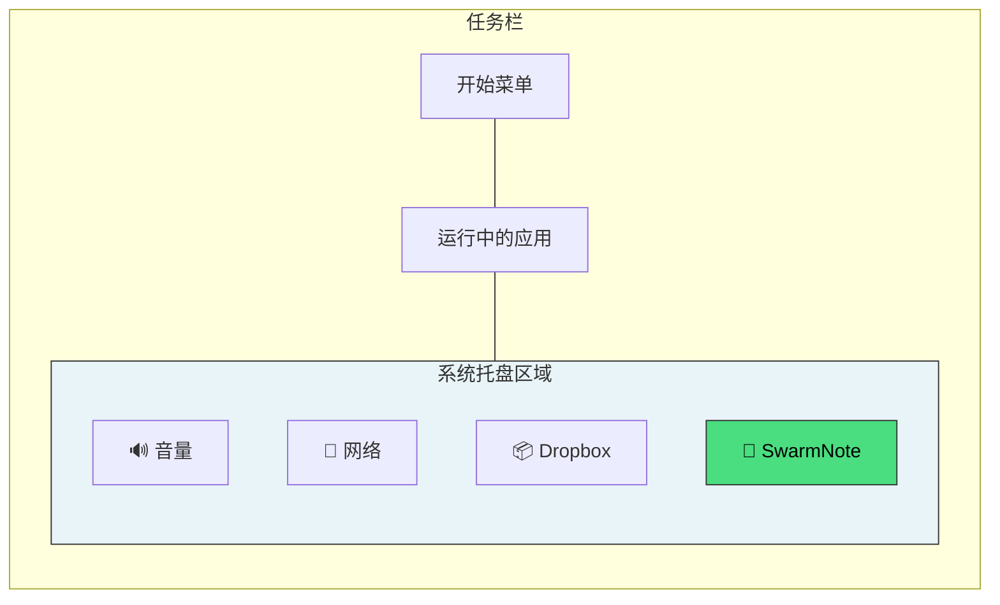

### 系统托盘的核心能力

| 能力 | 说明 | 典型场景 |
|------|------|----------|
| **常驻图标** | 应用关闭窗口后，图标仍然可见 | 后台同步、消息提醒 |
| **右键菜单** | 点击图标弹出操作菜单 | 快捷控制、状态查看 |
| **左键交互** | 单击/双击图标触发动作 | 恢复窗口、切换状态 |
| **动态更新** | 图标、菜单文字可以实时变化 | 显示连接状态、下载进度 |
| **气泡通知** | 在图标附近弹出通知 | 新消息、同步完成 |

### 各平台差异

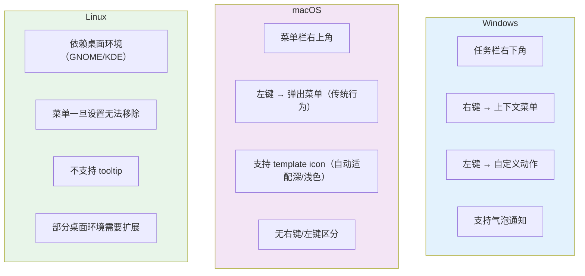

Tauri v2 封装了 `tray-icon` crate，帮我们抹平了大部分差异，但仍有一些平台特有行为需要注意。

## 2. 为什么 SwarmNote 需要系统托盘？

SwarmNote 是一个 **P2P 笔记同步工具**，核心价值在于设备间实时同步。这意味着：

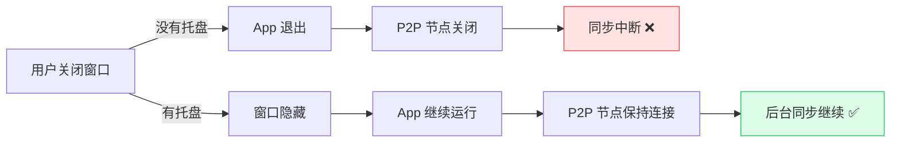

类比日常使用的软件：

- **Dropbox / OneDrive**：关闭窗口后继续同步文件
- **微信 / Telegram**：关闭窗口后继续接收消息
- **SwarmNote**：关闭窗口后继续同步笔记

## 3. 整体架构设计

在动手写代码之前，先梳理整体架构。系统托盘涉及 Rust 后端和 React 前端两侧的配合：

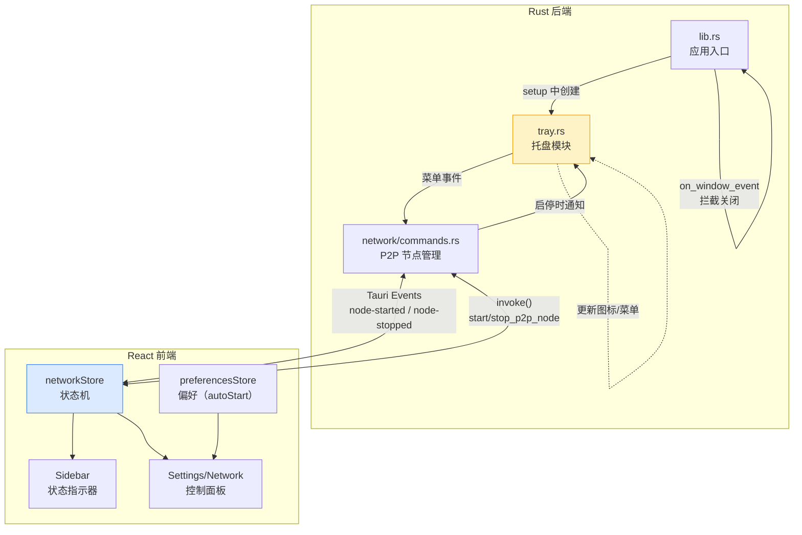

### 关键设计决策

**为什么不在 Rust `setup()` 中自动启动 P2P 节点？**

之前的实现是在 `setup()` 中无条件 spawn 启动 P2P 节点，存在两个问题：
1. 前端 `networkStore` 初始状态是 `false`，但后端已经在运行——**前后端状态不一致**
2. 用户无法控制何时启动——**没有用户主权**

新设计：后端只初始化空状态，前端根据用户偏好（`autoStartP2P`）在合适时机（打开工作区后）触发启动。

## 4. Tauri v2 托盘 API 速览

在 Tauri v2 中，系统托盘通过 `tray-icon` feature 启用。核心 API 围绕三个概念展开：

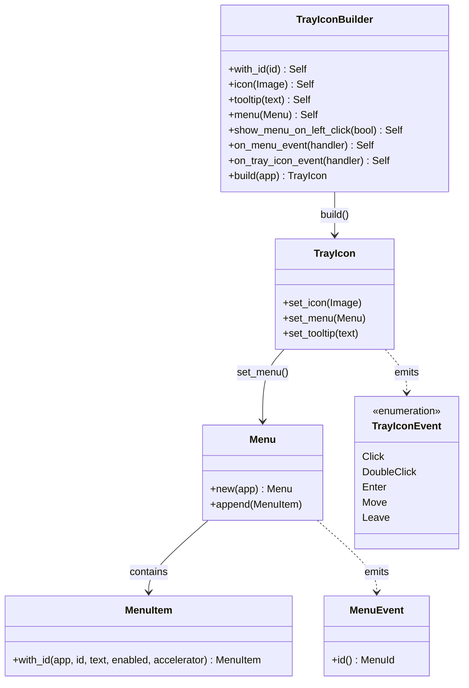

### 启用 feature

在 `Cargo.toml` 中为 Tauri 开启 tray 支持：

```toml
[dependencies]
tauri = { version = "2", features = ["tray-icon", "image-png"] }
```

- `tray-icon`：启用系统托盘 API
- `image-png`：支持从 PNG 字节加载图标（`Image::from_bytes`）

## 5. 实现步骤详解

### 5.1 创建托盘模块 `tray.rs`

整个托盘的生命周期可以总结为：

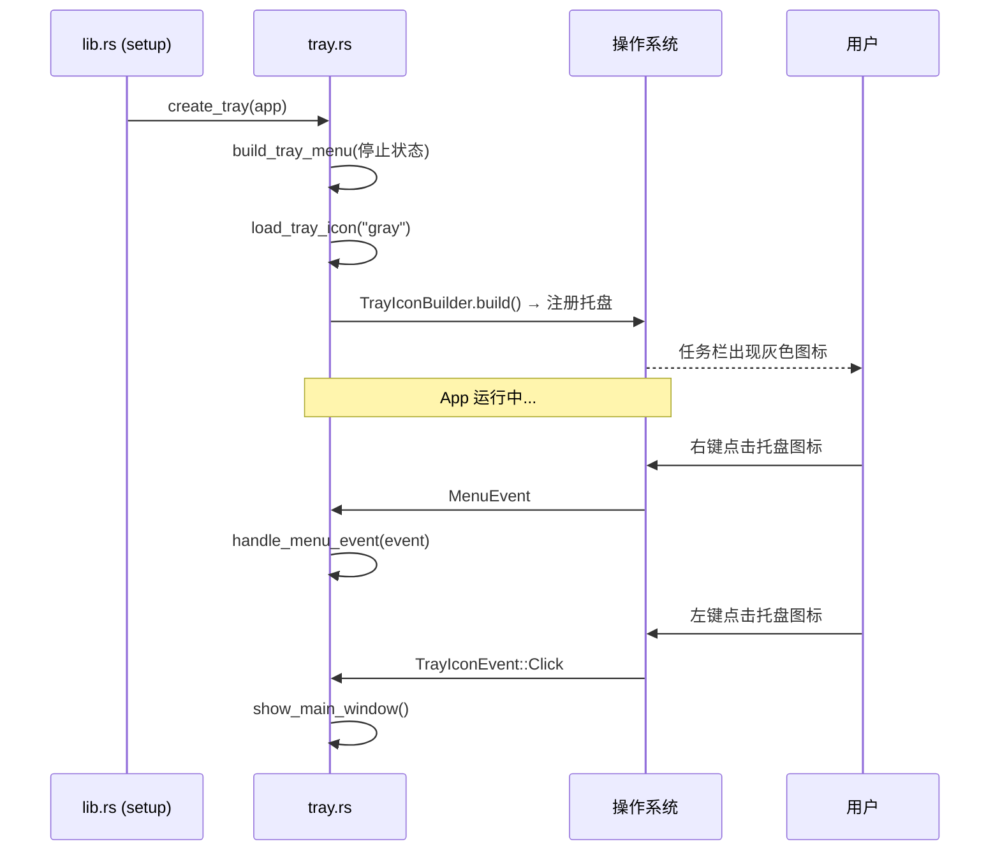

#### 创建托盘的核心代码

```rust
pub fn create_tray(app: &AppHandle) -> tauri::Result<()> {
    // 1. 构建初始菜单（节点未运行状态）
    let menu = build_tray_menu(app, false, 0)?;

    // 2. 使用 Builder 模式创建托盘
    let tray = TrayIconBuilder::with_id(TRAY_ID)
        .icon(load_tray_icon("gray"))           // 灰色图标 = 未连接
        .tooltip("SwarmNote")                   // 鼠标悬停提示
        .menu(&menu)                            // 右键菜单
        .show_menu_on_left_click(false)         // 左键不弹菜单（我们自定义行为）
        .on_menu_event(handle_menu_event)       // 菜单点击回调
        .on_tray_icon_event(handle_tray_icon_event)  // 图标点击回调
        .build(app)?;

    // 3. 存储 TrayIcon 到 Tauri State，供后续动态更新
    app.manage(TrayState(tokio::sync::Mutex::new(tray)));

    Ok(())
}
```

**关键点解读：**

- **`with_id(TRAY_ID)`**：给托盘一个 ID，方便后续通过 ID 查找（虽然我们这里用 State 存储更方便）
- **`show_menu_on_left_click(false)`**：macOS 默认左键弹菜单，Windows 默认右键。设置为 `false` 后，左键点击走 `on_tray_icon_event`，右键点击走 `on_menu_event`
- **`app.manage(TrayState(...))`**：Tauri 的 State 管理机制，类似 React 的 Context，全局可访问

#### 菜单构建

```rust
fn build_tray_menu(app: &AppHandle, node_running: bool, peer_count: usize)
    -> tauri::Result<Menu<tauri::Wry>>
{
    let menu = Menu::new(app)?;

    // 状态行（disabled = 不可点击，纯展示）
    let status_text = if node_running {
        format!("P2P 已连接 · {} 台设备", peer_count)
    } else {
        "P2P 未连接".to_string()
    };
    let status_item = MenuItem::with_id(app, "status", &status_text, false, None::<&str>)?;
    //                                               enabled=false ─────────^^^^^
    menu.append(&status_item)?;

    menu.append(&PredefinedMenuItem::separator(app)?)?;  // ──────────

    // 操作项
    menu.append(&MenuItem::with_id(app, "open", "打开 SwarmNote", true, None::<&str>)?)?;

    let toggle_text = if node_running { "暂停同步" } else { "恢复同步" };
    menu.append(&MenuItem::with_id(app, "toggle-sync", toggle_text, true, None::<&str>)?)?;

    menu.append(&PredefinedMenuItem::separator(app)?)?;

    menu.append(&MenuItem::with_id(app, "settings", "设置", true, None::<&str>)?)?;
    menu.append(&MenuItem::with_id(app, "quit", "退出 SwarmNote", true, None::<&str>)?)?;

    Ok(menu)
}
```

最终效果的菜单结构：

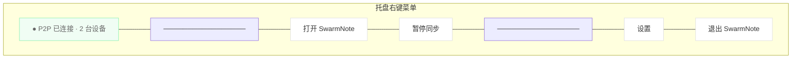

### 5.2 处理菜单事件

每个菜单项通过 `id` 区分。事件处理是纯同步函数签名，但我们可以在里面 spawn async 任务：

```rust
fn handle_menu_event(app: &AppHandle, event: MenuEvent) {
    match event.id().as_ref() {
        "open" => {
            // 同步操作：直接执行
            show_main_window(app);
        }
        "toggle-sync" => {
            // 异步操作：需要 spawn
            let handle = app.clone();
            tauri::async_runtime::spawn(async move {
                toggle_sync(&handle).await;
            });
        }
        "quit" => {
            let handle = app.clone();
            tauri::async_runtime::spawn(async move {
                // 先优雅关闭 P2P 节点
                let net_state = handle.state::<NetManagerState>();
                if let Some(manager) = net_state.lock().await.take() {
                    manager.shutdown().await;
                }
                // 再退出 App（绕过窗口关闭拦截）
                handle.exit(0);
            });
        }
        _ => {}
    }
}
```

**为什么需要 `app.clone()` + `spawn`？**

`handle_menu_event` 的签名是 `fn(&AppHandle, MenuEvent)`——同步函数。但停止 P2P 节点是异步操作（需要 `await`）。所以我们 clone 一份 `AppHandle`（它是 `Arc` 内部实现，clone 很便宜），然后 spawn 到 Tokio runtime 执行。

### 5.3 左键点击恢复窗口

```rust
fn handle_tray_icon_event(tray: &TrayIcon, event: TrayIconEvent) {
    if let TrayIconEvent::Click {
        button: MouseButton::Left,
        button_state: MouseButtonState::Up,  // Up 而非 Down，避免重复触发
        ..
    } = event
    {
        show_main_window(tray.app_handle());
    }
}

fn show_main_window(app: &AppHandle) {
    if let Some(window) = app.get_webview_window("main") {
        let _ = window.show();       // 从隐藏状态恢复
        let _ = window.set_focus();  // 聚焦到前台
    }
}
```

### 5.4 关闭窗口 → 隐藏到托盘

这是"后台常驻"体验的核心：用户点击窗口的 ✕ 按钮时，不退出 App，而是隐藏窗口。

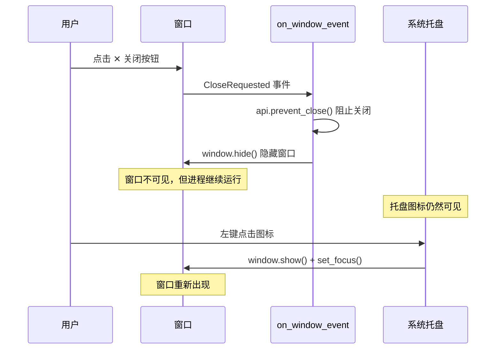

在 `lib.rs` 中注册这个拦截：

```rust
builder
    .on_window_event(|window, event| {
        #[cfg(desktop)]  // 仅桌面端，Android 没有托盘
        {
            if let tauri::WindowEvent::CloseRequested { api, .. } = event {
                api.prevent_close();    // 阻止窗口销毁
                let _ = window.hide();  // 隐藏窗口
            }
        }
    })
    .setup(|app| {
        // ...
    })
```

**`api.prevent_close()` 是关键**——如果不调用它，窗口会被销毁，Tauri 会在最后一个窗口销毁时退出进程。

那用户怎么真正退出？通过托盘菜单的"退出"按钮，调用 `app.exit(0)` 强制退出进程，不会触发 `CloseRequested` 事件。

### 5.5 动态更新托盘状态

当 P2P 节点启动/停止、设备连接/断开时，托盘需要实时更新：

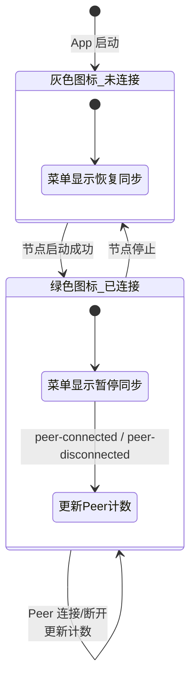

更新托盘的策略是**重建整个菜单**（因为 Tauri 不支持单独修改某个 MenuItem 的文字）：

```rust
pub fn update_tray_for_node_status(app: &AppHandle, node_running: bool) {
    let handle = app.clone();
    tauri::async_runtime::spawn(async move {
        let tray_state = handle.try_state::<TrayState>();
        let Some(tray_state) = tray_state else { return };
        let tray = tray_state.0.lock().await;

        // 1. 切换图标
        let icon_name = if node_running { "normal" } else { "gray" };
        let _ = tray.set_icon(Some(load_tray_icon(icon_name)));

        // 2. 重建菜单（"暂停同步" ↔ "恢复同步"）
        if let Ok(menu) = build_tray_menu(&handle, node_running, 0) {
            let _ = tray.set_menu(Some(menu));
        }
    });
}
```

更新调用点：

```rust
// 在 do_start_p2p_node 成功后：
let _ = app.emit("node-started", ());
#[cfg(desktop)]
crate::tray::update_tray_for_node_status(app, true);

// 在 stop_p2p_node 成功后：
let _ = app.emit("node-stopped", ());
#[cfg(desktop)]
crate::tray::update_tray_for_node_status(&app, false);
```

### 5.6 图标资源

我们准备了 3 套 32x32 PNG 图标：

| 文件 | 含义 | 对应状态 |
|------|------|----------|
| `icon-gray.png` | 灰色（不活跃） | 节点未运行 |
| `icon-normal.png` | 原色（活跃） | 节点运行中 |
| `icon-yellow.png` | 黄色（警告） | 启动中 / NAT 受限 |

使用 `include_bytes!` 在编译期嵌入二进制，不需要运行时读取文件：

```rust
fn load_tray_icon(name: &str) -> Image<'static> {
    let bytes = match name {
        "normal" => include_bytes!("../icons/tray/icon-normal.png").to_vec(),
        "yellow" => include_bytes!("../icons/tray/icon-yellow.png").to_vec(),
        _        => include_bytes!("../icons/tray/icon-gray.png").to_vec(),
    };
    Image::from_bytes(&bytes).expect("Failed to load tray icon")
}
```

### 5.7 条件编译：Android 没有托盘

所有托盘代码都用 `#[cfg(desktop)]` 守卫，确保 Android 构建不会包含这些代码：

```rust
// lib.rs 中声明模块
#[cfg(desktop)]
pub mod tray;

// setup 中创建托盘
#[cfg(desktop)]
{
    tray::create_tray(app.handle())?;
}

// 节点启停时更新托盘
#[cfg(desktop)]
crate::tray::update_tray_for_node_status(app, true);
```

## 6. 前端状态同步

后端搞定了托盘，前端需要与之配合——核心是 `networkStore` 的状态机重写。

### 6.1 从 boolean 到四态状态机

之前的实现：

```typescript
// ❌ 旧实现：boolean 无法表达中间状态
interface NetworkState {
  isNodeRunning: boolean;
}
```

新实现：

```typescript
// ✅ 新实现：4 状态状态机
type NodeStatus = "stopped" | "starting" | "running" | "error";

interface NetworkState {
  status: NodeStatus;
  error: string | null;
  connectedPeers: PeerInfo[];
  natStatus: string | null;
  userManuallyStopped: boolean;  // 手动停止标记
}
```

状态转换图：

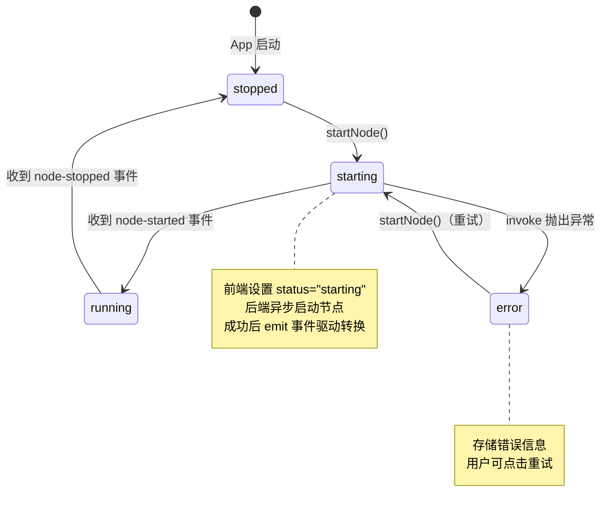

### 6.2 事件驱动而非命令返回值驱动

这是一个重要的架构决策：

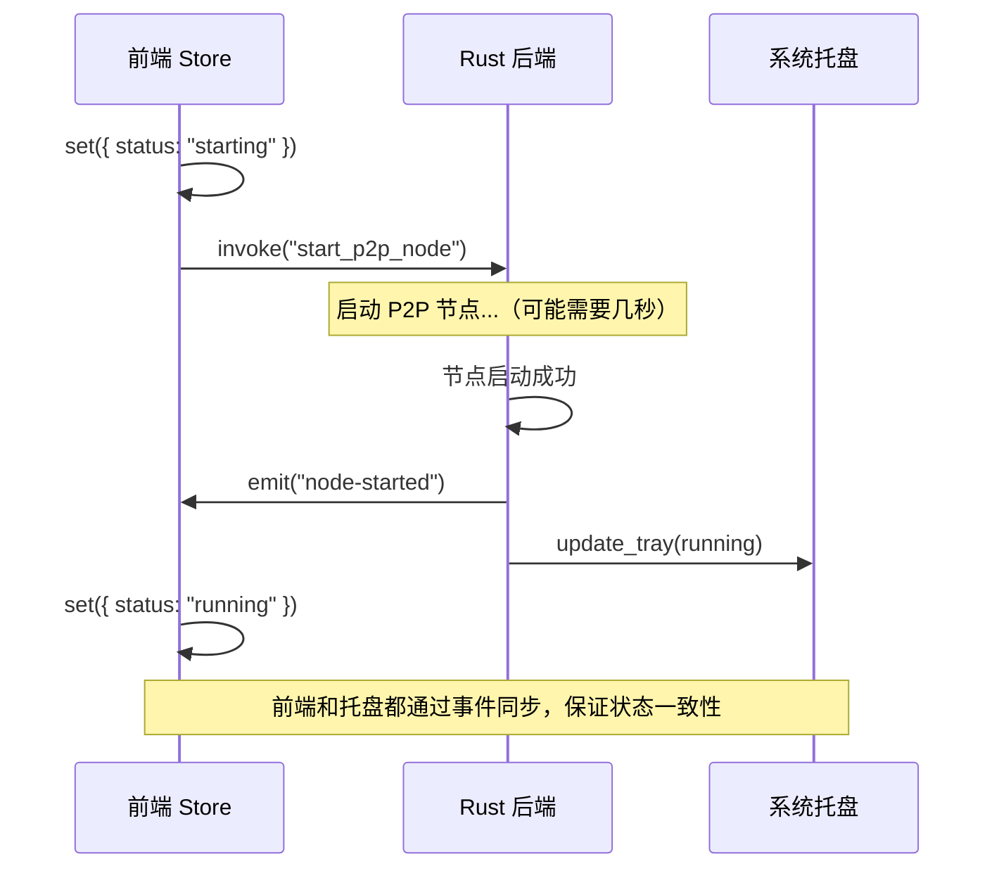

为什么用事件而不是直接用 `invoke` 的返回值？因为**托盘也可以启停节点**。如果只靠 `invoke` 返回值，托盘操作不会通知前端。用事件广播，无论是前端 `invoke` 还是托盘菜单触发，前端都能收到状态变化。

### 6.3 `userManuallyStopped` 标记

一个细节问题：用户手动停止节点后，切换工作区时不应该自动重启。

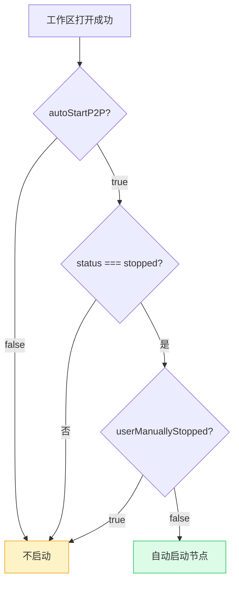

```typescript
// workspaceStore.ts 中的自动启动逻辑
function maybeAutoStartP2P() {
  const { autoStartP2P } = usePreferencesStore.getState();
  const { status, userManuallyStopped, startNode } = useNetworkStore.getState();
  if (autoStartP2P && status === "stopped" && !userManuallyStopped) {
    startNode();
  }
}
```

## 7. 前端 UI

### 7.1 侧边栏网络状态指示器

一个轻量的状态点 + 文字，点击跳转到设置页：

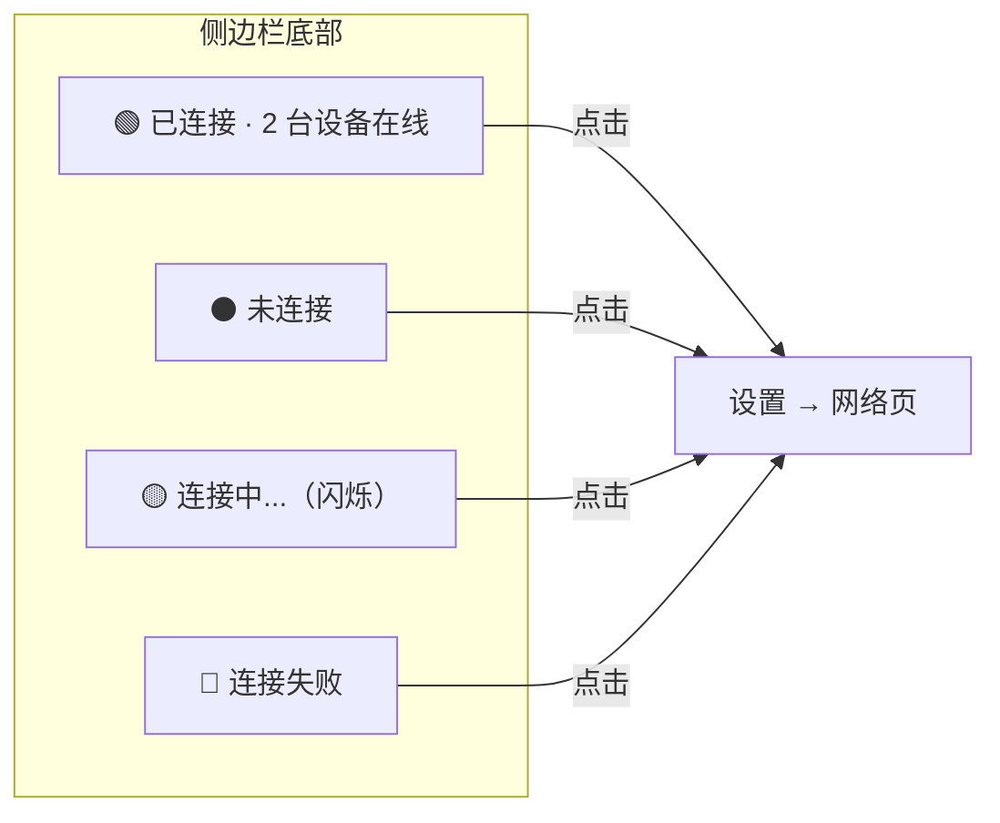

### 7.2 设置窗口网络页

设置窗口新增 "网络" 导航项，页面内容包括：

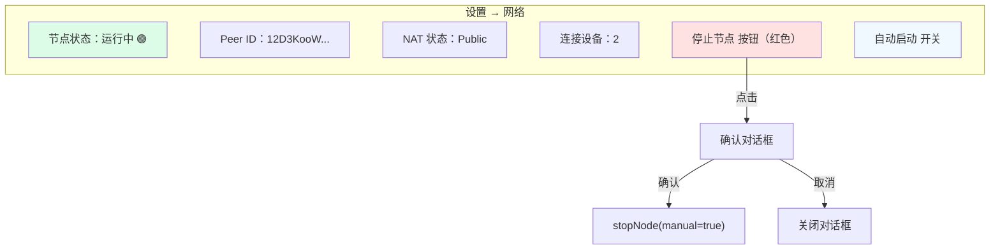

## 8. 完整数据流总结

把所有组件串起来，看一个完整的用户操作流程：

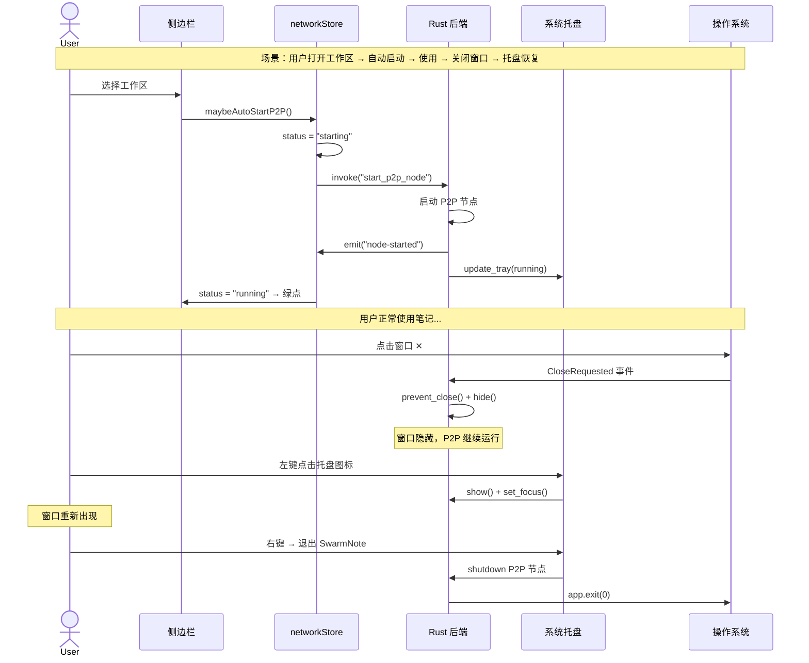

## 9. 踩坑与经验

### 9.1 `on_menu_event` 是同步的

Tauri v2 的菜单事件回调签名是同步函数 `fn(&AppHandle, MenuEvent)`。如果你需要做异步操作（几乎所有 P2P 操作都是异步的），必须 `spawn`：

```rust
// ❌ 编译错误：不能在同步函数中 await
fn handle_menu_event(app: &AppHandle, event: MenuEvent) {
    stop_p2p_node().await;
}

// ✅ 正确：clone + spawn
fn handle_menu_event(app: &AppHandle, event: MenuEvent) {
    let handle = app.clone();
    tauri::async_runtime::spawn(async move {
        stop_p2p_node(&handle).await;
    });
}
```

### 9.2 菜单项不能单独修改文字

Tauri v2 的 `MenuItem` 创建后无法修改其文字。想更新"暂停同步"→"恢复同步"？重建整个 `Menu`：

```rust
// ❌ 没有这个 API
menu_item.set_text("恢复同步");

// ✅ 重建菜单
let new_menu = build_tray_menu(app, false, 0)?;
tray.set_menu(Some(new_menu));
```

### 9.3 `#[cfg(desktop)]` vs `#[cfg(not(mobile))]`

Tauri v2 提供了 `desktop` 和 `mobile` 两个 cfg flag：

```rust
#[cfg(desktop)]     // Windows, macOS, Linux
#[cfg(mobile)]      // Android, iOS
#[cfg(not(mobile))] // 等价于 #[cfg(desktop)]
```

推荐用 `#[cfg(desktop)]`，语义更清晰。

### 9.4 `app.exit(0)` 不会触发 `CloseRequested`

这正是我们想要的——托盘"退出"按钮直接终止进程，不被 `prevent_close()` 拦截。

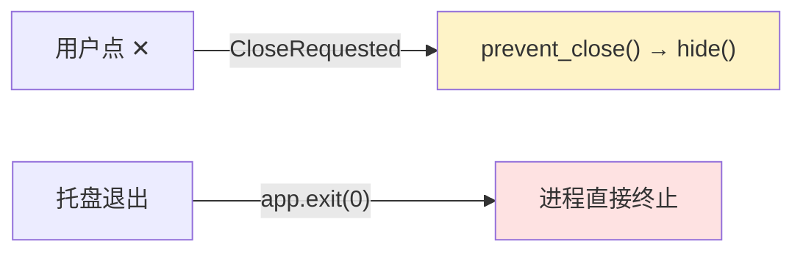

## 10. 文件清单

| 文件 | 变更 | 说明 |
|------|------|------|
| `src-tauri/Cargo.toml` | 修改 | 添加 `tray-icon`, `image-png` features |
| `src-tauri/src/tray.rs` | 新增 | 托盘创建、菜单构建、事件处理、动态更新 |
| `src-tauri/src/lib.rs` | 修改 | 声明 tray 模块、setup 中创建托盘、注册窗口关闭拦截、移除自动启动 |
| `src-tauri/src/network/commands.rs` | 修改 | 启停时 emit 事件 + 更新托盘 |
| `src-tauri/src/network/event_loop.rs` | 修改 | Peer 连接/断开时更新托盘计数 |
| `src-tauri/src/device/mod.rs` | 修改 | 添加 `connected_count()` 方法 |
| `src-tauri/icons/tray/` | 新增 | 3 套托盘图标（gray/normal/yellow） |
| `src/stores/networkStore.ts` | 重写 | boolean → 4 态状态机 + 事件驱动 |
| `src/stores/preferencesStore.ts` | 新增 | `autoStartP2P` 偏好持久化 |
| `src/stores/workspaceStore.ts` | 修改 | 工作区打开后自动启动逻辑 |
| `src/components/layout/Sidebar.tsx` | 修改 | 网络状态指示器 |
| `src/routes/settings.tsx` | 修改 | 添加"网络"导航项 |
| `src/routes/settings/network.tsx` | 新增 | 网络设置页 + 停止确认对话框 |
