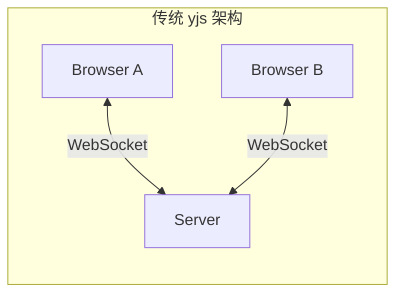
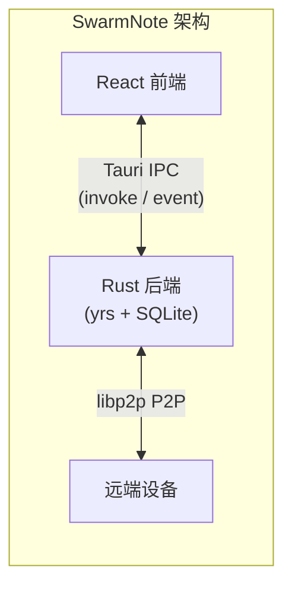
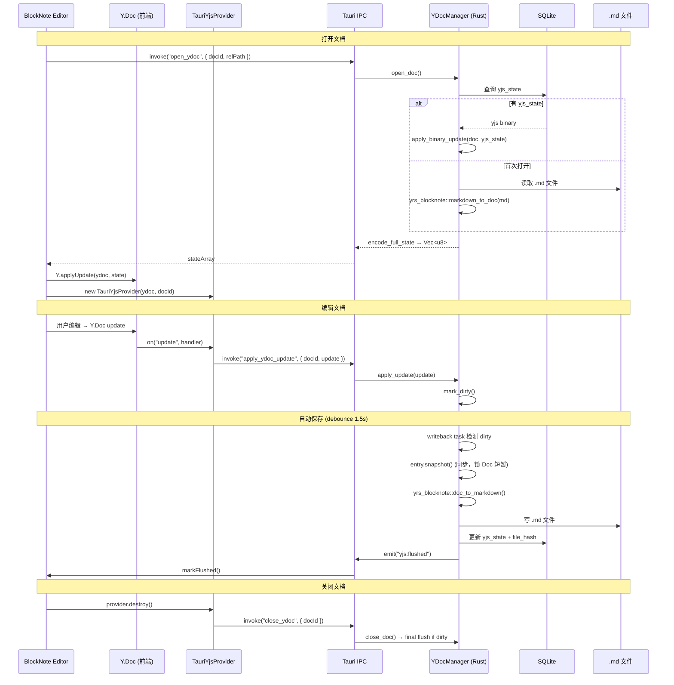
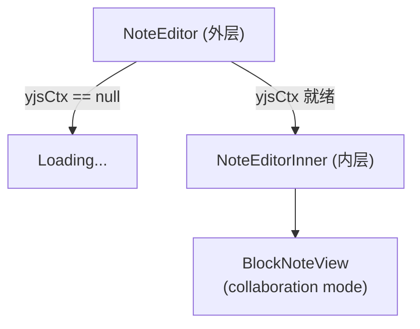
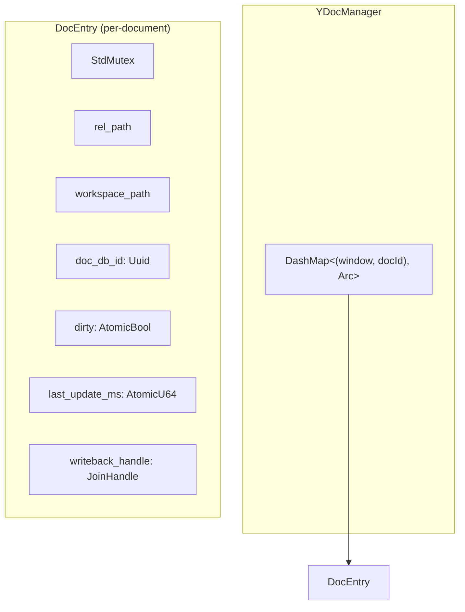
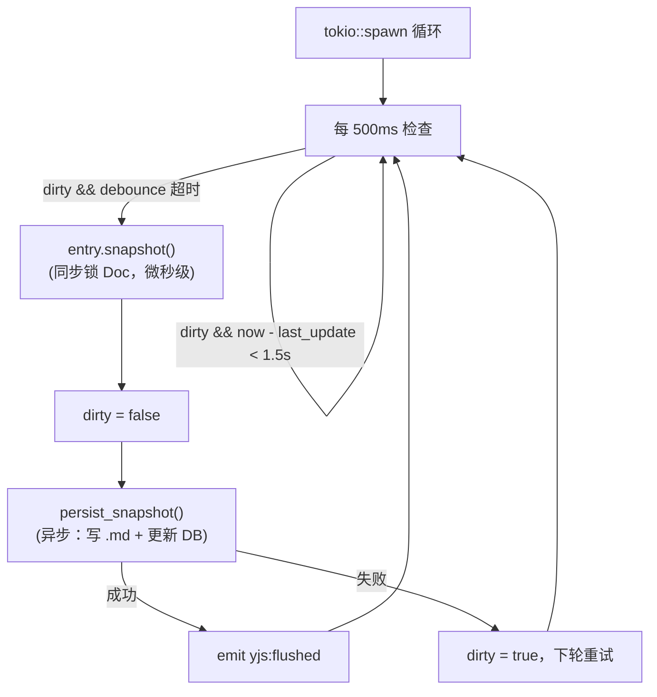
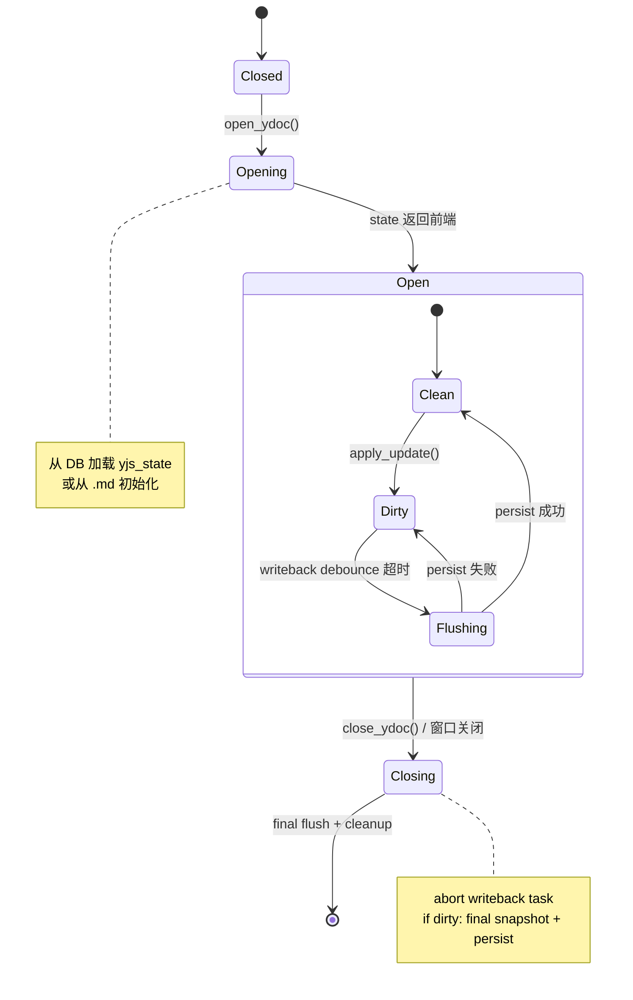
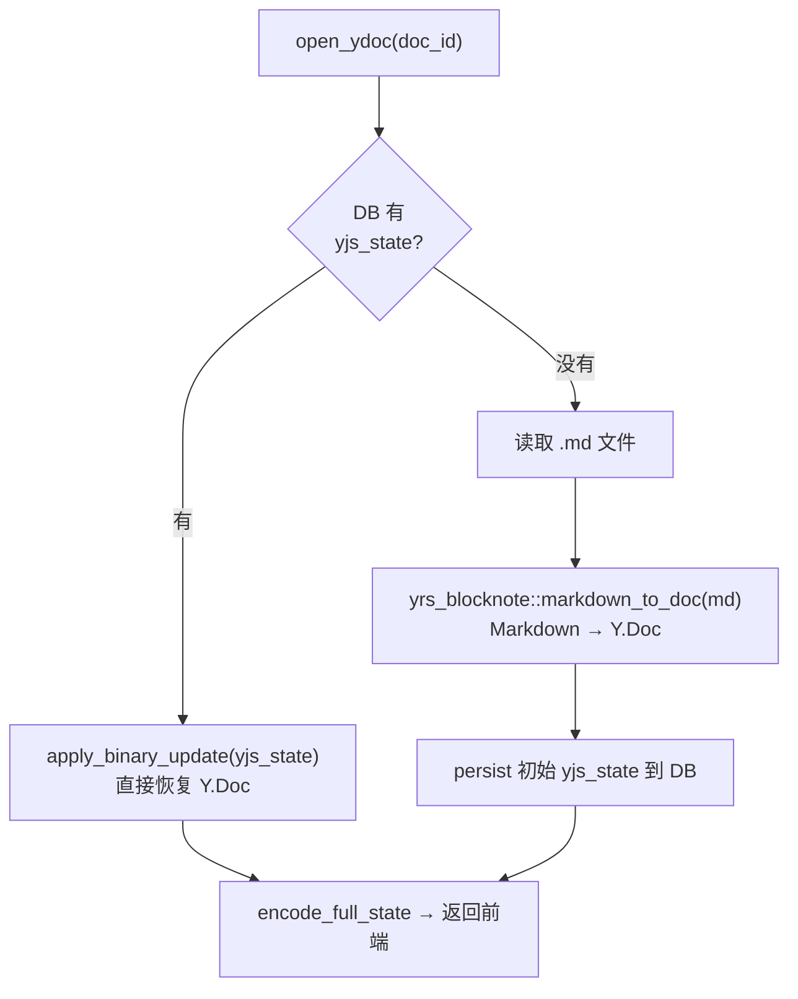
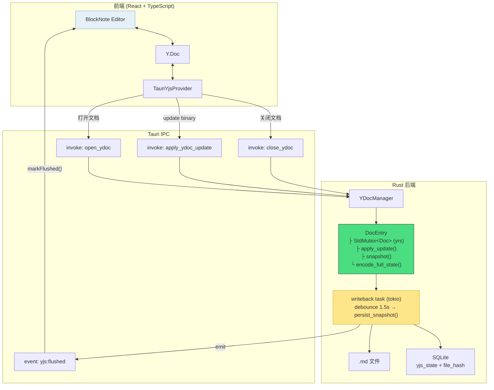

# 实现 TauriYjsProvider：让 BlockNote 协作层与 Rust 后端对话

> SwarmNote 使用 BlockNote 作为富文本编辑器，通过 yjs 实现协作编辑。但 SwarmNote 不是传统的 WebSocket 架构——它的"服务端"是本地的 Rust 进程，通过 Tauri IPC 通信。本文记录了如何实现一个自定义 yjs Provider，将 BlockNote 的协作层桥接到 Tauri Rust 后端。

## 1. 问题：为什么需要自定义 Provider？

BlockNote 内置了 yjs 协作支持，只需传入一个 provider 即可：

```typescript
useCreateBlockNote({
  collaboration: {
    provider,    // ← 谁来负责传输 yjs updates？
    fragment: ydoc.getXmlFragment("document-store"),
    user: { name: "Local", color: "#3b82f6" },
  },
});
```

典型的 yjs 应用用 `y-websocket` 或 `y-webrtc` 作为 provider——它们通过 WebSocket/WebRTC 把 updates 发给服务器或其他客户端。

**但 SwarmNote 的架构不同**：





**不存在 WebSocket 服务器**。前端和后端在同一台机器上，通过 Tauri IPC（`invoke` + `event`）通信。所以需要一个自定义 Provider 把 yjs updates 通过 IPC 转发给 Rust。

## 2. 整体架构



## 3. 前端：TauriYjsProvider

### 3.1 Provider 的职责

yjs provider 的核心契约很简单——BlockNote 只要求它有两个属性：

```typescript
interface YjsProvider {
  awareness: Awareness;  // 用户光标位置等状态（暂不使用）
  doc: Y.Doc;            // 共享文档
}
```

此外，provider 需要：
1. **监听本地 updates**：当用户编辑时，Y.Doc 会发出 `"update"` 事件
2. **转发给后端**：通过 Tauri IPC 把 update 二进制数据发给 Rust
3. **接收远端 updates**（未来 P2P 场景）：从 Rust 收到远端 update，应用到前端 Y.Doc
4. **防止 echo loop**：远端来的 update 应用时需要标记 `origin`，防止被再次转发

### 3.2 实现

```typescript
export class TauriYjsProvider {
  public awareness: Awareness;
  public doc: Y.Doc;
  private _docId: string;
  private _destroying = false;

  constructor(doc: Y.Doc, docId: string) {
    this.doc = doc;
    this._docId = docId;
    this.awareness = new Awareness(doc);
    doc.on("update", this._onDocUpdate);
  }

  private _onDocUpdate = (update: Uint8Array, origin: unknown) => {
    if (this._destroying) return;
    if (origin === "remote") return;  // 防 echo loop

    applyYDocUpdate(this._docId, Array.from(update)).catch((err) => {
      console.error("Failed to send yjs update to backend:", err);
    });
  };

  destroy() {
    this._destroying = true;
    this.doc.off("update", this._onDocUpdate);
    this.awareness.destroy();
    closeYDoc(this._docId).catch(console.error);
  }
}
```

**关键设计**：

| 点 | 说明 |
|---|---|
| `origin === "remote"` | 未来 Rust 推送远端 P2P update 时，会用 `ydoc.transact(fn, "remote")` 标记 origin，这里过滤掉防止 echo |
| `_destroying` flag | `destroy()` 后不再处理 update 事件，避免竞态条件 |
| 箭头函数 | `_onDocUpdate` 用箭头函数保证 `this` 绑定正确 |
| `Array.from(update)` | Tauri IPC 不支持 `Uint8Array`，需要转为 `number[]` |

### 3.3 NoteEditor 组件拆分

编辑器拆为两层：

```
NoteEditor（外层）
  ├─ 负责初始化 Y.Doc（从 Rust 加载状态）
  ├─ 创建 TauriYjsProvider
  ├─ 显示 Loading 状态
  └─ 就绪后渲染 ↓

NoteEditorInner（内层）
  ├─ useCreateBlockNote({ collaboration: { provider, fragment } })
  ├─ 监听 Y.Doc update → markDirty / setCharCount
  └─ 监听 yjs:flushed event → markFlushed
```

**为什么拆分？** `useCreateBlockNote` 创建编辑器时需要 provider 和 fragment 已就绪。Y.Doc 初始化是异步的（要等 Rust 返回 state），所以外层等待、内层渲染。



## 4. 后端：YDocManager

### 4.1 数据结构



**为什么用 `StdMutex` 而不是 `tokio::Mutex`？**

yrs `Doc` 是 `Send` 但不是 `Sync`。所有对 Doc 的操作（transact、apply_update、encode_state）都是**同步且极快**的（微秒级）。`StdMutex` 在无竞争时的 lock/unlock 只是一条原子指令，比 `tokio::Mutex`（需要 Future 调度）快得多。关键约束是：**永远不要在持有 StdMutex 的情况下 `.await`**。

### 4.2 DocEntry OOP 封装

DocEntry 封装了所有文档级操作：

```rust
impl DocEntry {
    /// 应用增量 update（锁 Doc → transact_mut → apply）
    fn apply_update(&self, update: &[u8]) -> AppResult<()>;

    /// 标记脏 + 记录时间戳
    fn mark_dirty(&self);

    /// 编码完整状态（锁 Doc → transact → encode）
    fn encode_full_state(&self) -> Vec<u8>;

    /// 提取快照：yjs_state + state_vector + markdown（锁 Doc 短暂）
    fn snapshot(&self) -> AppResult<DocSnapshot>;
}
```

`YDocManager` 变为纯调度器——它管理文档的生命周期（open/close/lookup），但文档内部的操作委托给 `DocEntry`。

### 4.3 三个 Tauri Command

```rust
// 打开文档：加载/初始化 Y.Doc，启动 writeback task，返回完整状态
open_ydoc(doc_id, rel_path, workspace_id, asset_url_prefix) → Vec<u8>

// 应用增量 update：前端编辑产生的 yjs update
apply_ydoc_update(doc_id, update: Vec<u8>) → ()

// 关闭文档：final flush + 停止 writeback task
close_ydoc(doc_id) → ()
```

### 4.4 Writeback Task

每个打开的文档有一个后台 tokio task，负责定期将脏文档刷写到磁盘：



**关键设计**：

1. **Snapshot 同步提取**：`entry.snapshot()` 在 `StdMutex` 锁内完成所有 Doc 读取（`encode_state` + `doc_to_markdown`），然后释放锁。之后的 I/O（写文件、更新 DB）完全异步，不再需要 Doc 锁。

2. **Debounce 策略**：用 `AtomicU64` 记录最后 update 时间，writeback task 轮询时检查是否超过 1.5s。这避免了为每次击键都写磁盘。

3. **失败重试**：如果 persist 失败（比如 DB 暂时不可用），将 `dirty` 重新设为 `true`，下一轮自动重试。

## 5. 文档生命周期



### 首次打开 vs 后续打开



## 6. 前后端协议

### 6.1 IPC 调用（前端 → Rust）

| 命令 | 参数 | 返回值 | 说明 |
|------|------|--------|------|
| `open_ydoc` | `docId, relPath, workspaceId, assetUrlPrefix` | `number[]`（yjs state binary） | 打开/初始化文档 |
| `apply_ydoc_update` | `docId, update: number[]` | `void` | 转发增量 update |
| `close_ydoc` | `docId` | `void` | 关闭文档，最终 flush |

### 6.2 Tauri Event（Rust → 前端）

| 事件 | Payload | 说明 |
|------|---------|------|
| `yjs:flushed` | `{ docId: string }` | writeback 完成，前端更新 `lastSavedAt` |

### 6.3 未来 P2P 扩展点

```typescript
// 未来 Rust 收到远端 P2P update 时，会通过 Tauri event 推送：
listen("yjs:remote-update", (event) => {
  const { docId, update } = event.payload;
  ydoc.transact(() => {
    Y.applyUpdate(ydoc, new Uint8Array(update));
  }, "remote");  // ← origin = "remote"，TauriYjsProvider 不会 echo back
});
```

## 7. editorStore 的简化

v0.1.0 的 editorStore 要管理 markdown 内容、手动 save/load、debounce 保存：

```typescript
// v0.1.0 — editorStore 负责一切
interface EditorState {
  markdown: string;          // 手动管理的 markdown 内容
  isDirty: boolean;
  // ...
}
interface EditorActions {
  loadDocument: () => Promise<void>;  // 读 .md → parseMarkdown → replaceBlocks
  saveContent: () => Promise<void>;   // blocksToMarkdown → 写 .md → upsert DB
  updateContent: (md: string) => void;
}
```

v0.2.0 全部下沉到 Rust：

```typescript
// v0.2.0 — editorStore 只管 UI 状态
interface EditorState {
  // 没有 markdown 字段了！
  isDirty: boolean;
  charCount: number;
  lastSavedAt: Date | null;
}
interface EditorActions {
  loadDocument: (id, title, relPath) => void;  // 只设置元数据，不读文件
  markDirty: () => void;                        // Y.Doc update 时调用
  markFlushed: (date: Date) => void;            // Rust writeback 完成时调用
  setCharCount: (count: number) => void;
}
```

**删除的代码**：`loadDocumentContent`、`saveDocumentContent`、`upsertDocument`、`assetUrlToRelativePath`、`relativePathToAssetUrl` — 全部由 Rust 端的 `YDocManager` 接管。

## 8. 总结



**一句话总结**：`TauriYjsProvider` 是一个极简的 yjs Provider——44 行 TypeScript，只做一件事：把本地 Y.Doc updates 通过 IPC 转发给 Rust。所有持久化、格式转换、writeback 逻辑都在 Rust 端的 `YDocManager` 中，编辑器变为纯渲染层。
