# Workspace 架构与文档 UUID 数据流转

> SwarmNote 是一个 P2P 笔记同步工具，两台设备之间不经过任何服务器，直接同步笔记。要实现这个目标，首先要解决一个基础问题：**设备 A 和设备 B 怎么知道 `notes/todo.md` 是"同一个文档"？** 本文从这个问题出发，讲清楚 SwarmNote 的 Workspace 双数据库架构、文档 UUID 的完整生命周期，以及为什么这样设计。

## 1. 为什么需要全局 UUID？

两台电脑各自打开 `notes/todo.md`——路径一样，但它们真的是"同一个文档"吗？

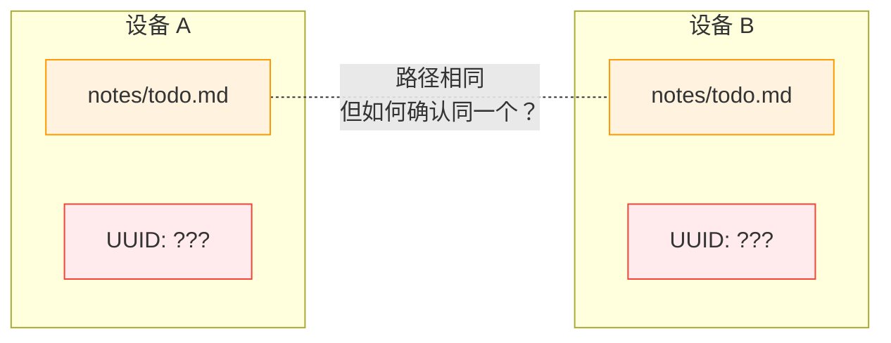

**路径不能作为唯一标识**，因为：
- 文件可以重命名——rename 后路径变了，但它仍是同一个文档
- 不同工作区可能有同名文件——`work/notes/todo.md` 和 `personal/notes/todo.md` 是不同文档
- P2P 同步需要一个不随路径变化的、跨设备稳定的身份

所以，**每个文档在创建时就分配一个全局唯一的 UUID（v7，时间有序）**，这个 UUID 才是文档的真实身份。

## 2. 双数据库架构

SwarmNote 采用双数据库设计：一个全局的，一个每个工作区独立的。

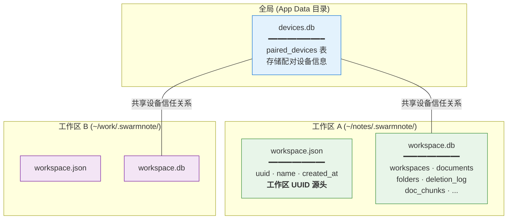

**为什么分两个 DB？**

| 设计决策 | 理由 |
|----------|------|
| `devices.db` 全局 | 配对设备是跨工作区的——你信任一台设备，不是信任某个工作区 |
| `workspace.db` per-workspace | 文档数据跟着工作区走，拷贝文件夹 = 拷贝数据，符合 local-first 原则 |
| `workspace.json` 而非 DB 列 | 工作区 UUID 是同步协议的先决条件——peer 需要在连接 DB 之前就知道 UUID |

### 多窗口状态管理

SwarmNote 支持多窗口，每个窗口绑定一个工作区。后端用 `RwLock<HashMap<String, DatabaseConnection>>` 管理连接：

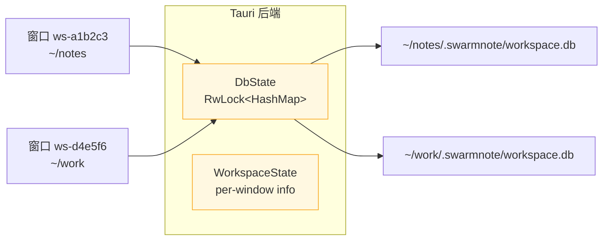

窗口 label 由工作区路径的 hash 生成（`ws-{hash16}`），保证同一路径不会打开两个窗口。

## 3. 文档 UUID 的完整生命周期

一个文档从诞生到删除，UUID 经历 5 个阶段：

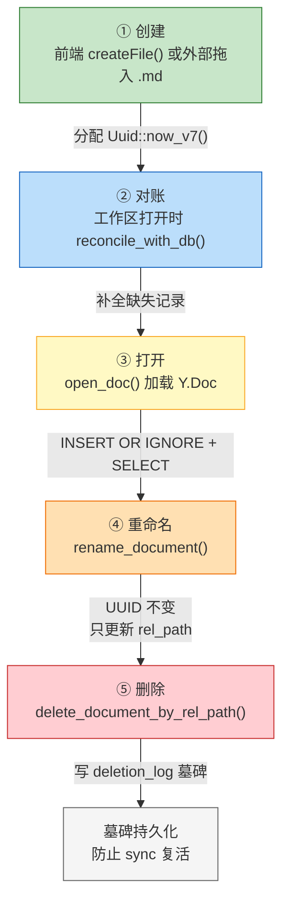

### ① 创建：UUID 在后端生成

前端调用 `createFile` 时，**不传 `id`**——后端生成 `Uuid::now_v7()` 并立即写入 DB。

```text
前端                              Rust 后端
  │                                  │
  ├─ fsCreateFile("notes","todo") ──→│  创建 .md 文件
  │                                  │
  ├─ upsertDocument({               │
  │    workspace_id,                 │
  │    title: "todo",         ──────→│  id 为空 → 生成 Uuid::now_v7()
  │    rel_path: "notes/todo.md"     │  INSERT documents 表
  │  })                              │
  │                                  │
  │←── DocumentModel { id: "019d..." │  返回带稳定 UUID 的记录
```

**关键设计**：UUID 由后端统一生成，前端永远不传 `id`。这避免了前端传路径当 UUID 的 bug。

### ② 对账：工作区打开时补全

用户可能通过文件管理器拷贝 `.md` 文件到工作区目录。这些文件在 DB 中没有记录。`reconcile_with_db` 在每次打开工作区时运行：

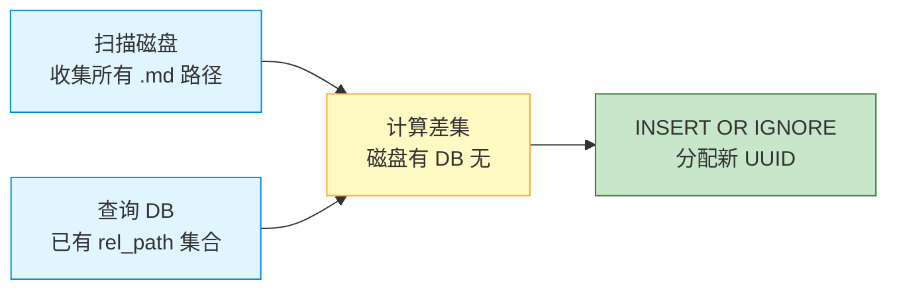

**为什么用 `INSERT OR IGNORE`？** UNIQUE 约束 `(workspace_id, rel_path)` 保证即使并发调用（例如窗口快速重开），也不会产生重复记录。

**为什么"DB 有但磁盘无"不删除？** 文件可能是被移动了（rename = 旧路径消失 + 新路径出现）。孤儿记录留给 tombstone GC 处理。

### ③ 打开：并发安全的 upsert

`open_doc` 是文档生命周期的核心。它负责：加载 Y.Doc → 返回稳定 UUID → 启动 writeback 任务。

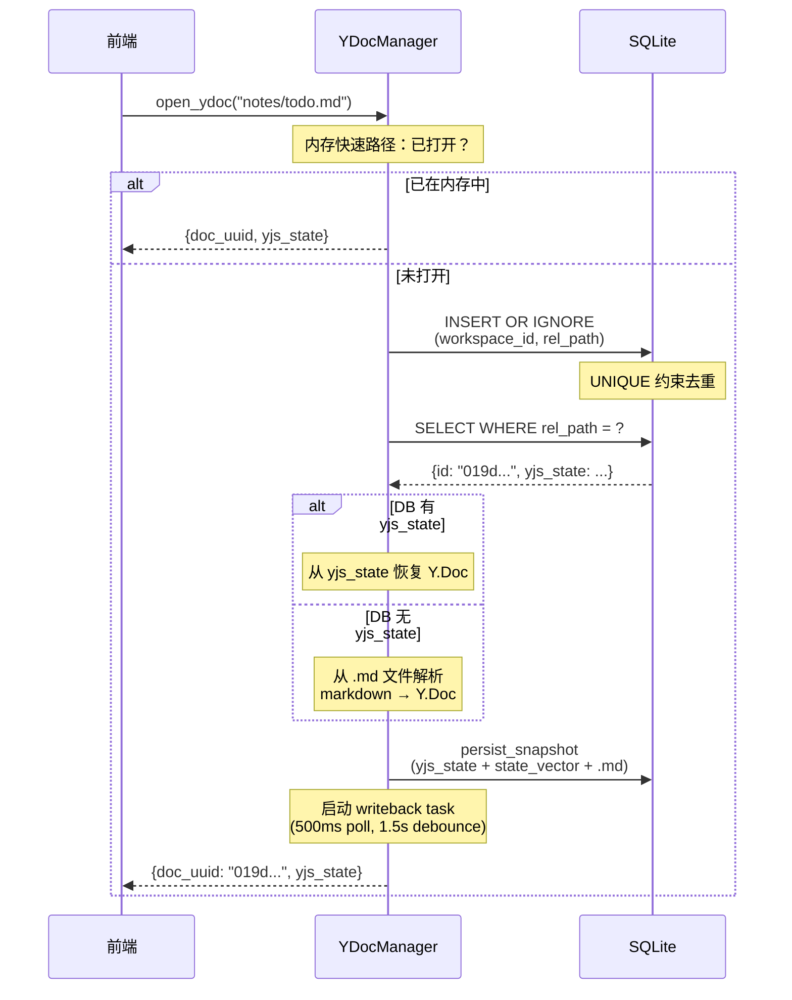

**`INSERT OR IGNORE` + `SELECT` 模式**的意义：即使两个并发调用同时发现"DB 无记录"并尝试 INSERT，UNIQUE 约束保证只有一条记录存活。后续 SELECT 取到同一条记录，两个调用返回相同 UUID。

### ④ 重命名：UUID 不变

```text
rename_document("notes/todo.md" → "notes/done.md")
  ├─ DB: UPDATE documents SET rel_path = "notes/done.md" WHERE rel_path = "notes/todo.md"
  ├─ 内存: YDocManager.rename_doc(uuid, "notes/done.md")
  └─ UUID 始终不变 → 对端同步时能通过 UUID 识别"同一个文档换了路径"
```

### ⑤ 删除：墓碑机制

删除不是简单的 `DELETE FROM documents`。为了防止 sync 时被远端"复活"，需要留下墓碑：

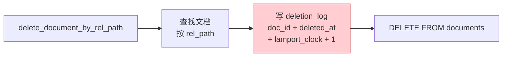

**目录删除级联**：删除目录时，先 `delete_documents_by_prefix(dir_path + "/")` 为所有子文档写墓碑，再删除磁盘文件。

## 4. Workspace UUID：跨设备工作区匹配

文档 UUID 解决了"同一个文档"的识别，但还有一个问题：**设备 A 的 `~/notes/` 和设备 B 的 `~/my-notes/` 是"同一个工作区"吗？**

答案同样是 UUID，但存储在 `workspace.json` 而非 DB：

```json
// ~/notes/.swarmnote/workspace.json
{
  "uuid": "019d3cd7-xxxx-xxxx-xxxx-xxxxxxxxxxxx",
  "name": "My Notes",
  "created_at": "2026-03-20T10:00:00Z"
}
```

**三级优先级**：

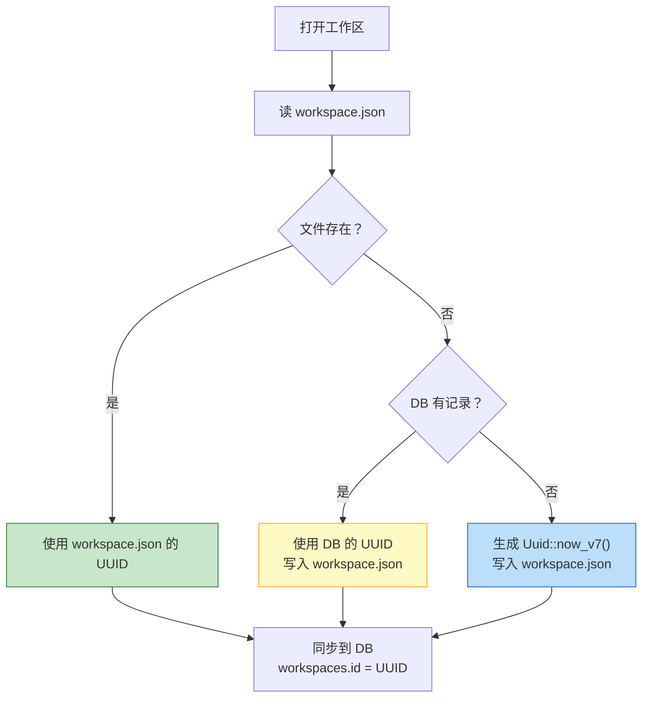

**为什么用文件而非 DB？**
- Peer 在连接时需要先交换 workspace UUID 来匹配工作区——此时可能还没打开 DB
- JSON 文件可以被其他工具读取（debug 友好）
- 解决了"先有 DB 还是先有 UUID"的鸡蛋问题

## 5. 全量同步设计

有了稳定的文档 UUID 和工作区 UUID，P2P 同步就有了基础。以下是全量同步的完整流程：

### 5.1 DocMeta 交换

两台设备配对连接后，先交换文档元数据：

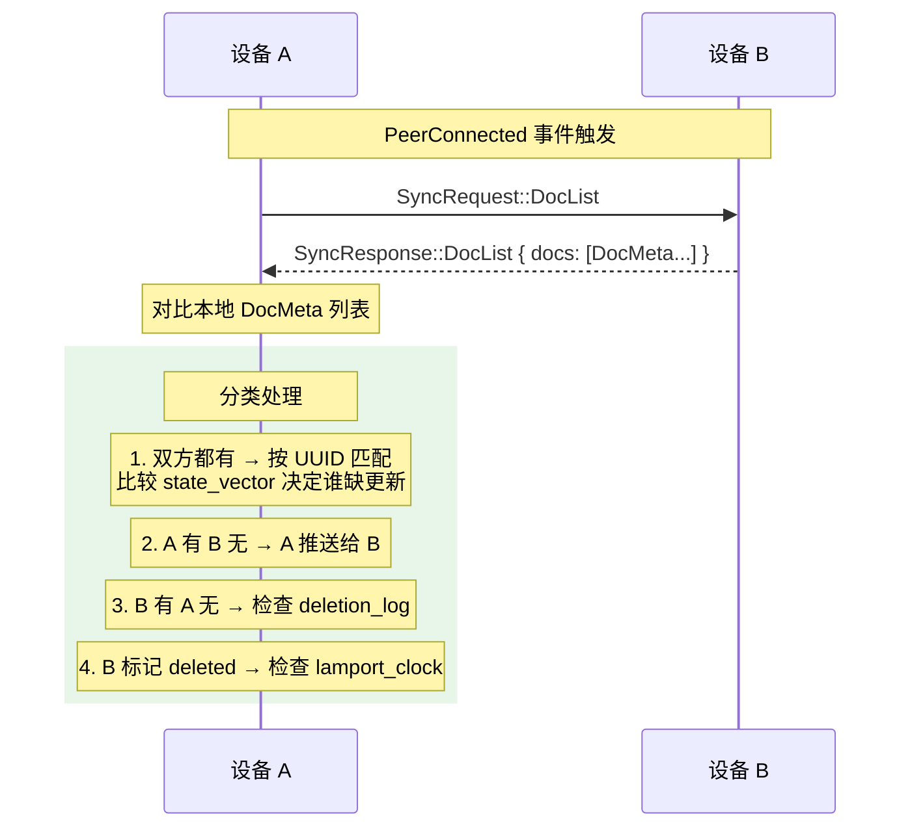

`DocMeta` 结构携带了做决策所需的全部信息：

```rust
pub struct DocMeta {
    pub doc_id: Uuid,            // 文档全局 UUID
    pub rel_path: String,         // 相对路径（首次同步时用于 claim）
    pub title: String,
    pub updated_at: i64,
    pub deleted_at: Option<i64>,  // None = 活跃, Some = 已删除（墓碑）
    pub lamport_clock: i64,       // 单调递增版本号
    pub workspace_uuid: Uuid,     // 所属工作区 UUID
}
```

### 5.2 State Vector 交换

确定哪些文档需要同步后，逐文档交换 yjs state vector：

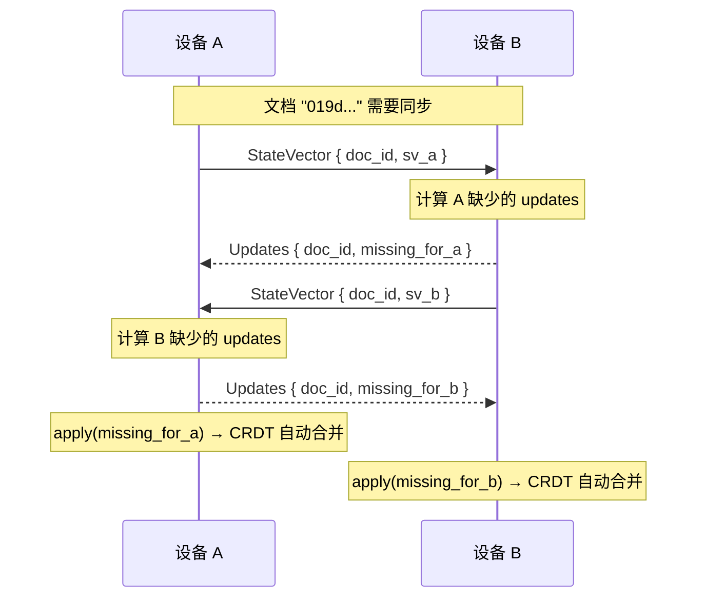

**同步优先级**：
1. **P0** — 当前打开的文档（亚秒级）
2. **P1** — 最近编辑的文档（按 `updated_at` 降序）
3. **P2** — 其余文档（后台追赶）

### 5.3 离线合并场景

离线合并不需要特殊处理——它就是全量同步的一个实例：

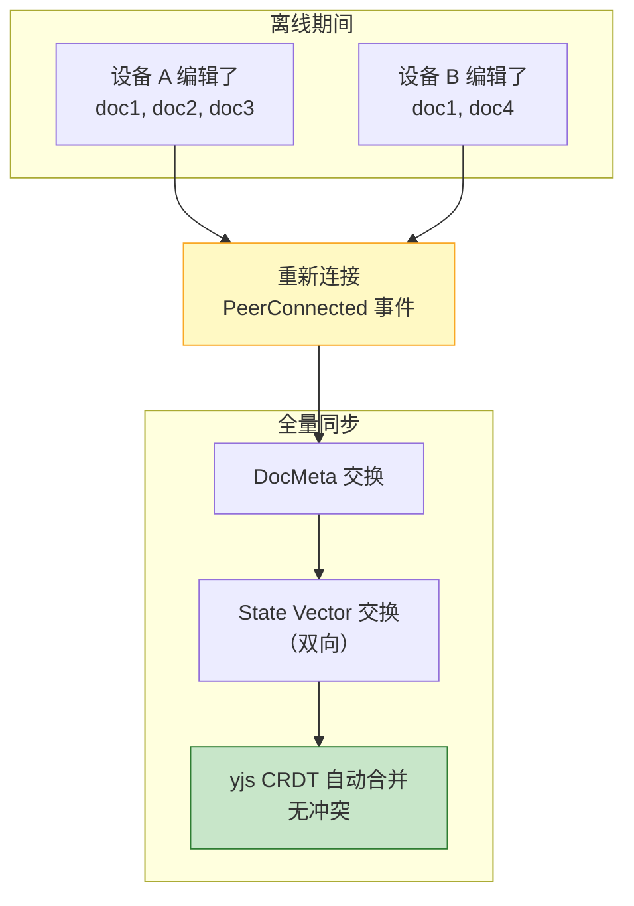

yjs 的 CRDT 特性保证：**无论两台设备在离线期间做了什么编辑，重连后的合并都是自动、无冲突的。**

### 5.4 墓碑同步：防复活

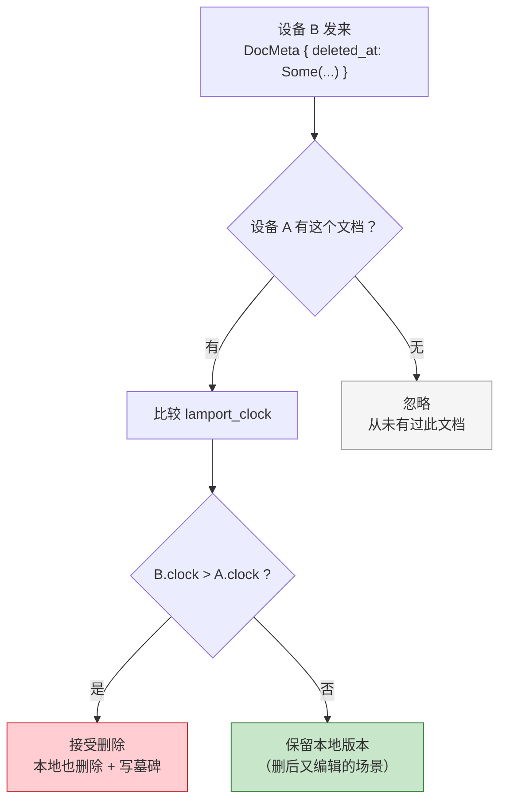

## 6. 数据完整性保障

整个系统在数据层面有 4 道防线：

| 防线 | 机制 | 保护什么 |
|------|------|----------|
| **UNIQUE 约束** | `UNIQUE(workspace_id, rel_path)` | 同一路径不会产生两条记录 |
| **INSERT OR IGNORE** | `on_conflict(...).do_nothing()` | 并发 upsert 不竞态 |
| **墓碑 deletion_log** | 删除时写墓碑，sync 时比较 clock | 已删文档不被复活 |
| **workspace.json** | 文件级 UUID 源头 | 工作区身份跨设备稳定 |

这些机制组合在一起，确保了一个核心属性：**文档的 UUID 从创建到删除，始终唯一、稳定、跨设备一致。** 这是 P2P 同步能正确工作的数据基础。
