# yrs-blocknote：P2P 笔记同步的数据转换引擎

> SwarmNote v0.2.0 要实现 P2P 笔记同步，核心挑战是让 Rust 后端能独立管理文档数据——存储、同步、导出，全部不依赖前端。本文记录了 `yrs-blocknote` crate 的设计思路，从问题出发，推导出最终架构。

## 1. 问题：为什么需要这个 crate？

SwarmNote 使用 BlockNote（基于 Tiptap/ProseMirror 的富文本编辑器）+ yjs CRDT 实现协作同步。数据在系统中以三种格式存在：


在 v0.1.0 中，三种格式的转换**全部由前端完成**：

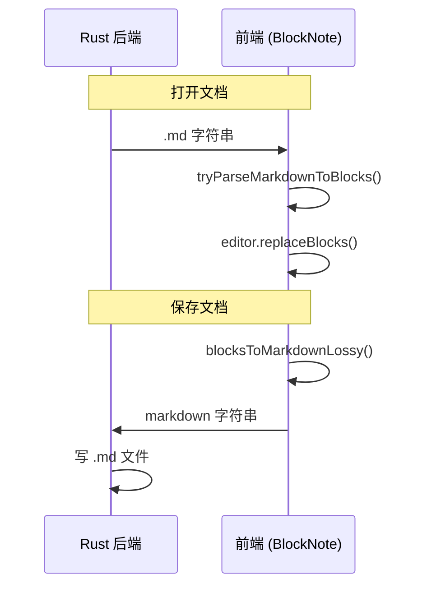

这在 v0.2.0 的 P2P 同步场景下行不通：

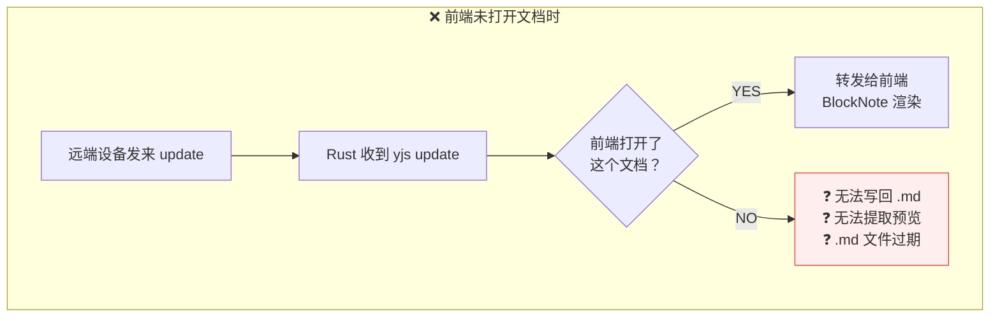

**Rust 后端必须能独立完成格式转换**，这就是 `yrs-blocknote` 的使命。

## 2. 设计决策

### 决策 1：Y.Doc 是唯一真相源

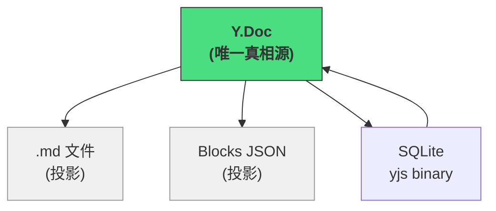

- `.md` 文件是 Y.Doc 的磁盘投影，给人和外部工具看的
- Blocks JSON 是 Y.Doc 的应用投影，给前端渲染的
- Y.Doc 的二进制状态持久化在 SQLite 中
- 不存在"两种模式切换"的问题——从创建文档开始就是 Y.Doc 驱动

### 决策 2：Rust 端使用 yrs（yjs 的 Rust 原生实现）

```
┌──────────────────────────────────────────────────┐
│               Rust 端 (yrs) 的职责               │
│                                                  │
│  - 持有 Y.Doc，即使前端未打开文档                  │
│  - 计算 state_vector（全量同步的前提）             │
│  - 编码缺失 updates（回应远端同步请求）            │
│  - 应用远端 updates                              │
│  - 持久化到 SQLite                               │
│  - 导出为 .md / Blocks JSON                      │
│  - P2P 转发                                      │
│                                                  │
│  前端 yjs 管"渲染"，Rust yrs 管"一切其他"         │
└──────────────────────────────────────────────────┘
```

### 决策 3：Block 树是核心数据类型（不是中间层）

Block 树 = BlockNote JSON 的 Rust 类型定义，等价于 `@blocknote/server-util` 中的 blocks 格式。

它不是为了转换而造的临时结构，而是 **BlockNote 生态的通用数据格式**：

```rust
pub struct Block {
    pub id: String,
    pub block_type: String,         // "paragraph", "heading", ...
    pub props: HashMap<String, String>,
    pub content: Vec<InlineContent>,
    pub children: Vec<Block>,       // 嵌套子块
}

pub enum InlineContent {
    Text { text: String, styles: Styles },
    HardBreak,
}

pub struct Styles {
    pub bold: bool,
    pub italic: bool,
    pub underline: bool,
    pub strikethrough: bool,
    pub code: bool,
    pub link: Option<String>,
}
```

`Block` 实现 `serde::Serialize` / `Deserialize`，序列化后与 BlockNote JSON 格式完全一致。

## 3. 最终架构

### crate 信息

| 项 | 值 |
|-----|------|
| 包名 | `yrs-blocknote` |
| 位置 | `crates/yrs-blocknote/`（仓库根目录） |
| 依赖 | `yrs 0.25` + `comrak 0.51`（GFM Markdown 解析/渲染） |
| 定位 | 通用库，不依赖 Tauri / SwarmNote，可发布到 crates.io |

### 核心 API：6 个函数，Block 树为中心

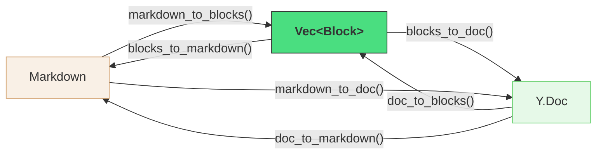

```rust
// ── Markdown ↔ Blocks ──
pub fn markdown_to_blocks(md: &str) -> Vec<Block>;
pub fn blocks_to_markdown(blocks: &[Block]) -> String;

// ── Y.Doc ↔ Blocks ──
pub fn doc_to_blocks(doc: &Doc, fragment: &str) -> Vec<Block>;
pub fn blocks_to_doc(blocks: &[Block], fragment: &str) -> Doc;

// ── 便捷：Markdown ↔ Y.Doc（组合上面的） ──
pub fn markdown_to_doc(md: &str, fragment: &str) -> Doc;
pub fn doc_to_markdown(doc: &Doc, fragment: &str) -> String;
```

### 内部模块结构

```
crates/yrs-blocknote/
├── Cargo.toml
├── src/
│   ├── lib.rs               # 公共 API + Block/InlineContent 类型定义
│   ├── blocks.rs             # Block 类型 + serde 实现
│   ├── markdown.rs           # markdown_to_blocks / blocks_to_markdown (comrak)
│   ├── yrs_codec.rs          # doc_to_blocks / blocks_to_doc (yrs XML API)
│   └── schema.rs             # BlockNote XML schema 常量 + 默认 props
└── tests/
    ├── roundtrip.rs           # md → blocks → md, blocks → doc → blocks
    ├── compatibility.rs       # 与 BlockNote JSON 格式一致性
    └── fixtures/              # 测试用 .md 文件
```

## 4. 全部使用场景

### 场景 A：首次打开 .md 文件（无 yjs_state）

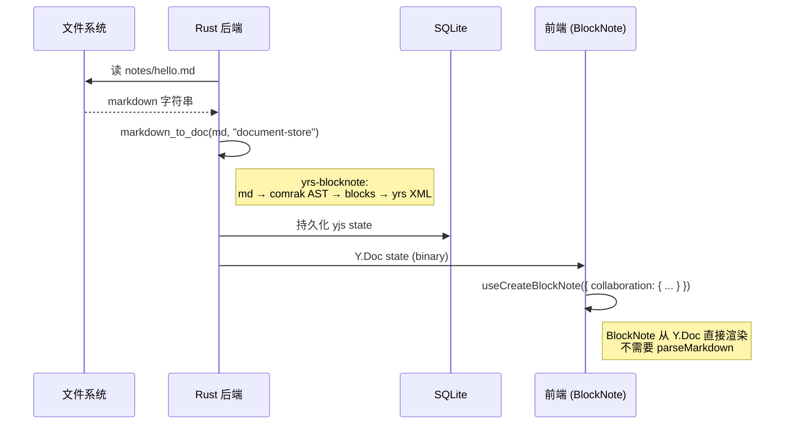

### 场景 B：后续打开（已有 yjs_state）

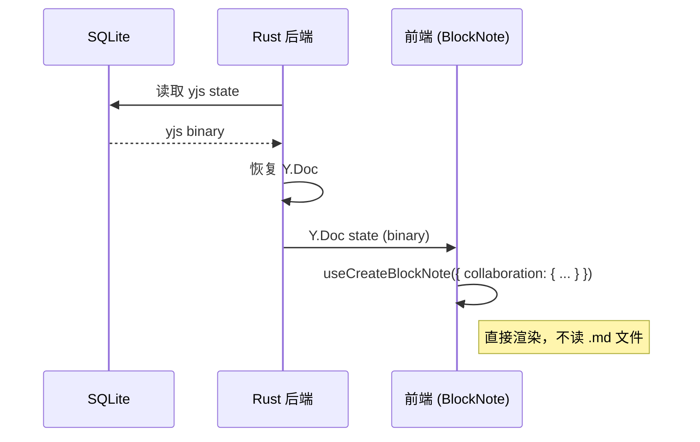

### 场景 C：用户在 SwarmNote 中编辑

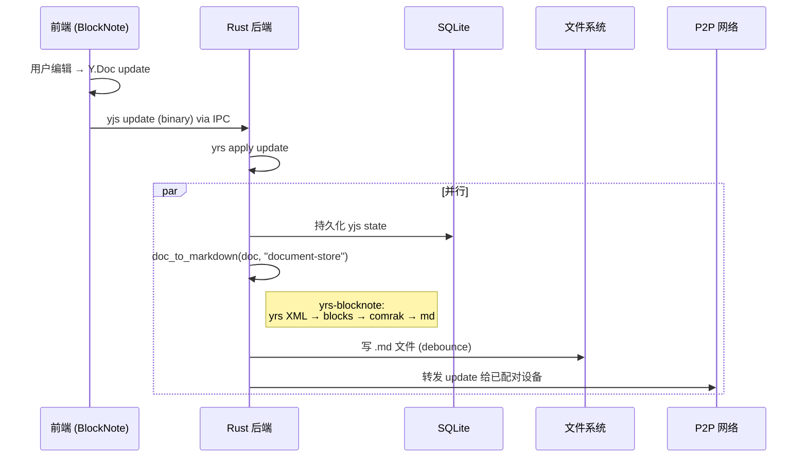

### 场景 D：收到远端同步 update（前端未打开文档）

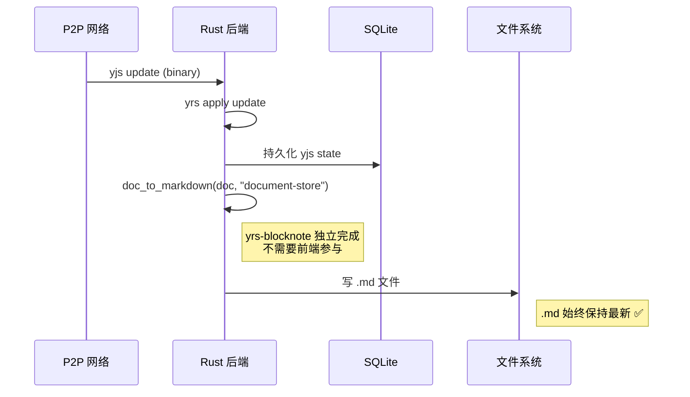

### 场景 E：收到远端同步 update（前端已打开文档）

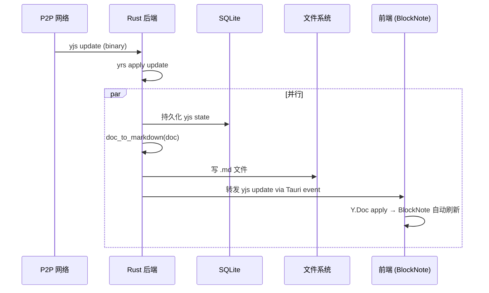

### 场景 F：外部编辑器修改了 .md 文件

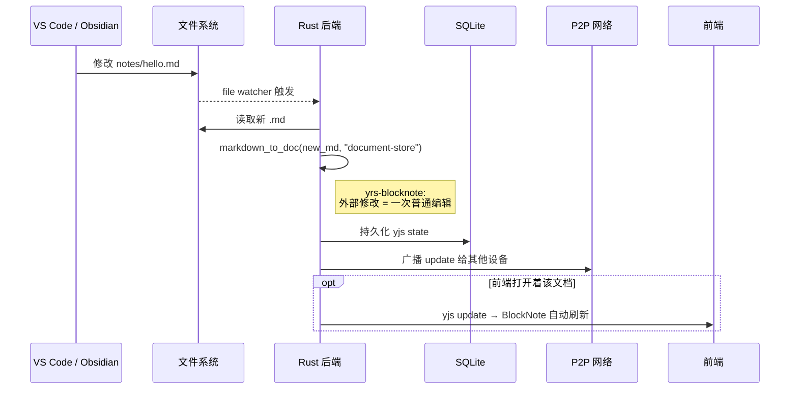

### 场景 G：全量同步（重连 / 新设备）

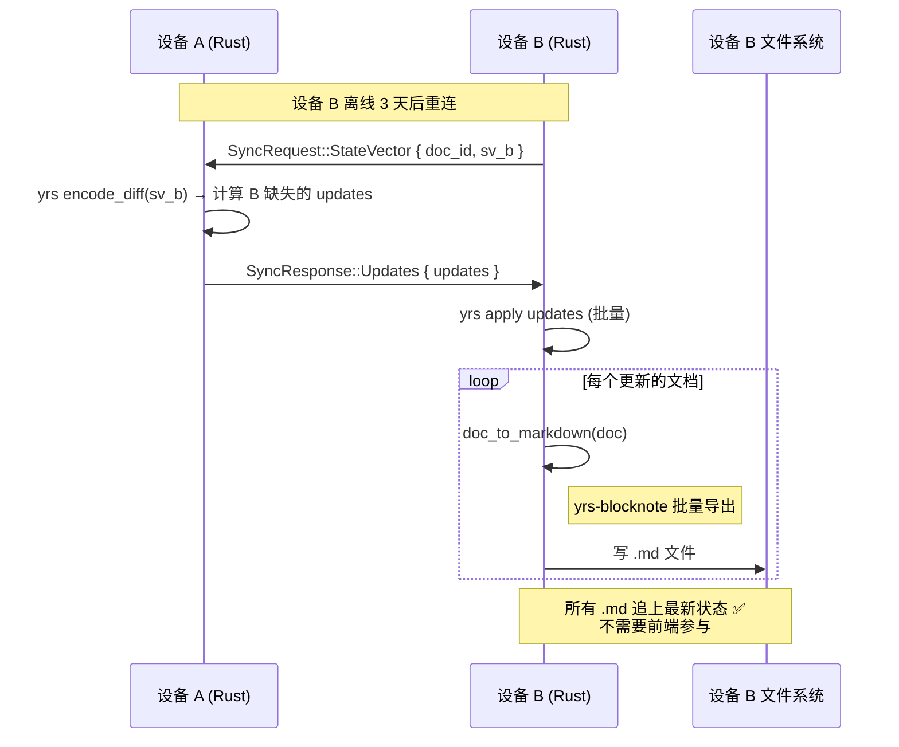

### 场景 H：文档预览卡片（不打开编辑器）

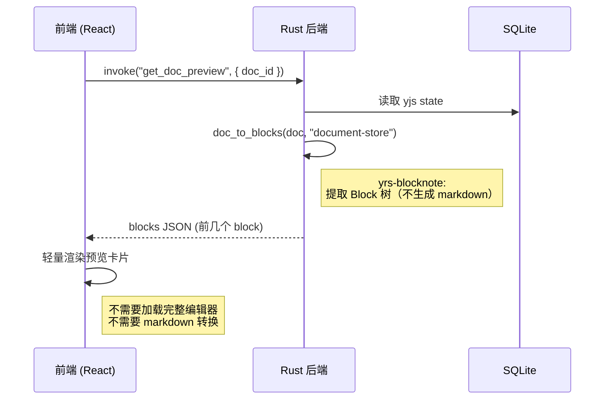

## 5. 前端架构变化对比

### v0.1.0（当前）— 前端负责格式转换

```
NoteEditor.tsx:
  useCreateBlockNote({ schema, dictionary, uploadFile })

  加载: invoke("load_document") → md → tryParseMarkdownToBlocks → replaceBlocks
  保存: blocksToMarkdownLossy → invoke("save_document", md)
  onChange: debounce 1.5s → 手动保存
```

### v0.2.0（目标）— 前端只负责渲染

```
NoteEditor.tsx:
  useCreateBlockNote({
    schema, dictionary, uploadFile,
    collaboration: {
      provider: tauriYjsProvider,   // 自定义 provider，通过 IPC 桥接 Rust
      fragment: doc.getXmlFragment("document-store"),
      user: { name: deviceName, color: userColor },
    },
  })

  加载: ❌ 不需要（Y.Doc 直接驱动渲染）
  保存: ❌ 不需要（Rust 端 yrs-blocknote 自动导出 .md）
  onChange: ❌ 不需要（Y.Doc update 自动流向 Rust）
```

**编辑器从"数据管理者"变成"纯渲染层"。**

## 6. BlockNote Y.Doc XML Schema

`yrs-blocknote` 需要读写的 XML 结构，由 BlockNote 通过 `y-prosemirror` 定义：

```
XmlFragment("document-store")
│
└── XmlElement("blockGroup")
     │
     ├── XmlElement("blockContainer")
     │   attrs: { id, backgroundColor, textColor, textAlignment, ...blockProps }
     │   │
     │   ├── XmlElement("<blockType>")        ← "paragraph", "heading", ...
     │   │   attrs: { ...blockProps }          ← 和 blockContainer 重复
     │   │   children:
     │   │     └── Y.XmlText                   ← delta 格式的富文本
     │   │          [{ insert: "Hello ", attributes: { bold: {} } },
     │   │           { insert: "World" }]
     │   │
     │   └── XmlElement("blockGroup")          ← [可选] 子块嵌套
     │        └── XmlElement("blockContainer") → ...递归
     │
     └── ...more blockContainer...
```

### Block 类型映射

| Block type | XmlElement | 内容 | 特有 props |
|---|---|---|---|
| `paragraph` | `"paragraph"` | XmlText | textAlignment, textColor, backgroundColor |
| `heading` | `"heading"` | XmlText | + level, isToggleable |
| `bulletListItem` | `"bulletListItem"` | XmlText | 同 paragraph |
| `numberedListItem` | `"numberedListItem"` | XmlText | + start |
| `checkListItem` | `"checkListItem"` | XmlText | + checked |
| `codeBlock` | `"codeBlock"` | XmlText | language |
| `image` | `"image"` | 空 | url, caption, name, previewWidth |
| `table` | `"table"` | tableRow/tableCell 子结构 | textColor |
| `divider` | `"divider"` | 空 | 无 |

### Inline 样式（XmlText delta attributes）

| 样式 | attribute | value |
|---|---|---|
| 粗体 | `"bold"` | `{}` |
| 斜体 | `"italic"` | `{}` |
| 下划线 | `"underline"` | `{}` |
| 删除线 | `"strike"` | `{}` |
| 行内代码 | `"code"` | `{}` |
| 链接 | `"link"` | `{ href: "..." }` |

### 重要细节

- `blockContainer` 和内部 `blockContent` 的 props **双写**（BlockNote 行为）
- 默认值（`backgroundColor: "default"`）**也要写入** XML attributes
- `hardBreak` 是独立 `XmlElement("hardBreak")`，穿插在 XmlText 之间
- 每个 `blockContainer` 需要唯一 `id`（默认 nanoid，可选 UUID v7）

## 7. 技术栈选型

| 组件          | 选择                                    | 理由                                 |
| ----------- | ------------------------------------- | ---------------------------------- |
| CRDT        | `yrs 0.25`                            | yjs 的 Rust 原生实现，XML API 完整         |
| Markdown 解析 | `comrak 0.51`                         | 自带 AST + GFM 全面支持 + 可回写 CommonMark |
| ID 生成       | `nanoid`（默认）/ `uuid` v7（feature flag） | 最小依赖，可选扩展                          |

### 为什么选 comrak 而不是 pulldown-cmark？

| | pulldown-cmark | comrak |
|---|---|---|
| 解析模型 | 事件流（需自建 AST） | **自带完整 AST** |
| GFM 合规 | 部分 | **完整 spec**（GitHub cmark-gfm 移植） |
| 回写 Markdown | 不支持 | **`format_commonmark()` 直接输出** |
| 性能 | 最快 | 慢 ~7x（单篇笔记无感知） |

comrak 自带 AST 意味着 `markdown_to_blocks` 可以直接遍历 comrak 的 AST 节点构建 `Vec<Block>`，不需要自己写栈式解析器。

### 生态调研结论

搜遍 crates.io 和 GitHub，**没有现成库做 yrs ↔ Markdown 转换**。最接近的是 `atuin-ydoc-convert`（yrs XmlFragment → BlockNote JSON），但它绕道 XML 字符串解析，不做 Markdown 转换，未发布到 crates.io。

**`yrs-blocknote` 填补了一个真实的生态空白。**

## 8. 与 SwarmNote Cargo Workspace 的集成

```
swarmnote/
├── crates/
│   └── yrs-blocknote/           ← 独立通用 crate
│       ├── Cargo.toml
│       └── src/
├── src-tauri/
│   ├── Cargo.toml               ← workspace 引用 ../crates/yrs-blocknote
│   ├── src/                     ← 消费 yrs-blocknote API
│   ├── entity/                  ← SwarmNote 内部 crate
│   └── migration/               ← SwarmNote 内部 crate
└── src/                         ← React 前端
```

```toml
# src-tauri/Cargo.toml
[workspace]
members = [".", "entity", "migration", "../crates/yrs-blocknote"]

[dependencies]
yrs-blocknote = { path = "../crates/yrs-blocknote", features = ["uuid"] }
```

## 9. 未来扩展性：不止 BlockNote

`yrs-blocknote` 的架构本质上是 **编辑器无关** 的。核心抽象是：

```
任意格式 ←→ Block 树 ←→ yrs XML
```

不同编辑器的区别仅在于 XML schema——它们如何把文档结构存入 Y.Doc：

| 编辑器 | 底层框架 | yjs 映射层 | XML 结构特点 |
|--------|----------|-----------|-------------|
| **BlockNote** | Tiptap → ProseMirror | y-prosemirror | `blockGroup > blockContainer > <type>` |
| **Plate.js** | Slate | y-slate / 自定义 | Slate node tree 的 XML 映射 |
| **Tiptap**（直接用） | ProseMirror | y-prosemirror | 类似 BlockNote 但无 blockContainer 包裹 |
| **Lexical** | 自有模型 | y-lexical（实验性） | Lexical node 的 XML 映射 |

实际上变化的不只是 XML schema，**数据模型本身也是编辑器特定的**：

| 编辑器 | 数据模型 | XML Schema |
|--------|---------|-----------|
| BlockNote | `Block { id, type, props, content, children }` | `blockGroup > blockContainer > <type>` |
| Plate.js | `SlateNode { type, children, ...attributes }` | Slate node tree 映射 |
| Tiptap | ProseMirror JSON nodes | `<nodeType>` 直接映射 |
| Lexical | `LexicalNode { type, version, ... }` | Lexical node 映射 |

真正不变的只有两端——**yrs XML 底层 API** 和 **输出格式（Markdown/HTML）**：

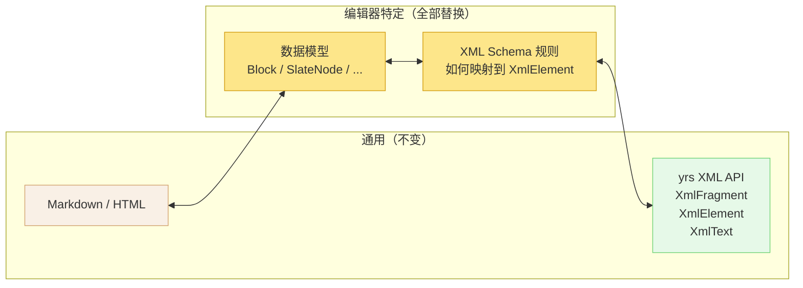

所以未来泛化的方向是：抽出 `yrs-editor-core` 提供 yrs XML 读写工具和 Markdown 处理基础设施，各编辑器 crate 实现自己的数据模型 + schema 映射：

```rust
// yrs-editor-core（通用基础设施）
pub trait EditorCodec {
    /// 编辑器特定的文档节点类型
    type Node: Serialize + DeserializeOwned;

    /// 从 yrs XML 树读取为编辑器节点
    fn decode_fragment(txn: &impl ReadTxn, fragment: &XmlFragmentRef) -> Vec<Self::Node>;

    /// 将编辑器节点写入 yrs XML 树
    fn encode_fragment(txn: &mut TransactionMut, fragment: &XmlFragmentRef, nodes: &[Self::Node]);

    /// 编辑器节点 → Markdown
    fn nodes_to_markdown(nodes: &[Self::Node]) -> String;

    /// Markdown → 编辑器节点
    fn markdown_to_nodes(md: &str) -> Vec<Self::Node>;
}

// yrs-blocknote（当前 crate，实现 BlockNote 的 codec）
struct BlockNoteCodec;
impl EditorCodec for BlockNoteCodec {
    type Node = Block;  // BlockNote 的 Block 类型
    // ...
}

// yrs-plate（未来，实现 Plate.js 的 codec）
struct PlateCodec;
impl EditorCodec for PlateCodec {
    type Node = SlateNode;  // Slate 的节点类型
    // ...
}
```

**但这是后话**——v0.2.0 先把 BlockNote 做好、做稳。包名 `yrs-blocknote` 明确了当前的 scope。验证架构可行后，再考虑抽出通用层。

## 10. 总结：一张图看全貌

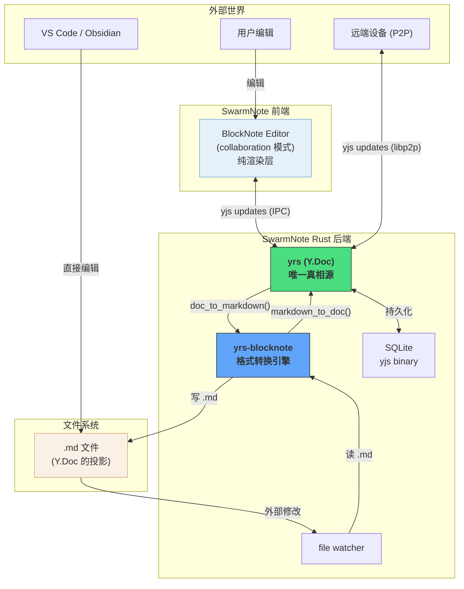

**一句话总结**：`yrs-blocknote` 让 Rust 后端成为完整的数据引擎——Y.Doc 是唯一真相源，.md 是投影，前端是纯渲染层。三种格式（Y.Doc、Blocks JSON、Markdown）通过 6 个函数自由互转，所有同步和存储场景都不依赖前端。
