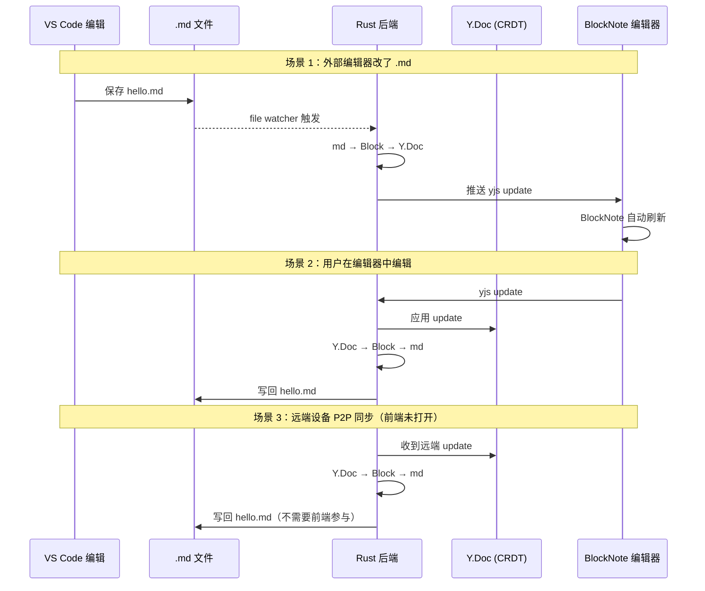
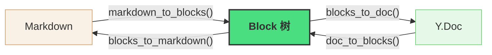
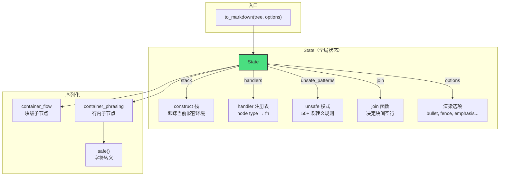
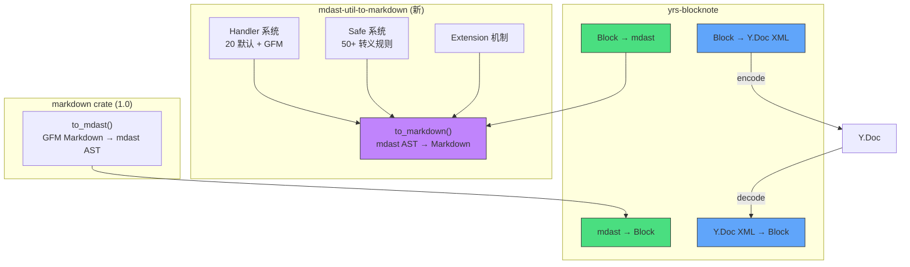

# yrs-blocknote 深度解析：三种格式如何无缝互转

> SwarmNote 的每一次编辑、每一次 P2P 同步、每一次外部文件变更，数据都要穿越三种格式。本文拆解 `yrs-blocknote` 和 `mdast-util-to-markdown` 两个 crate 的设计，从架构思想到实现细节。

## 第一部分：问题与架构

### 为什么需要三种格式

SwarmNote 中数据有三种存在形态：

| 格式 | 用途 | 特点 |
|------|------|------|
| **.md 文件** | 磁盘存储、人类阅读、外部编辑器兼容 | 纯文本、无状态 |
| **Block 树** | 应用数据格式、前端渲染 | 结构化、类型安全 |
| **Y.Doc** | CRDT 协作同步 | 二进制、可合并、有历史 |

每一次用户操作都会触发格式转换：



**如果转换过程丢了表格、搞乱了列表、转义了标题——笔记就毁了。**

### Hub-and-Spoke：Block 树为枢纽

三种格式不是两两直连（6 条转换路径），而是通过 Block 树中转（4 条路径）：



**设计思想**：Hub-and-Spoke（星型拓扑）。N 种格式只需 N 个适配器，不需要 N×(N-1) 个转换器。新增一种格式（比如 HTML 导出）只需写一个新适配器，不影响已有路径。

更重要的是，Block 树做了**归一化**——Markdown 的同一语义可以有不同写法（`*bold*` vs `__bold__`、`- item` vs `* item`），Block 树把这些"方言"统一成标准表示，避免了格式间的歧义传播。

## 第二部分：Block 数据模型

### 与 BlockNote 完全对齐

Block 树的设计与 BlockNote 编辑器的 JSON 格式 1:1 对应，这样 Rust 后端和 JS 前端共享同一套数据契约：

```rust
struct Block {
    id: String,              // UUID v7，全局唯一
    block_type: BlockType,   // paragraph, heading, table, ...
    props: Props,            // 属性（level, language, checked, ...）
    content: BlockContent,   // 内容（多态！见下文）
    children: Vec<Block>,    // 嵌套子块（列表项的子列表等）
}
```

### 多态 Content：一个 enum 三种形态

不同 block 类型的内容结构完全不同。强行用一种类型表示会丢失信息：

```rust
enum BlockContent {
    Inline(Vec<InlineContent>),  // 段落/标题/列表项：富文本片段
    Table(TableContent),         // 表格：行列结构 + 单元格属性
    None,                        // 图片/分割线：无文本内容
}
```

这对应 BlockNote JSON 中 `content` 字段的三种形态：

```json
// Paragraph → Inline
{ "type": "paragraph", "content": [{"type": "text", "text": "Hello"}] }

// Table → Table  
{ "type": "table", "content": {"type": "tableContent", "rows": [...]} }

// Image → None
{ "type": "image", "content": null }
```

**为什么不用 `Option<Vec<InlineContent>>`？** 因为区分不了"没有内容"和"内容是表格"。Table 需要存储 `rows`、`column_widths`、`header_rows` 等结构化数据，`Vec<InlineContent>` 装不下。

自定义 serde 让 JSON 序列化完全匹配 BlockNote 格式——`Inline` 序列化为数组，`Table` 序列化为对象，`None` 序列化为 `null`。

### Link 是容器，不是样式

这是一个容易犯的设计错误。直觉上 link 像是文本的一种"装饰"（和加粗、斜体并列），但 BlockNote 中 link 是一个**包裹结构**，可以包含不同样式的文本片段：

```
// ✗ 错误理解：link 是样式属性
Text { text: "click here", styles: { bold: true, link: "url" } }

// ✓ 正确理解：link 是容器，可以包裹多个不同样式的文本
Link {
    href: "url",
    content: [
        Text { text: "bold ", styles: { bold: true } },
        Text { text: "and italic", styles: { bold: true, italic: true } }
    ]
}
```

Rust 中的表示：

```rust
enum InlineContent {
    Text { text: String, styles: Styles },
    Link { href: String, content: Vec<InlineContent> },  // 递归结构
    HardBreak,
}

struct Styles {
    bold: bool,
    italic: bool,
    underline: bool,
    strikethrough: bool,  // serde 序列化为 "strike"
    code: bool,
    // 注意：没有 link！link 是 InlineContent 变体
}
```

这个设计直接影响 Y.Doc 编解码——link 在 yrs 中是文本的一个 attribute（`{link: {href: "url"}}`），decode 时需要把连续 link attribute 相同的 text 片段**归组**回一个 `Link` 容器。

## 第三部分：Markdown 渲染引擎（mdast-util-to-markdown）

### 为什么从零移植一个 JS 库

最初用 comrak（Rust 的 cmark-gfm 移植）做渲染，遇到了无法接受的问题：

| 问题 | 原因 | 能否配置解决 |
|------|------|------------|
| 连续列表项被拆成独立列表 | 每个 block 创建独立 NodeList | 不能 |
| `1.` 被转义为 `1\.` | format_commonmark 的转义逻辑 | 不能 |
| 表格分隔线格式变化 | CommonMark 标准格式化 | 不能 |

Rust 生态中没有成熟的 mdast → Markdown 库。JS 生态的 `mdast-util-to-markdown`（unified/remark 核心库，5000 行测试）是业界最成熟的实现。我们 1:1 移植，免费获得它积累的边界情况处理经验。

### 架构：State + Handler + Extension



#### State：穿透整个调用链的上下文

`State` 是整个序列化过程的"大脑"。它不仅存储配置，还跟踪运行时状态：

```rust
pub struct State {
    // ── 上下文追踪 ──
    pub stack: Vec<ConstructName>,    // 当前嵌套的 construct 栈
    pub index_stack: Vec<usize>,      // 每层的子节点索引

    // ── 注册表 ──
    pub handlers: HashMap<String, HandlerFn>,    // node type → handler
    pub peek_handlers: HashMap<String, PeekFn>,  // node type → peek
    pub unsafe_patterns: Vec<UnsafePattern>,      // 转义规则
    pub join: Vec<JoinFn>,                        // 块间空行逻辑

    // ── 配置 ──
    pub options: Options,

    // ── 运行时状态 ──
    pub bullet_current: Option<String>,      // 当前列表标记
    pub bullet_last_used: Option<String>,    // 上一个列表的标记
}
```

**`stack` 的作用**：Markdown 中同一个字符在不同上下文中含义不同。比如 `|` 在表格单元格中需要转义，在段落中不需要。`stack` 记录当前嵌套环境，转义系统据此判断是否需要转义：

```rust
// 进入表格单元格
state.enter(ConstructName::TableCell);
// ... 在这个环境中 safe() 会转义 |
let text = state.safe(Some("a | b"), &config);  // → "a \\| b"
// 退出
state.exit();
```

#### Handler 分发：HashMap 查表

handler 注册表是一个简单的 `HashMap<String, HandlerFn>`：

```rust
type HandlerFn = fn(&Node, Option<&Node>, &mut State, &Info) -> String;
```

分发逻辑只有 3 行：

```rust
pub fn handle(&mut self, node: &Node, parent: Option<&Node>, info: &Info) -> String {
    let type_name = node_type_name(node);  // Node::Heading → "heading"
    if let Some(handler) = self.handlers.get(type_name).copied() {
        handler(node, parent, self, info)
    } else {
        String::new()
    }
}
```

JS 版用 `zwitch` 库做 pattern matching，Rust 不需要——`HashMap::get` + `fn` 指针直接搞定，零开销。

#### 典型 Handler 的写法模式

以 heading handler 为例，展示标准的 handler 写作模式：

```rust
pub fn handle_heading(node: &Node, _parent: Option<&Node>,
                      state: &mut State, info: &Info) -> String {
    let Node::Heading(heading) = node else { return String::new() };
    let rank = heading.depth.clamp(1, 6) as usize;

    // 1. 创建位置追踪器
    let mut tracker = state.create_tracker(info);

    // 2. 进入 construct（影响转义规则和 join 逻辑）
    state.enter(ConstructName::HeadingAtx);
    state.enter(ConstructName::Phrasing);

    // 3. 追踪标记符的位置
    tracker.r#move(&format!("{} ", "#".repeat(rank)));

    // 4. 序列化子节点（行内内容）
    let value = state.container_phrasing(node, &Info {
        before: "# ".to_string(),   // heading 标记后的文本不是行首
        after: "\n".to_string(),     // heading 后面是换行
        ..tracker.current_info()
    });

    // 5. 退出 construct（逆序）
    state.exit(); // phrasing
    state.exit(); // headingAtx

    // 6. 组装最终输出
    format!("{} {}", "#".repeat(rank), value)
}
```

**核心模式**：`enter → track → serialize children → exit → assemble`。每个 handler 都遵循这个流程，区别只在于标记符和嵌套方式。

### 两种容器序列化：Flow vs Phrasing

这是 Markdown 渲染中最重要的概念划分：

```
Flow 容器（块级）：子节点之间用空行分隔
├── Root
├── Blockquote
├── List
└── ListItem

Phrasing 容器（行内）：子节点紧凑拼接，无分隔符
├── Paragraph
├── Heading
├── Emphasis / Strong / Delete
└── Link
```

#### container_flow：块级序列化 + Join 决策

```rust
pub fn container_flow(parent: &Node, state: &mut State, info: &TrackFields) -> String {
    let children = get_children(parent);
    let mut results = Vec::new();

    for (index, child) in children.iter().enumerate() {
        // 序列化当前子节点
        let value = state.handle(child, Some(parent), &child_info);
        results.push(value);

        // 如果不是最后一个，决定和下一个之间放什么
        if index < children.len() - 1 {
            let between = between(child, &children[index + 1], parent, state);
            results.push(between);
        }
    }

    results.join("")
}
```

`between()` 函数调用所有注册的 join 函数，按返回值决定间距：

```rust
fn between(left: &Node, right: &Node, parent: &Node, state: &State) -> String {
    // 逆序遍历 join 函数，first non-None wins
    for join_fn in state.join.iter().rev() {
        match join_fn(left, right, parent, state) {
            Some(0) => return "\n".to_string(),          // 无空行
            Some(1) => break,                             // 一个空行（默认）
            Some(n) if n < 0 => return "\n\n<!---->\n\n", // 不能相邻，插入注释
            Some(n) => return "\n".repeat(1 + n as usize), // n 个空行
            None => continue,                             // 无意见，问下一个
        }
    }
    "\n\n".to_string()  // 默认一个空行
}
```

**Join 函数的设计思想**：每个 join 函数只关心自己了解的场景，不了解的返回 `None`。这是一种 **Chain of Responsibility** 模式——多个处理者串联，第一个能处理的决定结果。扩展机制利用这个特性：新扩展可以往 join 数组追加自己的规则，不影响已有逻辑。

#### container_phrasing：行内序列化 + Peek 机制

行内内容紧凑拼接，但有一个精巧的细节——**peek**：

```rust
pub fn container_phrasing(parent: &Node, state: &mut State, info: &Info) -> String {
    let children = get_phrasing_children(parent);

    for (index, child) in children.iter().enumerate() {
        // 关键：peek 下一个兄弟节点的首字符
        let after = if index + 1 < children.len() {
            state.peek(&children[index + 1], Some(parent), info)
        } else {
            info.after.clone()
        };

        let child_info = Info {
            before: /* 上一个节点的末字符 */,
            after,  // 下一个节点的首字符
            ..
        };

        let value = state.handle(child, Some(parent), &child_info);
        results.push(value);
    }
}
```

**为什么需要 peek？** 因为 Markdown 转义是上下文敏感的。`*` 在 `a*b*c` 中是 emphasis 标记，但在 `a * b` 中是普通字符。handler 需要知道前后字符才能决定是否转义。peek 让每个节点知道"下一个节点会输出什么首字符"，从而做出正确的转义决策。

### 字符转义系统：50+ 条规则的精确匹配

Markdown 中几乎所有标点符号都可能有特殊含义，取决于上下文。`safe()` 函数是解决这个问题的核心：

```rust
pub struct UnsafePattern {
    pub character: char,                       // 危险字符
    pub before: Option<String>,                // 前面是什么（正则）
    pub after: Option<String>,                 // 后面是什么（正则）
    pub at_break: bool,                        // 是否只在行首危险
    pub in_construct: Vec<ConstructName>,       // 在哪些环境中危险
    pub not_in_construct: Vec<ConstructName>,   // 在哪些环境中安全
}
```

例如，`*` 在行内文本中可能触发 emphasis，但在代码块中是安全的：

```rust
UnsafePattern {
    character: '*',
    in_construct: vec![Phrasing],     // 只在行内文本中危险
    not_in_construct: vec![
        Autolink, DestinationLiteral, HeadingAtx, ...  // 但不在这些子环境中
    ],
    ..
}
```

`safe()` 的算法：

```
1. 把 before + input + after 拼成一个完整上下文
2. 遍历所有 pattern：
   a. 检查 pattern 是否在当前 construct stack 范围内（pattern_in_scope）
   b. 编译 pattern 为正则（带缓存）
   c. 在上下文中找到所有匹配位置
3. 对每个 unsafe 位置：
   - 如果是 ASCII 标点 → 反斜杠转义：\*
   - 否则 → 字符引用：&#42;
4. 返回安全字符串
```

**设计思想**：这是一个 **规则引擎**。每条规则独立描述一种危险情况，`safe()` 函数是统一的执行器。新增一条规则（比如 GFM strikethrough 的 `~`）只需往 patterns 数组追加，不需要修改 safe 的逻辑。

### 扩展机制：数据驱动的插件系统

GFM（table, strikethrough, task list）不是硬编码在核心中的，而是通过扩展机制注入：

```rust
pub struct Extension {
    pub handlers: HashMap<String, HandlerFn>,  // 新的/覆盖的 handlers
    pub unsafe_patterns: Vec<UnsafePattern>,   // 额外的转义规则
    pub join: Vec<JoinFn>,                     // 额外的 join 逻辑
}
```

合并语义与 JS 版完全一致：

| 字段 | 合并方式 | 原因 |
|------|---------|------|
| `handlers` | Last-wins（后覆盖前） | 同一节点类型只能有一个 handler |
| `unsafe_patterns` | 累加 | 所有规则都需要检查 |
| `join` | 累加 | Chain of Responsibility，first non-None wins |

```rust
/// 递归合并扩展——depth-first, left-to-right
pub fn configure(state: &mut State, extension: InputExtension) {
    // 先递归处理子扩展
    if let Some(extensions) = extension.extensions {
        for ext in extensions {
            configure(state, ext);
        }
    }
    // 再合并自身的字段
    if let Some(handlers) = extension.handlers {
        state.handlers.extend(handlers);  // last-wins
    }
    if let Some(patterns) = extension.unsafe_patterns {
        state.unsafe_patterns.extend(patterns);  // 累加
    }
    if let Some(join) = extension.join {
        state.join.extend(join);  // 累加
    }
}
```

GFM 扩展默认开启，但可以关掉：

```rust
// 默认包含 GFM
let md = to_markdown(&tree, &Options::default());

// 不要 GFM
let md = to_markdown(&tree, &Options { gfm: false, ..Default::default() });

// 自定义扩展
let md = to_markdown(&tree, &Options {
    extensions: vec![my_custom_extension()],
    ..Default::default()
});
```

## 第四部分：Y.Doc 编解码——与前端共享真相

### BlockNote 的 XML Schema

BlockNote 通过 y-prosemirror 将 ProseMirror 节点映射为 Y.Doc XML 元素。映射规则很简单：**ProseMirror node type name = XML tag name**。

普通 block 的通用结构：

```
XmlFragment("document-store")
└── blockGroup
    └── blockContainer id="abc"
        ├── paragraph                 ← block type = tag name
        │   └── XmlText               ← 富文本 delta
        │       insert("Hello ")  attrs: {}
        │       insert("world")   attrs: { bold: {} }
        └── blockGroup                ← [可选] 嵌套子块
```

### Table 的专用编解码

**关键区别**：table 内部不走通用的 `blockContainer > blockGroup` 路径。ProseMirror 的 table schema 定义了直接嵌套：`table > tableRow > tableCell > tableParagraph`。

```
blockContainer id="xxx"
└── table
    ├── tableRow                       ← 直接嵌套，没有 blockContainer！
    │   ├── tableHeader colspan="1"    ← 属性 = ProseMirror node attrs
    │   │   └── tableParagraph
    │   │       └── XmlText "Header"
    │   └── tableHeader ...
    └── tableRow
        ├── tableCell colspan="1" backgroundColor="red"
        │   └── tableParagraph
        │       └── XmlText "Cell"
        └── tableCell ...
```

Rust 实现中，`encode_block` 根据 content 类型分发到不同路径：

```rust
fn encode_block(parent_group, txn, block, id_gen) {
    let container = parent_group.push_back(txn, XmlElementPrelim::empty(BLOCK_CONTAINER));
    let content_elem = container.push_back(txn, XmlElementPrelim::empty(tag));

    match &block.content {
        BlockContent::Inline(inlines) if block.block_type.has_inline_content() => {
            // 通用路径：直接在 content element 下写 XmlText
            let text_ref = content_elem.push_back(txn, XmlTextPrelim::new(""));
            encode_inline_content(inlines, &text_ref, txn);
        }
        BlockContent::Table(table) => {
            // 表格专用路径：tableRow > tableCell > tableParagraph > XmlText
            encode_table(&content_elem, txn, table);
        }
        _ => {}  // None = image/divider，无内容写入
    }
}
```

### Link 在 Y.Doc 中的双重身份

Link 在 Y.Doc 中不是独立的 XML 元素，而是文本的 **attribute**：

```
XmlText delta:
  insert("bold link")  attrs: { bold: {}, link: { href: "url" } }
  insert(" plain")     attrs: { link: { href: "url" } }
```

编码时，`InlineContent::Link` 拆成多个 text insert，每个都附加 link attribute：

```rust
InlineContent::Link { href, content } => {
    for inner in content {
        if let InlineContent::Text { text, styles } = inner {
            let mut attrs = styles.to_yrs_attrs();
            // 把 link 作为 attribute 附加到文本上
            attrs.insert(Arc::from("link"), link_yrs_attr(href));
            text_ref.insert_with_attributes(txn, offset, text, attrs);
        }
    }
}
```

解码时做反向操作——连续 link attribute 相同的 text 片段归组：

```
Y.Doc 中的 3 个文本片段:
  "bold link"  attrs: { bold: {}, link: { href: "url1" } }
  " normal"    attrs: { link: { href: "url1" } }         ← 同一个 link
  "other"      attrs: { link: { href: "url2" } }         ← 不同 link

归组后:
  Link { href: "url1", content: [
      Text("bold link", bold=true),
      Text(" normal"),
  ]}
  Link { href: "url2", content: [
      Text("other"),
  ]}
```

## 第五部分：列表合并——Block 模型的核心挑战

### 问题的本质

BlockNote 的 block 模型把列表项视为**扁平、独立的 block**（和段落同级）：

```
Block { type: NumberedListItem, content: "First" }
Block { type: NumberedListItem, content: "Second" }
Block { type: Paragraph, content: "Not a list" }
Block { type: NumberedListItem, content: "Third" }
```

但 Markdown 和 mdast 都要求列表项在一个**容器节点**里：

```
List (ordered)
├── ListItem: "First"
├── ListItem: "Second"
Paragraph: "Not a list"
List (ordered)
└── ListItem: "Third"    ← 中间断开了，这是一个新列表
```

### 解法：渲染前扫描合并

在 Block → mdast 转换时，`blocks_to_mdast_children` 扫描连续同类列表项并合并：

```rust
fn blocks_to_mdast_children(blocks: &[Block]) -> Vec<Node> {
    let mut result = Vec::new();
    let mut i = 0;

    while i < blocks.len() {
        match blocks[i].block_type {
            BlockType::BulletListItem => {
                // 向前扫描所有连续的同类 block
                let (list_node, consumed) = group_bullet_list(&blocks[i..]);
                result.push(list_node);  // 一个 Node::List 包含多个 ListItem
                i += consumed;           // 跳过已消费的 blocks
            }
            BlockType::NumberedListItem => {
                let (list_node, consumed) = group_numbered_list(&blocks[i..]);
                result.push(list_node);
                i += consumed;
            }
            _ => {
                result.push(block_to_mdast(&blocks[i]));
                i += 1;
            }
        }
    }
    result
}

fn group_numbered_list(blocks: &[Block]) -> (Node, usize) {
    let mut items = Vec::new();
    let mut count = 0;

    for block in blocks {
        if block.block_type != BlockType::NumberedListItem { break; }
        items.push(block_to_list_item(block));
        count += 1;
    }

    (Node::List(List { ordered: true, children: items, .. }), count)
}
```

这样 `mdast-util-to-markdown` 渲染时看到的是完整的 `List` 节点，自然输出连续的 `1. 2. 3.`，不再分裂。

## 第六部分：测试——用真实文档说话

### 批量扫描 59 个文档

单元测试只覆盖已知的边界情况。真正验证 round-trip 保真度的是**真实文档测试**——自动扫描项目中所有 `.md` 文件：

```rust
#[test]
fn batch_dev_notes_blocks_roundtrip() {
    let files = collect_md_files(&root.join("dev-notes"));  // 递归收集
    for path in &files {
        let md = std::fs::read_to_string(path).unwrap();
        assert_blocks_roundtrip(&name, &md);  // block 数量 + 类型不变
    }
}
```

7 个测试覆盖：
- `batch_dev_notes_blocks_roundtrip` — dev-notes 下所有文件的 blocks round-trip
- `batch_dev_notes_ydoc_roundtrip` — dev-notes 下所有文件的 Y.Doc round-trip
- `batch_milestones_blocks_roundtrip` — milestones 下所有文件
- `batch_milestones_ydoc_roundtrip` — milestones 下所有文件
- `batch_double_roundtrip_converges` — 59 个文件的双 round-trip 收敛性
- `batch_tables_preserved` — 所有含表格的文档，表格数量不变
- `batch_code_blocks_preserved` — 所有含代码块的文档，代码块数量不变

### Double Round-Trip 收敛性

一次 round-trip 可能改变格式（比如表格列宽 padding），但不应该改变结构。更重要的是，**第二次 round-trip 的输出应该和第一次相同**——这就是"收敛性"：

```
原始 .md → round-trip 1 → md₁ → round-trip 2 → md₂
                                                ↑
                           md₁ 和 md₂ 的 block 结构必须相同
```

如果不收敛，说明渲染器的输出在重新解析后会产生不同的结构——这是 bug。

## 总结：三个 crate 的职责边界



| Crate | 代码量 | 测试 | 职责 |
|-------|--------|------|------|
| `markdown` (1.0) | 社区维护 | — | Markdown 解析 |
| `mdast-util-to-markdown` | ~3000 行 | 124 个 | Markdown 渲染（Handler + Safe + Extension） |
| `yrs-blocknote` | ~2000 行 | 79 个 | Block ↔ mdast 转换 + Block ↔ Y.Doc 编解码 |

**一句话总结**：`yrs-blocknote` 不做解析也不做渲染——它专注于**格式之间的桥接**。解析和渲染交给生态中最好的库，自己只管数据模型和编解码。这种职责分离让每一层都可以独立测试、独立演进、独立发布。
