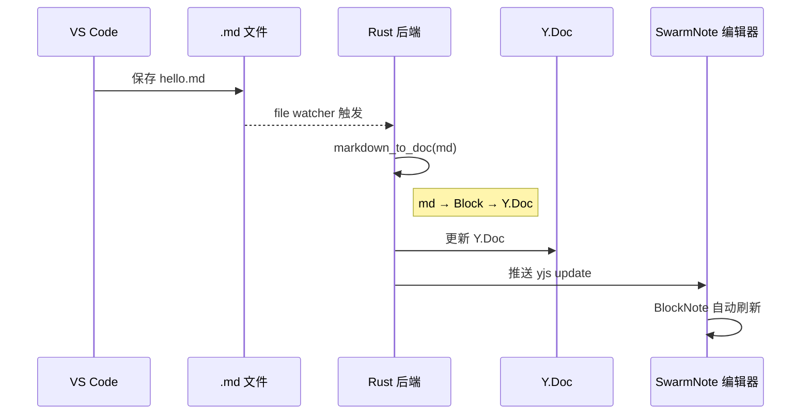
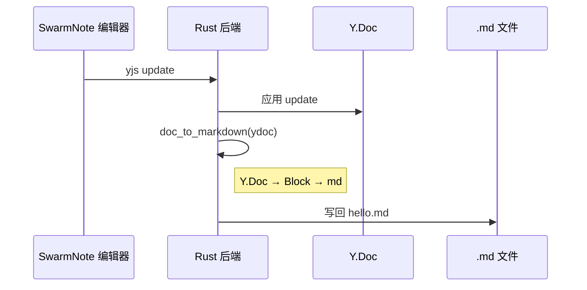
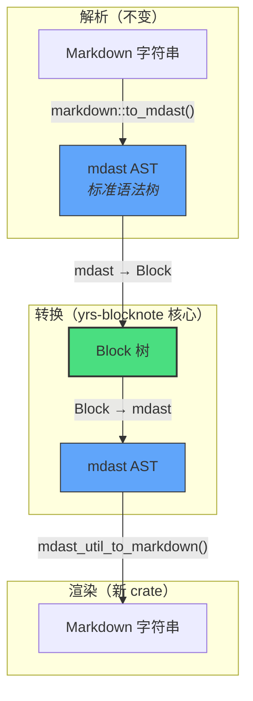
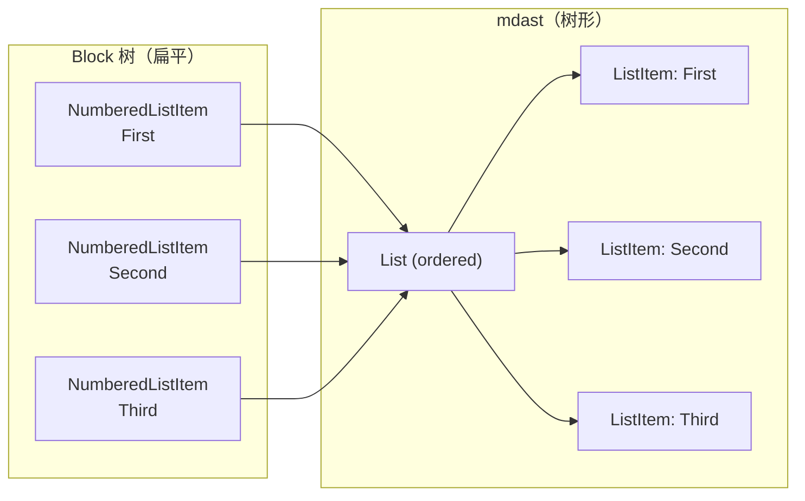
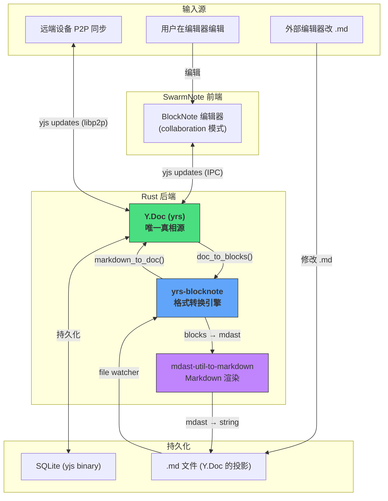

# yrs-blocknote 深度解析：三种格式如何无缝互转

> SwarmNote 的每一次编辑、每一次 P2P 同步、每一次外部文件变更，数据都要穿越三种格式。本文拆解 `yrs-blocknote` 的设计，看它如何做到 Markdown、Block JSON、Y.Doc 三者之间的无损转换。

## 你为什么应该关心这件事

假设你在 VS Code 里写了一篇带表格的笔记，SwarmNote 检测到文件变更后：



然后你在 SwarmNote 编辑器里改了几个字，Rust 后端又要把 Y.Doc 写回 .md：



如果这个转换过程丢了表格、搞乱了列表、转义了标题里的数字——你的笔记就毁了。**`yrs-blocknote` 的使命就是让这两个方向的转换完全无损。**

## 核心架构：Block 树是枢纽

三种格式不是两两直连的，而是通过一个中间层——Block 树——来中转：


为什么不 Markdown ↔ Y.Doc 直连？因为 Block 树做了一件很关键的事：**归一化**。

Markdown 的同一个语义可以有不同写法（`*bold*` vs `__bold__`，`- item` vs `* item`），Y.Doc 的 XML 结构也有自己的编码规则。Block 树把两边的"方言"统一成一种标准表示，这样两个方向的转换都只需要关心"Block ↔ 一种格式"，而不是"任意格式 ↔ 任意格式"。

## Block 树长什么样

Block 树的设计完全对齐 BlockNote 编辑器的 JSON 格式，这样前后端共享同一套数据模型：

```rust
struct Block {
    id: String,                    // 唯一标识（UUID v7）
    block_type: BlockType,         // paragraph, heading, table, ...
    props: Props,                  // 属性（level, language, checked, ...）
    content: BlockContent,         // 内容（多态）
    children: Vec<Block>,          // 嵌套子块
}
```

### 设计巧妙之一：content 是多态的

不同类型的 block 有完全不同的内容结构。一个 `enum` 搞定：

```rust
enum BlockContent {
    Inline(Vec<InlineContent>),  // 段落、标题、列表项的富文本
    Table(TableContent),         // 表格：行列结构 + cell props
    None,                        // 图片、分割线：没有文本内容
}
```

这对应 BlockNote JSON 中 `content` 字段的三种形态：

```
Paragraph  →  content: [{type: "text", text: "Hello", styles: {bold: true}}]
Table      →  content: {type: "tableContent", rows: [...], columnWidths: [...]}
Image      →  content: undefined
```

如果用 `Vec<InlineContent>` 统一表示所有 content，表格的行列数据就无处存放。如果用 `Option` 来区分有无内容，又区分不了 inline 和 table。`enum` 是精确的答案。

### 设计巧妙之二：Link 是 InlineContent，不是 Style

BlockNote 中链接不是文本的一个"样式"（像加粗、斜体那样），而是一个包裹结构：

```
// ✗ 错误理解：link 是样式
Text { text: "click here", styles: { bold: true, link: "url" } }

// ✓ 正确理解：link 是容器，可以包裹带样式的文本
Link {
    href: "url",
    content: [
        Text { text: "click ", styles: { bold: true } },
        Text { text: "here", styles: { bold: true, italic: true } }
    ]
}
```

所以 `InlineContent` 有三种：

```rust
enum InlineContent {
    Text { text: String, styles: Styles },    // 带样式的文本片段
    Link { href: String, content: Vec<InlineContent> },  // 链接包裹文本
    HardBreak,                                 // 硬换行
}
```

这让 Y.Doc 编码中 link attribute 的处理变得自然——link 的 yrs 属性 `{href: "url"}` 挂在被包裹文本的 attributes 上，decode 时只需要把连续 link attribute 相同的 text 片段归到同一个 `Link` 容器里。

## Markdown 层的演进：从 comrak 到 mdast

### 旧方案的痛点

最初 `yrs-blocknote` 用 comrak（Rust 的 cmark-gfm 移植）做 Markdown 解析和渲染。comrak 的解析很好，但渲染有三个致命问题：

```
问题 1：列表项被拆成独立列表
─────────────────────────────
输入:                    输出:
1. First                 1. First
2. Second                <!-- end list -->
3. Third                 1. Second
                         <!-- end list -->
                         1. Third

原因: 每个 NumberedListItem block 被单独包在一个 comrak NodeList 里

问题 2：标题中的数字被转义
─────────────────────────────
输入:  ## 1. Problem
输出:  ## 1\. Problem

原因: comrak 的 format_commonmark() 把 "1." 当成潜在的列表标记转义了

问题 3：表格分隔线格式变化
─────────────────────────────
输入:  |---|---|
输出:  | --- | --- |

原因: comrak 输出标准 CommonMark 格式，和 GFM 缩写格式不同
```

用 59 个真实项目文档跑 round-trip 测试，**5 个文件失败**。

### 新方案：三层解耦



| 层 | 职责 | 实现 |
|---|---|---|
| **解析** | Markdown → AST | `markdown` crate（wooorm 维护，1.0 稳定，100% 规范合规） |
| **转换** | AST ↔ Block 树 | `yrs-blocknote` 内部的 `markdown.rs` |
| **渲染** | AST → Markdown | `mdast-util-to-markdown`（JS 版 1:1 移植） |

### 设计巧妙之三：列表合并是数据结构问题

旧方案之所以列表分裂，是因为 BlockNote 的 block 模型把列表项视为**扁平、独立的 block**：

```
Block { type: NumberedListItem, content: "First" }
Block { type: NumberedListItem, content: "Second" }
Block { type: NumberedListItem, content: "Third" }
```

而 Markdown 要求它们在一个列表容器里。旧方案用 comrak 渲染时，每个 block 单独创建一个 `NodeList` → 分裂。

新方案在 Block → mdast 转换时做了**连续同类项合并**：

```rust
// blocks_to_mdast_children() 中的核心逻辑
while i < blocks.len() {
    match blocks[i].block_type {
        BlockType::NumberedListItem => {
            // 向前扫描，把连续的同类 block 收集到一起
            let (list_node, consumed) = group_numbered_list(&blocks[i..]);
            result.push(list_node);  // 一个 Node::List 包含多个 ListItem
            i += consumed;
        }
        _ => {
            result.push(block_to_mdast(&blocks[i]));
            i += 1;
        }
    }
}
```



这样 `mdast-util-to-markdown` 渲染时看到的是一个完整的 `List` 节点，自然输出连续的 `1. 2. 3.`。

## mdast-util-to-markdown：从 JS 生态移植

这个 crate 是 JS 库 `mdast-util-to-markdown`（unified/remark 核心组件，wooorm 维护）的 Rust 1:1 移植。为什么要移植而不是自己写？因为 Markdown 渲染看似简单，实际有大量边界情况：

- 什么时候 `*` 需要转义？（在 phrasing context 中且前后是特定字符）
- 代码围栏用几个反引号？（至少比内容中最长的连续反引号多一个）
- 两个相邻的列表之间怎么分隔？（用 HTML 注释 `<!---->` 或空行）
- 斜体 `_` 在什么情况下不能用？（前后是 Unicode 标点时）

JS 版有 5000 行测试覆盖了这些情况。我们 1:1 移植，免费获得这些经验。

### Handler 系统

每种 mdast 节点类型有一个 handler 函数：

```
Node::Heading  →  handle_heading()   → "## Title\n"
Node::List     →  handle_list()      → "- item1\n- item2\n"
Node::Table    →  handle_table()     → "| A | B |\n| --- | --- |\n"
```

handler 注册在一个 HashMap 里，通过扩展机制可以覆盖：

```rust
let ext = Extension {
    handlers: HashMap::from([("heading", my_custom_heading_handler)]),
    ..Default::default()
};
let md = to_markdown(&tree, &Options {
    extensions: vec![ext],
    ..Default::default()
});
```

### 字符转义系统

50+ 条 unsafe pattern 定义了什么字符在什么上下文中需要转义：

```rust
UnsafePattern {
    character: '*',
    in_construct: vec![Phrasing],  // 只在行内文本中
    not_in_construct: vec![         // 但不在这些子环境中
        Autolink, DestinationLiteral, HeadingAtx, ...
    ],
}
```

`safe()` 函数遍历所有 pattern，找到需要转义的位置，优先用反斜杠（`\*`），不行就用字符引用（`&#42;`）。

### GFM 作为内建扩展

Table、Strikethrough、Task List 通过扩展机制注入，但**默认开启**：

```rust
impl Default for Options {
    fn default() -> Self {
        Self {
            gfm: true,  // 默认包含 GFM 扩展
            bullet: '*',
            // ...
        }
    }
}
```

这意味着如果你不需要 GFM，可以关掉：

```rust
let opts = Options { gfm: false, ..Default::default() };
```

## Y.Doc 编解码：与 BlockNote 前端共享真相

Y.Doc 是 SwarmNote 的"唯一真相源"。Rust 后端和 BlockNote 前端操作**同一个** Y.Doc，所以 XML 结构必须完全一致。

### BlockNote 的 XML Schema

BlockNote 通过 `y-prosemirror` 将 ProseMirror 节点映射为 Y.Doc XML 元素。规则很简单：**ProseMirror node type name = XML tag name**。

```
XmlFragment("document-store")
└── blockGroup
    ├── blockContainer id="abc"           ← 每个 block 一个 container
    │   ├── paragraph                     ← block type = tag name
    │   │   └── XmlText "Hello **world**" ← 富文本（带 bold attribute）
    │   └── blockGroup                    ← [可选] 嵌套子块
    │        └── blockContainer → ...
    │
    └── blockContainer id="def"
        └── heading level="2"
            └── XmlText "Title"
```

### 设计巧妙之四：Table 的专用编解码

普通 block 都遵循 `blockContainer > <type> > XmlText > blockGroup` 的统一结构。但 table 不同——它的内部不用 `blockContainer` 包裹：

```
blockContainer id="xxx"
└── table
    ├── tableRow                       ← 直接嵌套，无 blockContainer
    │   ├── tableHeader colspan="1"    ← 直接嵌套
    │   │   └── tableParagraph         ← 内容包裹层
    │   │       └── XmlText "Header"
    │   └── tableHeader ...
    └── tableRow
        ├── tableCell colspan="1"
        │   └── tableParagraph
        │       └── XmlText "Cell"
        └── tableCell ...
```

这是 BlockNote 的设计（表格是 ProseMirror 的 `table > tableRow > tableCell` 嵌套，没有 `blockContent` wrapper），我们在 Rust 侧必须精确还原：

```rust
fn encode_block(/* ... */) {
    // ...
    match &block.content {
        BlockContent::Inline(inlines) if block.block_type.has_inline_content() => {
            // 通用路径：XmlText 直接放在 content element 下
            encode_inline_content(inlines, &text_ref, txn);
        }
        BlockContent::Table(table) => {
            // 表格专用路径：tableRow > tableCell > tableParagraph > XmlText
            encode_table(&content_elem, txn, table);
        }
        _ => {}
    }
}
```

### Link 的双重身份

Link 在 Y.Doc 中不是一个独立的 XML 元素，而是文本的一个 **attribute**：

```
XmlText:
  insert("click ")  attributes: { bold: {} }
  insert("here")    attributes: { bold: {}, link: { href: "url" } }
```

编码时，`InlineContent::Link` 需要把 `link` attribute 挂到每个内部文本片段上：

```rust
InlineContent::Link { href, content } => {
    for inner in content {
        if let InlineContent::Text { text, styles } = inner {
            let mut attrs = styles.to_yrs_attrs();
            attrs.insert("link", { href: "url" });  // 附加 link attribute
            text_ref.insert_with_attributes(txn, offset, text, attrs);
        }
    }
}
```

解码时，要做反向操作——把连续 link attribute 相同的文本片段**归组**回一个 `Link`：

```
// Y.Doc 中的 3 个文本片段
insert("bold link")  attrs: { bold: {}, link: { href: "url1" } }
insert(" normal")    attrs: { link: { href: "url1" } }
insert("other")      attrs: { link: { href: "url2" } }

// 归组后的 InlineContent
Link { href: "url1", content: [
    Text { text: "bold link", styles: { bold: true } },
    Text { text: " normal", styles: {} },
] }
Link { href: "url2", content: [
    Text { text: "other", styles: {} },
] }
```

## 数据流全景

把所有场景串起来，这是数据在系统中流动的完整图景：



## 测试策略：用真实文档说话

单元测试容易写，但真正验证 round-trip 保真度的是**真实文档测试**。我们批量扫描项目中的 59 个 `.md` 文件，对每个文件跑三种测试：

```rust
// 1. blocks round-trip: md → blocks → md，检查 block 数量和类型不变
assert_blocks_roundtrip(name, &md);

// 2. Y.Doc round-trip: md → Y.Doc → md，检查结构不变
assert_ydoc_roundtrip(name, &md);

// 3. double round-trip: 两次 round-trip 后结果收敛
assert_double_roundtrip_converges(name, &md);
```

还有针对性检查：所有含表格的文档，表格数量在 round-trip 后不变；所有含代码块的文档，代码块数量在 round-trip 后不变。

## 总结：三个 crate，各司其职

| Crate | 定位 | 职责 |
|-------|------|------|
| `markdown` (1.0) | Markdown 解析 | GFM Markdown → mdast AST |
| `mdast-util-to-markdown` (新) | Markdown 渲染 | mdast AST → Markdown 字符串 |
| `yrs-blocknote` | 格式转换引擎 | Block ↔ mdast 转换 + Block ↔ Y.Doc 编解码 |

`yrs-blocknote` 不做解析也不做渲染——它专注于**格式之间的桥接**。解析和渲染交给生态中最好的库，自己只管转换逻辑。这种职责分离让每一层都可以独立测试、独立演进。

两个通用 crate 都不依赖 SwarmNote，计划在稳定后发布到 crates.io，填补 Rust 生态中 "yrs ↔ Markdown" 和 "mdast → Markdown" 的空白。
