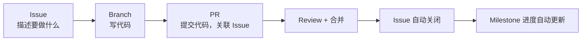
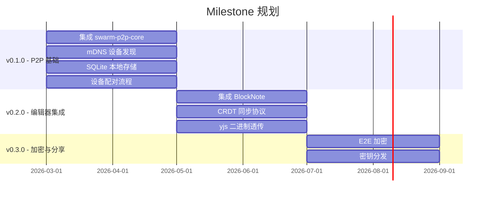
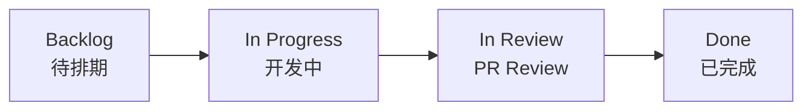
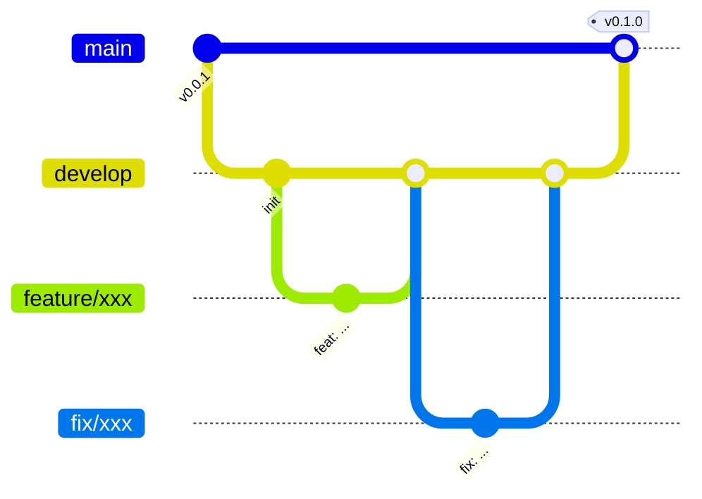
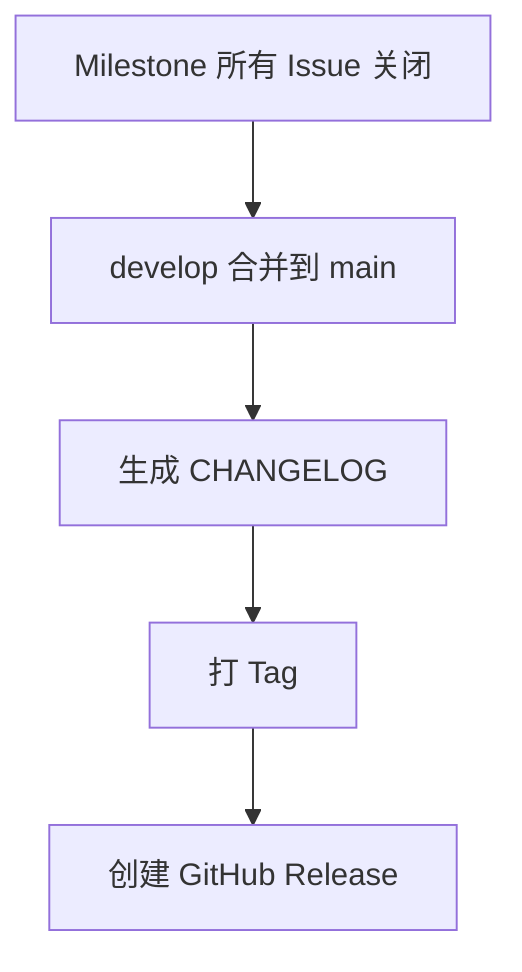
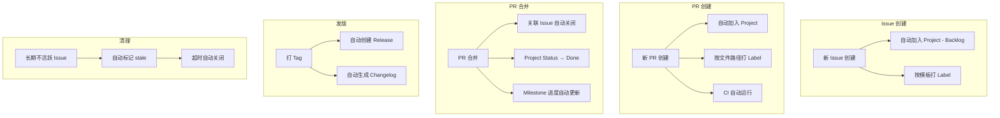
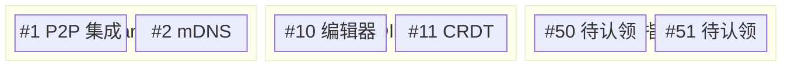
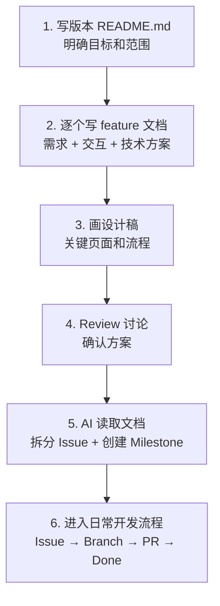
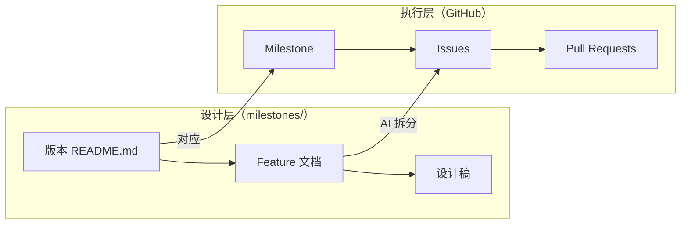

# GitHub 项目管理完全指南

> 面向开源项目维护者，从零搭建基于 GitHub 全家桶的项目管理体系。
> 不需要 Jira、Trello、Notion——GitHub 原生功能即可覆盖全流程。

## 目录

- [核心理念](#核心理念)
- [第一层：Issues — 任务管理](#第一层issues--任务管理)
- [第二层：Labels — 分类标记](#第二层labels--分类标记)
- [第三层：Milestones — 版本规划](#第三层milestones--版本规划)
- [第四层：Projects — 看板与进度](#第四层projects--看板与进度)
- [第五层：Pull Requests — 代码交付](#第五层pull-requests--代码交付)
- [第六层：Releases — 版本发布](#第六层releases--版本发布)
- [自动化配置](#自动化配置)
- [团队协作](#团队协作)
- [日常工作流速查](#日常工作流速查)
- [gh CLI 常用命令](#gh-cli-常用命令)

---

## 核心理念

GitHub 项目管理的核心循环：



一切围绕 **Issue** 展开：它是需求单、Bug 单、任务单的统一载体。

---

## 第一层：Issues — 任务管理

### Issue 是什么

Issue 就是一张「任务卡片」，可以是：

- 一个 Bug 报告
- 一个功能需求
- 一个重构计划
- 一个文档任务
- 一个讨论话题

### 写好一个 Issue

一个好的 Issue 应该包含：

```markdown
## 描述
简洁说明要做什么、为什么做。

## 具体需求
- [ ] 子任务 1
- [ ] 子任务 2
- [ ] 子任务 3

## 参考资料
相关链接、设计稿、技术文档等。
```

子任务用 `- [ ]` 格式，GitHub 会自动显示进度条。

### Issue 模板

在 `.github/ISSUE_TEMPLATE/` 下创建模板，规范化提交：

**Bug 报告模板** (`.github/ISSUE_TEMPLATE/bug_report.yml`)：

```yaml
name: Bug 报告
description: 提交一个 Bug
labels: ["type: bug"]
body:
  - type: textarea
    id: description
    attributes:
      label: Bug 描述
      description: 简洁描述这个 Bug
    validations:
      required: true
  - type: textarea
    id: steps
    attributes:
      label: 复现步骤
      description: 如何触发这个 Bug？
      value: |
        1. 打开 '...'
        2. 点击 '...'
        3. 观察到 '...'
    validations:
      required: true
  - type: textarea
    id: expected
    attributes:
      label: 期望行为
      description: 你期望发生什么？
    validations:
      required: true
  - type: dropdown
    id: platform
    attributes:
      label: 操作系统
      options:
        - Windows
        - macOS
        - Linux
        - Android
    validations:
      required: true
```

**功能请求模板** (`.github/ISSUE_TEMPLATE/feature_request.yml`)：

```yaml
name: 功能请求
description: 提交一个新功能建议
labels: ["type: feature"]
body:
  - type: textarea
    id: problem
    attributes:
      label: 问题描述
      description: 这个功能要解决什么问题？
    validations:
      required: true
  - type: textarea
    id: solution
    attributes:
      label: 建议的方案
      description: 你期望怎样的解决方案？
    validations:
      required: true
  - type: textarea
    id: alternatives
    attributes:
      label: 备选方案
      description: 你考虑过哪些替代方案？
```

**模板选择器** (`.github/ISSUE_TEMPLATE/config.yml`)：

```yaml
blank_issues_enabled: false
contact_links:
  - name: 讨论区
    url: https://github.com/你的用户名/你的仓库/discussions
    about: 一般性问题请到 Discussions 讨论
```

### Pinned Issues

可以置顶最多 3 个 Issue，适合放：

- 项目路线图
- 贡献指南
- 当前版本的进度追踪

---

## 第二层：Labels — 分类标记

### 推荐的 Label 体系

按 `前缀: 名称` 的方式组织，清晰分类：

**类型标签（必须选一个）：**

| Label | 颜色 | 描述 |
|-------|------|------|
| `type: feature` | `#5EBFAD` | 新功能 |
| `type: bug` | `#D73A4A` | Bug 修复 |
| `type: docs` | `#0075CA` | 文档改进 |
| `type: refactor` | `#E4E669` | 代码重构 |
| `type: chore` | `#CCCCCC` | 构建/工具/CI |
| `type: test` | `#BFD4F2` | 测试相关 |

**优先级标签：**

| Label | 颜色 | 描述 |
|-------|------|------|
| `priority: critical` | `#B60205` | 线上紧急问题 |
| `priority: high` | `#D93F0B` | 重要且紧急 |
| `priority: medium` | `#FBCA04` | 正常优先级 |
| `priority: low` | `#0E8A16` | 有空再做 |

**领域标签（按项目结构划分）：**

| Label | 颜色 | 描述 |
|-------|------|------|
| `area: frontend` | `#1D76DB` | React 前端 |
| `area: backend` | `#D4C5F9` | Rust 后端 |
| `area: p2p` | `#F9D0C4` | P2P 网络层 |
| `area: editor` | `#C2E0C6` | 编辑器相关 |

**社区标签：**

| Label | 颜色 | 描述 |
|-------|------|------|
| `good first issue` | `#7057FF` | 适合新贡献者 |
| `help wanted` | `#008672` | 欢迎外部贡献 |
| `wontfix` | `#FFFFFF` | 不会修复 |
| `duplicate` | `#CFD3D7` | 重复 Issue |

### 批量创建 Labels

用 `gh` CLI 批量创建，比网页操作快得多：

```bash
# 类型
gh label create "type: feature"  --color "5EBFAD" --description "新功能"
gh label create "type: bug"      --color "D73A4A" --description "Bug 修复"
gh label create "type: docs"     --color "0075CA" --description "文档改进"
gh label create "type: refactor" --color "E4E669" --description "代码重构"
gh label create "type: chore"    --color "CCCCCC" --description "构建/工具/CI"
gh label create "type: test"     --color "BFD4F2" --description "测试相关"

# 优先级
gh label create "priority: critical" --color "B60205" --description "线上紧急问题"
gh label create "priority: high"     --color "D93F0B" --description "重要且紧急"
gh label create "priority: medium"   --color "FBCA04" --description "正常优先级"
gh label create "priority: low"      --color "0E8A16" --description "有空再做"

# 领域
gh label create "area: frontend" --color "1D76DB" --description "React 前端"
gh label create "area: backend"  --color "D4C5F9" --description "Rust 后端"
gh label create "area: p2p"      --color "F9D0C4" --description "P2P 网络层"
gh label create "area: editor"   --color "C2E0C6" --description "编辑器相关"

# 社区
gh label create "good first issue" --color "7057FF" --description "适合新贡献者"
gh label create "help wanted"      --color "008672" --description "欢迎外部贡献"
```

---

## 第三层：Milestones — 版本规划

### Milestone 是什么

Milestone（里程碑）代表一个版本或阶段目标。它把多个 Issue 聚合在一起，自动追踪完成进度。

### 入口位置

```
仓库页面 → Issues 标签 → 列表页上方 [Labels] [Milestones] → 点 Milestones
```

### 创建 Milestone

点 **New milestone**，填写：

- **Title**：版本号 + 简述，如 `v0.1.0 - P2P 基础`
- **Due date**：截止日期（可选但推荐设）
- **Description**：这个版本的目标和范围

### 推荐的 Milestone 规划



### 使用要点

- 每个 Issue 创建时指定 Milestone
- Issue 关闭后 Milestone 进度条自动更新
- Milestone 全部 Issue 关闭后可以手动 Close 它
- 在 Issue 列表页可以按 Milestone 筛选，只看当前版本的任务

---

## 第四层：Projects — 看板与进度

### 创建 Project

仓库页面 → **Projects** 标签 → **New project** → 选 **Board** 模板

### 三种视图

| 视图 | 用途 | 适合场景 |
|------|------|---------|
| **Board**（看板） | 按状态分列拖拽 | 日常开发，直观看进度 |
| **Table**（表格） | 类 Excel 表格 | 批量管理，排序筛选 |
| **Roadmap**（路线图） | 时间轴甘特图 | 长期规划，对外展示 |

### 推荐的看板结构



### 自定义字段

在 Project Settings 中添加：

| 字段名      | 类型  | 选项                                               |
| -------- | --- | ------------------------------------------------ |
| Status   | 单选  | Backlog / In Progress / In Review / Done         |
| Priority | 单选  | P0 / P1 / P2 / P3                                |
| Phase    | 单选  | Phase 1 (P2P) / Phase 2 (Editor) / Phase 3 (E2E) |
| Area     | 单选  | Frontend / Backend / P2P / Docs                  |
| Sprint   | 迭代  | 每 2 周一个周期                                        |
| Effort   | 数字  | 工作量估算（人天）                                        |

### 多视图配置

建议创建这几个视图：

1. **Current Sprint**：Board 视图，过滤当前 Sprint
2. **By Priority**：Table 视图，按 Priority 排序
3. **By Assignee**：Board 视图，按负责人分组
4. **Roadmap**：Roadmap 视图，按 Phase 和时间线展示

### 内置自动化 Workflows

在 Project → Settings → Workflows 中开启：

| 规则 | 效果 |
|------|------|
| Item added to project | 自动设 Status → Backlog |
| Item closed | 自动设 Status → Done |
| PR merged | 自动设 Status → Done |
| Item reopened | 自动设 Status → In Progress |

开启这 4 个开关后，卡片会自动流转，不需要手动拖。

---

## 第五层：Pull Requests — 代码交付

### PR 与 Issue 的关联

PR 是代码交付的载体。通过关键词关联 Issue：

| 关键词 | 效果 |
|--------|------|
| `Closes #42` | PR 合并后自动关闭 Issue #42 |
| `Fixes #42` | 同上，语义偏 Bug 修复 |
| `Resolves #42` | 同上 |
| `Ref #42` | 仅关联，**不自动关闭** |

一个 PR 可以关闭多个 Issue：

```
Closes #42, Closes #43, Fixes #44
```

### PR 模板

创建 `.github/pull_request_template.md`：

```markdown
## 变更说明

简述本次 PR 做了什么。

## 关联 Issue

Closes #

## 变更类型

- [ ] 新功能 (feature)
- [ ] Bug 修复 (fix)
- [ ] 重构 (refactor)
- [ ] 文档 (docs)
- [ ] 其他

## 测试

- [ ] 已通过本地测试
- [ ] 已通过 CI

## 截图（如有 UI 变更）

```

### 分支策略



流程：

1. 从 `develop` 切分支：`git checkout -b feature/integrate-blocknote`
2. 开发完成后提 PR → `develop`
3. PR 描述中写 `Closes #10`
4. Code Review 通过 → 合并
5. Issue #10 自动关闭
6. 发版时 `develop` 合并到 `main`，打 Tag

### Branch Protection Rules

在 Settings → Branches 中保护 `main` 和 `develop`：

- ✅ Require pull request reviews（至少 1 人 Review）
- ✅ Require status checks to pass（CI 必须通过）
- ✅ Require branches to be up to date
- ❌ Allow force pushes（禁止强推）

---

## 第六层：Releases — 版本发布

### 发版流程



### 手动发版

```bash
# 切到 main，合并 develop
git checkout main
git merge develop

# 生成 changelog
pnpm changelog

# 打 tag
git tag v0.1.0
git push origin main --tags

# 在 GitHub 上基于 tag 创建 Release
gh release create v0.1.0 --title "v0.1.0 - P2P 基础" --notes-file CHANGELOG.md
```

### 自动发版（GitHub Actions）

```yaml
# .github/workflows/release.yml
name: Release

on:
  push:
    tags: ['v*']

jobs:
  release:
    runs-on: ubuntu-latest
    permissions:
      contents: write
    steps:
      - uses: actions/checkout@v4
        with:
          fetch-depth: 0

      - uses: pnpm/action-setup@v4
      - uses: actions/setup-node@v4
        with:
          node-version: 20
          cache: pnpm

      - run: pnpm install
      - run: pnpm changelog:latest > RELEASE_NOTES.md

      - uses: softprops/action-gh-release@v2
        with:
          body_path: RELEASE_NOTES.md
```

配置后只需要：

```bash
git tag v0.1.0 && git push --tags
```

GitHub Actions 自动生成 Release 页面。

---

## 自动化配置

### 1. 新 Issue/PR 自动加入 Project

```yaml
# .github/workflows/auto-add-to-project.yml
name: Auto add to project

on:
  issues:
    types: [opened]
  pull_request:
    types: [opened]

jobs:
  add-to-project:
    runs-on: ubuntu-latest
    permissions:
      issues: write
      pull-requests: write
      repository-projects: write
    steps:
      - uses: actions/add-to-project@v1
        with:
          project-url: https://github.com/users/你的用户名/projects/1
          github-token: ${{ secrets.GITHUB_TOKEN }}
```

### 2. 自动打 Label（按路径）

```yaml
# .github/labeler.yml
"area: frontend":
  - changed-files:
    - any-glob-to-any-file: "src/**"

"area: backend":
  - changed-files:
    - any-glob-to-any-file: "src-tauri/**"

"type: docs":
  - changed-files:
    - any-glob-to-any-file: "docs/**"
```

```yaml
# .github/workflows/labeler.yml
name: Auto label

on:
  pull_request:
    types: [opened, synchronize]

jobs:
  label:
    runs-on: ubuntu-latest
    permissions:
      contents: read
      pull-requests: write
    steps:
      - uses: actions/labeler@v5
```

### 3. Stale Issue 自动清理

```yaml
# .github/workflows/stale.yml
name: Stale issues

on:
  schedule:
    - cron: '0 0 * * *'  # 每天检查

jobs:
  stale:
    runs-on: ubuntu-latest
    permissions:
      issues: write
    steps:
      - uses: actions/stale@v9
        with:
          stale-issue-message: >
            该 Issue 已经 60 天没有活动，将在 7 天后自动关闭。
            如果仍然需要，请回复任意内容以保持打开状态。
          days-before-stale: 60
          days-before-close: 7
          stale-issue-label: stale
          exempt-issue-labels: "priority: critical,priority: high"
```

### 自动化全景



---

## 团队协作

### 指派任务（Assignees）

每个 Issue 可以指派给一个或多个成员：

```
Issue 右侧栏 → Assignees → 选择成员
```

**前提**：被指派的人必须是仓库的 Collaborator。

- 公开仓库：Settings → Collaborators → 邀请
- 私有仓库：同上

```bash
# CLI 指派
gh issue create --title "集成 BlockNote" --assignee zhangsan
gh issue edit 42 --add-assignee lisi
```

### 在 Project 中按人员查看

Project Board → 点 **Group by** → 选 **Assignees**：



### Code Review 流程

1. PR 创建后，指定 **Reviewers**（审查人）
2. Reviewer 在 PR 中逐行评论
3. 审查状态：Approve / Request Changes / Comment
4. 通过后由 PR 作者或 Reviewer 合并

### CODEOWNERS

创建 `.github/CODEOWNERS` 文件，自动为 PR 指定 Reviewer：

```
# 前端代码变更自动指派
/src/          @前端负责人

# Rust 代码变更自动指派
/src-tauri/    @后端负责人

# 文档变更
/docs/         @文档负责人
```

---

## 日常工作流速查

### 开发者视角（每天）

```bash
# 1. 看看分配给自己的任务
gh issue list --assignee @me

# 2. 选一个 Issue 开始做
git checkout develop
git pull
git checkout -b feature/42-integrate-p2p

# 3. 开发...提交（遵循 Conventional Commits）
git commit -m "feat: integrate swarm-p2p-core for device discovery"

# 4. 提 PR
gh pr create --title "feat: integrate swarm-p2p-core" --body "Closes #42"

# 5. 等 Review，合并
```

### 项目管理者视角（每周）

```bash
# 查看当前 Milestone 进度
gh issue list --milestone "v0.1.0"

# 查看未指派的 Issue
gh issue list --no-assignee

# 查看高优先级 Issue
gh issue list --label "priority: high"

# 查看 PR 状态
gh pr list
```

### 发版视角

```bash
# 确认 Milestone 所有 Issue 已关闭
gh issue list --milestone "v0.1.0" --state open
# 应返回空

# 合并发版
git checkout main && git merge develop
git tag v0.1.0 && git push origin main --tags
# Release 自动生成
```

---

## gh CLI 常用命令

### Issue 管理

```bash
# 创建
gh issue create --title "标题" --label "type: feature" --milestone "v0.1.0" --assignee 用户名

# 查看
gh issue list                              # 所有开放 Issue
gh issue list --milestone "v0.1.0"         # 按版本
gh issue list --label "type: bug"          # 按标签
gh issue list --assignee @me               # 我的任务

# 修改
gh issue edit 42 --add-label "priority: high"
gh issue edit 42 --add-assignee 用户名
gh issue edit 42 --milestone "v0.2.0"

# 关闭
gh issue close 42 --reason completed
```

### PR 管理

```bash
# 创建
gh pr create --title "feat: xxx" --body "Closes #42" --base develop

# 查看
gh pr list
gh pr view 10
gh pr checks 10                            # 查看 CI 状态

# Review
gh pr review 10 --approve
gh pr review 10 --request-changes --body "请修改..."

# 合并
gh pr merge 10 --squash --delete-branch
```

### Project 管理

```bash
# 查看 Project 列表
gh project list

# 查看 Project 中的条目
gh project item-list 1
```

### Release 管理

```bash
# 创建
gh release create v0.1.0 --title "v0.1.0" --notes "变更说明"

# 查看
gh release list
gh release view v0.1.0
```

### Label 管理

```bash
# 创建
gh label create "名称" --color "颜色" --description "描述"

# 查看
gh label list

# 删除
gh label delete "名称"
```

### Milestone 管理

```bash
# 创建
gh api repos/{owner}/{repo}/milestones \
  -f title="v0.1.0 - P2P 基础" \
  -f due_on="2026-05-01T00:00:00Z" \
  -f description="第一阶段：P2P 网络基础"

# 查看
gh api repos/{owner}/{repo}/milestones --jq '.[].title'

# 关闭
gh api repos/{owner}/{repo}/milestones/1 -X PATCH -f state="closed"
```

---

## 版本需求管理

GitHub 管理的是任务执行层面，但在创建 Issue 之前，还需要一个**需求设计**的过程。本项目采用仓库内文档管理需求。

### 目录结构

```
milestones/                         ← 版本规划目录（项目根目录下）
├── v0.1.0/
│   ├── README.md               ← 版本目标、范围、验收标准
│   ├── features/
│   │   ├── editor.md           ← 单个功能的需求 + 技术方案
│   │   ├── file-tree.md
│   │   └── p2p-sync.md
│   └── design/                 ← 设计稿（Excalidraw / 截图 / Figma 链接）
├── v0.2.0/
│   └── ...
```

模板文件由 `/project` skill 管理（`~/.claude/skills/project/templates/`），不放在用户仓库中。

### 工作流程



### 各层级关系



### 要点

- **需求文档跟代码一起版本控制**，可 Review、可追溯
- **设计稿推荐 Excalidraw**（.excalidraw 文件可直接入仓库，GitHub 可预览），也可放 Figma 链接
- **AI 拆分任务**：设计文档写完后，让 AI 读取整个版本目录，自动拆分成 GitHub Issues 并关联 Milestone
- **Feature 文档中保留 Issue 链接**，形成双向引用

---

## 总结：GitHub 项目管理全景图

| 层级 | 工具 | 粒度 | 管什么 | 自动化 |
|------|------|------|--------|--------|
| 任务 | Issues | 单个任务 | 做什么 | 模板 + 自动 Label |
| 分类 | Labels | 标签 | 什么类型 | Labeler Action |
| 版本 | Milestones | 版本 | 哪个版本 | 进度自动更新 |
| 看板 | Projects | 全局 | 什么状态 | Workflows 自动流转 |
| 代码 | PRs | 代码变更 | 怎么做的 | CI + CODEOWNERS |
| 人员 | Assignees | 任务 | 谁来做 | CODEOWNERS 自动指派 |
| 发版 | Releases | 版本 | 发布物 | Tag 触发自动发版 |
| 清理 | Stale Bot | Issue | 过期任务 | 定时自动标记关闭 |

所有这些功能都是 GitHub 原生的，无需额外付费或引入第三方工具。对于开源项目来说，这套体系完全足够应对从个人开发到团队协作的各种场景。
