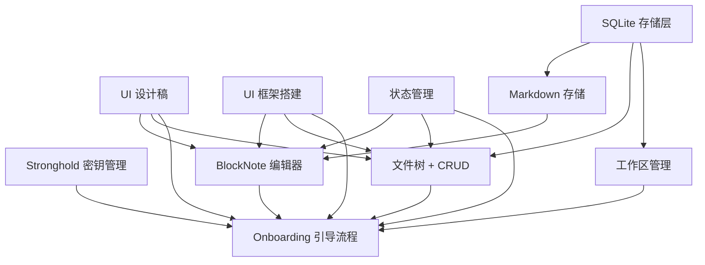

# v0.1.0 - 本地编辑基础版

> 搭建完整工程基础设施，实现本地笔记创建、编辑、存储的完整体验，为后续 P2P 同步做好准备。

## 目标

用户可以在桌面端打开 SwarmNote，通过引导流程创建工作区，使用 BlockNote 富文本编辑器撰写笔记，笔记以 Markdown 文件形式保存在本地文件系统中。同时完成设备身份、数据库、状态管理等工程基础设施搭建。

## 范围

### 包含

- **Onboarding 引导流程** — 首次启动引导用户创建工作区、设置设备名、生成设备身份
- **工作区管理** — 选择/创建工作区目录，初始化 `.swarmnote/` 配置
- **BlockNote 编辑器** — 集成 BlockNote 块编辑器，支持富文本编辑（标题、列表、代码块等）
- **文件树 + CRUD** — 侧边栏文件树展示，支持文件夹嵌套，新建/删除/重命名笔记和文件夹
- **Markdown 存储** — 笔记保存为 `.md` 文件，BlockNote ↔ Markdown 双向转换
- **SQLite 存储层** — Rust 端完整数据库 schema 建表，文档元数据索引
- **Stronghold 密钥管理** — 密码保护的 Ed25519 + X25519 密钥对生成与安全存储，PeerId 生成
- **UI 框架** — shadcn/ui + Tailwind 集成，暗色主题，侧边栏 + 编辑区布局
- **状态管理** — Zustand store 搭建，前后端数据流通路

### 不包含（推迟到后续版本）

- P2P 网络同步 — v0.2.0+，需先完成 swarm-p2p-core GossipSub 集成
- 跨网络同步 — v0.3.0+，DHT、NAT 穿透、Relay 中继
- E2E 加密 — v0.3.0+，内容加密与密钥分发
- 权限与分享 — v0.3.0+，角色管理、链接分享、设备配对
- 实时协作 — v0.2.0+，yjs Awareness 光标、多人实时编辑
- 外部编辑检测 — 后续版本，文件系统监听与自动重载

## 功能清单

### 依赖关系

| 层级 | 功能 | 可并行 |
|------|------|--------|
| L0（无依赖） | UI 设计稿、UI 框架搭建、状态管理、SQLite 存储层、Stronghold 密钥管理 | 全部可并行 |
| L1（依赖 L0） | Markdown 存储、BlockNote 编辑器、文件树 + CRUD、工作区管理 | 相互独立可并行 |
| L2（依赖 L0+L1） | Onboarding 引导流程 | 需等待大部分功能完成 |

### 功能清单

| 功能 | 优先级 | 依赖 | Feature 文档 | Issue |
|------|--------|------|-------------|-------|
| UI 设计稿 | P0 | - | [ui-design.md](features/ui-design.md) | #TODO |
| UI 框架搭建 | P0 | - | [ui-framework.md](features/ui-framework.md) | #TODO |
| 状态管理 | P0 | - | [state-management.md](features/state-management.md) | #TODO |
| SQLite 存储层 | P0 | - | [sqlite-storage.md](features/sqlite-storage.md) | #TODO |
| Stronghold 密钥管理 | P0 | - | [device-identity.md](features/device-identity.md) | #TODO |
| Markdown 存储 | P0 | SQLite | [markdown-storage.md](features/markdown-storage.md) | #TODO |
| BlockNote 编辑器 | P0 | UI 框架, 状态管理, Markdown 存储, UI 设计稿 | [blocknote-editor.md](features/blocknote-editor.md) | #TODO |
| 文件树 + CRUD | P0 | UI 框架, SQLite, 状态管理, UI 设计稿 | [file-tree.md](features/file-tree.md) | #TODO |
| 工作区管理 | P0 | SQLite | [workspace-management.md](features/workspace-management.md) | #TODO |
| Onboarding 引导流程 | P0 | UI 框架, 状态管理, Stronghold, 工作区管理, 编辑器, 文件树, UI 设计稿 | [onboarding.md](features/onboarding.md) | #TODO |

## 验收标准

- [ ] 首次启动展示 Onboarding 引导流程，用户可选择工作区目录并设置设备名
- [ ] 设备身份（Ed25519 密钥对 + PeerId）自动生成并通过 Stronghold 安全存储
- [ ] 侧边栏展示文件树，支持文件夹层级结构
- [ ] 可新建、删除、重命名笔记和文件夹
- [ ] BlockNote 编辑器可正常编辑富文本（标题、列表、代码块、引用等）
- [ ] 编辑内容自动保存为 `.md` 文件到工作区目录
- [ ] 重新打开应用后，之前的笔记内容完整恢复
- [ ] UI 采用暗色主题，布局流畅，交互响应及时
- [ ] 键盘快捷键可用（Ctrl+N 新建、Ctrl+S 保存等）
- [ ] 应用在 Windows 上稳定运行，不崩溃

## 技术选型

| 领域 | 选择 | 备注 |
|------|------|------|
| SQLite ORM | **sea-orm** | 全功能异步 ORM，基于 sqlx，类型安全 |
| 密钥存储 | **tauri-plugin-stronghold** | Tauri 官方插件，SwarmDrop 已验证 |
| Rust 架构 | **按功能分模块** | db/、identity/、workspace/ 等模块 |
| CSS 框架 | **Tailwind v4** | CSS-first 配置，最新版本 |
| 路由 | **TanStack Router** | 类型安全路由 |
| UI 组件 | **shadcn/ui（按需安装）** | 用到哪个装哪个 |
| 状态管理 | **Zustand** | persist 中间件 + tauri-plugin-store |
| 编辑器 | **BlockNote（纯，不含 yjs）** | v0.2.0 再集成 yjs |

## 依赖与风险

- **依赖**：
  - BlockNote npm 包及其 Markdown 导入/导出功能
  - Tauri v2 Stronghold 插件（`tauri-plugin-stronghold`）
  - sea-orm + sqlx-sqlite（Rust 异步 ORM）
  - shadcn/ui + Tailwind CSS v4 前端组件库
  - TanStack Router（前端路由）
  - tauri-plugin-store（前端状态持久化）

- **风险**：
  - BlockNote ↔ Markdown 转换有损（文字颜色、对齐等高级格式会丢失），需评估可接受范围
  - Stronghold 在 Windows 上的兼容性需实际验证
  - 全量 schema 建表可能引入暂时用不到的复杂度，但有利于后续版本平滑过渡
  - sea-orm 异步 ORM 在 Tauri 中的集成方式需验证（tokio runtime 共享）

## 时间线

- 开始日期：2026-03
- 目标发布日期：待定
- Milestone：[GitHub Milestone 链接待创建]
