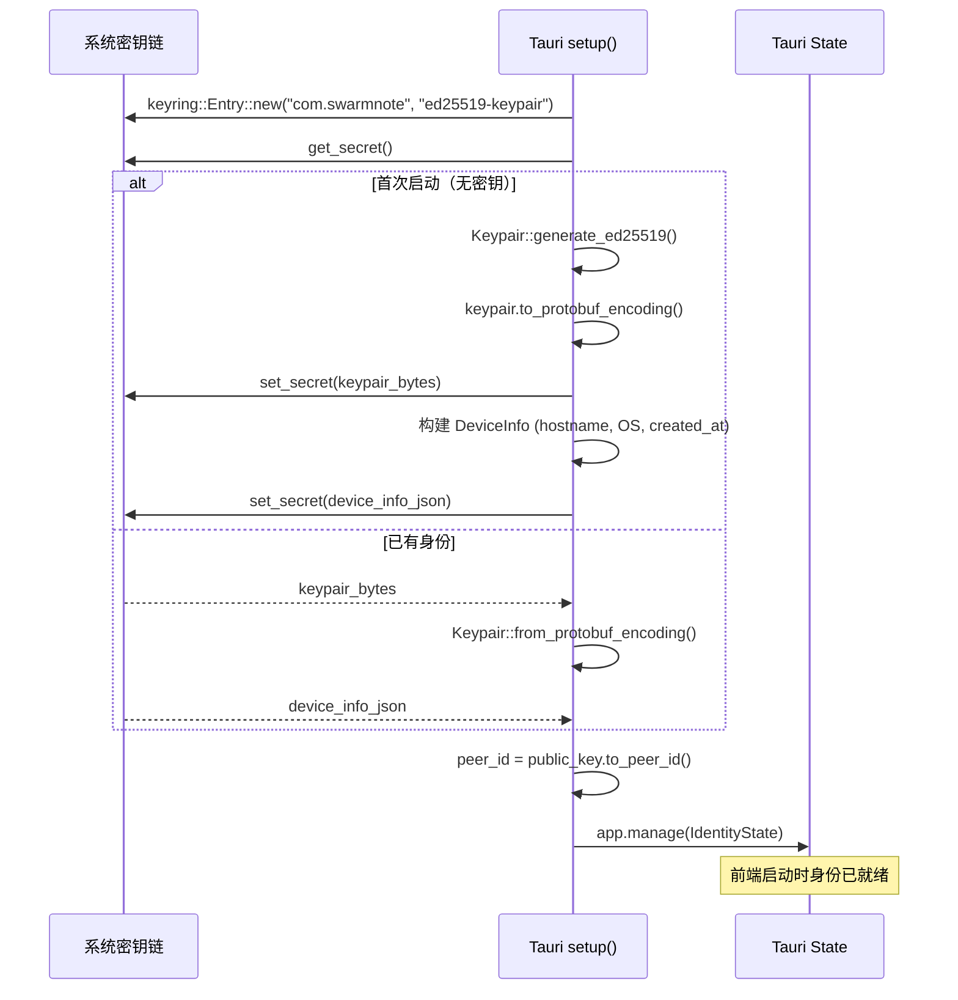

# 设备身份 - 技术设计

> 对应 Feature: [device-identity.md](../features/device-identity.md) | Issue: #5

## 设计决策

| 决策项 | 选择 | 备选方案 | 理由 |
|--------|------|----------|------|
| 密钥存储 | `keyring` crate 直存系统密钥链 | Stronghold 加密存储（SwarmDrop 方案） | Stronghold 已被 Tauri 标记为不再推荐（v3 将移除）；系统密钥链本身就是 OS 级加密存储，无需额外一层 |
| 密钥类型 | 仅 Ed25519 | Ed25519 + X25519 | YAGNI，X25519 推迟到 Phase 3 E2E 加密时再加 |
| 密钥链接入 | 直接依赖 `keyring` crate | `tauri-plugin-keyring` 插件 | 只在 Rust 后端 `setup()` 中使用，不需要前端 API，直接用 crate 更轻量 |
| 初始化时机 | Tauri `setup()` 阶段自动完成 | 前端 Onboarding 触发 | 前端启动时身份已就绪，简化前端逻辑 |
| API 粒度 | 简化为 2 个 command | 文档原设计 4 个 | 后端封装复杂度，前端无需管理"是否已有身份"状态 |

## 与 SwarmDrop 的差异

SwarmDrop 采用前端驱动 + Stronghold 模式。SwarmNote 改为后端驱动 + 系统密钥链直存：

```
SwarmDrop（三层）:                     SwarmNote（一层）:
┌────────────────────────┐             ┌────────────────────────┐
│ 生物识别/密码           │             │ setup():               │
│ → 解锁 Stronghold      │             │  keyring.get_secret()  │
├────────────────────────┤             │  ├─ 有? 加载 keypair   │
│ Stronghold vault       │             │  └─ 无? 生成并存入     │
│ → 存储 keypair         │             ├────────────────────────┤
├────────────────────────┤             │ 前端启动时身份已就绪    │
│ IPC 传输 keypair bytes │             │ 调 get_device_info()   │
│ → 注册到后端 State     │             └────────────────────────┘
└────────────────────────┘              密钥始终在 Rust 内存中
 密钥经过 IPC，需管理密码               无额外文件，无密码管理
```

## 架构设计

### 启动流程



### 模块结构

```
src-tauri/src/
├── identity/
│   ├── mod.rs          # 模块入口，init() 编排初始化，数据结构定义
│   ├── keychain.rs     # keyring 存取封装（仅 keypair）
│   ├── config.rs       # 本地配置文件存取（device_name, created_at）
│   └── commands.rs     # Tauri commands (get_device_info, set_device_name)
└── lib.rs              # setup() 中调用 identity::init()
```

### 存储布局

```text
系统密钥链 (keyring)
└── service: "com.swarmnote", key: "ed25519-keypair"   ← protobuf 编码的密钥对 (~68 bytes)

~/.swarmnote/
└── config.json   ← 非敏感设备配置 (device_name, created_at)
```

> 密钥链只存敏感数据（私钥）。设备名和创建时间存本地配置文件，OS 信息从系统 API 实时获取。

## Tauri Commands

### `get_device_info() -> DeviceInfo`

前端调用，获取当前设备身份信息。

```rust
#[tauri::command]
fn get_device_info(state: State<'_, IdentityState>) -> Result<DeviceInfo, AppError>
```

### `set_device_name(name: String)`

Onboarding 或设置页面中，用户自定义设备名称。更新 Tauri State 并持久化到 `~/.swarmnote/config.json`。

```rust
#[tauri::command]
fn set_device_name(name: String, state: State<'_, IdentityState>) -> Result<(), AppError>
```

## 数据结构

```rust
/// 运行时身份状态，存储在 Tauri State 中
struct IdentityState {
    keypair: Keypair,              // libp2p Ed25519 密钥对
    device_info: RwLock<DeviceInfo>,
}

/// 设备信息，可序列化返回给前端
#[derive(Serialize, Deserialize, Clone)]
struct DeviceInfo {
    peer_id: String,               // libp2p PeerId（从 Ed25519 公钥派生）
    device_name: String,           // 用户自定义设备名
    os: String,                    // 操作系统类型
    platform: String,              // 平台
    arch: String,                  // CPU 架构
    created_at: String,            // 身份创建时间 (ISO 8601)
}
```

## 依赖项

| Crate | 用途 |
|-------|------|
| `keyring` (v3.6, features: `apple-native`, `windows-native`, `sync-secret-service`) | 系统密钥链存取 |
| `libp2p-identity` | Ed25519 密钥对生成 + PeerId 派生 |

## 开放问题

- **密钥链不可用时的 fallback**：Linux 无桌面环境可能没有 Secret Service，是否 fallback 到基于文件的加密存储？
- **设备名默认值**：使用 hostname 还是生成友好名称（如 "My Windows PC"）？
