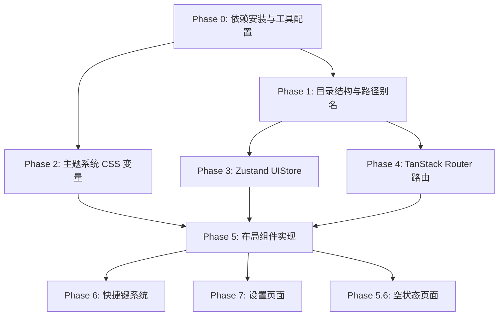

# UI 框架搭建 — 项目计划书

> 关联 Issue: #2 `ui: 框架搭建 (shadcn/ui + Tailwind v4 + 暗色主题)`
> 分支: `feature/ui-framework` (从 `develop` 分出)
> 设计稿: [`layout-design.pen`](./layout-design.pen)

## 目标

搭建 SwarmNote 前端 UI 基础设施，实现设计稿中的核心布局，为后续 feature（编辑器、文件树、Onboarding 等）提供可复用的 UI 骨架。

## 技术栈版本基线（2026-03 检查）

| 技术 | 版本 | 备注 |
|------|------|------|
| Tailwind CSS | v4.2.0 | CSS-first 配置，`@tailwindcss/vite` 插件 |
| shadcn/ui CLI | v4 (2026-03) | 统一 `radix-ui` 包，支持 `--preset` 初始化 |
| TanStack Router | v1.168.x | 支持 Vite 7/8，file-based routing |
| Zustand | v5.0.x | v5 移除了 `equalityFn`，persist 中间件行为微调 |
| lucide-react | v0.577.x | 树摇优化，1000+ 图标 |
| CVA + clsx + tailwind-merge | 仍为 shadcn 核心依赖 | 无变化 |

## 前置条件

- `develop` 分支已有 Tauri v2 + React 19 + Vite 7 基础项目
- 已有 `commands/identity.ts` Tauri 命令桥接层
- Biome lint + Lefthook + commitlint 工具链已就绪

## 决策记录

| 决策项 | 结论 |
|-------|------|
| 窗口标题栏 | 自定义 TitleBar，隐藏原生标题栏 |
| 路由方案 | TanStack Router (file-based routing) |
| 状态管理 | Zustand，本阶段仅 UIStore |
| 设置页面 | 实现基础设置页（主题切换 + 设备名称） |
| Ctrl+P 搜索 | 占位 UI（Command Palette 弹窗框架，不接搜索逻辑） |
| shadcn/ui 组件 | 基础套件 + scroll-area + 辅助组件 |

---

## Phase 0: 依赖安装与工具配置

### 0.1 安装核心依赖

```bash
# CSS 框架
pnpm add tailwindcss @tailwindcss/vite

# UI 组件库 (shadcn/ui CLI v4，使用统一 radix-ui 包)
# 注：shadcn/ui 通过 npx shadcn@latest init 初始化，不需要单独安装包

# 路由
pnpm add @tanstack/react-router
pnpm add -D @tanstack/router-devtools @tanstack/router-plugin

# 状态管理 (v5，移除了 equalityFn，persist 行为微调，对本项目无影响)
pnpm add zustand

# 工具库 (shadcn/ui 依赖)
pnpm add class-variance-authority clsx tailwind-merge lucide-react

# 字体
pnpm add @fontsource-variable/inter @fontsource-variable/jetbrains-mono
```

### 0.2 Tailwind v4 配置

- 在 `vite.config.ts` 中添加 `@tailwindcss/vite` 插件
- 创建 `src/app.css` 引入 `@import "tailwindcss"`
- 配置 CSS 变量：Indigo 主色调 + Slate 基础色 + Light/Dark 双主题

### 0.3 shadcn/ui 初始化

- 运行 `npx shadcn@latest init` 配置项目（CLI v4，2026-03）
- 确认 `components.json` 配置（路径别名 `@/`、CSS variables 模式）
- 新版 CLI 使用统一的 `radix-ui` 包替代多个 `@radix-ui/react-*` 包
- 可选：使用 `npx shadcn@latest init --preset [CODE]` 一键配置设计系统（颜色、主题、字体、圆角）
- 按需安装首批组件：

| 组件 | 用途 |
|------|------|
| `button` | 全局按钮 |
| `dialog` | 删除确认、设置弹窗等 |
| `input` | 搜索框、设备名输入 |
| `tooltip` | 按钮/图标提示 |
| `dropdown-menu` | 设置菜单、更多操作 |
| `scroll-area` | 侧边栏文件树滚动 |
| `separator` | 分隔线 |
| `badge` | 状态标记 |
| `avatar` | 设备头像 |
| `label` | 表单标签 |
| `switch` | 主题切换开关 |
| `command` | Ctrl+P 搜索弹窗 (Command Palette) |

### 0.4 TanStack Router 配置

- 在 `vite.config.ts` 中集成 `@tanstack/router-plugin` (Vite 插件)
- 使用 file-based routing：`src/routes/` 目录自动生成路由树
- 配置 `routeTree.gen.ts` 自动生成

### 0.5 字体集成

- **Inter** — UI 文本字体 (通过 `@fontsource-variable/inter`)
- **JetBrains Mono** — 代码块字体 (通过 `@fontsource-variable/jetbrains-mono`)
- 在 `app.css` 中设置为全局 font-family

### 0.6 Tauri 窗口配置

- 在 `src-tauri/tauri.conf.json` 中设置 `decorations: false` 隐藏原生标题栏
- 配置最小窗口尺寸约束

### 验收

- [ ] `pnpm dev` 正常启动，Tailwind 样式生效
- [ ] shadcn/ui 组件可正常导入使用
- [ ] TanStack Router 路由切换正常
- [ ] Zustand store 可正常创建和使用
- [ ] 原生标题栏已隐藏，窗口可拖拽

---

## Phase 1: 项目目录结构

### 1.1 前端目录规范

```
src/
├── main.tsx                    # 入口（保留 React.StrictMode）
├── app.css                     # 全局样式 + Tailwind + CSS 变量 + 字体
├── routeTree.gen.ts            # TanStack Router 自动生成（勿手动编辑）
├── commands/                   # Tauri 命令桥接层
│   └── identity.ts             # (已有)
├── components/                 # React 组件
│   ├── layout/                 # 布局组件
│   │   ├── AppLayout.tsx       # 顶层布局容器
│   │   ├── TitleBar.tsx        # 自定义标题栏
│   │   ├── Sidebar.tsx         # 可折叠侧边栏
│   │   ├── EditorPane.tsx      # 编辑区容器
│   │   ├── StatusBar.tsx       # 底部状态栏
│   │   └── EmptyState.tsx      # 空状态页面
│   └── ui/                     # shadcn/ui 组件（自动生成，勿手动编辑）
├── hooks/                      # 自定义 hooks
│   └── useKeyboardShortcuts.ts # 全局快捷键 hook
├── routes/                     # TanStack Router 文件路由
│   ├── __root.tsx              # 根路由（全局 provider + layout）
│   ├── index.tsx               # 主界面 `/`（AppLayout + EditorPane）
│   ├── onboarding.tsx          # Onboarding `/onboarding`（占位）
│   └── settings.tsx            # 设置 `/settings`（基础设置页）
├── stores/                     # Zustand stores
│   └── uiStore.ts              # UI 状态（sidebar、theme）
└── lib/                        # 工具函数
    └── utils.ts                # cn() 等 shadcn/ui 工具函数
```

### 1.2 路径别名

- `tsconfig.json` 中配置 `@/*` → `src/*`
- `vite.config.ts` 中配置对应 resolve alias

### 1.3 文件命名规范

- React 组件：PascalCase（`AppLayout.tsx`, `Sidebar.tsx`）
- hooks：camelCase 以 `use` 开头（`useKeyboardShortcuts.ts`）
- stores：camelCase（`uiStore.ts`）
- 工具函数：camelCase（`utils.ts`）
- shadcn/ui 组件保持其默认命名（kebab-case）

### 验收

- [ ] 目录结构创建完毕
- [ ] 路径别名 `@/` 在 import 中可用
- [ ] TypeScript 编译无报错

---

## Phase 2: 主题系统

### 2.1 CSS 变量定义

基于设计稿 `layout-design.pen` 的 shadcn 设计系统组件，提取完整 CSS 变量。设计稿使用 theme axis：`Mode: Light/Dark`、`Base: Slate`、`Accent: Indigo`。

**亮色主题 (默认)**

从设计稿变量中提取，包含但不限于：
- `--background`, `--foreground` — 页面背景/前景
- `--card`, `--card-foreground` — 卡片
- `--primary`, `--primary-foreground` — 主色（Indigo）
- `--secondary`, `--secondary-foreground` — 次要色
- `--muted`, `--muted-foreground` — 弱化色
- `--accent`, `--accent-foreground` — 强调色
- `--destructive`, `--destructive-foreground` — 危险色
- `--border`, `--input`, `--ring` — 边框/输入框/焦点环
- `--sidebar`, `--sidebar-border`, `--sidebar-accent`, `--sidebar-foreground` — 侧边栏专用
- `--popover`, `--popover-foreground` — 弹出层
- `--white` — 纯白色

**暗色主题 `.dark`**

同上变量名，切换为暗色值。

### 2.2 主题切换机制

- 通过 `<html>` 元素的 `class="dark"` 切换
- UIStore 中管理 `theme: 'light' | 'dark' | 'system'`
- `system` 模式通过 `window.matchMedia('(prefers-color-scheme: dark)')` 监听
- 持久化到 localStorage
- 页面加载时在 `<head>` 中内联脚本防止闪烁 (FOUC)

### 2.3 从设计稿提取变量

使用 Pencil MCP 的 `get_variables` 工具从 `layout-design.pen` 提取精确的颜色值，确保代码与设计稿 100% 一致。

### 验收

- [ ] 亮色主题下 Indigo 主色调视觉一致
- [ ] 暗色主题全局生效，所有 shadcn/ui 组件颜色正确
- [ ] 主题切换平滑无闪烁 (无 FOUC)
- [ ] 刷新后主题状态保持

---

## Phase 3: Zustand UIStore

### 3.1 Store 定义

```typescript
interface UIState {
  // 侧边栏
  sidebarOpen: boolean;
  toggleSidebar: () => void;
  setSidebarOpen: (open: boolean) => void;

  // 主题
  theme: 'light' | 'dark' | 'system';
  setTheme: (theme: 'light' | 'dark' | 'system') => void;
  resolvedTheme: 'light' | 'dark'; // 实际生效的主题
}
```

### 3.2 持久化

- 使用 `zustand/middleware` 的 `persist` 中间件
- 存储到 `localStorage`，key: `swarmnote-ui`
- 仅持久化 `sidebarOpen` 和 `theme`，不持久化计算值

### 3.3 主题副作用

- `theme` 变化时自动更新 `document.documentElement.classList`
- `system` 模式下监听 `prefers-color-scheme` 变化

### 验收

- [ ] sidebar 展开/折叠状态可控
- [ ] 主题切换状态持久化
- [ ] system 模式跟随系统变化
- [ ] 刷新后状态恢复

---

## Phase 4: 路由系统

### 4.1 路由结构

| 路径 | 组件 | 说明 |
|------|------|------|
| `/` | `MainPage` | 主界面（AppLayout: TitleBar + Sidebar + EditorPane） |
| `/onboarding` | `OnboardingPage` | 引导流程（占位，后续 #10 实现） |
| `/settings` | `SettingsPage` | 基础设置页（主题切换 + 设备名称） |

### 4.2 根路由 `__root.tsx`

- 提供全局 Provider（如有需要）
- 挂载 `useKeyboardShortcuts` hook
- 开发环境挂载 TanStack Router DevTools

### 4.3 路由守卫（占位）

- 在根路由的 `beforeLoad` 中预留 onboarding 完成检查
- 本阶段硬编码为已完成（`const isOnboarded = true`）
- 后续 #9 workspace 和 #10 onboarding 实现后替换为真实检查

### 验收

- [ ] `/` 显示主界面
- [ ] `/onboarding` 显示占位页面
- [ ] `/settings` 显示基础设置页
- [ ] 路由切换正常，无白屏

---

## Phase 5: 布局组件实现

### 5.1 AppLayout（根布局容器）

```
┌──────────────────────────────────────────────────┐
│  TitleBar (h=40px, 自定义标题栏)                   │
│  Logo + "笔记" | 搜索(Ctrl+P) + 设置 + 窗口按钮    │
├──────────────────────────────────────────────────┤
│          │                                       │
│ Sidebar  │  children (EditorPane/EmptyState)     │
│ (240px)  │  (flex-1)                             │
│  可折叠   │                                       │
│          │                                       │
└──────────────────────────────────────────────────┘
```

- 全屏高度 `h-screen`，垂直 flex 布局
- `overflow: hidden` 防止页面滚动
- TitleBar 固定 40px
- Body 区域 `flex-1` 水平 flex：Sidebar + 内容区

### 5.2 TitleBar（自定义标题栏）

参考设计稿 `Main - Light` (node: xHebR)：

- **左侧**：SwarmNote logo (lucide `pen-line` 图标) + "笔记" 文字
- **右侧**：
  - 搜索按钮/输入框占位 (触发 Command Palette)
  - 设置按钮 (lucide `settings` 图标，导航到 `/settings`)
  - 窗口操作按钮：最小化、最大化/还原、关闭
- 高度 40px
- 背景 `bg-card`，底部 `border-b`
- `data-tauri-drag-region` 实现窗口拖拽
- 窗口按钮使用 `@tauri-apps/api/window` 的 `appWindow.minimize()` / `maximize()` / `close()`

### 5.3 Sidebar（可折叠侧边栏）

参考设计稿 `Main - Light` (Sidebar 组件 node: PV1ln)：

- **宽度**：展开 256px（设计稿值），折叠 0px
- **动画**：CSS transition `width 200ms ease`
- **结构**：
  - 顶部区域：工作区名称 + 新建按钮（lucide `plus` 图标）
  - 中部区域：文件树占位（使用 `ScrollArea` 包裹）
    - 本阶段展示静态示例文件列表
    - 后续 #8 filetree 替换为真实文件树
  - 底部区域：设备信息（设备名 + PeerId 缩写 + 在线状态指示）
- **背景**：`bg-sidebar`，右侧 `border-r` (sidebar-border)
- **padding**：8px（设计稿值）
- **gap**：16px
- **切换按钮（新增）**：
  - Sidebar Header 右侧新增 `panel-left` 图标按钮（lucide），与新建文件/文件夹按钮并排
  - 按钮尺寸 24x24，圆角 4px，图标 14x14，颜色 `text-muted-foreground`
  - 点击调用 `uiStore.toggleSidebar()` 收起侧边栏
  - 参考设计稿 `Main - Light` / `Main - Dark` Sidebar Header 区域

### 5.3.1 侧边栏浮动展开按钮（新增）

参考设计稿 `Sidebar Collapsed - Light` (node: 5rAZh) / `Sidebar Collapsed - Dark` (node: Lwlpq)：

当侧边栏收起后，在编辑区左侧设置一个透明热区，鼠标悬浮时按钮淡入显示：

```text
默认状态（按钮不可见）：
┌──────────────────────────────────────────────┐
│ SwarmNote  笔记  |          🔍  ⚙  — □ ×    │
├──────────────────────────────────────────────┤
┃ │                                            │  ┃ = 12px 透明热区
┃ │  Editor Content (full width)               │
┃ │                                            │
└──────────────────────────────────────────────┘

鼠标进入热区后（hover 态，设计稿展示的状态）：
┌──────────────────────────────────────────────┐
│ SwarmNote  笔记  |          🔍  ⚙  — □ ×    │
├──────────────────────────────────────────────┤
┃[⊞]                                          │  按钮从热区顶部淡入
┃ │  Editor Content (full width)               │
┃ │                                            │
└──────────────────────────────────────────────┘
```

**热区规格**：
- 透明 div，宽 12px，全高，`left-0 top-0 bottom-0`，`z-10`
- 仅在 `sidebarOpen === false` 时渲染

**按钮规格**：
- **位置**：热区内，绝对定位 `top-3 left-0`（距顶部 12px）
- **尺寸**：32x32，圆角 8px
- **样式**：
  - 背景 `bg-card`，边框 `border`
  - 阴影 `shadow-sm`（`0 2px 8px rgba(0,0,0,0.1)`）
  - 图标 `panel-left`（lucide），16x16，颜色 `text-muted-foreground`
- **默认隐藏**：`opacity-0 -translate-x-1 scale-95`
- **hover 显示**：热区 hover 时 `opacity-100 translate-x-0 scale-100`
- **过渡**：`transition-all duration-200 ease-out`
- **消失延迟**：鼠标离开热区后 300ms 延迟再淡出（防闪烁）

**行为**：
- 仅在 `sidebarOpen === false` 时存在
- 点击调用 `uiStore.setSidebarOpen(true)` 展开侧边栏
- 展开后热区和按钮消失（侧边栏内已有收起按钮）

**触屏兼容**：
- `@media (hover: none)` 时按钮始终显示（Android 等触屏设备回退）

### 5.4 EditorPane（编辑区容器）

参考设计稿 `Main - Light` (Body node: ggRXJ)：

- `flex-1` 填充剩余宽度
- 垂直 flex 布局：内容区 + StatusBar
- **内容区**（flex-1）：
  - 本阶段展示占位内容或 EmptyState
  - 后续 #7 editor 替换为 BlockNote 编辑器
- **StatusBar** 固定在底部

### 5.5 StatusBar（底部状态栏）

参考设计稿 `Main - Light` 底部区域：

- 固定在 EditorPane 底部
- 高度约 28px
- 左侧：字数统计 + 字符统计（占位数据）
- 右侧：保存状态 + 最后保存时间（占位）
- 文字 `text-xs text-muted-foreground`
- 上方 `border-t` 分隔

### 5.6 EmptyState（空状态）

参考设计稿 `Empty State - Light` (node: Evnq3)：

- 居中显示在 EditorPane 内容区
- 结构：
  - 文件图标（lucide `file-text`，大尺寸）
  - 标题 "还没有笔记"
  - 描述文字 "创建你的第一篇笔记，开始记录你的想法"
  - "+ 新建笔记" 按钮（Primary 样式）
  - 快捷键提示 "或按 Ctrl+N 快速创建"
- 当无文档打开时显示

### 验收

- [ ] 布局与设计稿 `Main - Light` / `Main - Dark` 视觉一致
- [ ] 自定义标题栏：窗口拖拽正常，最小化/最大化/关闭按钮可用
- [ ] Sidebar 折叠/展开动画平滑（200ms transition）
- [ ] Sidebar Header 内 panel-left 按钮可点击收起侧边栏
- [ ] Sidebar 折叠后编辑区左上角显示浮动展开按钮
- [ ] 浮动按钮点击后展开侧边栏并消失
- [ ] Sidebar 折叠后内容区自适应填满
- [ ] 空状态与设计稿 `Empty State - Light` / `Empty State - Dark` 视觉一致
- [ ] 窗口缩放时布局自适应

---

## Phase 6: 快捷键系统

### 6.1 useKeyboardShortcuts Hook

全局挂载在 `__root.tsx`，监听键盘事件。

| 快捷键 | 功能 | 本阶段行为 |
|--------|------|-----------|
| Ctrl/⌘+B | 切换侧边栏 | 调用 `uiStore.toggleSidebar()` |
| Ctrl/⌘+N | 新建笔记 | 占位（console.log） |
| Ctrl/⌘+S | 手动保存 | 占位（console.log） |
| Ctrl/⌘+P | 快速搜索 | 打开 Command Palette 弹窗 |

### 6.2 平台适配

- 使用 `navigator.platform` 或 `navigator.userAgentData` 检测 macOS
- macOS 使用 `metaKey`（⌘），其他平台使用 `ctrlKey`
- 所有快捷键阻止浏览器默认行为（`e.preventDefault()`）

### 6.3 Command Palette（Ctrl+P 占位 UI）

- 使用 shadcn/ui 的 `Command` 组件
- 居中弹窗，带搜索输入框
- 本阶段内容为空或显示示例项
- 后续接入真实文件搜索逻辑

### 验收

- [ ] Ctrl+B 可切换侧边栏
- [ ] Ctrl+N / Ctrl+S 有响应（console.log）
- [ ] Ctrl+P 打开 Command Palette 弹窗
- [ ] macOS 下 ⌘ 键正常工作
- [ ] 快捷键不与浏览器默认行为冲突

---

## Phase 7: 设置页面

### 7.1 Settings 路由

路径：`/settings`

### 7.2 页面内容

基础设置页，包含：

- **外观设置**
  - 主题切换：Light / Dark / System（使用 Switch 或 Radio 组件）
  - 当前主题预览

- **设备设置**
  - 设备名称显示与修改（调用 `commands/identity.ts` 的 `setDeviceName()`）
  - PeerId 显示（只读）

- **返回按钮**
  - 导航回主界面 `/`

### 验收

- [ ] 设置页面可正常访问
- [ ] 主题切换实时生效
- [ ] 设备名称可修改

---

## 实施顺序与依赖关系



**推荐执行顺序**：P0 → P1 → P2 + P3 (并行) → P4 → P5 → P6 + P7 + P5.6 (并行)

## 预估工作量

| Phase | 内容 | 复杂度 |
|-------|------|--------|
| 0 | 依赖安装与配置 | 低 |
| 1 | 目录结构与别名 | 低 |
| 2 | 主题系统 | 中 |
| 3 | UIStore | 低 |
| 4 | 路由系统 | 中 |
| 5 | 布局组件 (5 个) | 高 |
| 6 | 快捷键系统 | 低 |
| 7 | 设置页面 | 中 |

## 与后续 Feature 的接口约定

本阶段为后续 feature 提供的接口和占位点：

| 后续 Feature | 本阶段提供 | 接口说明 |
|-------------|-----------|---------|
| #3 state (Zustand) | `stores/` 目录结构 | 后续添加 WorkspaceStore, FileTreeStore, EditorStore 等 |
| #7 editor (BlockNote) | `EditorPane` 组件的内容区 | 后续替换占位内容为 BlockNote 编辑器实例 |
| #8 filetree | `Sidebar` 中部文件树区域 | 后续替换静态示例为真实文件树组件 |
| #9 workspace | 路由守卫占位 | 后续替换 `isOnboarded = true` 为真实 workspace 检测 |
| #10 onboarding | `/onboarding` 路由 | 后续实现 4 步引导流程页面 |
| #3 state | `UIStore` 模式 | 后续 store 遵循相同的 Zustand + persist 模式 |

## Issue #2 验收标准对照

| 验收标准 | 覆盖 Phase |
|---------|-----------|
| shadcn/ui + Tailwind v4 正确集成 | Phase 0 |
| TanStack Router 集成，支持页面切换 | Phase 4 |
| 暗色主题全局生效，视觉一致 | Phase 2 |
| 侧边栏 + 编辑区布局正常 | Phase 5 |
| 侧边栏可折叠/展开（Ctrl+B） | Phase 5 + 6 |
| 状态栏展示区域就位 | Phase 5.5 |
| 基础快捷键框架可用 | Phase 6 |
| 窗口缩放时布局自适应 | Phase 5 |
