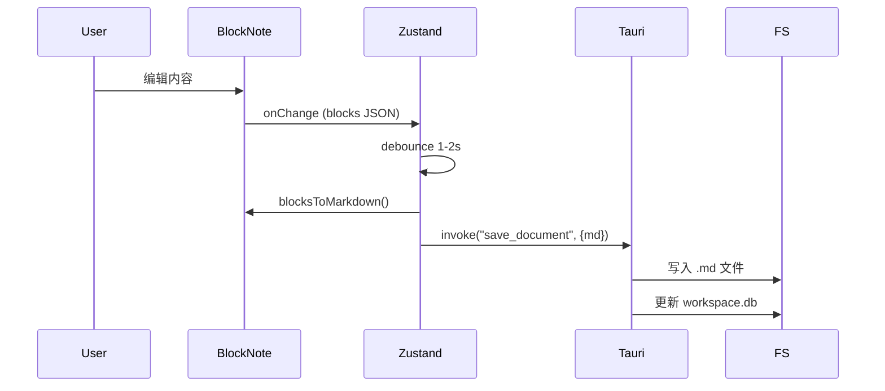

# BlockNote 编辑器

## 用户故事

作为用户，我希望使用类似 Notion 的块编辑器撰写笔记，以便获得直观的富文本编辑体验。

## 需求描述

集成 BlockNote 作为核心编辑器，提供块级编辑体验。v0.1.0 使用纯 BlockNote（不集成 yjs），编辑内容通过 Markdown 格式持久化。

## 交互设计

### 用户操作流程

1. 在文件树中点击笔记，编辑区加载该笔记内容
2. 直接在编辑器中输入和编辑
3. 支持 `/` 斜杠菜单插入不同类型的块
4. 内容自动保存（debounce 防抖）

### 关键页面 / 组件

- `NoteEditor` — 编辑器容器，加载/保存逻辑
- `EditorToolbar` — 可选的格式化工具栏
- 编辑器顶部：文档标题（可编辑，与文件名同步）

### 支持的块类型

- 段落（Paragraph）
- 标题（Heading 1-3）
- 无序列表（Bullet List）
- 有序列表（Numbered List）
- 待办事项（To-do / Checklist）
- 代码块（Code Block）
- 引用（Blockquote）
- 分割线（Divider）
- 图片（Image）— 存储在同名资源目录中

## 技术方案

### 前端

- `@blocknote/react` + `@blocknote/core` 依赖
- `useCreateBlockNote()` hook 创建编辑器实例
- `BlockNoteView` 组件渲染编辑器
- 暗色主题：BlockNote 原生支持 `theme="dark"`
- 自动保存：`onChange` 回调 + debounce（1-2 秒）触发保存
- 图片处理：通过 BlockNote 的 `uploadFile` 配置，将图片复制到同名资源目录

### 后端

- `#[tauri::command] fn save_document(id, content_md)` — 将 Markdown 内容写入 .md 文件，更新数据库元数据
- `#[tauri::command] fn load_document(id)` — 读取 .md 文件内容，返回给前端
- `#[tauri::command] fn save_image(doc_id, image_data, filename)` — 保存图片到资源目录

### 数据流

## 验收标准

- [ ] BlockNote 编辑器正常渲染，暗色主题生效
- [ ] 支持所有列出的块类型
- [ ] `/` 斜杠菜单正常工作
- [ ] 编辑后自动保存（1-2 秒 debounce）
- [ ] 关闭笔记后重新打开，内容完整恢复
- [ ] 文档标题可编辑，与文件名保持同步
- [ ] 图片可插入并保存到同名资源目录

## 任务拆分建议

> 此部分可留空，由 /project plan 自动拆分为 GitHub Issues。

## 开放问题

- BlockNote ↔ Markdown 转换的有损性如何处理？
  - 不支持的格式（文字颜色等）转换时丢失是可接受的
- 是否需要 Markdown 源码编辑模式？
  - v0.1.0 暂不需要，后续可作为高级功能
