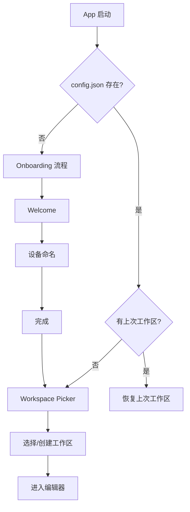

# Onboarding 引导流程

## 用户故事

作为首次使用 SwarmNote 的用户，我希望通过简单的引导流程完成设备初始化，以便快速开始使用。

## 需求描述

首次启动应用时（无 `~/.swarmnote/config.json`），展示多步骤引导流程，帮助用户完成设备命名和身份确认。工作区选择由独立的 Workspace Picker 负责（v0.2.0 #22），Onboarding 只关注设备级初始化。

后续启动检测到已有配置时跳过 Onboarding，直接进入 Workspace Picker 或恢复上次工作区。

## 交互设计

### 简化后的 3 步流程

1. **Step 1 - 欢迎页**：展示 SwarmNote Logo 和核心卖点（多端协作、安全加密、P2P 同步），"开始使用" 按钮
2. **Step 2 - 设备名称**：输入设备名称（默认取系统主机名），用于 P2P 设备识别。说明文案："为你的设备取个名字，方便识别"
3. **Step 3 - 完成**：展示设备身份摘要（设备名、PeerId 前 8 位），"进入 SwarmNote" 按钮 → 跳转到 Workspace Picker

> **与 v0.1.0 原始设计的差异**：原设计有 4 步（含选择工作区），现简化为 3 步。工作区选择从 Onboarding 中移出，由 Workspace Picker 统一处理，支持多工作区场景。

### 关键页面 / 组件

- `OnboardingWelcome` — 欢迎页
- `OnboardingDeviceName` — 设备名输入页
- `OnboardingComplete` — 完成页（设备摘要）
- `OnboardingStepper` — 步骤指示器组件（3 步）

### 设计稿

参考 `milestones/v0.1.0/design/layout-design.pen` 中 Onboarding 1/3/4 页面（Onboarding 2 Workspace 已删除）。

## 技术方案

### 前端

- 使用已有的 `onboardingStore`（Zustand）管理步骤状态
- 步骤间滑动/淡入动画过渡
- 完成后将 `isCompleted` 持久化到 tauri-plugin-store
- 完成后跳转到 Workspace Picker

### 后端

- 复用已有的 `identity::init()`（setup 阶段自动完成密钥生成）
- 复用已有的 `set_device_name` command
- 复用已有的 `get_device_info` command（获取 PeerId）
- 无需新增 Rust command

### 启动流程

## 验收标准

- [ ] 首次启动显示 3 步引导流程
- [ ] 非首次启动跳过 Onboarding
- [ ] 设备名称默认填充系统主机名，用户可修改
- [ ] 完成页展示设备名、PeerId 摘要
- [ ] 完成后跳转到 Workspace Picker
- [ ] 步骤间有流畅的过渡动画

## 开放问题

- Onboarding 完成状态存储在 tauri-plugin-store（`settings.json` 的 `isCompleted` 字段），已由 `onboardingStore` 实现
