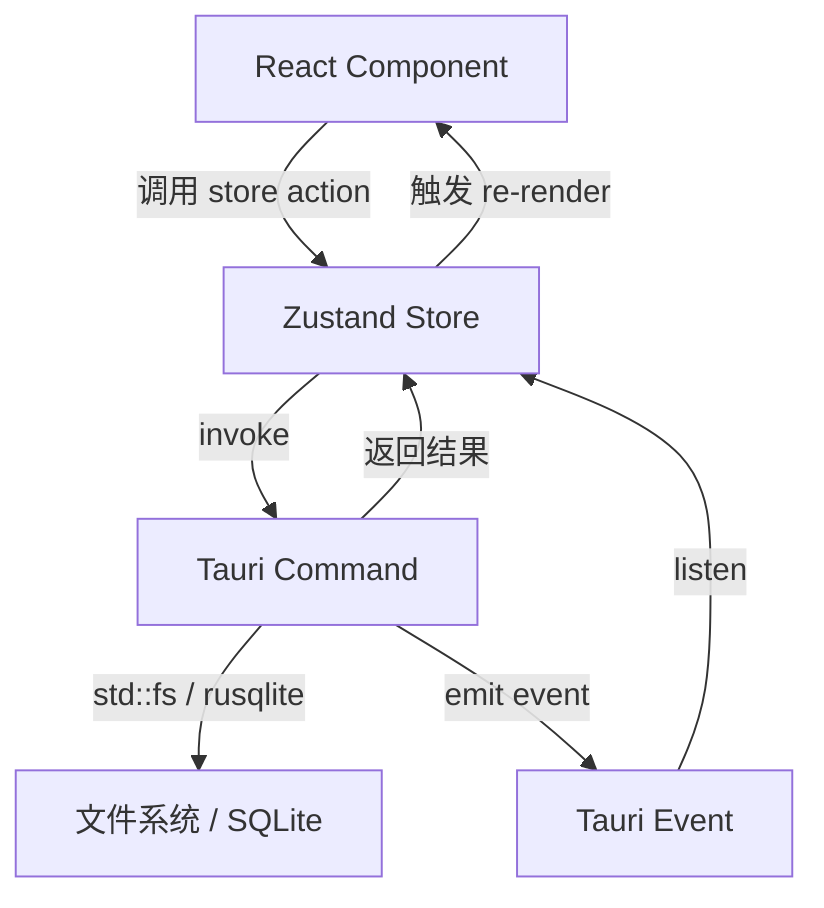

# 状态管理

## 用户故事

作为开发者，我需要一个清晰的状态管理架构，以便前后端数据流通顺畅，UI 响应及时。

## 需求描述

使用 Zustand 搭建前端状态管理，定义核心 stores，建立前端与 Tauri 后端的数据流通路。

## 技术方案

### Store 架构

```typescript
// 工作区 Store
interface WorkspaceStore {
  workspace: WorkspaceInfo | null;
  isLoading: boolean;
  openWorkspace: (path: string) => Promise<void>;
  initWorkspace: (path: string, deviceName: string) => Promise<void>;
}

// 文件树 Store
interface FileTreeStore {
  tree: FileTreeNode[];
  selectedFile: string | null;  // 当前选中的文件路径
  expandedFolders: Set<string>;
  loadTree: () => Promise<void>;
  selectFile: (path: string) => void;
  toggleFolder: (path: string) => void;
  createDocument: (parentPath: string, title: string) => Promise<void>;
  createFolder: (parentPath: string, name: string) => Promise<void>;
  deleteItem: (path: string) => Promise<void>;
  renameItem: (path: string, newName: string) => Promise<void>;
}

// 编辑器 Store
interface EditorStore {
  currentDocId: string | null;
  content: string;  // Markdown 内容
  isDirty: boolean;
  lastSavedAt: Date | null;
  wordCount: number;
  loadDocument: (id: string) => Promise<void>;
  saveDocument: () => Promise<void>;
  updateContent: (md: string) => void;
}

// Onboarding Store
interface OnboardingStore {
  isCompleted: boolean;
  currentStep: number;
  workspacePath: string;
  deviceName: string;
  checkStatus: () => Promise<void>;
  nextStep: () => void;
  prevStep: () => void;
  complete: () => Promise<void>;
}

// UI Store
interface UIStore {
  sidebarOpen: boolean;
  toggleSidebar: () => void;
}
```

### 前端

- 每个 store 使用 `create()` 独立创建
- 异步操作通过 `invoke()` 调用 Tauri commands
- Store 之间通过 React 组件层连接（避免 store 间直接依赖）
- 持久化：`zustand/middleware` 的 `persist` 中间件 + `tauri-plugin-store` 作为存储后端（存文件系统，比 localStorage 更可靠）
- 路由：使用 TanStack Router 管理页面切换（onboarding / main / settings）

### 前后端数据流



## 验收标准

- [ ] 所有 Zustand stores 正常工作
- [ ] 前端通过 invoke 调用 Rust commands 数据正确传递
- [ ] 状态变化即时反映到 UI
- [ ] 刷新/重启后持久化数据正确恢复
- [ ] 无不必要的 re-render

## 任务拆分建议

> 此部分可留空，由 /project plan 自动拆分为 GitHub Issues。

## 开放问题

- 暂无
