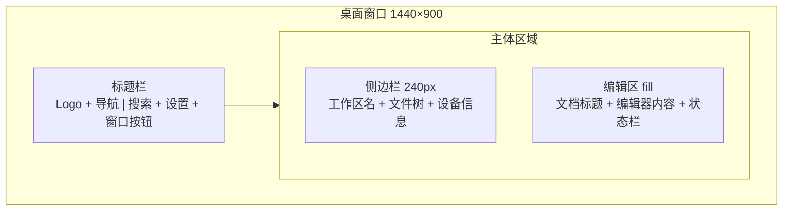

# UI 框架搭建

## 用户故事

作为用户，我希望看到一个美观、现代的界面，以便获得愉悦的笔记使用体验。

## 需求描述

搭建前端 UI 基础设施：集成 shadcn/ui 组件库 + Tailwind CSS v4，实现靛蓝主色调的亮色/暗色双主题，搭建标题栏 + 侧边栏 + 编辑区的两栏桌面布局。设计稿参考 [`design/layout-design.pen`](../design/layout-design.pen)。

## 交互设计

### 整体布局

- **标题栏**（40px）：左侧 Logo + "笔记" 导航，右侧搜索框 (Ctrl+P) + 设置按钮 + 窗口操作按钮（最小化/最大化/关闭）
- **侧边栏**（240px）：顶部工作区名 + 新建文件/文件夹按钮，中间文件树，底部设备信息（设备名 + PeerId 缩写）
- **编辑区**（fill）：无工具栏沉浸式设计，文档标题直接在编辑区内，底部状态栏显示字数 + 字符数 + 保存状态
- **无右侧面板**：两栏布局

### 设计风格

- **主色调**：靛蓝 Indigo #4F46E5（亮色）/ #818CF8（暗色）
- **基础色**：Slate 系列，通过 CSS 变量自动切换亮暗
- **主题**：亮色为默认，支持暗色主题切换（参考 Linear / Notion 风格）
- **字体**：Inter（UI）+ JetBrains Mono（代码块）
- **组件**：使用 shadcn/ui 提供的 Button、Dialog、Input、ContextMenu、Tooltip 等

### 响应式

- 仅桌面端，不做移动端适配
- 侧边栏可折叠/展开（Ctrl+B 快捷键）
- 编辑区自适应宽度
- 最小窗口尺寸约束

## 技术方案

### 前端

- **Tailwind CSS v4** — 集成到 Vite + React 项目
- **shadcn/ui** — 按需安装组件（不全量安装）
- **布局组件**：
  - `AppLayout` — 顶层布局（标题栏 + 主体）
  - `Sidebar` — 可折叠侧边栏
  - `EditorPane` — 编辑区
  - `StatusBar` — 底部状态栏
- **主题**：通过 CSS 变量实现亮色/暗色切换（亮色为默认），靛蓝 Indigo 主色调

### 关键快捷键

| 快捷键 | 功能 |
|--------|------|
| Ctrl+N | 新建笔记 |
| Ctrl+S | 手动保存（虽然有自动保存） |
| Ctrl+B | 切换侧边栏 |
| Ctrl+P | 快速搜索（P1，可推迟） |

## 验收标准

- [ ] shadcn/ui + Tailwind 正确集成
- [ ] 亮色/暗色主题全局生效，靛蓝主色调视觉一致
- [ ] 侧边栏 + 编辑区布局正常
- [ ] 侧边栏可折叠/展开
- [ ] 状态栏展示字数和保存时间
- [ ] 基础快捷键可用（Ctrl+N, Ctrl+S, Ctrl+B）
- [ ] 窗口缩放时布局自适应

## 任务拆分建议

> 此部分可留空，由 /project plan 自动拆分为 GitHub Issues。

## 开放问题

- ~~Tailwind v3 还是 v4？~~ **已决定：Tailwind v4**
- ~~是否需要 v0.1.0 就支持亮色主题切换？~~ **已决定：亮色为默认，亮色+暗色双主题都实现**
- ~~主色调用什么？~~ **已决定：靛蓝 Indigo #4F46E5**
- ~~是否需要右侧面板？~~ **已决定：不需要，两栏布局**
- ~~是否做移动端？~~ **已决定：v0.1.0 只做桌面端**
