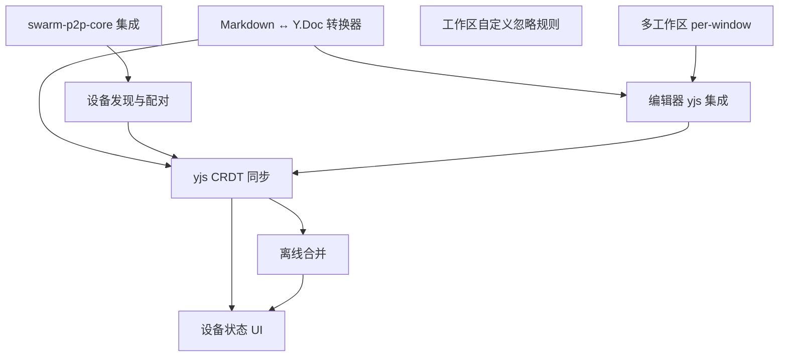

# v0.2.0 - P2P 笔记同步

> 多台设备通过 P2P 网络发现、配对并同步笔记，支持局域网和跨网络场景，离线编辑后重连自动合并，数据始终以 Markdown 文件为主存储。

## 目标

用户可以在多台电脑上运行 SwarmNote，设备自动发现（局域网 mDNS + 跨网络 DHT）并建立 P2P 连接。配对确认后，编辑笔记秒级同步到其他设备，离线编辑后重连自动合并无冲突。支持 NAT 穿透和 Relay 中继，跨网络也能同步。笔记仍以 `.md` 文件形式保存在本地，yjs 仅作为同步层。

加密方面，v0.2.0 依赖 libp2p Noise 协议提供传输层加密（每次连接自动协商会话密钥），内容层 E2E 加密和权限体系推迟到 v0.3.0。

## 范围

### 包含

- **swarm-p2p-core 集成** — 全量引入 P2P 网络库（mDNS + DHT + NAT 穿透 + Relay），定义笔记同步协议消息
- **设备发现与配对** — mDNS 局域网发现 + DHT 跨网络发现，Direct/Code 两种配对方式，配对是同步的前提条件
- **Markdown ↔ Y.Doc 转换器** — Rust 端（yrs）实现 Markdown 与 BlockNote Y.Doc XML 的双向转换，使后端能独立导入/导出 .md 文件
- **编辑器 yjs 集成** — BlockNote + yjs 协作层，Rust 端透传 yjs 二进制
- **yjs CRDT 同步** — 全量同步（state_vector 交换）+ GossipSub 增量广播
- **离线合并** — 重连后自动全量同步，CRDT 无冲突合并
- **设备状态 UI** — 已连接设备数、同步状态指示（已同步/同步中/离线待同步）
- **多工作区 per-window**（#22）— 后端状态管理从全局单例改为 per-window HashMap
- **工作区自定义忽略规则** — 引入 `ignore` crate gitignore 模块，支持 `.swarmnote-ignore` 自定义过滤，集中 scan/watcher 重复过滤逻辑

### 不包含（推迟到后续版本）

- E2E 内容加密 — v0.3.0
- 权限体系 — v0.3.0
- 文档分享 — v0.3.0
- 密钥轮换与权限撤销 — v0.3.0
- 实时协作光标（yjs Awareness）— v0.3.0+
- 移动端支持 — v0.5.0+

> **v0.3.0 备忘**（基于本次讨论，详见 `dev-notes/design/`）：
>
> - **加密架构**：三层模型——传输层 Noise（v0.2.0 已有）+ 内容层 XChaCha20-Poly1305（工作区 master_key，HKDF 派生文档密钥）+ 静态存储加密（可选）
> - **密钥管理**：工作区创建时生成 master_key，配对时用 X25519 公钥加密后分发（Lockbox 机制），取消配对时轮换 master_key（key_version + 1），前向安全
> - **权限体系**：Owner/Editor/Reader 三级角色，密码学执行（read_key / write_key / admin_key），权限 Workspace → Folder → Document 向下继承可覆盖
> - **文档分享**：配对分享（P2P 加密通道直传密钥）+ 链接分享（`swarmnote://invite/<token>#<secret>`，DHT 存加密包，fragment 存密钥，支持密码保护/有效期/使用次数）
> - **协作者邀请**：已配对设备选择资源+角色直接授权；未配对用户通过邀请链接加入

## 功能清单

### 依赖关系

| 层级 | 功能 | 可并行 |
|------|------|--------|
| L0（无依赖） | **多工作区 per-window**、swarm-p2p-core 集成、工作区自定义忽略规则、**Markdown ↔ Y.Doc 转换器** | 全部可并行 |
| L1（依赖 L0） | 设备发现与配对（依赖 p2p-core）、编辑器 yjs 集成（依赖多工作区 + 转换器） | 可并行 |
| L2（依赖 L1） | yjs CRDT 同步（依赖设备配对 + 编辑器 yjs + 转换器） | - |
| L3（依赖 L2） | 离线合并、设备状态 UI | 离线合并依赖 CRDT |

### 功能清单

| 功能 | 优先级 | 依赖 | Feature 文档 | Issue |
|------|--------|------|-------------|-------|
| **多工作区 per-window** | **P0** | **-** | [multi-workspace-window.md](features/multi-workspace-window.md) | [#22](https://github.com/yexiyue/SwarmNote/issues/22) |
| swarm-p2p-core 集成 | P0 | - | [p2p-core-integration.md](features/p2p-core-integration.md) | [#24](https://github.com/yexiyue/SwarmNote/issues/24) |
| Markdown ↔ Y.Doc 转换器 | P0 | - | [markdown-yrs-converter.md](features/markdown-yrs-converter.md) | [#37](https://github.com/yexiyue/SwarmNote/issues/37) |
| 设备发现与配对 | P0 | p2p-core | [device-pairing.md](features/device-pairing.md) | [#26](https://github.com/yexiyue/SwarmNote/issues/26) |
| 编辑器 yjs 集成 | P0 | 多工作区, 转换器 | [yjs-editor.md](features/yjs-editor.md) | [#27](https://github.com/yexiyue/SwarmNote/issues/27) |
| yjs CRDT 同步 | P0 | 设备配对, 编辑器 yjs, 转换器 | [crdt-sync.md](features/crdt-sync.md) | [#28](https://github.com/yexiyue/SwarmNote/issues/28) |
| 离线合并 | P0 | yjs CRDT 同步 | [offline-merge.md](features/offline-merge.md) | [#29](https://github.com/yexiyue/SwarmNote/issues/29) |
| 设备状态 UI | P1 | yjs CRDT 同步, 离线合并 | [device-status-ui.md](features/device-status-ui.md) | [#30](https://github.com/yexiyue/SwarmNote/issues/30) |
| v0.2.0 UI 设计 | P1 | 设备配对, 设备状态 UI | [ui-design.md](features/ui-design.md) | [#31](https://github.com/yexiyue/SwarmNote/issues/31) |
| 工作区自定义忽略规则 | P2 | - | [workspace-ignore-filter.md](features/workspace-ignore-filter.md) | [#25](https://github.com/yexiyue/SwarmNote/issues/25) |

## 验收标准

- [ ] 两台电脑在同一局域网内启动 SwarmNote，mDNS 自动发现对方
- [ ] 未配对设备显示在"附近设备"列表，可发起配对
- [ ] Direct 配对和 Code 配对均可正常完成，双方存储信任关系
- [ ] 未配对设备无法同步笔记
- [ ] 局域网内 A 设备编辑笔记后，B 设备秒级看到更新（< 500ms）
- [ ] 跨网络场景（NAT 穿透或 Relay 中继）下两台设备能配对并同步
- [ ] 关闭 B 设备 → A 继续编辑 → 重开 B → B 自动追上所有离线期间的编辑
- [ ] 两台设备同时编辑同一笔记，CRDT 自动合并无冲突
- [ ] 笔记始终以 `.md` 文件形式保存在工作区目录中
- [ ] yjs state 在 SQLite 中持久化，支持全量同步时的 state_vector 交换
- [ ] 状态栏展示已连接设备数和同步状态
- [ ] 后端支持 per-window 工作区状态管理，多窗口互不干扰
- [ ] `cargo clippy -- -D warnings` 无警告
- [ ] `pnpm lint:ci` 通过

## 技术选型

| 领域     | 选择                    | 备注                                      |
| ------ | --------------------- | --------------------------------------- |
| P2P 网络 | **swarm-p2p-core**    | 自有库，已集成 GossipSub、mDNS、Request-Response |
| CRDT   | **yjs**               | 前端 Y.Doc，Rust 端透传二进制 blob               |
| 编辑器协作  | **BlockNote + yjs**   | BlockNote 内置 yjs 一等支持                   |
| 增量同步   | **GossipSub pub/sub** | swarm-p2p-core 已有支持                     |
| 全量同步   | **Request-Response**  | state_vector 交换 + missing updates       |
| 存储模型   | **MD 主 + yjs 同步层**    | .md 文件为真实数据源，yjs 仅在同步时使用                |

## 依赖与风险

- **依赖**：
  - swarm-p2p-core（git submodule，GossipSub 已就绪）
  - BlockNote yjs 协作插件（`@blocknote/core` 内置支持）
  - yjs npm 包（Y.Doc、编码/解码工具）

- **风险**：
  - **yjs + BlockNote + Rust 透传衔接**：BlockNote 内置 yjs 支持，但 yjs updates 需要通过 Tauri IPC 传递给 Rust 端进行存储和网络转发，二进制序列化/反序列化链路需验证
  - **MD ↔ yjs 双向转换一致性**：同一份文档经过 MD → BlockNote → Y.Doc → BlockNote → MD 多次转换后，格式是否会漂移或丢失内容
  - **GossipSub 局域网稳定性**：多设备（3+）场景下的消息投递可靠性和顺序保证

## 时间线

- 开始日期：v0.1.0 发布后
- 目标发布日期：待定
- Milestone：[v0.2.0](https://github.com/yexiyue/SwarmNote/milestone/2)
