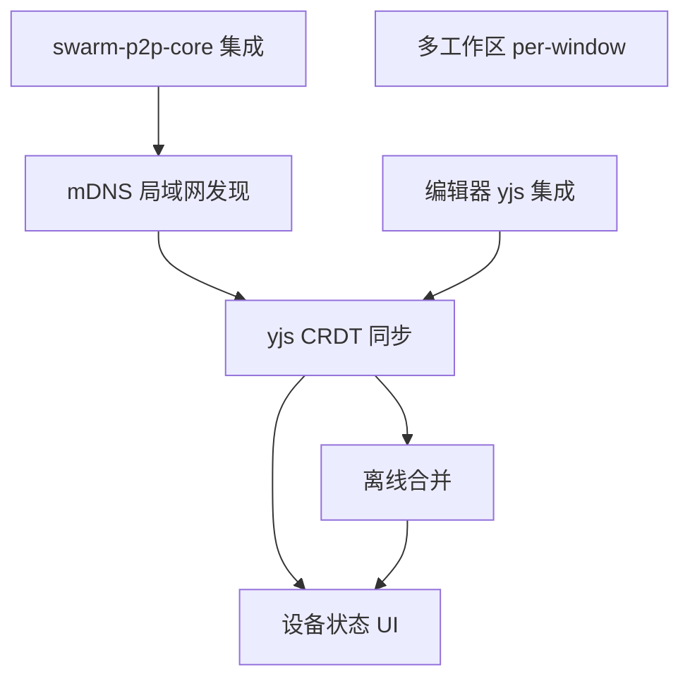

# v0.2.0 - 局域网 P2P 同步

> 两台设备在局域网内自动发现、同步笔记，离线编辑后重连自动合并，数据始终以 Markdown 文件为主存储。

## 目标

用户可以在多台电脑上运行 SwarmNote，局域网内设备自动发现并建立 P2P 连接。编辑笔记后秒级同步到其他设备，离线编辑后重连自动合并无冲突。笔记仍以 `.md` 文件形式保存在本地，yjs 仅作为同步层。

## 范围

### 包含

- **swarm-p2p-core 集成** — 引入 P2P 网络库，定义笔记同步协议消息（SyncRequest/SyncResponse）
- **mDNS 局域网发现** — 自动发现同局域网内的 SwarmNote 设备
- **编辑器 yjs 集成** — BlockNote + yjs 协作层，Rust 端透传 yjs 二进制
- **yjs CRDT 同步** — 全量同步（state_vector 交换）+ GossipSub 增量广播
- **离线合并** — 重连后自动全量同步，CRDT 无冲突合并
- **设备状态 UI** — 已连接设备数、同步状态指示（已同步/同步中/离线待同步）
- **多工作区 per-window**（#22）— 后端状态管理从全局单例改为 per-window HashMap

### 不包含（推迟到后续版本）

- 跨网络同步（DHT、NAT 穿透、Relay 中继）— v0.3.0+
- E2E 加密（内容加密与密钥分发）— v0.3.0+
- 实时协作光标（yjs Awareness）— v0.3.0+
- 设备管理面板（配对、信任列表）— v0.3.0+
- 文档分享与权限管理 — v0.3.0+
- 移动端支持 — v0.5.0+

## 功能清单

### 依赖关系

| 层级 | 功能 | 可并行 |
|------|------|--------|
| L0（无依赖） | swarm-p2p-core 集成、多工作区 per-window、编辑器 yjs 集成 | 全部可并行 |
| L1（依赖 L0） | mDNS 局域网发现 | - |
| L2（依赖 L0+L1） | yjs CRDT 同步、离线合并 | 离线合并依赖 CRDT |
| L3（依赖 L2） | 设备状态 UI | - |

### 功能清单

| 功能 | 优先级 | 依赖 | Feature 文档 | Issue |
|------|--------|------|-------------|-------|
| swarm-p2p-core 集成 | P0 | - | [p2p-core-integration.md](features/p2p-core-integration.md) | #TODO |
| mDNS 局域网发现 | P0 | swarm-p2p-core 集成 | [mdns-discovery.md](features/mdns-discovery.md) | #TODO |
| 编辑器 yjs 集成 | P0 | - | [yjs-editor.md](features/yjs-editor.md) | #TODO |
| yjs CRDT 同步 | P0 | mDNS, 编辑器 yjs | [crdt-sync.md](features/crdt-sync.md) | #TODO |
| 离线合并 | P0 | yjs CRDT 同步 | [offline-merge.md](features/offline-merge.md) | #TODO |
| 设备状态 UI | P1 | yjs CRDT 同步, 离线合并 | [device-status-ui.md](features/device-status-ui.md) | #TODO |
| 多工作区 per-window | P1 | - | [multi-workspace-window.md](features/multi-workspace-window.md) | [#22](https://github.com/yexiyue/SwarmNote/issues/22) |

## 验收标准

- [ ] 两台电脑在同一局域网内启动 SwarmNote，自动发现对方
- [ ] A 设备编辑笔记后，B 设备秒级看到更新（< 500ms 局域网延迟）
- [ ] 关闭 B 设备 → A 继续编辑 → 重开 B → B 自动追上所有离线期间的编辑
- [ ] 两台设备同时编辑同一笔记，CRDT 自动合并无冲突
- [ ] 笔记始终以 `.md` 文件形式保存在工作区目录中
- [ ] yjs state 在 SQLite 中持久化，支持全量同步时的 state_vector 交换
- [ ] 状态栏展示已连接设备数和同步状态
- [ ] 后端支持 per-window 工作区状态管理，多窗口互不干扰
- [ ] `cargo clippy -- -D warnings` 无警告
- [ ] `pnpm lint:ci` 通过

## 技术选型

| 领域 | 选择 | 备注 |
|------|------|------|
| P2P 网络 | **swarm-p2p-core** | 自有库，已集成 GossipSub、mDNS、Request-Response |
| CRDT | **yjs** | 前端 Y.Doc，Rust 端透传二进制 blob |
| 编辑器协作 | **BlockNote + yjs** | BlockNote 内置 yjs 一等支持 |
| 增量同步 | **GossipSub pub/sub** | swarm-p2p-core 已有支持 |
| 全量同步 | **Request-Response** | state_vector 交换 + missing updates |
| 存储模型 | **MD 主 + yjs 同步层** | .md 文件为真实数据源，yjs 仅在同步时使用 |

## 依赖与风险

- **依赖**：
  - swarm-p2p-core（git submodule，GossipSub 已就绪）
  - BlockNote yjs 协作插件（`@blocknote/core` 内置支持）
  - yjs npm 包（Y.Doc、编码/解码工具）

- **风险**：
  - **yjs + BlockNote + Rust 透传衔接**：BlockNote 内置 yjs 支持，但 yjs updates 需要通过 Tauri IPC 传递给 Rust 端进行存储和网络转发，二进制序列化/反序列化链路需验证
  - **MD ↔ yjs 双向转换一致性**：同一份文档经过 MD → BlockNote → Y.Doc → BlockNote → MD 多次转换后，格式是否会漂移或丢失内容
  - **GossipSub 局域网稳定性**：多设备（3+）场景下的消息投递可靠性和顺序保证

## 时间线

- 开始日期：v0.1.0 发布后
- 目标发布日期：待定
- Milestone：[v0.2.0](https://github.com/yexiyue/SwarmNote/milestone/2)
