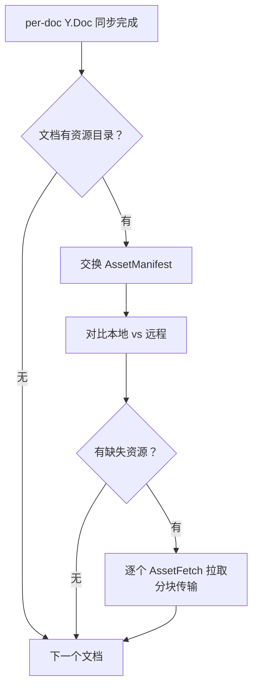
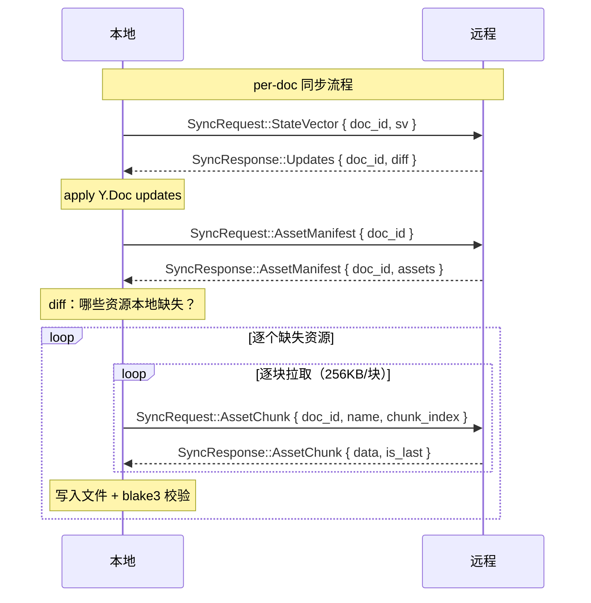
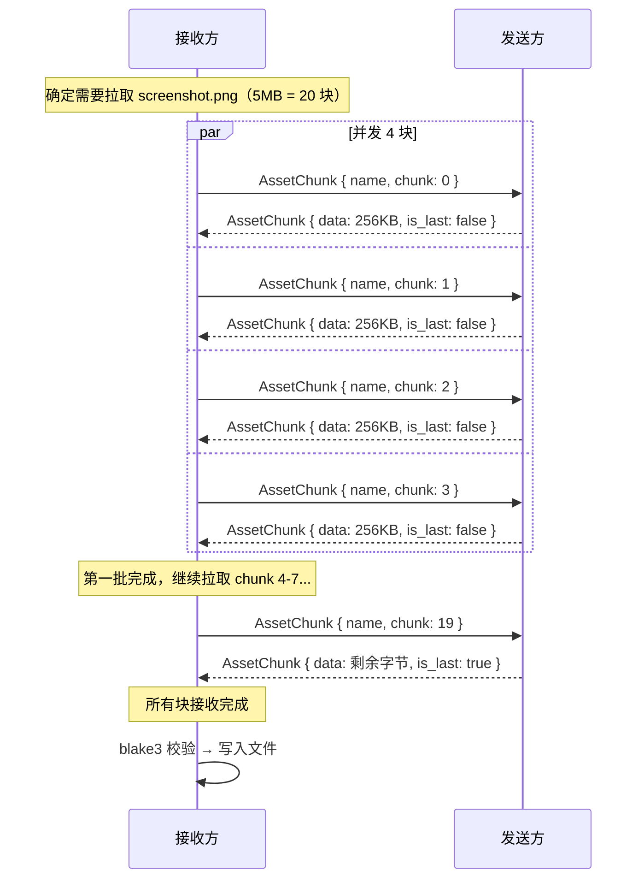
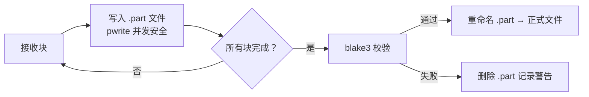
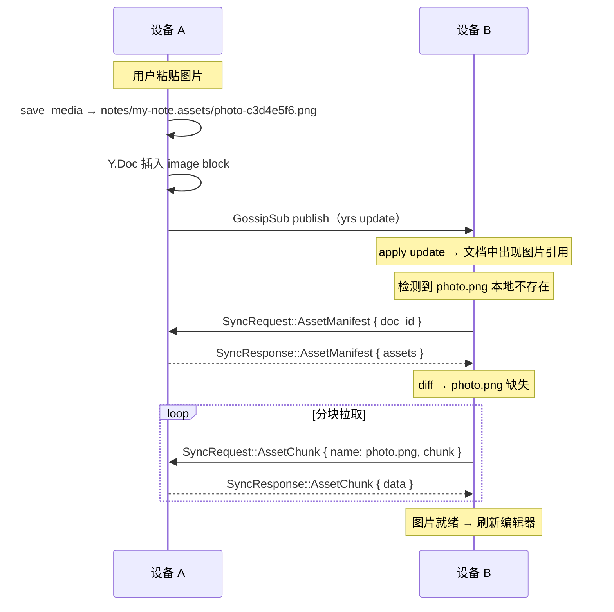
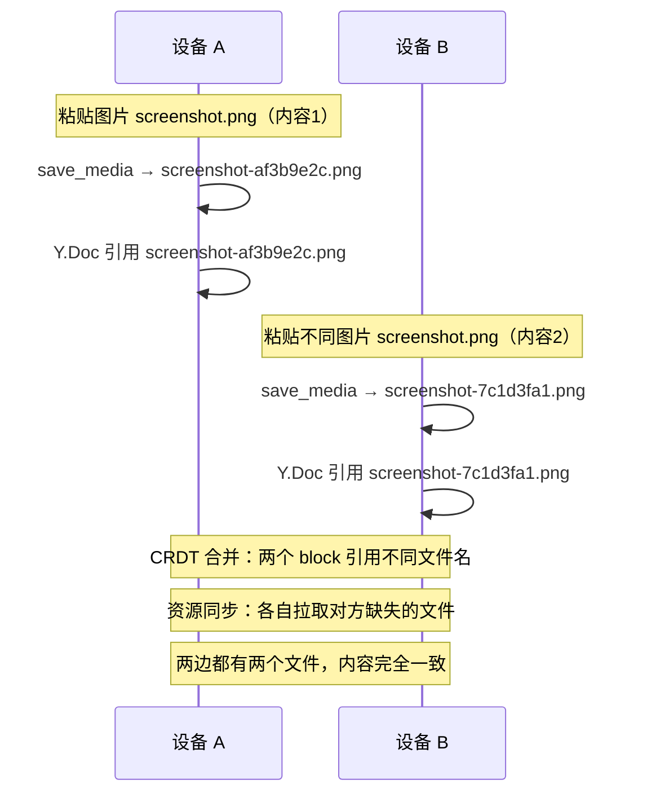
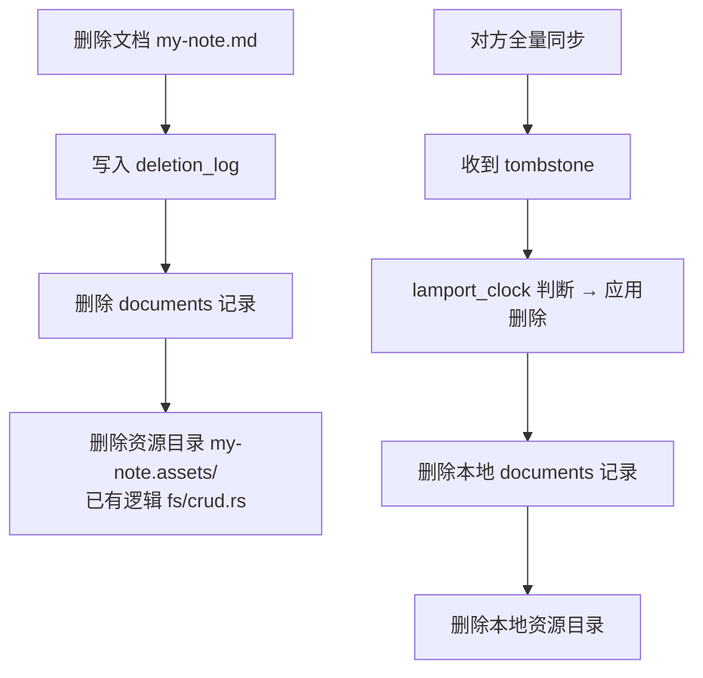

# 资源文件同步设计

> 版本：v0.2.0
> 日期：2026-04-02
> 关联：#28 CRDT 同步（资源同步是文档同步的配套功能）
> 参考：SwarmDrop 分块传输机制（`D:/workspace/swarmdrop`）

---

## 1. 问题

SwarmNote 的笔记可以包含图片等资源文件。资源以标准相对路径引用、存放在 `.assets` 后缀的资源目录中（Typora 默认惯例）：

```text
workspace/
├── notes/
│   ├── my-note.md              → 
│   └── my-note.assets/
│       └── screenshot-af3b.png
```

Y.Doc 同步只传输文本内容（yrs update 二进制）。对方收到文档后，Markdown 中引用的图片文件不存在——**图片裂开**。

---

## 2. 设计原则

### 保持标准 Markdown 兼容

SwarmNote 的笔记是普通 `.md` 文件，必须在任何编辑器中可读：

```markdown
<!-- 这个引用在 VS Code / Typora / Obsidian / GitHub 中都能正常渲染 -->

```

**不使用**内容寻址引用（如 `blob:blake3:xxxx`）——那会破坏所有第三方编辑器的兼容性。

### 资源跟随文档

资源目录与文档是绑定关系。同步一个文档时，紧接着同步其资源——不是独立的后台任务。用户打开已同步的文档时，图片应该已就绪。

### 文件名全局唯一（前置重构）

`save_media` 保存资源时，在文件名中加入**内容 hash 后缀**，从源头保证全局唯一：

```rust
// 当前：screenshot.png → screenshot.png / screenshot 1.png（仅本地去重）
// 改后：screenshot.png → screenshot-af3b9e2c.png（全局唯一）

let hash = blake3::hash(&data);
let short_hash = &hex::encode(hash.as_bytes())[..8];
let unique_name = format!("{}-{}.{}", stem, short_hash, ext);
```

**为什么必须在创建时解决？**

两台设备独立插入同名但不同内容的图片时，Y.Doc 中的引用路径已经写死。如果文件名相同，同步后两边的同名文件内容不同——CRDT 保证了文本一致，但图片不一致。加 hash 后缀使不同内容产生不同文件名，从源头消除冲突。

**额外好处**：

- **天然去重**：同一张图粘贴两次，hash 相同 → 文件名相同 → 直接复用
- **同步安全**：不同设备上相同内容产生相同文件名 → 无需传输
- **可读性**：`screenshot-af3b9e2c.png` 人类可读，优于 UUID

**改动范围**：仅 `src-tauri/src/fs/commands.rs` 的 `save_media` 函数。前端无需修改（只关心返回的绝对路径）。

---

## 3. 整体流程



### 在全量同步中的位置



---

## 4. 分块传输

### 4.1 为什么分块？

资源文件可能 5-10MB（高清图片）。单个 Req-Resp 消息传输整个文件：
- 可能导致超时（libp2p 默认 120s）
- 内存峰值高（整个文件在内存中）
- 无法知道传输进度

### 4.2 复用 SwarmDrop 的核心模式，简化实现

| 特性 | SwarmDrop | SwarmNote 资源同步 |
|------|-----------|-------------------|
| 块大小 | 256KB | 256KB（相同） |
| 并发拉取 | 8 块 | 4 块（资源同步与文档同步共享带宽） |
| 断点续传 | bitmap 持久化到 DB | 无（失败重传整个文件） |
| 加密 | XChaCha20-Poly1305 | 无（libp2p Noise 已加密） |
| 重试 | 3 次指数退避 | 3 次指数退避（相同） |
| 完整性校验 | BLAKE3 | BLAKE3（相同） |

### 4.3 为什么不需要 bitmap 断点续传？

- 笔记中的资源通常 <10MB，40 个 256KB 块
- 传输时间 <5s（局域网），失败概率低
- 失败后重传整个文件的代价很小
- 下次全量同步会自动重试（manifest diff 会再次发现缺失）
- 省去 DB schema 扩展和 bitmap 管理代码

### 4.4 分块流程



### 4.5 发送方读取

```rust
fn read_asset_chunk(asset_path: &Path, file_size: u64, chunk_index: u32) -> Vec<u8> {
    let offset = chunk_index as u64 * CHUNK_SIZE as u64;
    let read_size = ((file_size - offset) as usize).min(CHUNK_SIZE);
    // seek + read_exact（复用 SwarmDrop 的 FileSource 模式）
}
```

### 4.6 接收方写入

先写 `.part` 临时文件，校验通过后重命名：



---

## 5. 协议扩展

在 Sync 子协议中新增资源相关变体：

```rust
pub enum SyncRequest {
    // 现有
    DocList { workspace_uuid: Uuid },
    StateVector { doc_id: Uuid, sv: Vec<u8> },
    FullSync { doc_id: Uuid },
    // 新增：资源同步
    AssetManifest { doc_id: Uuid },
    AssetChunk { doc_id: Uuid, name: String, chunk_index: u32 },
}

pub enum SyncResponse {
    // 现有
    DocList { docs: Vec<DocMeta> },
    Updates { doc_id: Uuid, updates: Vec<u8> },
    // 新增：资源同步
    AssetManifest { doc_id: Uuid, assets: Vec<AssetMeta> },
    AssetChunk {
        doc_id: Uuid,
        name: String,
        chunk_index: u32,
        #[serde(with = "serde_bytes")]
        data: Vec<u8>,
        is_last: bool,
    },
}

pub struct AssetMeta {
    pub name: String,       // 文件名（如 screenshot.png）
    pub hash: Vec<u8>,      // blake3 hash（32 bytes）
    pub size: u64,          // 文件大小（字节）
}
```

### 为什么放在 Sync 而不是新建顶层 Asset 变体？

资源同步是文档同步的一部分——一个文档的同步包含"文本内容 + 资源文件"。逻辑上属于 Sync 生命周期阶段，不是独立的协议。

---

## 6. 资源目录路径推导

```rust
/// 从文档 rel_path 推导资源目录路径
/// "notes/my-note.md" → "notes/my-note.assets/"
fn asset_dir_from_rel_path(rel_path: &str) -> String {
    let base = rel_path.strip_suffix(".md").unwrap_or(rel_path);
    format!("{}.assets", base)
}
```

这与 `save_media` 命令中的逻辑一致。

---

## 7. 增量同步时的资源传播

GossipSub 只传输 yrs update（文本层）。用户插入新图片时：



### 前端占位符

图片未就绪时，编辑器显示**加载中占位符**（灰色区域 + 旋转图标），拉取完成后自动替换为真实图片。

---

## 8. 边界情况

### 8.1 同名资源冲突（已由 hash 文件名消除）



hash 文件名从创建时就保证了**不同内容 = 不同文件名**，同步层不需要处理同名冲突。

**Diff 规则**：远程有、本地没有 → 拉取。同名文件（hash 相同意味着内容相同）→ 跳过。

### 8.2 文档删除时清理资源



`fs/crud.rs` 中删除 `.md` 时已实现资源目录清理。同步层应用远程删除时复用同样的逻辑。

### 8.3 文档重命名

```
A 重命名：my-note.md → my-diary.md
→ 资源目录：my-note.assets/ → my-diary.assets/（本地 fs/crud.rs 已处理）

B 同步到 A 的 DocList：doc_id 不变，rel_path 变了
→ B 的 Y.Doc 同步后 rel_path 更新
→ B 根据新 rel_path 推导资源目录："my-diary/"
→ AssetManifest 指向 "my-diary/" 目录
→ B 本地旧目录 "my-note.assets/" 变成孤儿

处理：旧目录自然孤立，不主动清理（v0.2.0）。
后续可加定期扫描清理无主资源目录。
```

### 8.4 新文档拉取时资源目录不存在

```
B 第一次同步 doc-1（本地从未有过）
→ FullSync 创建 .md + DB 记录
→ AssetManifest 发现本地无资源目录
→ 创建目录 + 逐个拉取所有资源

某个资源拉取失败（网络断开）：
→ 记录 warn 日志
→ 继续同步其他文档的 Y.Doc + 资源
→ 下次全量同步时 manifest diff 自动发现缺失，重试
```

**单个资源失败不阻塞整体同步。**

### 8.5 空资源目录

```
文档没有引用任何图片 → 资源目录不存在
→ AssetManifest 返回空列表 → 跳过资源同步阶段
```

### 8.6 资源目录中的非图片文件

资源目录可能包含用户手动放入的文件（如 `.pdf`、`.xlsx`）。同步策略对所有文件类型一视同仁——按 filename + hash 比较，缺失则传输。

---

## 9. 实现要点

### 9.1 扫描本地资源目录

```rust
fn scan_asset_dir(workspace_path: &Path, rel_path: &str) -> Vec<AssetMeta> {
    let dir = workspace_path.join(asset_dir_from_rel_path(rel_path));
    if !dir.is_dir() { return vec![]; }
    
    std::fs::read_dir(dir)
        .into_iter()
        .flatten()
        .filter_map(|entry| {
            let entry = entry.ok()?;
            if !entry.file_type().ok()?.is_file() { return None; }
            let name = entry.file_name().to_string_lossy().into_owned();
            let metadata = entry.metadata().ok()?;
            let hash = blake3::hash(&std::fs::read(entry.path()).ok()?);
            Some(AssetMeta {
                name,
                hash: hash.as_bytes().to_vec(),
                size: metadata.len(),
            })
        })
        .collect()
}
```

### 9.2 Diff 算法

```rust
fn diff_assets(local: &[AssetMeta], remote: &[AssetMeta]) -> Vec<String> {
    let local_names: HashSet<&str> = local.iter().map(|a| a.name.as_str()).collect();
    remote.iter()
        .filter(|r| !local_names.contains(r.name.as_str()))
        .map(|r| r.name.clone())
        .collect()
}
```

**只检查"远程有、本地没有"。** 同名文件不覆盖。

### 9.3 与 SyncManager 集成

```rust
async fn sync_single_doc(/* ... */) -> SyncResult {
    // Phase 1: Y.Doc 同步
    sync_doc_content(app, client, peer_id, doc_id).await?;
    
    // Phase 2: 资源同步（紧跟文档同步）
    sync_doc_assets(app, client, peer_id, doc_id, rel_path).await?;
    
    Ok(())
}
```

---

## 10. 设计决策总结

| 决策 | 选择 | 理由 |
|------|------|------|
| 存储方式 | 保持同名资源目录 + 相对路径引用 | Markdown 兼容性，任何编辑器可读 |
| 传输方式 | 分块（256KB） | 参考 SwarmDrop，避免大文件超时/OOM |
| 断点续传 | 不实现（v0.2.0） | 资源通常 <10MB，失败重传代价小 |
| 同步时机 | 紧跟文档 Y.Doc 同步 | 用户打开文档时图片就绪 |
| 增量同步资源 | GossipSub 文本 + Req-Resp 补发资源 | GossipSub 有 64KB 限制，大图放不下 |
| 协议层 | Sync 子协议扩展 | 资源同步是文档同步的一部分 |
| 文件名策略 | hash 后缀全局唯一 | 创建时消除冲突，天然去重，同步安全 |
| 删除清理 | 跟随文档删除 | 复用现有 fs/crud.rs 逻辑 |
| 重命名 | 资源目录由 rel_path 派生 | 旧目录自然孤立，后续清理 |
| 拉取失败 | 记录日志继续 | 不阻塞整体同步，下次自动重试 |
| 前端占位 | 加载中占位符 | 图片未就绪时灰色区域 + 旋转图标 |
