# CRDT 同步架构设计

> 版本：v0.2.0  
> 日期：2026-04-02  
> 关联：#28 yjs CRDT 同步  
> 前置：#26 设备配对（已完成）、#46 工作区列表交换（已完成）

---

## 1. 设计目标

让已配对设备之间的笔记实现**秒级同步**：

- **增量同步**：编辑产生的 yjs update 通过 GossipSub 实时广播
- **全量同步**：设备连接/重连时通过 Req-Resp 交换 state vector，互发缺失 update
- **删除同步**：tombstone 机制防止已删除文档复活
- **断点续传**：per-doc 粒度，中断后从未完成的文档继续

### 不在本版本范围

- 同步进度 UI（预留事件接口）
- Trash 回收站 UI
- 工作区元数据同步（名称、文件夹结构）
- 大文档分块传输

### 配套设计文档

- [资源文件同步设计](asset-sync.md) — 图片等资源文件的分块传输、per-doc 资源目录同步

---

## 2. 架构总览

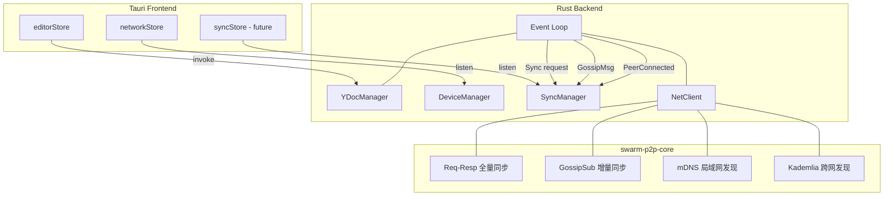

### 为什么分两种同步模式？

| | 全量同步 (Req-Resp) | 增量同步 (GossipSub) |
|--|--|--|
| **触发** | 设备连接/重连时 | 编辑实时发生时 |
| **粒度** | 所有文档 | 仅当前打开的文档 |
| **语义** | 点对点拉取 | 发布-订阅广播 |
| **适用** | 追平历史差异 | 实时协作 |
| **容错** | 超时重试，断点续传 | 丢失靠全量补偿 |

两者互补：GossipSub 负责实时性（< 500ms），Req-Resp 负责完整性（确保最终一致）。

---

## 3. SyncManager 设计

### 3.1 结构

```rust
pub struct SyncManager {
    app: AppHandle,
    client: AppNetClient,
    /// 防止对同一 (peer, workspace) 重复触发全量同步
    active_syncs: DashMap<(PeerId, Uuid), CancellationToken>,
}
```

### 3.2 为什么用 task-based 而非 stateful session？

全量同步是一次性操作（连接 → 同步 → 结束），没有长期存活的会话状态。对比：

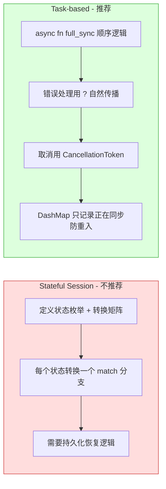

异步函数天然就是状态机（编译器生成），不需要手写。

### 3.3 集成到 NetManager

```rust
pub struct NetManager {
    pub client: AppNetClient,
    pub device_manager: Arc<DeviceManager>,
    pub online_announcer: Arc<OnlineAnnouncer>,
    pub pairing_manager: Arc<PairingManager>,
    pub sync_manager: Arc<SyncManager>,       // ← 新增
    cancel_token: CancellationToken,
}
```

SyncManager 与 DeviceManager、PairingManager 平级，共享 `AppNetClient`。通过 `app.state::<T>()` 按需访问 DbState、WorkspaceState、YDocManager（不直接持有引用，避免循环依赖）。

### 3.4 Tauri State 访问模式

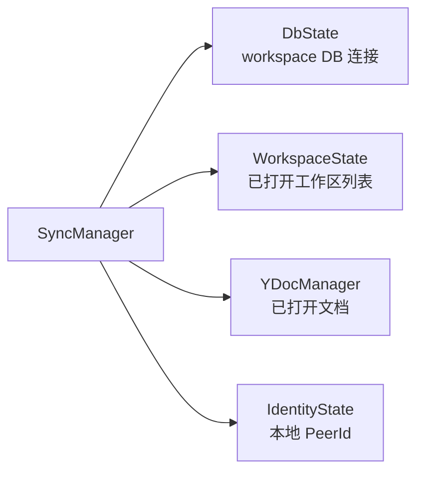

---

## 4. 全量同步协议

### 4.1 协议修改

当前 `SyncRequest::DocList` 无参数，需要指定工作区：

```rust
pub enum SyncRequest {
    DocList { workspace_uuid: Uuid },           // ← 新增参数
    StateVector { doc_id: Uuid, sv: Vec<u8> },
    FullSync { doc_id: Uuid },
}
```

**为什么？** 每个工作区独立同步。不指定工作区意味着返回所有文档——泄露不相关工作区信息，且对方无法过滤。per-workspace 请求与 sync session 的 `(PeerId, Uuid)` 粒度一致。

### 4.2 对称全量同步

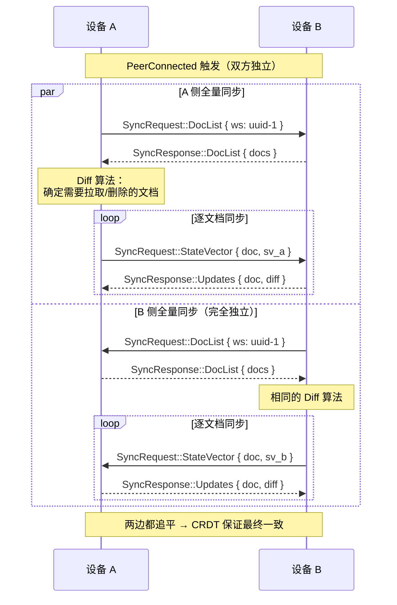

### 4.3 为什么选择对称设计？

**核心论点：CRDT 的幂等性消除了协调需求。**

| 对称 | 非对称 |
|------|--------|
| 两边运行完全相同的代码 | 需要 initiator/responder 两条路径 |
| A 崩溃不影响 B 的同步 | initiator 崩溃 → 需要 responder 接管逻辑 |
| 无需"谁先"协议 | 需要 PeerId 字典序比较或协商 |
| 可能重复交换 updates | 无冗余 |

"重复交换"的代价极小：StateVector 交换后，如果双方已同步，diff 为空（0 字节）。CRDT merge 是幂等的——同一个 update apply 两次效果相同。用零复杂度换零冗余是个好交易。

### 4.4 全量同步 async 流程

```rust
async fn full_sync(
    app: AppHandle,
    client: AppNetClient,
    peer_id: PeerId,
    workspace_uuid: Uuid,
    cancel: CancellationToken,
) -> SyncResult {
    // 1. 获取远程 DocList
    let remote_docs = request_doc_list(&client, peer_id, workspace_uuid).await?;

    // 2. 获取本地 DocList（从 DB）
    let local_docs = build_local_doc_list(&app, workspace_uuid).await?;

    // 3. Diff
    let plan = diff_doc_lists(&local_docs, &remote_docs);

    // 4. 按优先级排序 + 并发执行
    let semaphore = Arc::new(Semaphore::new(4));
    let mut tasks = JoinSet::new();

    for task in plan.sorted_by_priority() {
        let permit = semaphore.clone().acquire_owned().await?;
        tasks.spawn(async move {
            let result = sync_single_doc(app, client, peer_id, task).await;
            drop(permit);
            result
        });
    }

    // 5. 收集结果，emit 进度
    while let Some(result) = tasks.join_next().await { ... }
}
```

**这不是伪代码，是实际实现的骨架。** 注意几个设计点：

- **Semaphore(4)**：限制并发文档数，防止大工作区同步时打爆内存（每个文档需要一个临时 Y.Doc）
- **JoinSet**：复用 `get_remote_workspaces` 中验证过的并发模式
- **CancellationToken**：peer 断连时取消所有进行中的任务

### 4.5 优先级排序


如何知道哪些文档"当前打开"？查询 `YDocManager.docs` 中是否包含该 doc_uuid。

---

## 5. DocList Diff 算法

### 5.1 数据来源

本地 DocList 由两部分合并构成：

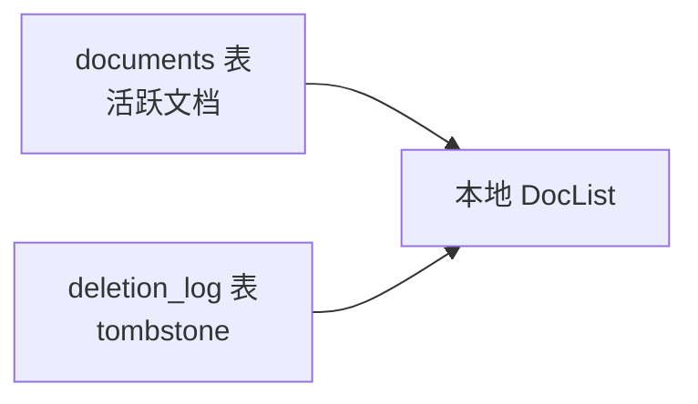

```rust
struct LocalDocState {
    active: HashMap<Uuid, DocMeta>,       // documents 表 → 活跃文档
    tombstones: HashMap<Uuid, Tombstone>, // deletion_log → 已删除
}
```

### 5.2 Diff 逻辑（单方向：从远程拉取）

对称设计下，每一方只需决定**从对方拉取什么**。对方会独立计算它要从我们拉取什么。

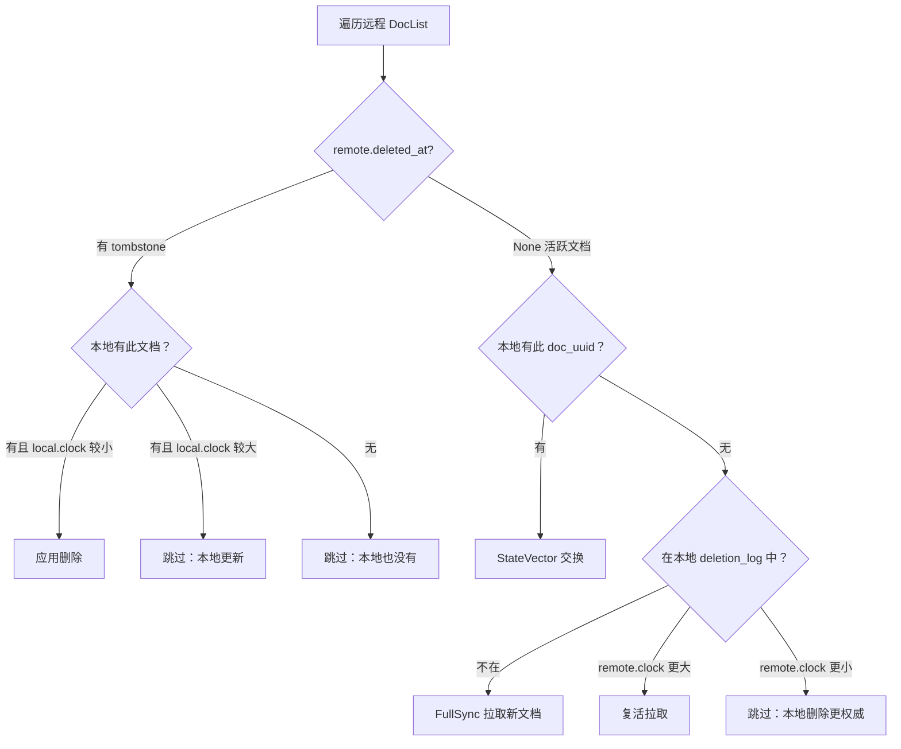

### 5.3 为什么不需要处理"本地有、远程没有"？

对称设计的巧妙之处：

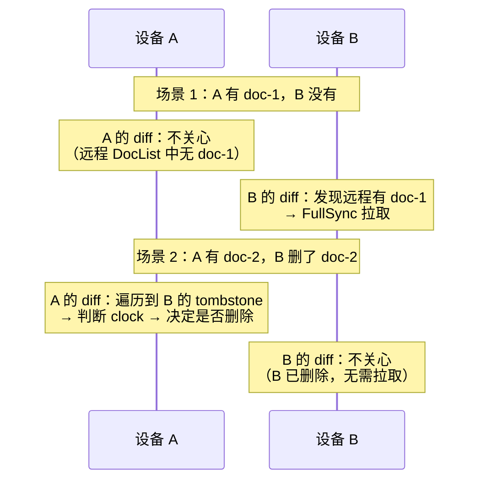

每一方只需要一个方向的逻辑。对方的 DocList **已经包含了所有信息**（活跃文档 + tombstone）。

---

## 6. 单文档同步

### 6.1 StateVector 交换

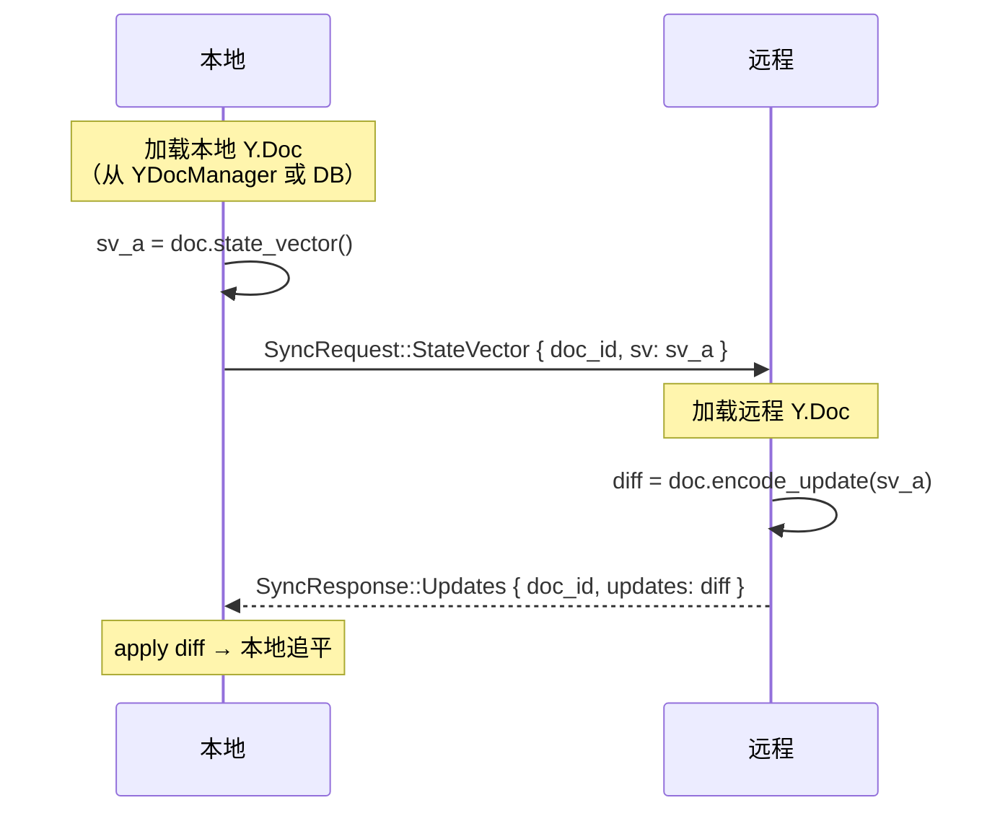

**单向 vs 双向**：上面只是 A 拉取 B 的差量。B 拉取 A 的差量在 B 自己的同步 task 中独立完成（对称设计）。所以实际是**双向对称各拉一次**，而非传统的双向交叉。

### 6.2 FullSync（新文档拉取）

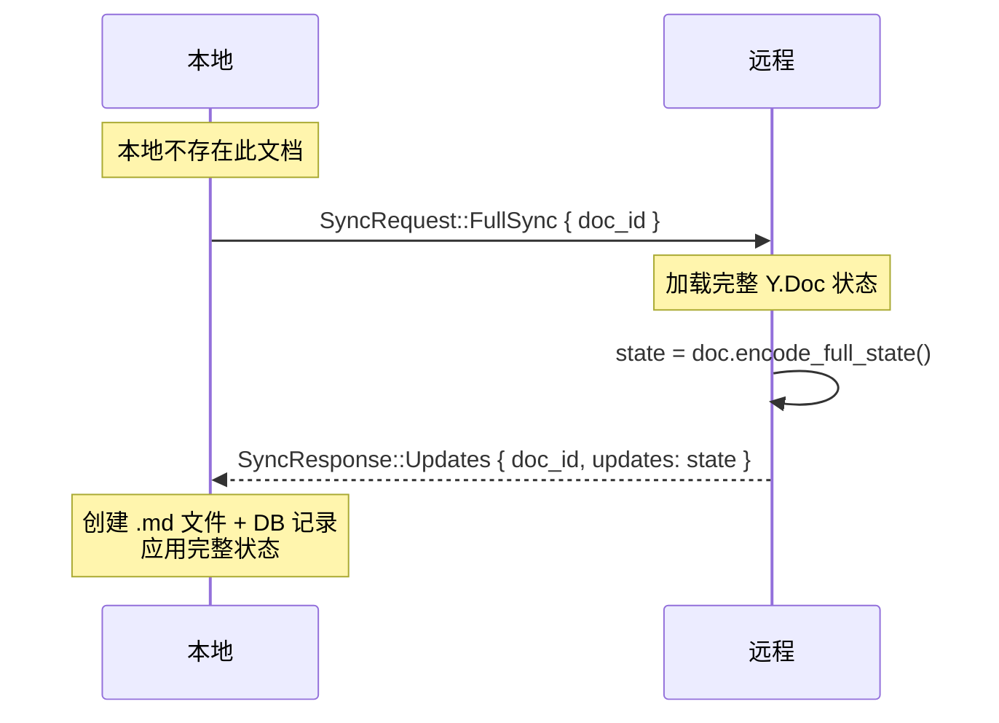

### 6.3 入站请求处理

SyncManager 还需要**响应**对方发来的同步请求：

```rust
pub async fn handle_inbound_request(
    &self,
    peer_id: PeerId,
    pending_id: u64,
    request: SyncRequest,
) {
    match request {
        SyncRequest::DocList { workspace_uuid } => {
            let docs = self.build_doc_list(workspace_uuid).await;
            self.client.send_response(pending_id, SyncResponse::DocList { docs }).await;
        }
        SyncRequest::StateVector { doc_id, sv } => {
            let diff = self.compute_diff(doc_id, &sv).await;
            self.client.send_response(pending_id, SyncResponse::Updates { doc_id, updates: diff }).await;
        }
        SyncRequest::FullSync { doc_id } => {
            let state = self.load_full_state(doc_id).await;
            self.client.send_response(pending_id, SyncResponse::Updates { doc_id, updates: state }).await;
        }
    }
}
```

注意：入站请求需要**立即响应**（PendingMap 有 TTL），不能排队等待。

---

## 7. Y.Doc 生命周期管理

这是整个设计中最关键的架构决策。

### 7.1 问题

YDocManager 以 `(window_label, doc_uuid)` 为 key，只管理在编辑器中打开的文档。但全量同步需要处理工作区中**所有文档**——绝大部分没有在任何窗口中打开。

### 7.2 方案对比

| 方案 | 描述 | 评价 |
|------|------|------|
| **A: 扩展 YDocManager** | `open_headless(uuid)` key 用 `("__sync__", uuid)` | ✗ "无头"概念不自然，污染抽象；所有方法要处理两种情况；writeback 不知往哪 emit |
| **B: SyncManager 自管 Doc 池** | 持有 `DashMap<Uuid, SyncDocEntry>` | ✗ 同一文档两个 Y.Doc 实例；状态可能不一致；需复杂锁协调 |
| **C: 双路径策略** ✅ | 已打开 → YDocManager；未打开 → 临时 Doc 用完即弃 | ✓ 无并发实例；YDocManager 几乎无修改；临时 Doc 毫秒级生命周期 |

### 7.3 方案 C 详细设计

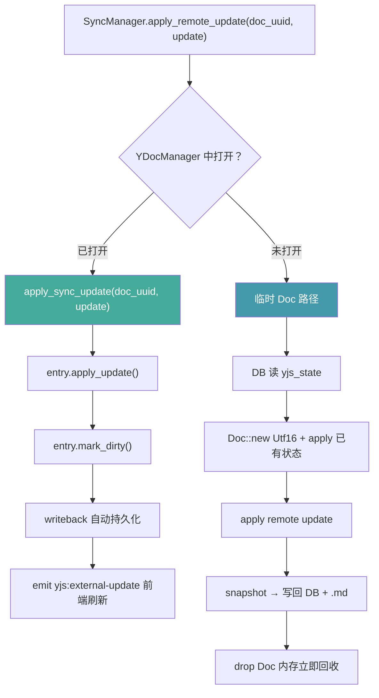

### 7.4 YDocManager 新增方法

```rust
impl YDocManager {
    /// 尝试将同步 update 应用到已打开的文档。
    /// 返回 None = 文档未打开（SyncManager 应走 DB 路径）。
    pub async fn apply_sync_update(
        &self,
        app: &AppHandle,
        doc_uuid: &Uuid,
        update: &[u8],
    ) -> Option<AppResult<()>> {
        // 在所有窗口中查找此 doc_uuid（不关心 label）
        let entry = self.docs.iter()
            .find(|e| e.key().1 == *doc_uuid)
            .map(|e| (e.key().0.clone(), Arc::clone(e.value())))?;

        let (label, doc_entry) = entry;
        let result = doc_entry.apply_update(update).await;
        if result.is_ok() {
            doc_entry.mark_dirty();
            // 通知前端编辑器刷新
            let _ = app.emit_to(&label, "yjs:external-update", serde_json::json!({
                "docUuid": doc_uuid.to_string(),
                "update": update,
            }));
        }
        Some(result)
    }
}
```

**为什么不需要 window label？** 同步层按 doc_uuid 寻址。一个 doc 只会在一个窗口中打开（UUID 唯一），遍历 DashMap 即可定位。

### 7.5 临时 Doc 操作（未打开文档）

```rust
/// 从 DB 加载文档状态，应用远程 update，持久化回 DB + 写 .md。
async fn sync_closed_doc(
    db: &DatabaseConnection,
    workspace_path: &Path,
    doc_uuid: Uuid,
    remote_update: &[u8],
) -> AppResult<()> {
    // 1. 从 DB 读取当前状态
    let doc_model = documents::Entity::find_by_id(doc_uuid).one(db).await?;

    // 2. 创建临时 Y.Doc（必须 Utf16 与前端一致）
    let doc = Doc::with_options(Options {
        offset_kind: OffsetKind::Utf16,
        ..Default::default()
    });
    doc.get_or_insert_xml_fragment("document-store");

    // 3. 加载已有状态（如果有）
    if let Some(yjs_state) = &doc_model.yjs_state {
        apply_binary_update(&doc, yjs_state)?;
    }

    // 4. 应用远程 update
    apply_binary_update(&doc, remote_update)?;

    // 5. 编码新状态
    let txn = doc.transact();
    let new_state = txn.encode_state_as_update_v1(&StateVector::default());
    let new_sv = txn.state_vector().encode_v1();
    drop(txn);

    // 6. 转换为 Markdown 并写文件
    let markdown = yrs_blocknote::doc_to_markdown(&doc, "document-store")?;
    let file_path = workspace_path.join(&doc_model.rel_path);
    tokio::fs::write(&file_path, &markdown).await?;

    // 7. 持久化回 DB
    let mut model: documents::ActiveModel = doc_model.into();
    model.yjs_state = Set(Some(new_state));
    model.state_vector = Set(Some(new_sv));
    model.file_hash = Set(Some(blake3::hash(markdown.as_bytes()).as_bytes().to_vec()));
    model.update(db).await?;

    Ok(())
    // doc 在这里被 drop，内存立即回收
}
```

**为什么临时 Doc 是安全的？**

- 文档未在 YDocManager 中打开 → 没有并发实例
- 文件不在 watcher 监控中（watcher 按 window label 隔离）→ 不会触发 reload
- 持久化完成后 Doc 立即 drop → 无内存泄漏

### 7.6 Y.Doc 中的资源 URL（前置重构，关键）

#### 问题

当前 Y.Doc 中存储的是**设备专属的绝对 URL**：


- `NoteEditor.tsx:126`：`uploadFile` 返回 `convertFileSrc(absPath)` → `tauri://localhost/C:/Users/A/workspace/...`
- 这个 URL 被 BlockNote 存入 Y.Doc 的 image block props
- yrs update 二进制中嵌入了这个设备专属 URL
- 同步到设备 B 后，B 的 `asset_url_to_relative(md, B_PREFIX)` 无法剥离 A 的 URL（前缀不匹配）
- **结果：.md 文件和编辑器中图片全部裂开**

#### 解决方案：Y.Doc 存储相对路径

将 URL 转换从**存储边界**移到**渲染边界**：

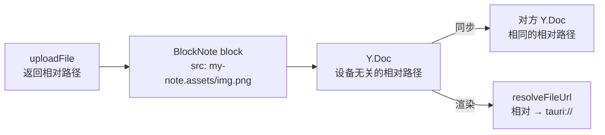

| 改动 | 文件 | 说明 |
|------|------|------|
| `uploadFile` 返回相对路径 | `NoteEditor.tsx` | 不再调用 `convertFileSrc`，直接返回 `relPath.assets/filename` |
| BlockNote `resolveFileUrl` | `NoteEditor.tsx` | 渲染时将相对路径转为 `convertFileSrc(wsPath + relPath)` |
| `save_media` 返回相对路径 | `fs/commands.rs` | 返回工作区内相对路径而非绝对路径 |
| 移除 URL 转换逻辑 | `yjs/manager.rs` | 移除 `relative_to_asset_url`、`asset_url_to_relative`、`asset_url_prefix` 参数 |
| `open_doc` 签名简化 | `yjs/manager.rs` | 不再需要 `asset_url_prefix` 参数 |
| 现有文档迁移 | 一次性 | DB 中的 `yjs_state` 含旧 URL → 清除，让 `open_doc` 从 .md 重新加载 |

**为什么必须在同步前完成？** 如果不改，所有跨设备同步的含图文档都会图片裂开。这不是优化，是同步的前提条件。

**额外好处**：
- Y.Doc 变为设备无关的纯数据，天然可同步
- 移除了 `asset_url_prefix` 参数，简化了 `open_doc` 的 API
- 移除了 `relative_to_asset_url` / `asset_url_to_relative`，减少了转换层

---

## 8. 增量同步（GossipSub）

### 8.1 Topic 设计

Topic 格式：`swarmnote/doc/{doc_uuid}`

按文档粒度订阅：只收当前打开的文档的 update，节省带宽。

### 8.2 生命周期

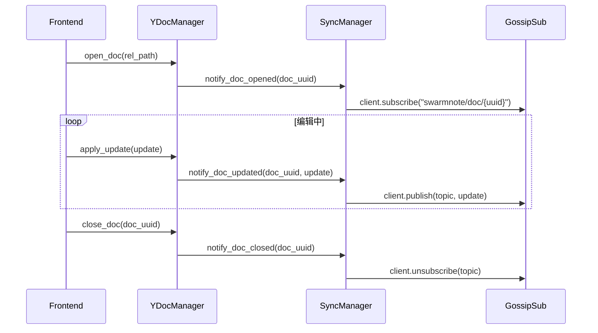

### 8.3 消息格式：裸二进制

GossipSub message payload = **yrs update V1 bytes**（无 wrapper）

**为什么裸二进制而非 wrapper？**

1. **接收方文档必定已打开**：按设计，只有 subscribe 了 topic 的节点才会收到消息。subscribe 发生在 open_doc 时。所以收到消息时，该文档已在 YDocManager 中打开。
2. **doc_uuid 已在 topic 中**：`swarmnote/doc/{uuid}`，解析 topic 即可得到。
3. **workspace_uuid 不需要**：文档已在 YDocManager 中，YDocManager 知道 workspace。
4. **最小化序列化开销**：yrs update 已经是二进制，再包一层 CBOR/JSON 是浪费。

### 8.4 接收流程

```rust
// event_loop.rs 中
NodeEvent::GossipMessage { source, topic, data } => {
    if let Some(doc_uuid) = parse_doc_topic(&topic) {
        sync_manager.handle_gossip_update(source, doc_uuid, data).await;
    }
}

// sync_manager 中
async fn handle_gossip_update(&self, source: Option<PeerId>, doc_uuid: Uuid, data: Vec<u8>) {
    let ydoc_mgr = self.app.state::<YDocManager>();
    // 文档必定已打开（否则不会 subscribe 这个 topic）
    if let Some(result) = ydoc_mgr.apply_sync_update(&self.app, &doc_uuid, &data).await {
        if let Err(e) = result {
            tracing::warn!("Failed to apply gossip update for {doc_uuid}: {e}");
        }
    }
}
```

### 8.5 丢失补偿

GossipSub 不保证送达。消息可能因为：
- Mesh 拓扑变化（节点加入/离开）
- 网络抖动

**补偿策略**：定期（如每 60s）对当前打开的文档执行 StateVector 校验：

```
A.state_vector != B.state_vector → 触发一次 per-doc StateVector 交换
```

这是全量同步的轻量版——只对打开的文档做，不遍历整个工作区。

---

## 9. 删除同步

### 9.1 当前已实现

`document/commands.rs` 中 `delete_document_by_rel_path()` 已实现：

1. 写入 `deletion_log`（doc_id, rel_path, deleted_at, deleted_by, lamport_clock+1）
2. ON CONFLICT 更新（支持重复删除）
3. 删除 `documents` 记录

### 9.2 同步时的删除传播

DocList 中同时包含活跃文档和 tombstone：

```rust
async fn build_doc_list(db: &DatabaseConnection, workspace_uuid: Uuid) -> Vec<DocMeta> {
    // 活跃文档
    let active = documents::Entity::find()
        .filter(Column::WorkspaceId.eq(workspace_uuid))
        .all(db).await?
        .into_iter()
        .map(|d| DocMeta { deleted_at: None, ... });

    // Tombstone
    let deleted = deletion_log::Entity::find()
        .all(db).await?
        .into_iter()
        .map(|t| DocMeta { deleted_at: Some(t.deleted_at.timestamp_millis()), ... });

    active.chain(deleted).collect()
}
```

### 9.3 Lamport Clock 冲突解决

```
场景：A 删了 doc-1（clock=5），B 在不知情时编辑了 doc-1（clock=3 → 4）

A 收到 B 的 DocList：doc-1, clock=4, active
A 本地：doc-1 在 deletion_log，clock=5
→ A 的 tombstone.clock(5) > remote.clock(4) → 跳过（A 的删除更新）

B 收到 A 的 DocList：doc-1, clock=5, deleted
B 本地：doc-1 在 documents，clock=4
→ remote.clock(5) > B.clock(4) → 应用删除

结果：doc-1 被删除 ✓ （A 的删除操作后于 B 的编辑）
```

```
场景：A 删了 doc-1（clock=3），B 在 A 删除之后编辑了 doc-1（clock=5）

A 收到 B 的 DocList：doc-1, clock=5, active
A 本地：doc-1 在 deletion_log，clock=3
→ remote.clock(5) > tombstone.clock(3) → 复活拉取（B 在删除后编辑了）

结果：doc-1 恢复 ✓ （B 的编辑操作后于 A 的删除）
```

**规则简单明确**：clock 大的赢。

### 9.4 Tombstone GC（简化版）

v0.2.0 暂不实现自动 GC，保留所有 tombstone。未来策略：

- 所有已配对 peer 确认后 + 30 天 → 可 GC
- 6 个月 → 强制 GC
- 解除配对时从 ack 列表移除该设备

---

## 10. 边界条件与异常处理

### 10.1 网络中断

```
场景：全量同步中，第 41/100 个文档时 peer 断连

处理：
  ├─ send_request 超时 → 返回 Err
  ├─ CancellationToken 感知 PeerDisconnected → 取消剩余任务
  ├─ 已完成的 40 个文档状态正常（已持久化到 DB + .md）
  ├─ 第 41 个文档可能部分完成：
  │   ├─ 如果 apply_update 已执行 → 状态已合并，安全
  │   └─ 如果 send_request 还没返回 → 无变化，安全
  └─ peer 重连时：
      └─ 重新触发全量同步 → DocList 重新 diff → 只同步剩余文档
         （已同步的文档 StateVector 匹配 → diff 为空 → 跳过）
```

**关键保证**：每个文档的同步是原子的——要么完全应用，要么不应用。CRDT update 的 apply 是幂等的，重复 apply 同一个 update 无害。

### 10.2 并发编辑冲突

```
场景：A 和 B 同时编辑 doc-1 的不同段落

  A: 编辑 → GossipSub publish(update_a)
  B: 编辑 → GossipSub publish(update_b)

  A 收到 update_b → apply → CRDT 自动合并
  B 收到 update_a → apply → CRDT 自动合并

  结果：A 和 B 看到完全相同的内容 ✓
```

yrs (Yjs Rust) 使用 Y-CRDT 算法，对并发编辑的合并有数学保证：
- **强最终一致性**：所有节点应用完相同的 update 集合后，状态一致
- **意图保持**：尽可能保留每个编辑的语义意图

### 10.3 重复同步防护

```
场景：peer 快速断连重连（网络抖动），触发多次全量同步

  第 1 次 PeerConnected → spawn full_sync task
  第 2 次 PeerConnected（task 还在运行）→ active_syncs 检查 → 跳过

active_syncs: DashMap<(PeerId, Uuid), CancellationToken>
  → 同一 (peer, workspace) 只允许一个进行中的同步任务
```

### 10.4 文件系统冲突

```
场景：SyncManager 写了 doc-1.md 到磁盘 → 文件 watcher 检测到变更 → 尝试 reload

处理方式取决于文档是否打开：
  ├─ 未打开：watcher 不监控（watcher 按 window label 隔离）→ 无冲突
  └─ 已打开：sync 通过 YDocManager.apply_sync_update() → 不写磁盘
     → writeback task 最终写磁盘 → blake3 自写检测 → watcher 跳过 → 无冲突
```

### 10.5 大文档

```
场景：单个 Y.Doc 的 yjs_state 非常大（如 10MB 的长文档）

当前 Req-Resp 无显式消息大小限制（libp2p 默认允许大消息），
但 GossipSub 有默认 64KB 消息限制。

处理：
  ├─ 全量同步（Req-Resp）：无影响，大消息可传输
  └─ 增量同步（GossipSub）：单次编辑的 update 通常很小（<1KB）
     大批量 update（如粘贴 10000 字）可能接近限制
     → 暂不处理，观察实际情况（v0.3.0 考虑分块）
```

### 10.6 空工作区

```
场景：远程 DocList 返回 0 个文档

处理：全量同步正常结束，diff 为空 → 无操作 → emit sync-complete
```

### 10.7 同名文档不同 UUID

```
场景：A 和 B 独立创建了 notes/todo.md，各自分配了不同的 UUID

A 的 DocList: { doc_id: uuid-1, rel_path: "notes/todo.md" }
B 的 DocList: { doc_id: uuid-2, rel_path: "notes/todo.md" }

B 收到 A 的 DocList → uuid-1 本地不存在 → FullSync 拉取
→ 本地已有 notes/todo.md (uuid-2) → 文件系统冲突

处理：
  创建时附加后缀：notes/todo (1).md
  或跳过，保留本地版本，后续版本处理冲突
```

**v0.2.0 策略**：检测到 rel_path 冲突时，为新拉取的文档自动重命名（追加数字后缀）。

### 10.8 协议版本不兼容

```
场景：A 是 v0.2.0（支持 Sync），B 是 v0.1.0（不支持 Sync）

A 发送 SyncRequest → B 反序列化失败 → libp2p Req-Resp 超时（120s）
→ A 捕获超时错误 → 记录日志 → 跳过此 peer

优化（可选）：通过 Identify 协议的 agent_version 提前判断对方版本
```

### 10.9 PendingMap TTL

```
场景：收到 SyncRequest，但处理时间过长（如 build_doc_list 需要查询大量文档）

PendingMap TTL 约 60s（swarm-p2p-core 配置）
→ 必须在 TTL 内调用 send_response，否则 channel 过期

处理：
  ├─ DocList 查询：通常 <100ms，无风险
  ├─ StateVector 计算：加载 Y.Doc + 编码 SV，<500ms，无风险
  └─ FullSync：编码完整状态，<1s，无风险
```

---

## 11. 事件循环集成

### 11.1 event_loop.rs 修改

```rust
pub fn spawn_event_loop(
    mut receiver: EventReceiver<AppRequest>,
    app: AppHandle,
    client: AppNetClient,
    device_manager: Arc<DeviceManager>,
    pairing_manager: Arc<PairingManager>,
    sync_manager: Arc<SyncManager>,          // ← 新增
    cancel_token: CancellationToken,
) {
    tokio::spawn(async move {
        loop {
            tokio::select! {
                _ = cancel_token.cancelled() => break,
                event = receiver.recv() => {
                    match event {
                        Some(event) => handle_event(
                            event, &app, &client,
                            &device_manager, &pairing_manager,
                            &sync_manager,                    // ← 新增
                        ).await,
                        None => break,
                    }
                }
            }
        }
    });
}
```

### 11.2 新增的事件处理

```rust
async fn handle_event(/* ... */, sync_manager: &SyncManager) {
    // ... 现有逻辑 ...

    match event {
        // 已配对 peer 上线 → 触发全量同步
        NodeEvent::PeerConnected { ref peer_id } => {
            // ... 现有 emit_devices + tray 更新 ...
            if device_manager.is_paired(peer_id) {
                sync_manager.on_paired_peer_connected(*peer_id).await;
            }
        }

        // GossipSub 消息 → 增量同步
        NodeEvent::GossipMessage { source, ref topic, ref data } => {
            if let Some(doc_uuid) = parse_sync_topic(topic) {
                sync_manager.handle_gossip_update(source, doc_uuid, data).await;
            }
        }

        // 入站同步请求
        NodeEvent::InboundRequest { peer_id, pending_id, request } => {
            match request {
                AppRequest::Sync(sync_req) => {
                    sync_manager.handle_inbound_request(peer_id, pending_id, sync_req).await;
                }
                // ... 其他现有处理 ...
            }
        }

        _ => { /* 其他事件不变 */ }
    }
}

fn parse_sync_topic(topic: &str) -> Option<Uuid> {
    topic.strip_prefix("swarmnote/doc/")
        .and_then(|s| Uuid::parse_str(s).ok())
}
```

---

## 12. 模块结构

```
src-tauri/src/sync/
├── mod.rs           # 类型定义 + re-export
│   ├── pub enum SyncStatus { Idle, Syncing, Completed, Partial }
│   └── pub use manager::SyncManager
│
├── manager.rs       # SyncManager 结构体
│   ├── new(app, client)
│   ├── on_paired_peer_connected(peer_id)
│   ├── handle_inbound_request(peer_id, pending_id, req)
│   ├── handle_gossip_update(source, doc_uuid, data)
│   ├── notify_doc_opened(doc_uuid)
│   └── notify_doc_closed(doc_uuid)
│
├── full_sync.rs     # 全量同步 async 函数
│   ├── full_sync(app, client, peer_id, ws_uuid, cancel)
│   ├── request_doc_list(client, peer_id, ws_uuid)
│   ├── build_local_doc_list(app, ws_uuid)
│   └── diff_doc_lists(local, remote) → SyncPlan
│
└── doc_sync.rs      # 单文档同步
    ├── sync_single_doc(app, client, peer_id, task)
    ├── sync_via_state_vector(...)   # 已有文档：SV 交换
    ├── sync_via_full_pull(...)      # 新文档：FullSync 拉取
    ├── apply_remote_update(...)     # 路由到 YDocManager 或 DB
    └── sync_closed_doc(...)         # 未打开文档的临时 Doc 操作
```

---

## 13. Tauri 事件

| 事件名 | 时机 | Payload |
|--------|------|---------|
| `sync-started` | 全量同步开始 | `{ peerId, workspaceUuid }` |
| `sync-progress` | 每完成一个文档 | `{ peerId, workspaceUuid, completed, total }` |
| `sync-completed` | 全量同步完成 | `{ peerId, workspaceUuid, result }` |
| `doc-sync-status-changed` | 文档同步状态变化 | `{ docId, status }` |
| `yjs:external-update` | 收到远程编辑 | `{ docUuid, update }` |

前端可监听这些事件实现同步状态指示（v0.2.0 预留接口，暂不实现 UI）。

---

## 14. 数据流总览

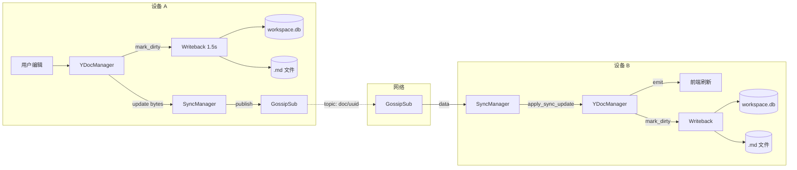

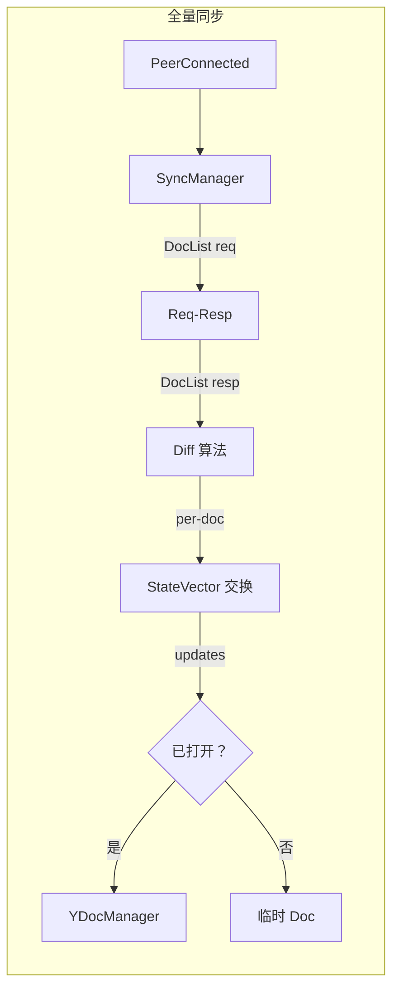

---

## 15. 技术选型

### 不需要新增的依赖

| 库 | 结论 | 理由 |
|---|---|---|
| y-sync | 不需要 | 已合并入 yrs 0.20+，crate 已归档 |
| y-sweet | 不需要 | WebSocket 服务器架构，不适合 P2P |
| relative-path | 不需要 | 解决路径类型表示问题，非我们的需求 |

### yrs sync feature

yrs 0.25 内置 `yrs::sync` 模块（`Protocol` trait + `DefaultProtocol` + `Awareness` + `SyncMessage`），是 Yjs 同步协议的完整 Rust 实现。但该模块设计为 WebSocket 流式协议，而 SwarmNote 使用 libp2p Req-Resp 请求响应模式。

**决策**：不使用 `yrs::sync::Protocol`，直接使用底层 API：

```rust
// 编码 state vector（SyncStep1 等价物）
txn.state_vector().encode_v1()

// 计算对方缺失的 updates（SyncStep2 等价物）
txn.encode_state_as_update_v1(&remote_sv)

// 应用远程 update
txn.apply_update(Update::decode_v1(&data)?)
```

这些 API 与现有 `SyncRequest::StateVector` / `SyncResponse::Updates` 协议完全匹配。

需要在 Cargo.toml 中启用 `sync` feature 以确保 Send+Sync bounds（async 上下文需要）：

```toml
yrs = { version = "0.25", features = ["sync"] }
```

### BlockNote resolveFileUrl

BlockNote 原生支持 `resolveFileUrl` 选项——在渲染时将存储的 URL 转换为可访问的 URL。这正是"Y.Doc 存储相对路径，渲染时转换"方案所需的 API，无需自定义 block schema 或 hack。

```typescript
useCreateBlockNote({
    uploadFile: async (file) => "my-note.assets/screenshot-af3b.png",  // 存储相对路径
    resolveFileUrl: async (url) => convertFileSrc(`${wsPath}/${url}`), // 渲染时转换
})
```

### pathdiff

`save_media` 重构后需要将绝对路径转为工作区相对路径。`pathdiff::diff_paths` 可一行完成，支持 `..` 路径计算，代码更简洁。

```toml
pathdiff = "0.2"
```

---

## 16. 设计决策总结

| 决策 | 选择 | 核心理由 |
|------|------|---------|
| 全量同步对称性 | 对称（双方独立发起） | CRDT 幂等消除协调需求 |
| SyncManager 模式 | Task-based（非状态机） | async fn 天然是状态机 |
| DocList 参数 | 加 workspace_uuid | per-workspace 同步，不泄露无关信息 |
| GossipSub 消息 | 裸二进制 | 接收方文档必定已打开，无需 wrapper |
| 未打开文档同步 | 临时 Doc + DB 直接操作 | 不侵入 YDocManager，无并发实例 |
| 删除冲突 | Lamport clock 大者胜 | 简单、确定、无需额外协调 |
| 消息丢失补偿 | 定期 SV 校验 | GossipSub 不保证送达 |
| 并发控制 | Semaphore(4) | 限制内存，防大工作区打爆 |
| 重复同步防护 | DashMap 查重 | 网络抖动快速重连场景 |
| 时间戳格式 | DB: ISO8601 / 协议: i64 ms | DB 可读性 + 协议紧凑性 |
| Y.Doc URL 策略 | 存储相对路径，渲染时转换 | 设备无关，天然可同步 |

---

## 16. 实现顺序

```mermaid
gantt
    title CRDT 同步实现路线
    dateFormat  X
    axisFormat %s

    section 前置重构
    Y.Doc 相对路径重构                     :crit, r1, 0, 2
    save_media hash 文件名 + .assets       :r2, 2, 3
    DB 连接生命周期修复                    :r3, 2, 3
    协议扩展 + .assets 过滤               :r4, 3, 4

    section Phase 2a: 骨架
    sync/ 模块 + SyncManager 结构体       :a1, 4, 5
    event_loop 集成 Sync + GossipSub      :a2, 4, 5
    build_local_doc_list 从 DB 构建        :a3, 5, 6
    handle_inbound 请求响应               :a4, 5, 6

    section Phase 2b: 全量同步
    full_sync async 流程 + DocList diff    :b1, 6, 8
    per-doc StateVector 交换              :b2, 7, 9
    apply_sync_update 双路径              :b3, 8, 9
    新文档拉取 + tombstone 处理            :b4, 9, 10
    per-doc 资源目录同步 + 分块传输        :b5, 9, 11

    section Phase 2c: 触发与并发
    Identify 等待 + 配对检查触发           :c1, 11, 12
    优先级排序 + Semaphore + Cancel        :c2, 11, 12
    进度事件 emit                          :c3, 12, 13

    section Phase 3: 增量同步
    open/close subscribe/unsubscribe      :d1, 13, 14
    apply_update publish + GossipMsg      :d2, 13, 14
    缺失资源检测 + Req-Resp 补发          :d3, 14, 15
    定期 SV 校验补偿                       :d4, 14, 15
```
