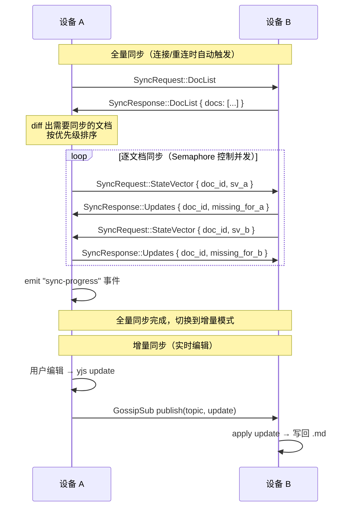

# yjs CRDT 同步

## 用户故事

作为用户，我希望在一台设备上编辑笔记后，其他局域网内的设备秒级看到更新。

## 依赖

- 设备配对（只同步已配对设备，需先完成配对流程）
- 编辑器 yjs 集成（需要 yjs 数据层支持）
- **底层重构：文档全局 UUID**（前置条件，见下方）

## 需求描述

实现两种同步模式：
1. **增量同步**：本地编辑产生的 yjs updates 通过 GossipSub 实时广播给所有已连接设备
2. **全量同步**：新设备连接或重连时，通过 Request-Response 交换 state_vector，互发缺失的 updates

## 前置：文档全局 UUID 重构

### 问题

当前 UUID 是 `open_doc` 时懒生成的（`Uuid::now_v7()`），不同设备打开同一 `notes/todo.md` 会生成不同 UUID。同步时无法识别"同一篇文档"。

### 方案

- **创建时生成全局 UUID**：文档创建（前端 `upsertDocument` 或工作区扫描）时立即生成 UUID 并持久化到 DB
- **工作区扫描建库**：打开工作区时扫描所有 .md 文件，为没有 DB 记录的文件自动创建记录（分配 UUID）
- **同步时传播 UUID**：全量同步的 DocList 包含 UUID + rel_path。接收方首次同步时按 rel_path 匹配本地文档，建立 UUID 映射（"认领"）
- **`open_doc` 不再生成 UUID**：只从 DB 查找，DB 中必须已有记录

## 技术方案

### 同步协议



### 增量同步（GossipSub）

- **topic 粒度**：按文档 `swarmnote/doc/{doc_uuid}`
- 打开文档时 `client.subscribe(topic)`，关闭时 `client.unsubscribe(topic)`
- 编辑产生 yjs update → `client.publish(topic, update)` 广播
- 收到 GossipSub 消息 → apply to Y.Doc → persist → 通知前端

### 全量同步（Request-Response）

- **触发时机**：已配对 peer 连接时自动触发 + 手动"重新同步"按钮
- **优先级排序**：
  1. P0 — 当前打开的文档（秒级完成）
  2. P1 — 最近编辑的文档（按 `updated_at` 降序）
  3. P2 — 其余文档（后台逐步追平）
- **并发控制**：Semaphore 限制并发文档数（参考 SwarmDrop 的 8 并发 chunk 模式）
- **进度事件**：节流 200ms emit `sync-progress` 给前端（预留 UI 接口，v0.2.0 暂不做进度 UI）

### 文档同步状态

```rust
enum DocSyncStatus {
    Synced,    // 已与所有已连接设备同步
    Syncing,   // 正在接收/发送 updates
    Pending,   // 排队等待同步（全量同步中尚未轮到）
    LocalOnly, // 仅本地修改，未连接任何设备
}
```

Tauri 事件：`doc-sync-status-changed { doc_id, status }`

### 删除同步（Tombstone 机制）

#### 问题

设备 A 删除文档后，设备 B 全量同步时发现 A 没有此文档——无法区分"A 删除了"和"A 从来没有"。不处理则删除的文档会被重新同步回来（resurrection 问题）。

#### 方案：软删除 + Tombstone + 版本时钟

参考 Syncthing（version-vectored tombstone，保留 15 个月）+ Notion（Trash 两层删除 UX）。

**DB schema**：workspace.db 新增 `deletion_log` 表：

```sql
CREATE TABLE IF NOT EXISTS deletion_log (
    doc_id TEXT PRIMARY KEY,       -- 文档 UUID
    rel_path TEXT NOT NULL,        -- 删除时的相对路径（记录用）
    deleted_at INTEGER NOT NULL,   -- Unix timestamp
    deleted_by TEXT NOT NULL,      -- PeerId
    lamport_clock INTEGER NOT NULL -- 单调递增版本时钟
);
```

**协议扩展**：`DocMeta` 增加 `deleted_at` + `lamport_clock` 字段：

```rust
pub struct DocMeta {
    pub doc_id: Uuid,
    pub rel_path: String,
    pub title: String,
    pub updated_at: i64,
    pub deleted_at: Option<i64>,    // None = 活跃, Some = 已删除
    pub lamport_clock: u64,         // 用于排序和冲突判断
}
```

**同步流程**：

```
Peer A 删除文档：
  1. 删除 .md 文件
  2. 从 documents 表移除（或标记 deleted_at）
  3. 插入 deletion_log（doc_id, now(), self_peer_id, clock++）
  4. 下次 DocList 交换时包含 tombstone

Peer B 收到带 tombstone 的 DocList：
  ├─ B 有此 doc 且 B.clock < tombstone.clock → 应用删除
  ├─ B 有此 doc 且 B.clock >= tombstone.clock → 冲突（删后又改，保留 B 版本）
  └─ B 没有此 doc → 忽略

Peer B 没有此 doc 且 deletion_log 中也没有 → 说明是新文档，拉取
```

**Tombstone GC**：
- 所有已配对 peer 确认后 **且** 超过 30 天 → 可 GC
- 超过 6 个月 → 强制 GC（处理永久离线设备）
- 解除配对时，从 ack 要求列表中移除该设备

**UX（v0.2.0 简化版）**：
- 删除 = 直接软删除 + tombstone，暂不做 Trash UI
- 后续版本可加 Trash 页面（30 天可恢复 → 永久删除）

### 新文档同步

全量同步时发现对方有本地不存在的文档：
1. 检查 `deletion_log` — 如果有 tombstone 且 clock >= 对方 clock → 忽略（已删除）
2. 不在 `deletion_log` 中 → 自动拉取：`SyncRequest::FullSync { doc_id }` → 创建 .md + DB 记录

### 后端架构

- 新增 `sync/` 模块，包含：
  - `SyncManager` — 管理全量同步会话、进度追踪、GossipSub 订阅
  - `progress.rs` — 参考 SwarmDrop 的 `ProgressTracker`（滑动窗口测速、节流 emit）
- event_loop 中 `AppRequest::Sync(_)` 分发到 SyncManager
- event_loop 中 `NodeEvent::GossipMessage` 分发到 YDocManager
- `PeerConnected` 事件（已配对 peer）→ 触发全量同步

### 前端

- 监听 `sync-progress` 和 `doc-sync-status-changed` 事件
- 本地编辑 → invoke Rust → Rust 负责 GossipSub 广播
- 前端进度 UI 预留接口（v0.2.0 暂不实现，侧边栏底部预留位置）

## 验收标准

- [ ] A 编辑后 B 秒级看到更新（局域网 < 500ms）
- [ ] 增量同步通过 GossipSub 正确广播和接收
- [ ] 全量同步通过 state_vector 交换正确完成
- [ ] 3 台设备同时在线，同步无遗漏
- [ ] 新建文档自动同步到其他设备
- [ ] 删除文档通过 tombstone 同步到其他设备
- [ ] 删除后又编辑的冲突正确处理（保留编辑版本）
- [ ] 全量同步按优先级排序：当前文档 → 最近编辑 → 其余文档
- [ ] 全量同步中断后重连，从断点继续而非重新开始
- [ ] 每篇文档的同步状态正确更新并通知前端
- [ ] `cargo clippy -- -D warnings` 无警告
- [ ] `pnpm lint:ci` 通过

## 工作区同步

### 工作区身份

每个工作区有全局 UUID，存储在 `.swarmnote/workspace.json`（或 workspace.db 的 metadata 表）。创建工作区时生成，同步时传播。

### 工作区传播流程

```
配对完成后：
  A → WorkspaceList { workspaces: [{ uuid, name, doc_count }] } → B
  B → 显示提示："设备 A 共享了 2 个工作区，选择要同步的"
  B → 选择工作区 + 指定本地目录（或自动创建）
  B → 创建本地工作区目录 + .swarmnote/ + workspace.db
  B → 开始全量同步
```

### 多工作区同步策略

- 每个工作区独立同步，各自有独立的 DocList / state_vector 交换
- 配对是设备级别的，工作区同步是工作区级别的
- 一台设备可以选择只同步部分工作区

## 实现路线

```
Phase 1: 底层重构（独立 PR）
  ├─ 工作区 UUID（.swarmnote/ 中持久化）
  ├─ 文档 UUID 稳定化（扫描建库 + open_doc 不再懒生成）
  ├─ deletion_log 表 + Lamport clock 基础设施
  └─ 协议扩展（DocMeta 加 deleted_at / lamport_clock / workspace_uuid）

Phase 2: 全量同步
  ├─ SyncManager 骨架（管理 per-peer 同步会话）
  ├─ DocList 交换 + 文档匹配（UUID 优先 + rel_path 回退认领）
  ├─ StateVector 交换 + Updates 互发
  ├─ 新文档拉取 + 删除 tombstone 处理
  ├─ 优先级排序 + 并发控制
  └─ 进度事件（Tauri emit，预留 UI 接口）

Phase 3: 增量同步
  ├─ GossipSub subscribe/unsubscribe 生命周期
  ├─ 编辑 → publish yjs update
  ├─ 收到 GossipMessage → apply + persist + 通知前端
  └─ 丢失补偿（定期 state_vector 校验）
```

## 设计决策记录

| 决策 | 选择 | 理由 |
| ---- | ---- | ---- |
| 增量同步协议 | GossipSub | 天然支持多设备广播，swarm-p2p-core 已实现 |
| 全量同步协议 | Request-Response | 点对点拉取，支持优先级和并发控制 |
| GossipSub topic 粒度 | 按文档 | 精确控制流量，只收打开的文档的更新 |
| 全量同步触发 | 自动（连接时）+ 手动重试 | 符合 local-first 自动化理念，手动兜底异常 |
| 文档身份 | 创建时全局 UUID，同步时传播 | 支持重命名，避免 rel_path 匹配歧义 |
| 无 DB 记录的文档 | 工作区扫描时统一建库 | 确保所有 .md 都有稳定 UUID |
| 删除同步 | 软删除 + tombstone + Lamport clock | 防止 resurrection，参考 Syncthing |
| 新文档同步 | 自动拉取并创建 | 配对后自动同步一切，无需手动 |
| 工作区身份 | 全局 UUID | 多设备匹配同一工作区 |
| 工作区传播 | 配对后提示选择 + 指定目录或自动创建 | 用户控制同步范围 |
| 进度 UI | v0.2.0 预留接口不做 UI | 先跑通后端和事件 |
| 实现节奏 | 先底层重构（UUID），再做同步 | 渐进式，每步可测 |

## 开放问题

- 大文档的 yjs state 分块传输策略（单个 Request-Response 的 payload 上限）
- 文档列表同步的冲突处理（两端同时创建同名文档但不同 UUID）
- GossipSub 消息丢失时的补偿机制（定期 state_vector 校验？）
- 工作区元数据同步（工作区名称修改、文件夹结构同步）
