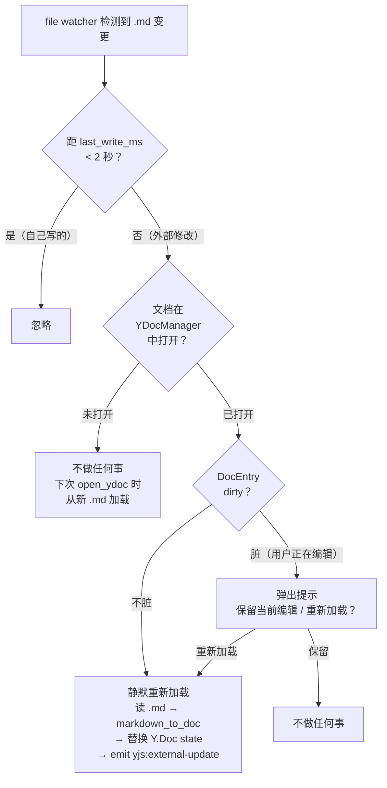

# 外部编辑器修改 .md 后自动同步到 Y.Doc

## 用户故事

作为用户，我希望在 VS Code、Obsidian 等外部编辑器中修改 .md 文件后，SwarmNote 能自动检测并同步到编辑器中，无需手动切换笔记。

## 依赖

- #27 编辑器 yjs 集成（Y.Doc 作为唯一真相源的基础架构）
- #37 yrs-blocknote crate（`markdown_to_doc` 用于将新 .md 转为 Y.Doc）

## 需求描述

当前 SwarmNote 以 Y.Doc 为唯一真相源，.md 文件是投影。但用户可能同时用外部编辑器修改 .md。文件 watcher 已能检测到变更并刷新文件树，但**不会更新已打开文档的 Y.Doc**，用户必须切换笔记再切回来才能看到变化。

## 同步策略（参考 Obsidian）



| 场景 | 行为 |
|------|------|
| 文档未打开 | 忽略，下次 `open_ydoc` 时自然从新 .md 加载 |
| 文档已打开 + 不脏 | 静默刷新：读新 .md → `markdown_to_doc` → 替换 Y.Doc → 通知前端 |
| 文档已打开 + 脏 | 提示用户选择："文件被外部修改，保留当前编辑 / 重新加载？" |
| SwarmNote 自己 writeback 写的 | 通过 `last_write_ms` 时间戳排除（2 秒内忽略） |

## 技术方案

### 排除自写

`DocEntry` 新增 `last_write_ms: AtomicU64`，`persist_snapshot` 写完 .md 后记录时间戳。watcher 检测到变更时，若距 `last_write_ms` 不到 2 秒，判定为自写并忽略。

### Rust 端

**`YDocManager` 新增方法**：

```rust
/// 外部文件修改后重新加载 .md 到 Y.Doc。
/// 返回 None 表示文档未打开或被自写排除。
pub async fn reload_from_file(
    &self,
    app: &AppHandle,
    label: &str,
    rel_path: &str,
) -> AppResult<Option<ReloadResult>> {
    // 1. 遍历 docs 找到 rel_path 匹配的 entry
    // 2. 检查 last_write_ms 排除自写
    // 3. 检查 dirty → 返回 NeedPrompt / 直接 reload
    // 4. 读 .md → markdown_to_doc → encode state → apply 到现有 Doc
    // 5. persist 新的 yjs_state 到 DB
    // 6. emit "yjs:external-update" { docUuid, yjsState }
}
```

**`fs/watcher.rs` 扩展**：

在 `is_relevant_change` 返回 true 且是 .md 文件时，额外调用 `YDocManager::reload_from_file`。需要在 watcher 闭包中访问 `YDocManager` state。

### 前端

**`NoteEditor.tsx` 新增监听**：

```typescript
// 监听外部文件修改事件
useEffect(() => {
  const unlistenPromise = listen<{ docUuid: string; yjsState: number[] }>(
    "yjs:external-update",
    (event) => {
      if (event.payload.docUuid === docUuid) {
        // 用 origin="remote" 应用，TauriYjsProvider 不会 echo back
        ydoc.transact(() => {
          Y.applyUpdate(ydoc, new Uint8Array(event.payload.yjsState), "remote");
        }, "remote");
      }
    }
  );
  return () => { unlistenPromise.then(fn => fn()); };
}, [docUuid, ydoc]);
```

**冲突提示（dirty 场景）**：

使用 `tauri-plugin-dialog` 弹出确认框：

```typescript
listen("yjs:external-conflict", async (event) => {
  const confirmed = await confirm(
    "文件被外部修改，是否重新加载？当前未保存的编辑将丢失。",
    { title: "文件已修改", kind: "warning" }
  );
  if (confirmed) {
    invoke("reload_ydoc_confirmed", { docUuid: event.payload.docUuid });
  }
});
```

## 验收标准

- [ ] 外部编辑 .md 后，SwarmNote 中未聚焦（不脏）的文档 2 秒内自动刷新
- [ ] 用户正在编辑时收到外部修改，弹出冲突提示
- [ ] 用户选择"保留当前编辑"后，外部修改不影响编辑器
- [ ] 用户选择"重新加载"后，编辑器内容更新为外部修改版本
- [ ] SwarmNote 自己的 writeback 不会触发误判（self-write 排除）
- [ ] 快速连续外部修改不会导致竞态（debounce by watcher 的 100ms 已足够）
- [ ] `cargo clippy -- -D warnings` 无警告
- [ ] `pnpm lint:ci` 通过

## 开放问题

- watcher 闭包中如何访问 `YDocManager` state？当前 watcher 在非 async 上下文中（notify 回调），调用 `reload_from_file` 需要 spawn 一个 tokio task
- 冲突提示的 UI 是用系统原生 dialog 还是前端自定义 modal？
- 如果外部修改了一个新文件（不在 DB 中），watcher 应该忽略还是创建新的 DB 记录？
