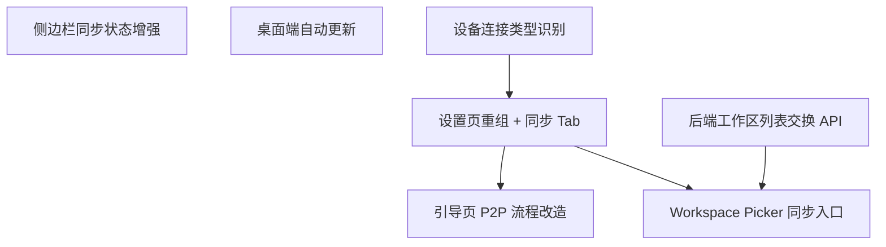

# v0.2.1 - 同步体验闭环 & 自动更新

> 补全从引导到配对到同步的完整用户体验闭环，重组设置页面增加同步管理视角，并引入桌面端自动更新能力。

## 目标

v0.2.0 实现了 P2P 配对和同步的后端能力，但用户体验上存在多个断点：引导页不引导同步、配对后没有工作区同步入口、设置页缺少同步视角。v0.2.1 的目标是补全这些断点，让用户从首次打开到完成同步有完整引导，同时增加桌面端自动更新以支撑持续迭代分发。

完成后用户可以：
1. 首次打开 SwarmNote 时，根据「全新用户」或「添加设备」两条路径获得不同引导
2. 「添加设备」路径在引导页内完成配对，然后在 Workspace Picker 中选择要同步的工作区
3. 在设置页的「同步」Tab 中查看工作区同步状态和进度
4. 在侧边栏底部一眼看到同步状态
5. 收到桌面端应用更新通知并一键更新

## 范围

### 包含

- **引导页 P2P 流程改造** — Onboarding 增加分支路径：「全新用户」跳过、「添加设备」完成配对
- **Workspace Picker 同步入口** — 新增「从已配对设备同步工作区」入口，列表选择式同步工作区
- **设置页重组 + 同步 Tab** — Tab 结构调整为 通用/同步/设备/关于，新增同步状态管理页面
- **侧边栏同步状态增强** — 底部从简单网络状态升级为设备数 + 同步状态展示
- **桌面端自动更新** — 集成 tauri-plugin-updater + UpgradeLink，支持强制/可选/静默更新策略
- **后端工作区列表交换 API** — 配对后获取对方工作区列表，支持远程工作区同步创建
- **设备连接类型识别** — 后端识别并暴露每台设备的连接方式（局域网/打洞/中继），前端展示彩色 badge

### 不包含（推迟到后续版本）

- 同步历史记录/活动日志 — 暂不做
- Android 端自动更新 — v0.5.0+（移动端支持时一并实现）
- 同步冲突解决 UI — yjs CRDT 天然无冲突，暂不需要

## 功能清单

### 依赖关系

| 层级 | 功能 | 可并行 |
|------|------|--------|
| L0（无依赖） | 设备连接类型识别、侧边栏同步状态增强、后端工作区列表交换 API、桌面端自动更新 | 全部可并行 |
| L1（依赖 L0） | 设置页重组 + 同步 Tab（依赖连接类型识别）、引导页 P2P 流程改造（依赖设置页重组）、Workspace Picker 同步入口（依赖设置页重组 + 后端 API） | 可并行 |

### 功能清单

| 功能 | 优先级 | 依赖 | Feature 文档 | Issue |
|------|--------|------|-------------|-------|
| 设备连接类型识别 | P0 | - | [device-connection-type.md](features/device-connection-type.md) | [#44](https://github.com/yexiyue/SwarmNote/issues/44) |
| 侧边栏同步状态增强 | P0 | - | [sidebar-sync-status.md](features/sidebar-sync-status.md) | [#45](https://github.com/yexiyue/SwarmNote/issues/45) |
| 后端工作区列表交换 API | P0 | - | [workspace-list-api.md](features/workspace-list-api.md) | [#46](https://github.com/yexiyue/SwarmNote/issues/46) |
| 桌面端自动更新 | P0 | - | [auto-update.md](features/auto-update.md) | [#47](https://github.com/yexiyue/SwarmNote/issues/47) |
| 设置页重组 + 同步 Tab | P0 | 连接类型识别 | [settings-sync-tab.md](features/settings-sync-tab.md) | [#48](https://github.com/yexiyue/SwarmNote/issues/48) |
| 引导页 P2P 流程改造 | P0 | 设置页重组 | [onboarding-p2p-flow.md](features/onboarding-p2p-flow.md) | [#49](https://github.com/yexiyue/SwarmNote/issues/49) |
| Workspace Picker 同步入口 | P0 | 设置页重组, 后端 API | [workspace-sync-picker.md](features/workspace-sync-picker.md) | [#50](https://github.com/yexiyue/SwarmNote/issues/50) |

## 验收标准

- [ ] 首次打开 SwarmNote，引导页提供「全新用户」和「添加设备」两条路径
- [ ] 「添加设备」路径可在引导页内完成设备配对（Direct + Code 两种方式）
- [ ] 配对后进入 Workspace Picker，能看到「同步已配对设备工作区」入口
- [ ] 点击同步入口后展示对方工作区列表，可勾选要同步的工作区
- [ ] 选择同步后自动创建本地工作区目录并开始同步
- [ ] 设置窗口 Tab 为 通用/同步/设备/关于，同步 Tab 展示工作区同步状态
- [ ] 侧边栏底部显示设备连接数和同步状态，同步中显示进度
- [ ] 应用启动时自动检查更新，有更新时根据策略提示用户
- [ ] 强制更新时弹出不可关闭的更新 Dialog
- [ ] 可选更新时弹出可关闭的更新 Dialog，支持「稍后提醒」
- [ ] `cargo clippy -- -D warnings` 无警告
- [ ] `pnpm lint:ci` 通过

## 技术选型

| 领域 | 选择 | 备注 |
|------|------|------|
| 自动更新（桌面） | **tauri-plugin-updater** | Tauri v2 官方插件 |
| 更新分发 | **UpgradeLink + GitHub Releases** | UpgradeLink 主、GitHub 备，支持强制/可选/静默策略 |
| 签名验证 | **minisign** | tauri-plugin-updater 内置支持 |

## 依赖与风险

- **依赖**：
  - v0.2.0 的 P2P 配对和同步功能已完成
  - tauri-plugin-updater v2 稳定可用
  - UpgradeLink 服务已在 SwarmDrop 验证

- **风险**：
  - 引导页分支流程增加了 Onboarding 组件复杂度，需注意状态管理
  - 工作区列表交换需要新的后端 API（协议扩展），需与 v0.2.0 的同步协议兼容
  - UpgradeLink 服务的可用性依赖第三方，GitHub Releases 作为兜底

## 时间线

- 开始日期：v0.2.0 发布后
- 目标发布日期：待定
- Milestone：[v0.2.1](https://github.com/yexiyue/SwarmNote/milestone/4)
