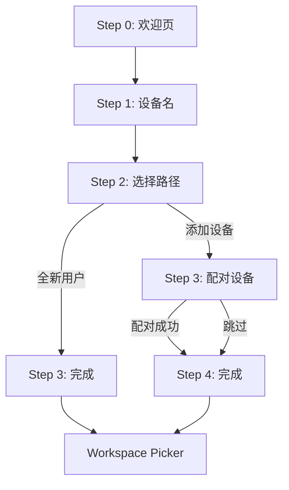

# 引导页 P2P 流程改造

## 用户故事

作为首次安装 SwarmNote 的用户，我希望引导页能根据我的情况（全新用户 or 添加设备）提供不同路径，以便添加设备时能直接完成配对，不需要自己找入口。

## 依赖

- 设置页重组 + 同步 Tab（「添加设备」分支的配对 UI 需复用已有的配对组件，设置页重组应先完成）
- v0.2.0 设备配对后端功能已完成

## 需求描述

当前引导页是线性 3 步：欢迎 → 设备名 → 完成。v0.2.1 在「设备名」之后增加一个分支选择步骤，区分两类用户：

1. **全新用户**：第一次使用 SwarmNote，没有其他设备。直接进入完成页 → Workspace Picker。
2. **添加设备**：已有一台运行 SwarmNote 的设备，希望同步已有笔记。进入配对流程 → 完成 → Workspace Picker（带同步入口）。

### 为什么需要分支

- 全新用户不需要关心配对，强制看配对步骤会困惑
- 添加设备的用户最迫切的需求是「和已有设备同步」，如果引导页不引导，他需要自己发现设置 → 设备 → 配对的路径
- 区分后两条路径都更短更聚焦

## 交互设计

### 完整流程



### Step 2: 选择路径（新增）

```text
┌──────────────────────────────────────────┐
│                                          │
│          你是如何开始的？                  │
│                                          │
│   ┌────────────────────────────────┐     │
│   │  🆕  全新开始                   │     │
│   │  这是我的第一台 SwarmNote 设备   │     │
│   └────────────────────────────────┘     │
│                                          │
│   ┌────────────────────────────────┐     │
│   │  📱  添加设备                   │     │
│   │  我已有其他设备，想要同步笔记    │     │
│   └────────────────────────────────┘     │
│                                          │
│              ● ● ◉ ● ●                  │
└──────────────────────────────────────────┘
```

- 两个选项以大按钮/卡片形式展示，点击即选择并进入下一步
- 风格参考 Obsidian 的「Create new vault / Open existing vault」

### Step 3（添加设备路径）: 配对设备

```text
┌──────────────────────────────────────────┐
│                                          │
│          配对你的设备                      │
│                                          │
│   在另一台设备上打开 SwarmNote，          │
│   确保两台设备在同一网络中。              │
│                                          │
│   附近设备                                │
│   ┌────────────────────────────────┐     │
│   │ 🖥 MacBook Pro    macOS  [配对] │     │
│   └────────────────────────────────┘     │
│                                          │
│   ─── 或使用配对码 ───                    │
│   [生成配对码]    [输入配对码]             │
│                                          │
│              [跳过，稍后设置]              │
│              ● ● ● ◉ ●                  │
└──────────────────────────────────────────┘
```

- 自动启动 P2P 网络节点（后台静默启动，不需要用户手动操作）
- 附近设备列表实时更新（mDNS 发现）
- 支持 Direct 配对（点击「配对」按钮）和 Code 配对（生成码/输入码）
- 配对成功后自动进入下一步
- 底部有「跳过，稍后设置」入口，不强制配对

### 配对成功过渡

配对成功后短暂显示成功提示（1-2 秒），然后自动进入完成页：

```text
┌──────────────────────────────────────────┐
│                                          │
│           ✓ 配对成功！                    │
│                                          │
│     已与 MacBook Pro 配对                 │
│     你可以在 Workspace Picker 中          │
│     选择要同步的工作区                     │
│                                          │
│            [进入 SwarmNote]               │
│              ● ● ● ● ◉                  │
└──────────────────────────────────────────┘
```

## 技术方案

### 前端

**Onboarding Store 扩展**：

```typescript
interface OnboardingStore {
  step: number;
  isCompleted: boolean;
  // 新增
  userPath: 'new' | 'add-device' | null;  // 用户选择的路径
  pairedInOnboarding: boolean;             // 是否在引导中完成了配对
}
```

**组件结构**：

```text
src/components/onboarding/
├── WelcomeStep.tsx         # Step 0（已有）
├── DeviceNameStep.tsx      # Step 1（已有）
├── PathChoiceStep.tsx      # Step 2（新增）— 全新用户 / 添加设备
├── PairingStep.tsx         # Step 3-添加设备（新增）— 配对流程
├── CompleteStep.tsx         # 最后一步（改造）— 根据路径显示不同文案
└── OnboardingLayout.tsx    # 布局（改造）— 支持动态步骤数
```

**关键改造**：

- `OnboardingLayout` 的步骤指示器需要支持动态步骤数（全新用户 4 步，添加设备 5 步）
- `PairingStep` 复用 `usePairingStore` 和配对相关的 Tauri commands
- P2P 节点在进入 `PairingStep` 时自动启动（调用 `startNode`），不需要用户手动操作
- 配对成功后设置 `pairedInOnboarding = true`，Workspace Picker 据此决定是否高亮同步入口

### 后端

- 无新增后端功能，复用 v0.2.0 已有的配对 API
- P2P 节点启动复用 `start_node` command

## 验收标准

- [ ] 引导页 Step 2 展示「全新开始」和「添加设备」两个选项
- [ ] 选择「全新开始」→ 跳过配对直接进入完成页
- [ ] 选择「添加设备」→ 进入配对步骤，自动启动 P2P 网络
- [ ] 配对步骤展示附近设备列表，支持 Direct 配对
- [ ] 配对步骤支持生成/输入配对码（Code 配对）
- [ ] 配对成功后自动进入完成页，显示配对成功信息
- [ ] 「跳过，稍后设置」可跳过配对步骤
- [ ] 步骤指示器根据路径动态显示正确的步骤数
- [ ] 所有新增 UI 适配亮色/暗色主题
- [ ] 所有新增文案支持中英文国际化
- [ ] `pnpm lint:ci` 通过

## 开放问题

- 「添加设备」路径中，P2P 节点启动如果失败（如端口占用），如何处理？建议显示错误提示 + 重试按钮
- 如果用户选择了「添加设备」但配对后发现对方没有工作区，完成页是否需要特殊提示？
